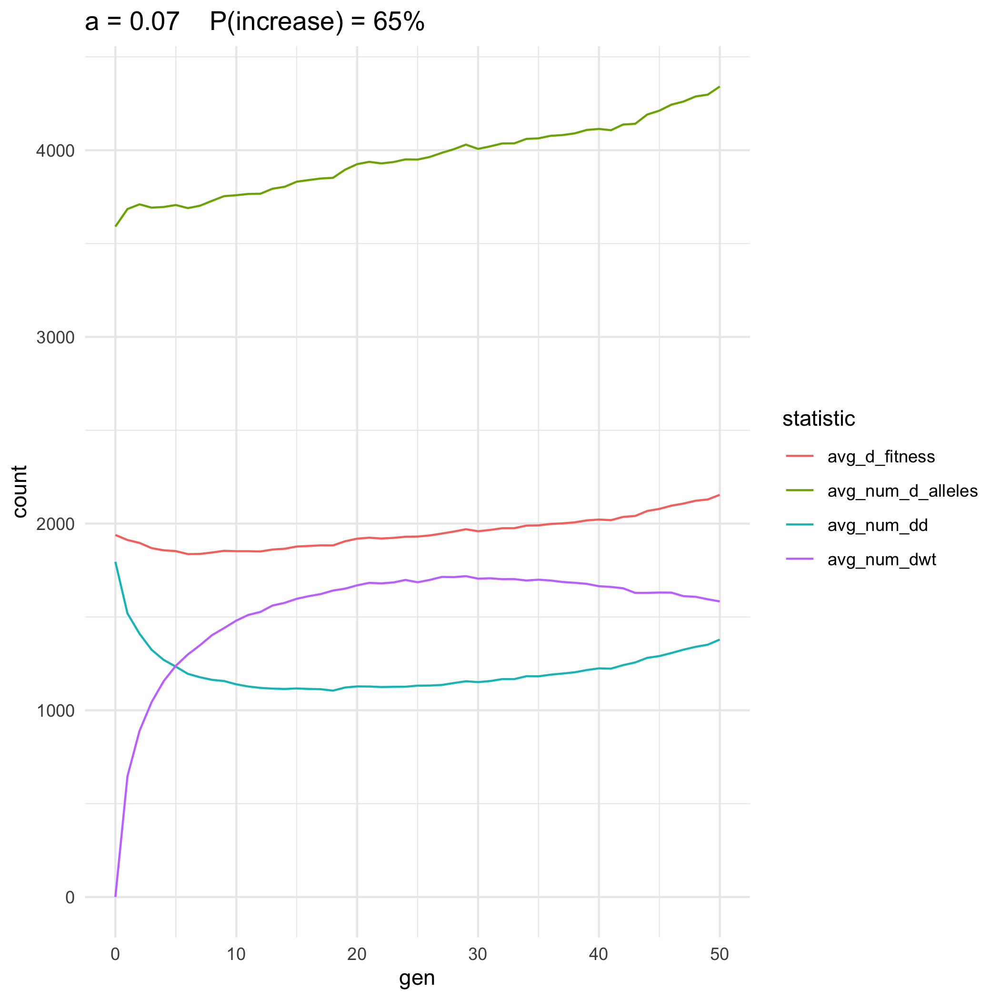

4 graphs for 5 values of a
================
Isabel Kim
5/17/2022

## Objective

-   For the first 10 generations, plot:
    -   The average number of homozygotes \[N_AA\] over time
    -   The average number of heterozygotes \[N_Aa\] over time
    -   The average number of drive alleles \[2N_AA + N_Aa\] over time
    -   The average fitness of drive alleles \[w_AAxN_AA +
        0.5xw_AaxN_Aa\] over time
-   all on the same plot

## Functions

``` r
library(tidyverse)
```

    ## ── Attaching packages ─────────────────────────────────────── tidyverse 1.3.1 ──

    ## ✓ ggplot2 3.3.5     ✓ purrr   0.3.4
    ## ✓ tibble  3.1.6     ✓ dplyr   1.0.8
    ## ✓ tidyr   1.2.0     ✓ stringr 1.4.0
    ## ✓ readr   2.1.2     ✓ forcats 0.5.1

    ## ── Conflicts ────────────────────────────────────────── tidyverse_conflicts() ──
    ## x dplyr::filter() masks stats::filter()
    ## x dplyr::lag()    masks stats::lag()

``` r
# Function to create a num_d_alleles and outcome columns and then replace the replicate column. Saving this to a directory if true. Then go through an average N_AA, N_Aa, wAA(N_AA) + 0.5(w_Aa)(N_Aa), and 2(N_AA) + N_Aa over each generation

clean_data = function(compiled_data, save_data = TRUE){
  
  # Add a "n_d_alleles" column
  compiled_data = compiled_data %>% mutate(num_d_alleles = 2*num_dd + num_dwt)
  
  gen_start_points = which(compiled_data$gen == 0)
  gen_end_points = gen_start_points[2:100] - 1
  gen_end_points = c(gen_end_points, nrow(compiled_data))
  
  replicate_column = rep(-1,nrow(compiled_data))
  outcome_column = rep(-1,nrow(compiled_data))
  for (i in 1:100){
    s = gen_start_points[i]
    e = gen_end_points[i]
    replicate_rows = compiled_data[s:e,]
    replicate_column[s:e] = rep(i,length(s:e))
    start_d_alleles = replicate_rows$num_d_alleles[1]
    end_d_alleles = replicate_rows$num_d_alleles[nrow(replicate_rows)]
    if (start_d_alleles > end_d_alleles){
      outcome_column[s:e] = rep("decrease", length(s:e))
    } else if (start_d_alleles < end_d_alleles){
      outcome_column[s:e] = rep("increase", length(s:e))
    } else {
      outcome_column[s:e] = rep("constant", length(s:e))
    }
  }
  
  compiled_data_edit = compiled_data %>% add_column(replicate_number = replicate_column,
                                                    eventual_outcome = outcome_column) %>%
    dplyr::select(a, replicate_number, gen, num_dd, num_dwt, num_d_alleles, d_fitness, eventual_outcome)
  
  a = compiled_data_edit$a[1]
  dir = "/Users/isabelkim/Desktop/year2/underdominance/reaction-diffusion/bistable-R-waves/four_plots/compiled_csvs/"
  file = paste0(dir, "a",a,"_compiled_csv_may_18.csv")
  
  if (save_data){
    write_csv(x = compiled_data_edit, file = file)
    print(paste("Writing out to", file))
  }
  
  p_increase = mean(outcome_column[gen_start_points] == "increase")
  print(paste("For a =",a,"P(increase) =",p_increase))
  
  # Go through and average the statistics for each generation
  gen_vector = min(compiled_data_edit$gen):max(compiled_data_edit$gen)
  a_vector = rep(a, length(gen_vector))

  # fill in
  num_dd_vector = rep(-1,length(gen_vector)) 
  num_dwt_vector = rep(-1,length(gen_vector))
  num_d_alleles_vector = rep(-1,length(gen_vector))
  d_fitness_vector = rep(-1,length(gen_vector))
  num_replicates = rep(-1,length(gen_vector))
  
  for (i in 1:length(gen_vector)){
    g = gen_vector[i]
    # Grab all rows associated with this generation
    gen_rows = compiled_data_edit %>% filter(gen == g)
    num_replicates[i] = nrow(gen_rows)
    num_dd_vector[i] = mean(gen_rows$num_dd)
    num_dwt_vector[i] = mean(gen_rows$num_dwt)
    num_d_alleles_vector[i] = mean(gen_rows$num_d_alleles)
    d_fitness_vector[i] = mean(gen_rows$d_fitness)
  }
  
  avg_tibble = tibble(a = a_vector, gen = gen_vector, avg_num_dd = num_dd_vector,
                      avg_num_dwt = num_dwt_vector, avg_num_d_alleles = num_d_alleles_vector,
                      avg_d_fitness = d_fitness_vector, num_replicates = num_replicates)
  
  if (save_data){
    file = paste0("/Users/isabelkim/Desktop/year2/underdominance/reaction-diffusion/bistable-R-waves/four_plots/avg_csvs/a", a,"_avg_csv_may_18.csv")
    write_csv(x = avg_tibble, file = file)
    print(paste("Writing out to",file))
  }
  
  return(list(compiled_data = compiled_data_edit, avg_data = avg_tibble))
}

# Plot the 4 metrics
plot_four_stats = function(avg_data, p_increase,cutoff_gen = 10,save_data = TRUE){
  short_data = avg_data %>% filter(gen <= cutoff_gen)
  a = short_data$a[1]
  # Need to manipulate the dataset for color-plotting
  n = 4*(cutoff_gen+1)
  gen_vector = rep(-1,n)
  count_vector = rep(-1,n)
  statistic_vector = rep("*",n)
  gen_starts = seq(1, n, by=4)
  for (i in 1:length(gen_starts)){
    row_start = gen_starts[i]
    row_end = row_start + 3
    generation = i - 1 # 0-based
    gen_vector[row_start:row_end] = rep(generation,4)
    
    count_vector[row_start] = avg_data$avg_num_dd[i]
    statistic_vector[row_start] = "avg_num_dd"
    
    count_vector[row_start + 1] = avg_data$avg_num_dwt[i]
    statistic_vector[row_start + 1] = "avg_num_dwt"
    
    count_vector[row_start+2] = avg_data$avg_num_d_alleles[i]
    statistic_vector[row_start + 2] = "avg_num_d_alleles"
    
    count_vector[row_start+3] = avg_data$avg_d_fitness[i]
    statistic_vector[row_start +3] = "avg_d_fitness"
  }
  
  data_new_format = tibble(gen = gen_vector,
                           count = count_vector,
                           statistic = statistic_vector)
  p = ggplot(data_new_format,aes(x = gen, y = count, color = statistic)) + geom_line() + theme_minimal() + ggtitle(paste0("a = ",a,"    P(increase) = ",p_increase*100,"%"))
  if (save_data){
    plot_name = paste0("/Users/isabelkim/Desktop/year2/underdominance/reaction-diffusion/bistable-R-waves/four_plots/figures/a",a,"_cutoff_gen_",cutoff_gen,"_4_stats.png")
    ggsave(plot = p, filename = plot_name)
    print(paste("Writing out",plot_name))
  }
  return(p)
}
```

## a = 0.02 (p_increase = 0%)

``` r
compiled_data = read_csv("/Users/isabelkim/Desktop/year2/underdominance/reaction-diffusion/bistable-R-waves/d_fitness_results/compiled_results/a0.02_100_replicates_compiled.csv")

a = 0.02


new_csvs = clean_data(compiled_data)
compiled_data_edit = new_csvs$compiled_data
avg_data = new_csvs$avg_data
p_increase = 0

# Create plot
p = plot_four_stats(avg_data, p_increase = p_increase, cutoff_gen=50)
```

``` r
knitr::include_graphics("../bistable-R-waves/four_plots/figures/a0.02_cutoff_gen_50_4_stats.png")
```

<!-- -->
Number of drive alleles no longer has that “bump”. Would it for single
replicates only?

``` r
replicate1_to_5 = compiled_data_edit %>% filter(replicate_number%in% c(1,2,3,4,5)) 
replicate1_to_5$replicate_number = as.character(replicate1_to_5$replicate_number)

p1 = replicate1_to_5 %>% filter(gen <= 50) %>%
  ggplot(aes(x = gen, y = num_d_alleles, color = replicate_number)) + theme_minimal() + geom_line() +
  ggtitle("a = 0.02 first 5 replicates")

#ggsave(plot =p1, filename ="/Users/isabelkim/Desktop/year2/underdominance/reaction-diffusion/bistable-R-waves/four_plots/figures/a0.02_first_5_replicates.png")
```

``` r

```

<!-- -->
No longer see the bump in single replicates either.

This also is the case in SLiM liveplots.

## a = 0.056

``` r
compiled_data = read_csv("/Users/isabelkim/Desktop/year2/underdominance/reaction-diffusion/bistable-R-waves/d_fitness_results/compiled_results/a0.056_100_replicates_compiled.csv")

a = 0.056


new_csvs = clean_data(compiled_data)
compiled_data_edit = new_csvs$compiled_data
avg_data = new_csvs$avg_data
p_increase = 0

# Create plot
p = plot_four_stats(avg_data, p_increase = p_increase, cutoff_gen=50)
```

``` r

```

<!-- -->
Even after averaging, there is still a small bump in the number of drive
alleles from generation 0 to 1.

Examine just a few replicates

``` r
replicate1_to_3 = compiled_data_edit %>% filter(replicate_number%in% c(1,2,3)) 
replicate1_to_3$replicate_number = as.character(replicate1_to_3$replicate_number)

p1 = replicate1_to_3 %>% filter(gen <= 50) %>%
  ggplot(aes(x = gen, y = num_d_alleles, color = replicate_number)) + theme_minimal() + geom_line() +
  ggtitle("a = 0.056 first 3 replicates")

#ggsave(plot = p1, filename = "/Users/isabelkim/Desktop/year2/underdominance/reaction-diffusion/bistable-R-waves/four_plots/figures/a0.056_first_3_replicates.png")
```

``` r

```

<!-- -->
Can see the “bump” much more in single replicates.

## a = 0.06 (p_increase = 2%)

``` r
library(tidyverse)
a = 0.06

# Raw data from the cluster, combined for all 100 replicates
compiled_data = read_csv("/Users/isabelkim/Desktop/year2/underdominance/reaction-diffusion/bistable-R-waves/d_fitness_results/compiled_results/a0.06_100_replicates_compiled.csv")

# Write out and obtain new csvs
new_csvs = clean_data(compiled_data)
compiled_data_edit = new_csvs$compiled_data

avg_data = new_csvs$avg_data

avg_data = read_csv("/Users/isabelkim/Desktop/year2/underdominance/reaction-diffusion/bistable-R-waves/four_plots/avg_csvs/a0.06_avg_csv_may_17.csv")

# Create plot
p = plot_four_stats(avg_data, p_increase = 0.02, cutoff_gen=50)
```

``` r
knitr::include_graphics("../bistable-R-waves/four_plots/figures/a0.06_cutoff_gen_10_4_stats.png")
```

<!-- -->
Initial “bump” in number of drive alleles –> stays somewhat constant.

Examine first few replicates

``` r
compiled_data_edit = read_csv("/Users/isabelkim/Desktop/year2/underdominance/reaction-diffusion/bistable-R-waves/four_plots/compiled_csvs/a0.06_compiled_csv_may_17.csv")

replicate1_to_3 = compiled_data_edit %>% filter(replicate_number%in% c(1,2,3)) 
replicate1_to_3$replicate_number = as.character(replicate1_to_3$replicate_number)

p1 = replicate1_to_3 %>% filter(gen <= 50) %>%
  ggplot(aes(x = gen, y = num_d_alleles, color = replicate_number)) + theme_minimal() + geom_line() +
  ggtitle("a = 0.06 first 3 replicates")
#ggsave(plot = p1, filename = "/Users/isabelkim/Desktop/year2/underdominance/reaction-diffusion/bistable-R-waves/four_plots/figures/a0.06_first_3_replicates.png")
```

``` r

```

<!-- -->
The averaged line looks flat because half are going up and half are
going down. Replicate 2 doesn’t have an initial bump.

## a = 0.0637

``` r
compiled_data = read_csv("/Users/isabelkim/Desktop/year2/underdominance/reaction-diffusion/bistable-R-waves/d_fitness_results/compiled_results/a0.0637_100_replicates_compiled.csv")

a = 0.0637


new_csvs = clean_data(compiled_data)
compiled_data_edit = new_csvs$compiled_data
avg_data = new_csvs$avg_data
p_increase = 0.13

# Create plot
p = plot_four_stats(avg_data, p_increase = p_increase, cutoff_gen=50)
```

``` r
knitr::include_graphics("../bistable-R-waves/four_plots/figures/a0.0637_cutoff_gen_50_4_stats.png")
```

<!-- -->
Does show initial bump.

First 3 replicates:

``` r
compiled_data_edit = read_csv("/Users/isabelkim/Desktop/year2/underdominance/reaction-diffusion/bistable-R-waves/four_plots/compiled_csvs/a0.0637_compiled_csv_may_18.csv")

replicate1_to_3 = compiled_data_edit %>% filter(replicate_number%in% c(1,2,3)) 
replicate1_to_3$replicate_number = as.character(replicate1_to_3$replicate_number)

p1 = replicate1_to_3 %>% filter(gen <= 50) %>%
  ggplot(aes(x = gen, y = num_d_alleles, color = replicate_number)) + theme_minimal() + geom_line() +
  ggtitle("a = 0.0637 first 3 replicates")
#ggsave(plot = p1, filename = "/Users/isabelkim/Desktop/year2/underdominance/reaction-diffusion/bistable-R-waves/four_plots/figures/a0.0637_first_3_replicates.png")
```

``` r

```

<!-- -->
Does show initial bump for single replicates.

## a = 0.0662

``` r
a = 0.0662
compiled_data = read_csv("/Users/isabelkim/Desktop/year2/underdominance/reaction-diffusion/bistable-R-waves/d_fitness_results/compiled_results/a0.0662_100_replicates_compiled.csv")

new_csvs = clean_data(compiled_data)
p_increase = 0.25
compiled_data_edit = new_csvs$compiled_data
avg_data = new_csvs$avg_data

avg_data = read_csv("/Users/isabelkim/Desktop/year2/underdominance/reaction-diffusion/bistable-R-waves/four_plots/avg_csvs/a0.0662_avg_csv_may_17.csv")

plot = plot_four_stats(avg_data,0.25,cutoff_gen = 50)
```

``` r

```

<!-- -->
Number of drive alleles line looks \~flat.

First 10 replicates:

``` r
replicate1_to_10 = compiled_data_edit %>% filter(replicate_number%in% c(1,2,3,4,5,6,7,8,9,10)) 
replicate1_to_10$replicate_number = as.character(replicate1_to_10$replicate_number)

p1 = replicate1_to_10 %>% filter(gen <= 50) %>%
  ggplot(aes(x = gen, y = num_d_alleles, color = replicate_number)) + theme_minimal() + geom_line() +
  ggtitle("a = 0.0662 first 10 replicates")
#ggsave(plot = p1, filename = "/Users/isabelkim/Desktop/year2/underdominance/reaction-diffusion/bistable-R-waves/four_plots/figures/a0.0662_first_10_replicates.png")
```

``` r
knitr::include_graphics("../bistable-R-waves/four_plots/figures/a0.0662_first_10_replicates.png")
```

<!-- -->
Most replicates seem to decrease rapidly, whereas others stay more
stable in the first 50 generations.

## a = 0.0688

``` r
a = 0.0688
compiled_data = read_csv("/Users/isabelkim/Desktop/year2/underdominance/reaction-diffusion/bistable-R-waves/d_fitness_results/compiled_results/a0.0688_100_replicates_compiled.csv")
new_csvs = clean_data(compiled_data)
p_increase = 0.41
compiled_data_edit = new_csvs$compiled_data
avg_data = new_csvs$avg_data
avg_data = read_csv("/Users/isabelkim/Desktop/year2/underdominance/reaction-diffusion/bistable-R-waves/four_plots/avg_csvs/a0.0688_avg_csv_may_17.csv")

plot = plot_four_stats(avg_data, 0.41,cutoff_gen = 50)
```

``` r

```

<!-- -->
This one looks somewhat non-monotonic, like an upsidedown U.

First 10 replicates:

``` r
replicate1_to_10 = compiled_data_edit %>% filter(replicate_number%in% c(1,2,3,4,5,6,7,8,9,10)) 
replicate1_to_10$replicate_number = as.character(replicate1_to_10$replicate_number)

p1 = replicate1_to_10 %>% filter(gen <= 50) %>%
  ggplot(aes(x = gen, y = num_d_alleles, color = replicate_number)) + theme_minimal() + geom_line() +
  ggtitle("a = 0.0688 first 10 replicates")
#ggsave(plot = p1, filename = "/Users/isabelkim/Desktop/year2/underdominance/reaction-diffusion/bistable-R-waves/four_plots/figures/a0.0688_first_10_replicates.png")
```

``` r

```

<!-- -->
Similar shape to a = 0.0662.

## a = 0.07

``` r
a = 0.07
compiled_data = read_csv("/Users/isabelkim/Desktop/year2/underdominance/reaction-diffusion/bistable-R-waves/d_fitness_results/compiled_results/a0.07_100_replicates_compiled.csv")

new_csvs = clean_data(compiled_data)
p_increase = 0.65
compiled_data_edit = new_csvs$compiled_data
avg_data = new_csvs$avg_data

plot = plot_four_stats(avg_data,0.65,cutoff_gen = 50)
```

``` r

```

<!-- -->
Small bump, then increase.

## a = 0.0713

``` r
a = 0.0713
compiled_data = read_csv("/Users/isabelkim/Desktop/year2/underdominance/reaction-diffusion/bistable-R-waves/d_fitness_results/compiled_results/a0.0713_100_replicates_compiled.csv")
new_csvs = clean_data(compiled_data)
p_increase = 0.76
compiled_data_edit = new_csvs$compiled_data
avg_data = new_csvs$avg_data

avg_data = read_csv("/Users/isabelkim/Desktop/year2/underdominance/reaction-diffusion/bistable-R-waves/four_plots/avg_csvs/a0.0713_avg_csv_may_17.csv")


plot = plot_four_stats(avg_data, p_increase,cutoff_gen = 50)
```

``` r

```

<!-- -->
## a = 0.0739

``` r
a = 0.0739
compiled_data = read_csv("/Users/isabelkim/Desktop/year2/underdominance/reaction-diffusion/bistable-R-waves/d_fitness_results/compiled_results/a0.0739_100_replicates_compiled.csv")

new_csvs = clean_data(compiled_data)
p_increase = 0.92
compiled_data_edit = new_csvs$compiled_data
avg_data = new_csvs$avg_data

plot = plot_four_stats(avg_data,0.92,cutoff_gen = 50)
```

``` r
knitr::include_graphics("../bistable-R-waves/four_plots/figures/a0.0739_cutoff_gen_50_4_stats.png")
```

<!-- -->
## a = 0.0764

``` r
a = 0.0764
compiled_data = read_csv("/Users/isabelkim/Desktop/year2/underdominance/reaction-diffusion/bistable-R-waves/d_fitness_results/compiled_results/a0.0764_100_replicates_compiled.csv")

new_csvs = clean_data(compiled_data)
p_increase = 0.98
compiled_data_edit = new_csvs$compiled_data
avg_data = new_csvs$avg_data

plot = plot_four_stats(avg_data,0.98,cutoff_gen = 50)
```

``` r

```

<!-- -->

## a = 0.08 (p_increase = 99%)

``` r
a = 0.08
compiled_data = read_csv("/Users/isabelkim/Desktop/year2/underdominance/reaction-diffusion/bistable-R-waves/d_fitness_results/compiled_results/a0.08_100_replicates_compiled.csv")
new_csvs = clean_data(compiled_data)
p_increase = 0.99
compiled_data_edit = new_csvs$compiled_data
avg_data = new_csvs$avg_data
avg_data = read_csv("/Users/isabelkim/Desktop/year2/underdominance/reaction-diffusion/bistable-R-waves/four_plots/avg_csvs/a0.08_avg_csv_may_17.csv")

plot = plot_four_stats(avg_data, p_increase, cutoff_gen = 50)
```

``` r

```

<!-- -->

## a = 0.1 (p_increase = 100%)

``` r
a = 0.1
compiled_data = read_csv("/Users/isabelkim/Desktop/year2/underdominance/reaction-diffusion/bistable-R-waves/d_fitness_results/compiled_results/a0.1_100_replicates_compiled.csv")

new_csvs = clean_data(compiled_data)
p_increase = 1
compiled_data_edit = new_csvs$compiled_data
avg_data = new_csvs$avg_data

plot = plot_four_stats(avg_data,1,cutoff_gen = 50)
```

``` r

```

<!-- -->

## a = 0.25 (p_increase = 100%)

``` r
a = 0.25
compiled_data = read_csv("/Users/isabelkim/Desktop/year2/underdominance/reaction-diffusion/bistable-R-waves/d_fitness_results/compiled_results/a0.25_100_replicates_compiled.csv")

new_csvs = clean_data(compiled_data)
p_increase = 1
compiled_data_edit = new_csvs$compiled_data
avg_data = new_csvs$avg_data

plot = plot_four_stats(avg_data,1,cutoff_gen = 50)
```

``` r

```

<!-- -->

## Notes from April 19th:

Recall the a vs P(increase) graph:

``` r

```

<!-- -->

See
`/Users/isabelkim/Desktop/year2/underdominance/reaction-diffusion/cluster/u_hat=0.4_run/april19-uhat40_a_vs_change_in_dr_revised_model.md`

The number of drive alleles change in generation 1 *wasn’t always
positive*

``` r
knitr::include_graphics("../cluster/u_hat=0.4_run/num_drive_testing/figures/revised_slim_a_vs_change_uhat40.png")
```

<!-- -->

In single replicates, there wasn’t always an initial bump in drive
alleles in this model.

See a = 0.025 single replicate from 4/19:

``` r
knitr::include_graphics("../cluster/u_hat=0.4_run/num_drive_testing/figures/a_0.025_revised_model.png")
```

<!-- -->

But initial non-predictive “bumps” *did* occur for some parameters

ex: a = 0.05

``` r
knitr::include_graphics("../cluster/u_hat=0.4_run/num_drive_testing/figures/a_0.05_revised_model.png")
```

<!-- -->

ex: a = 0.06

``` r
knitr::include_graphics("../cluster/u_hat=0.4_run/num_drive_testing/figures/a_0.06_revised_model.png")
```

<!-- -->

ex: a = 0.075

``` r

```

<!-- -->
