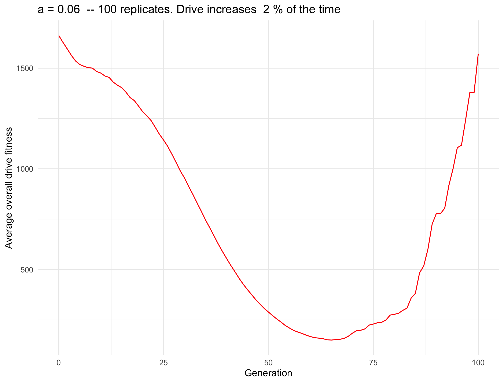
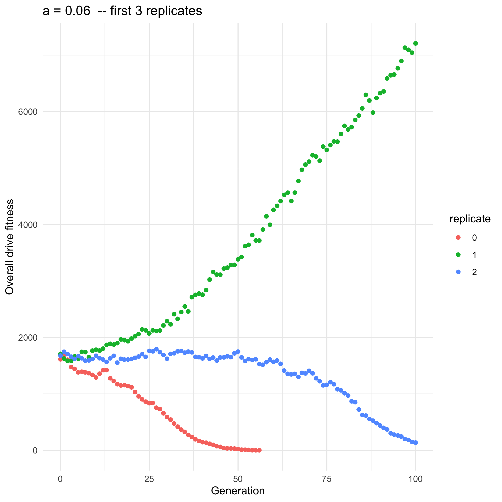
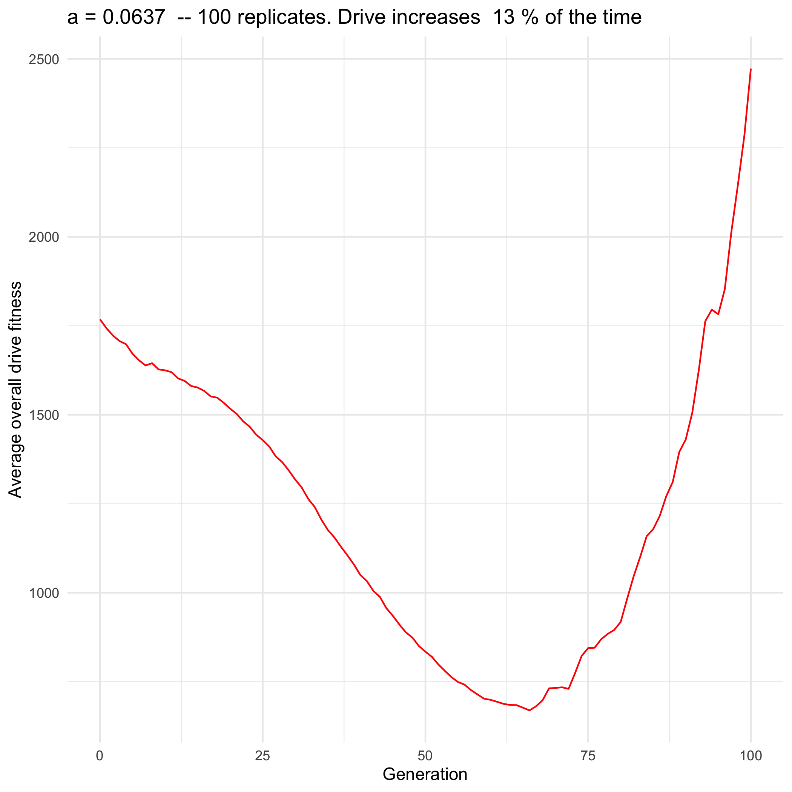

```{r setup, include=FALSE}
knitr::opts_chunk$set(echo = TRUE)
```

## a = 0.02

* Compiled replicate results: `/Users/isabelkim/Desktop/year2/underdominance/reaction-diffusion/bistable-R-waves/d_fitness_results/compiled_results/a0.02_100_replicates_compiled.csv`
* Averaged replicate results: `/Users/isabelkim/Desktop/year2/underdominance/reaction-diffusion/bistable-R-waves/d_fitness_results/compiled_results/a0.02_100_replicates_averaged.csv`
* Figure: `/Users/isabelkim/Desktop/year2/underdominance/reaction-diffusion/bistable-R-waves/d_fitness_results/compiled_figures/a0.02_100_replicates.png`
* p_increase = 0%

```{r}
knitr::include_graphics("../bistable-R-waves/d_fitness_results/compiled_figures/a0.02_100_replicates.png")
```

## a = 0.056

* Compiled results: `/Users/isabelkim/Desktop/year2/underdominance/reaction-diffusion/bistable-R-waves/d_fitness_results/compiled_results/a0.056_100_replicates_compiled.csv`
* Averaged results: `/Users/isabelkim/Desktop/year2/underdominance/reaction-diffusion/bistable-R-waves/d_fitness_results/compiled_results/a0.056_100_replicates_averaged.csv`
* Figure: `/Users/isabelkim/Desktop/year2/underdominance/reaction-diffusion/bistable-R-waves/d_fitness_results/compiled_figures/a0.056_100_replicates.png`
* p_increase = 0%

```{r}

```

## a = 0.0586

* Compiled results: `/Users/isabelkim/Desktop/year2/underdominance/reaction-diffusion/bistable-R-waves/d_fitness_results/compiled_results/a0.0586_100_replicates_compiled.csv`
* Averaged results: `/Users/isabelkim/Desktop/year2/underdominance/reaction-diffusion/bistable-R-waves/d_fitness_results/compiled_results/a0.0586_100_replicates_averaged.csv`
* p_increase = 1%
* Figure: `/Users/isabelkim/Desktop/year2/underdominance/reaction-diffusion/bistable-R-waves/d_fitness_results/compiled_figures/a0.0586_100_replicates.png`
  + Only the first few replicates: `/Users/isabelkim/Desktop/year2/underdominance/reaction-diffusion/bistable-R-waves/d_fitness_results/compiled_figures/a0.0586_first_3_replicates.png`
  + Outlier increase replicate: `/Users/isabelkim/Desktop/year2/underdominance/reaction-diffusion/bistable-R-waves/d_fitness_results/compiled_figures/a0.0586_outlier_increase_replicate.png`
  + d_fitness graph without the outlier: `/Users/isabelkim/Desktop/year2/underdominance/reaction-diffusion/bistable-R-waves/d_fitness_results/compiled_figures/a0.0586_no_outlier.png`

```{r}

knitr::include_graphics("../bistable-R-waves/d_fitness_results/compiled_figures/a0.0586_first_3_replicates.png")


```

## a = 0.06

* Compiled replicate results: `/Users/isabelkim/Desktop/year2/underdominance/reaction-diffusion/bistable-R-waves/d_fitness_results/compiled_results/a0.06_100_replicates_compiled.csv`
* Averaged replicate results: `/Users/isabelkim/Desktop/year2/underdominance/reaction-diffusion/bistable-R-waves/d_fitness_results/compiled_results/a0.06_100_replicates_averaged.csv`
* Figure: `/Users/isabelkim/Desktop/year2/underdominance/reaction-diffusion/bistable-R-waves/d_fitness_results/compiled_figures/a0.06_100_replicates.png`
  + Just the first 3 replicates: `/Users/isabelkim/Desktop/year2/underdominance/reaction-diffusion/bistable-R-waves/d_fitness_results/compiled_figures/a0.06_first_3_replicates.png`
  + Only the outlier replicates that increased: `/Users/isabelkim/Desktop/year2/underdominance/reaction-diffusion/bistable-R-waves/d_fitness_results/compiled_figures/a0.06_outlier_increase_replicates.png`
  + Outliers filtered out: `/Users/isabelkim/Desktop/year2/underdominance/reaction-diffusion/bistable-R-waves/d_fitness_results/compiled_figures/a0.06_no_outliers.png`
* p_increase = 2%
```{r}




```

## a = 0.0611

* Compiled results: `/Users/isabelkim/Desktop/year2/underdominance/reaction-diffusion/bistable-R-waves/d_fitness_results/compiled_results/a0.0611_100_replicates_compiled.csv`
* Averaged results: `/Users/isabelkim/Desktop/year2/underdominance/reaction-diffusion/bistable-R-waves/d_fitness_results/compiled_results/a0.0611_100_replicates_averaged.csv`
* Figure: `/Users/isabelkim/Desktop/year2/underdominance/reaction-diffusion/bistable-R-waves/d_fitness_results/compiled_figures/a0.0611_100_replicates.png`
* p_increase = 6%
```{r}

```
## a = 0.0637

* Compiled results: `/Users/isabelkim/Desktop/year2/underdominance/reaction-diffusion/bistable-R-waves/d_fitness_results/compiled_results/a0.0637_100_replicates_compiled.csv`
* Averaged results: `/Users/isabelkim/Desktop/year2/underdominance/reaction-diffusion/bistable-R-waves/d_fitness_results/compiled_results/a0.0637_100_replicates_averaged.csv`
* p_increase = 13%
* Figure: `/Users/isabelkim/Desktop/year2/underdominance/reaction-diffusion/bistable-R-waves/d_fitness_results/compiled_figures/a0.0637_100_replicates.png`
```{r}

```
## a = 0.0662

* Compiled results: `/Users/isabelkim/Desktop/year2/underdominance/reaction-diffusion/bistable-R-waves/d_fitness_results/compiled_results/a0.0662_100_replicates_compiled.csv`
* Averaged results: `/Users/isabelkim/Desktop/year2/underdominance/reaction-diffusion/bistable-R-waves/d_fitness_results/compiled_results/a0.0662_100_replicates_averaged.csv`
* p_increase = 25%
* Figure: `/Users/isabelkim/Desktop/year2/underdominance/reaction-diffusion/bistable-R-waves/d_fitness_results/compiled_figures/a0.0662_100_replicates.png`

```{r}

```
## a = 0.0688

* Compiled results: `/Users/isabelkim/Desktop/year2/underdominance/reaction-diffusion/bistable-R-waves/d_fitness_results/compiled_results/a0.0688_100_replicates_compiled.csv`
* Averaged csv: `/Users/isabelkim/Desktop/year2/underdominance/reaction-diffusion/bistable-R-waves/d_fitness_results/compiled_results/a0.0688_100_replicates_averaged.csv`
* p_increase = 41%
* Figure: `/Users/isabelkim/Desktop/year2/underdominance/reaction-diffusion/bistable-R-waves/d_fitness_results/compiled_figures/a0.0688_100_replicates.png`

```{r}

```

## a = 0.07

* Compiled csv: `/Users/isabelkim/Desktop/year2/underdominance/reaction-diffusion/bistable-R-waves/d_fitness_results/compiled_results/a0.07_100_replicates_compiled.csv`
* Averaged csv: `/Users/isabelkim/Desktop/year2/underdominance/reaction-diffusion/bistable-R-waves/d_fitness_results/compiled_results/a0.07_100_replicates_averaged.csv`
* Figure: `/Users/isabelkim/Desktop/year2/underdominance/reaction-diffusion/bistable-R-waves/d_fitness_results/compiled_figures/a0.07_100_replicates.png`
* p_increase = 65%

```{r}
knitr::include_graphics("../bistable-R-waves/d_fitness_results/compiled_figures/a0.07_100_replicates.png")
```


## a = 0.0713

* Compiled csv: `/Users/isabelkim/Desktop/year2/underdominance/reaction-diffusion/bistable-R-waves/d_fitness_results/compiled_results/a0.0713_100_replicates_compiled.csv`
* Averaged csv: `/Users/isabelkim/Desktop/year2/underdominance/reaction-diffusion/bistable-R-waves/d_fitness_results/compiled_results/a0.0713_100_replicates_averaged.csv`
* Figure: `/Users/isabelkim/Desktop/year2/underdominance/reaction-diffusion/bistable-R-waves/d_fitness_results/compiled_figures/a0.0713_100_replicates.png`
* p_increase = 76%

```{r}

```

## a = 0.0739

* Compiled results: `/Users/isabelkim/Desktop/year2/underdominance/reaction-diffusion/bistable-R-waves/d_fitness_results/compiled_results/a0.0739_100_replicates_compiled.csv`
* Averaged results: `/Users/isabelkim/Desktop/year2/underdominance/reaction-diffusion/bistable-R-waves/d_fitness_results/compiled_results/a0.0739_100_replicates_averaged.csv`
* p_increase = 92%
* Figure: `/Users/isabelkim/Desktop/year2/underdominance/reaction-diffusion/bistable-R-waves/d_fitness_results/compiled_figures/a0.0739_100_replicates.png`

```{r}

```

## a = 0.0764

* Compiled csv: `/Users/isabelkim/Desktop/year2/underdominance/reaction-diffusion/bistable-R-waves/d_fitness_results/compiled_results/a0.0764_100_replicates_compiled.csv`
* Averaged csv: `/Users/isabelkim/Desktop/year2/underdominance/reaction-diffusion/bistable-R-waves/d_fitness_results/compiled_results/a0.0764_100_replicates_averaged.csv`
* Figure: `/Users/isabelkim/Desktop/year2/underdominance/reaction-diffusion/bistable-R-waves/d_fitness_results/compiled_figures/a0.0764_100_replicates.png`
* p_increase = 98%

```{r}

```

## a = 0.079

* Compiled results: `/Users/isabelkim/Desktop/year2/underdominance/reaction-diffusion/bistable-R-waves/d_fitness_results/compiled_results/a0.079_100_replicates_compiled.csv`
* Averaged results: `/Users/isabelkim/Desktop/year2/underdominance/reaction-diffusion/bistable-R-waves/d_fitness_results/compiled_results/a0.079_100_replicates_averaged.csv`
* p_increase = 99%
* Figure: `/Users/isabelkim/Desktop/year2/underdominance/reaction-diffusion/bistable-R-waves/d_fitness_results/compiled_figures/a0.079_100_replicates.png`
```{r}

```


## a = 0.08

* Compiled results: `/Users/isabelkim/Desktop/year2/underdominance/reaction-diffusion/bistable-R-waves/d_fitness_results/compiled_results/a0.08_100_replicates_compiled.csv`
* Averaged results: `/Users/isabelkim/Desktop/year2/underdominance/reaction-diffusion/bistable-R-waves/d_fitness_results/compiled_results/a0.08_100_replicates_averaged.csv`
* p_increase = 99%
* Figure: `/Users/isabelkim/Desktop/year2/underdominance/reaction-diffusion/bistable-R-waves/d_fitness_results/compiled_figures/a0.08_100_replicates.png`
```{r}

```
## a = 0.1

* Compiled results: `/Users/isabelkim/Desktop/year2/underdominance/reaction-diffusion/bistable-R-waves/d_fitness_results/compiled_results/a0.1_100_replicates_compiled.csv`
* Average results: `/Users/isabelkim/Desktop/year2/underdominance/reaction-diffusion/bistable-R-waves/d_fitness_results/compiled_results/a0.1_100_replicates_averaged.csv`
* p_increase = 100%
* Figure: `/Users/isabelkim/Desktop/year2/underdominance/reaction-diffusion/bistable-R-waves/d_fitness_results/a0.1_100_replicates.png`
```{r}
knitr::include_graphics("../bistable-R-waves/d_fitness_results/compiled_figures/a0.1_100_replicates.png")
```

## a = 0.25

* Compiled csv: `/Users/isabelkim/Desktop/year2/underdominance/reaction-diffusion/bistable-R-waves/d_fitness_results/compiled_results/a0.25_100_replicates_compiled.csv`
* Averaged csv: `/Users/isabelkim/Desktop/year2/underdominance/reaction-diffusion/bistable-R-waves/d_fitness_results/compiled_results/a0.25_100_replicates_averaged.csv`
* Figure: `/Users/isabelkim/Desktop/year2/underdominance/reaction-diffusion/bistable-R-waves/d_fitness_results/compiled_figures/a0.25_100_replicates.png`
* p_increase = 100%

```{r}

```
