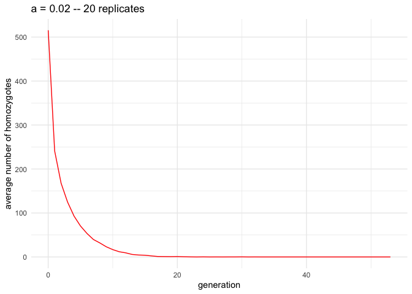
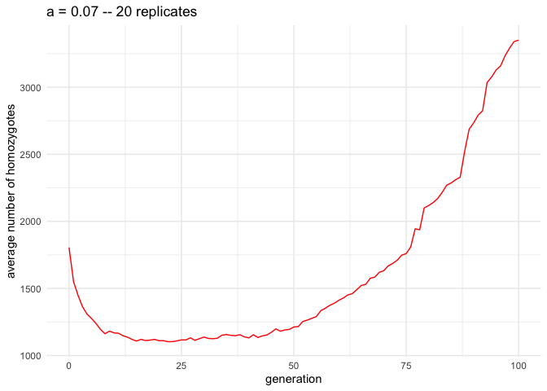
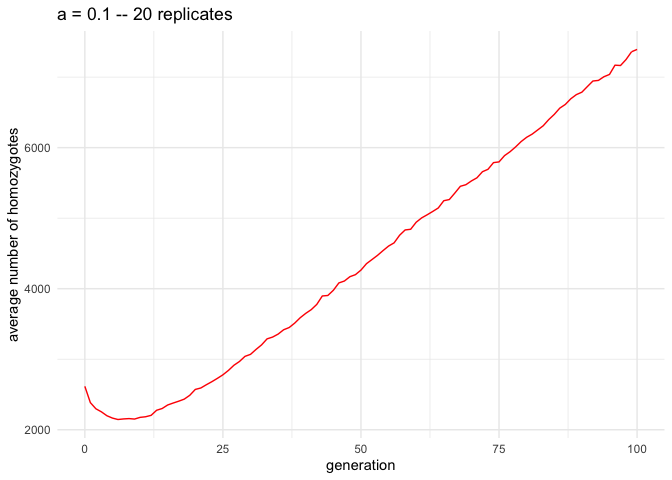
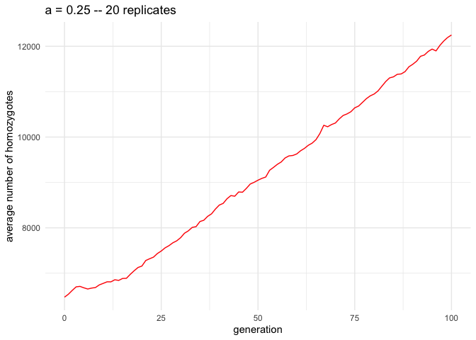

Drive homozygotes
================
Isabel Kim
5/12/2022

## Files

-   SLiM: `nonWF-model-drive-homozygotes.slim`
-   Python driver: `python_driver_homozygotes.py`
-   Text file: `may12_ndd.txt`
-   Script: `may12_ndd.sh`
    -   Uses `a = 0.02, 0.07, 0.1, 0.25`
    -   20 replicates each
    -   100 lines \* 20 replicates = 2000 lines per `.part` csv file
    -   Submitted on 5/12 11:45am
-   Results are in
    `/Users/isabelkim/Desktop/year2/underdominance/reaction-diffusion/bistable-R-waves/cluster_csvs/`
    -   `a0.02.csv` has header
    -   `a0.07.csv` has no header
    -   `a0.1.csv` has no header
    -   `a0.25.csv` has no header

## Go through each file, average over the generations, and plot the number of drive homozygotes over time

### a = 0.02

``` r
library(tidyverse)
```

    ## ── Attaching packages ─────────────────────────────────────── tidyverse 1.3.1 ──

    ## ✓ ggplot2 3.3.5     ✓ purrr   0.3.4
    ## ✓ tibble  3.1.6     ✓ dplyr   1.0.8
    ## ✓ tidyr   1.2.0     ✓ stringr 1.4.0
    ## ✓ readr   2.1.2     ✓ forcats 0.5.1

    ## ── Conflicts ────────────────────────────────────────── tidyverse_conflicts() ──
    ## x dplyr::filter() masks stats::filter()
    ## x dplyr::lag()    masks stats::lag()

``` r
a0_02 = read_csv("/Users/isabelkim/Desktop/year2/underdominance/reaction-diffusion/bistable-R-waves/cluster_csvs/a0.02.csv")
```

    ## Rows: 778 Columns: 4

    ## ── Column specification ────────────────────────────────────────────────────────
    ## Delimiter: ","
    ## dbl (4): a, replicate, gen, num_dd
    ## 
    ## ℹ Use `spec()` to retrieve the full column specification for this data.
    ## ℹ Specify the column types or set `show_col_types = FALSE` to quiet this message.

``` r
generations_vector = min(a0_02$gen):max(a0_02$gen)
n = length(generations_vector)
avg_ndd = rep(-1, n)
a_vec = rep(0.02, n)
number_of_replicates = rep(-1,n)
for (i in 1:n){
  g = generations_vector[i]
  rows_of_gen = a0_02 %>% filter(gen==g)
  avg_ndd[i] = mean(rows_of_gen$num_dd)
  number_of_replicates[i] = nrow(rows_of_gen)
}

avg_a_0.02_data = tibble(a = a_vec, generation = generations_vector, avg_ndd = avg_ndd, number_of_replicates = number_of_replicates)

a_0.02_plot = ggplot(avg_a_0.02_data, aes(x = generation, y = avg_ndd)) + theme_minimal() + geom_line(color = "red") + xlab("generation") + ylab("average number of homozygotes") + ggtitle("a = 0.02 -- 20 replicates")

#ggsave(filename = "/Users/isabelkim/Desktop/year2/underdominance/reaction-diffusion/bistable-R-waves/cluster_figs/a_0.02_avg_ndd.png", plot = a_0.02_plot)

a_0.02_plot
```

<!-- -->

### a = 0.07

``` r
a0_07 = read_csv("/Users/isabelkim/Desktop/year2/underdominance/reaction-diffusion/bistable-R-waves/cluster_csvs/a0.07.csv", col_names = c("a","replicate","gen","num_dd" ))
```

    ## Rows: 1941 Columns: 4
    ## ── Column specification ────────────────────────────────────────────────────────
    ## Delimiter: ","
    ## dbl (4): a, replicate, gen, num_dd
    ## 
    ## ℹ Use `spec()` to retrieve the full column specification for this data.
    ## ℹ Specify the column types or set `show_col_types = FALSE` to quiet this message.

``` r
generations_vector = min(a0_07$gen):max(a0_07$gen)
n = length(generations_vector)
avg_ndd = rep(-1, n)
a_vec = rep(0.07, n)
number_of_replicates = rep(-1,n)
for (i in 1:n){
  g = generations_vector[i]
  rows_of_gen = a0_07 %>% filter(gen==g)
  avg_ndd[i] = mean(rows_of_gen$num_dd)
  number_of_replicates[i] = nrow(rows_of_gen)
}

avg_a_0.07_data = tibble(a = a_vec, generation = generations_vector, avg_ndd = avg_ndd, number_of_replicates = number_of_replicates)

a_0.07_plot = ggplot(avg_a_0.07_data, aes(x = generation, y = avg_ndd)) + theme_minimal() + geom_line(color = "red") + xlab("generation") + ylab("average number of homozygotes") + ggtitle("a = 0.07 -- 20 replicates")

#ggsave(filename = "/Users/isabelkim/Desktop/year2/underdominance/reaction-diffusion/bistable-R-waves/cluster_figs/a_0.07_avg_ndd.png", plot = a_0.07_plot)

a_0.07_plot
```

<!-- -->

### a = 0.1

``` r
a0_1 = read_csv("/Users/isabelkim/Desktop/year2/underdominance/reaction-diffusion/bistable-R-waves/cluster_csvs/a0.1.csv", col_names = c("a","replicate","gen","num_dd" ))
```

    ## Rows: 2020 Columns: 4
    ## ── Column specification ────────────────────────────────────────────────────────
    ## Delimiter: ","
    ## dbl (4): a, replicate, gen, num_dd
    ## 
    ## ℹ Use `spec()` to retrieve the full column specification for this data.
    ## ℹ Specify the column types or set `show_col_types = FALSE` to quiet this message.

``` r
generations_vector = min(a0_1$gen):max(a0_1$gen)
n = length(generations_vector)
avg_ndd = rep(-1, n)
a_vec = rep(0.1, n)
number_of_replicates = rep(-1,n)
for (i in 1:n){
  g = generations_vector[i]
  rows_of_gen = a0_1 %>% filter(gen==g)
  avg_ndd[i] = mean(rows_of_gen$num_dd)
  number_of_replicates[i] = nrow(rows_of_gen)
}

avg_a_0.1_data = tibble(a = a_vec, generation = generations_vector, avg_ndd = avg_ndd, number_of_replicates = number_of_replicates)

a_0.1_plot = ggplot(avg_a_0.1_data, aes(x = generation, y = avg_ndd)) + theme_minimal() + geom_line(color = "red") + xlab("generation") + ylab("average number of homozygotes") + ggtitle("a = 0.1 -- 20 replicates")

#ggsave(filename = "/Users/isabelkim/Desktop/year2/underdominance/reaction-diffusion/bistable-R-waves/cluster_figs/a_0.1_avg_ndd.png", plot = a_0.1_plot)

a_0.1_plot
```

<!-- -->

### a = 0.25

``` r
a0_25 = read_csv("/Users/isabelkim/Desktop/year2/underdominance/reaction-diffusion/bistable-R-waves/cluster_csvs/a0.25.csv", col_names = c("a","replicate","gen","num_dd" ))
```

    ## Rows: 2020 Columns: 4
    ## ── Column specification ────────────────────────────────────────────────────────
    ## Delimiter: ","
    ## dbl (4): a, replicate, gen, num_dd
    ## 
    ## ℹ Use `spec()` to retrieve the full column specification for this data.
    ## ℹ Specify the column types or set `show_col_types = FALSE` to quiet this message.

``` r
generations_vector = min(a0_25$gen):max(a0_25$gen)
n = length(generations_vector)
avg_ndd = rep(-1, n)
a_vec = rep(0.25, n)
number_of_replicates = rep(-1,n)
for (i in 1:n){
  g = generations_vector[i]
  rows_of_gen = a0_25 %>% filter(gen==g)
  avg_ndd[i] = mean(rows_of_gen$num_dd)
  number_of_replicates[i] = nrow(rows_of_gen)
}

avg_a_0.25_data = tibble(a = a_vec, generation = generations_vector, avg_ndd = avg_ndd, number_of_replicates = number_of_replicates)

a_0.25_plot = ggplot(avg_a_0.25_data, aes(x = generation, y = avg_ndd)) + theme_minimal() + geom_line(color = "red") + xlab("generation") + ylab("average number of homozygotes") + ggtitle("a = 0.25 -- 20 replicates")

#ggsave(filename = "/Users/isabelkim/Desktop/year2/underdominance/reaction-diffusion/bistable-R-waves/cluster_figs/a_0.25_avg_ndd.png", plot = a_0.25_plot)

a_0.25_plot
```

<!-- -->
