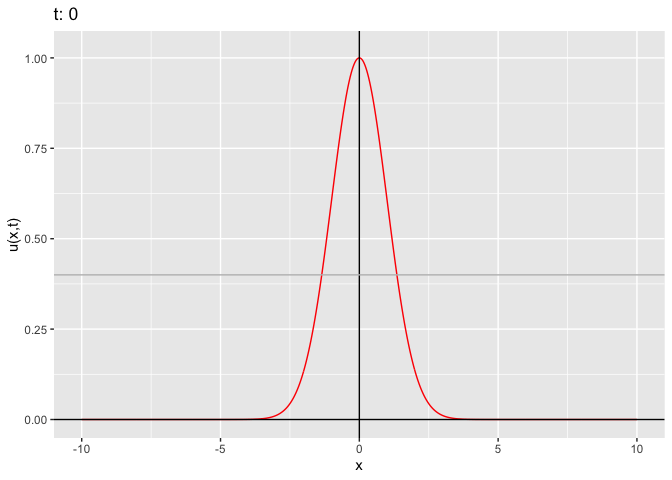
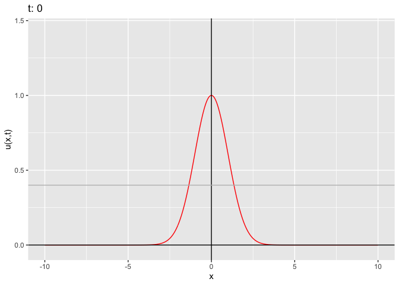
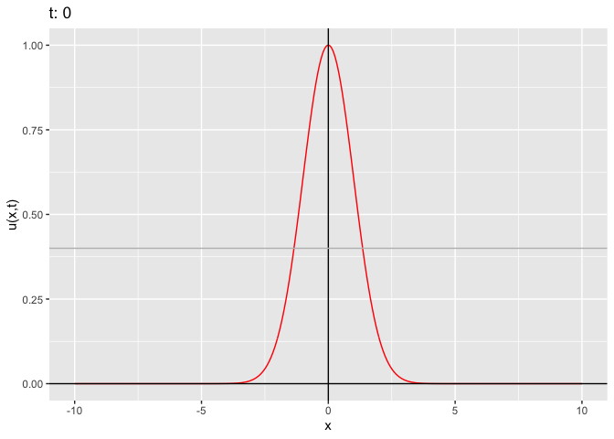

Examples of the R-simulated bistable waves
================
Isabel Kim
4/27/2022

## Load in the functions

``` r
source("/Users/isabelkim/Desktop/year2/underdominance/reaction-diffusion/scripts/bistable-wave.R")
```

    ## ── Attaching packages ─────────────────────────────────────── tidyverse 1.3.1 ──

    ## ✓ ggplot2 3.3.5     ✓ purrr   0.3.4
    ## ✓ tibble  3.1.6     ✓ dplyr   1.0.8
    ## ✓ tidyr   1.2.0     ✓ stringr 1.4.0
    ## ✓ readr   2.1.2     ✓ forcats 0.5.1

    ## ── Conflicts ────────────────────────────────────────── tidyverse_conflicts() ──
    ## x dplyr::filter() masks stats::filter()
    ## x dplyr::lag()    masks stats::lag()

    ## Linking to ImageMagick 6.9.12.3
    ## Enabled features: cairo, fontconfig, freetype, heic, lcms, pango, raw, rsvg, webp
    ## Disabled features: fftw, ghostscript, x11

    ## Loading required package: pracma

    ## 
    ## Attaching package: 'pracma'

    ## The following object is masked from 'package:purrr':
    ## 
    ##     cross

-   Use the
    `simulate_u_x_t(u, x_grid,time_steps, D, k,uhat, save_plot_path)`
    function
    -   Note that the initial `u` must be twice differentiable

## Gaussian u(x)

### D = 0.01, k = 0.2, uhat = 0.4

``` r
x_grid = seq(-10, 10, length.out = 1000)
u = dnorm(x_grid)*2.506754 # make u(x=0)=1

simulate_u_x_t(u, x_grid, 11, 0.01, 0.2, 0.4)
```

<!-- -->

-   The approximation breaks down at t=11.
-   The wave goes a bit lower than 1 from t=1 to t=5 but then rises from
    t=6 to t=10
    -   The whole time, the wave is widening
-   Possible that the wave falls and widens, then rises back up to 1 and
    fixes
    -   Could correspond to a dip in the frequency of the drive at x=0
        in the first few generations and a gradual build up back to 1

### Raise D to 0.02; keep k=0.2 and uhat=0.4

``` r
x_grid = seq(-10, 10, length.out = 1000)
u = dnorm(x_grid)*2.506754 # make u(x=0)=1
simulate_u_x_t(u, x_grid, 9, 0.02, 0.2, 0.4)
```

<!-- -->

-   Falls and widens
-   Looks like it starts to rise again around t=8
-   Approximation breaks down at t=9

### Lower D to 0.009; keep k=0.2 and uhat=0.4

``` r
x_grid = seq(-10, 10, length.out = 1000)
u = dnorm(x_grid)*2.506754 # make u(x=0)=1
simulate_u_x_t(u, x_grid, 12, 0.009, 0.2, 0.4, "/Users/isabelkim/Desktop/year2/underdominance/reaction-diffusion/bistable-R-waves/D0.009_k0.2_uhat0.4.gif")
```

    ## [1] "Saving /Users/isabelkim/Desktop/year2/underdominance/reaction-diffusion/bistable-R-waves/D0.009_k0.2_uhat0.4.gif"

<!-- --> \* D is
still sufficient; the wave falls a bit and widens but then rises back to
1 by t=11 \* Approximation then breaks down at t=12

-   Would be useful to have a measurement of how the critical AUC is
    changing over time

## Let’s make D too small

### D = 0.003; keep k=0.2 and uhat=0.4

``` r
x_grid = seq(-10, 10, length.out = 1000)
u = dnorm(x_grid)*2.506754 # make u(x=0)=1
simulate_u_x_t(u, x_grid, 12, 0.003, 0.2, 0.4)
```

<!-- --> \* Doesn’t
fall, just widens at the top \* Is this helpful? Or are we just scaling
down time?

### D = 0.001; keep k=0.2 and uhat=0.4

``` r
x_grid = seq(-10, 10, length.out = 1000)
u = dnorm(x_grid)*2.506754 # make u(x=0)=1
simulate_u_x_t(u, x_grid, 12, 0.001, 0.2, 0.4)
```

<!-- --> \* Doesn’t
fall, just widens a bit

### D = 0.0009; keep k=0.2 and uhat=0.4

``` r
x_grid = seq(-10, 10, length.out = 1000)
u = dnorm(x_grid)*2.506754 # make u(x=0)=1
simulate_u_x_t(u, x_grid, 12, 0.0003, 0.2, 0.4)
```

<!-- --> \* Even
when D is extremely small, the wave widens
