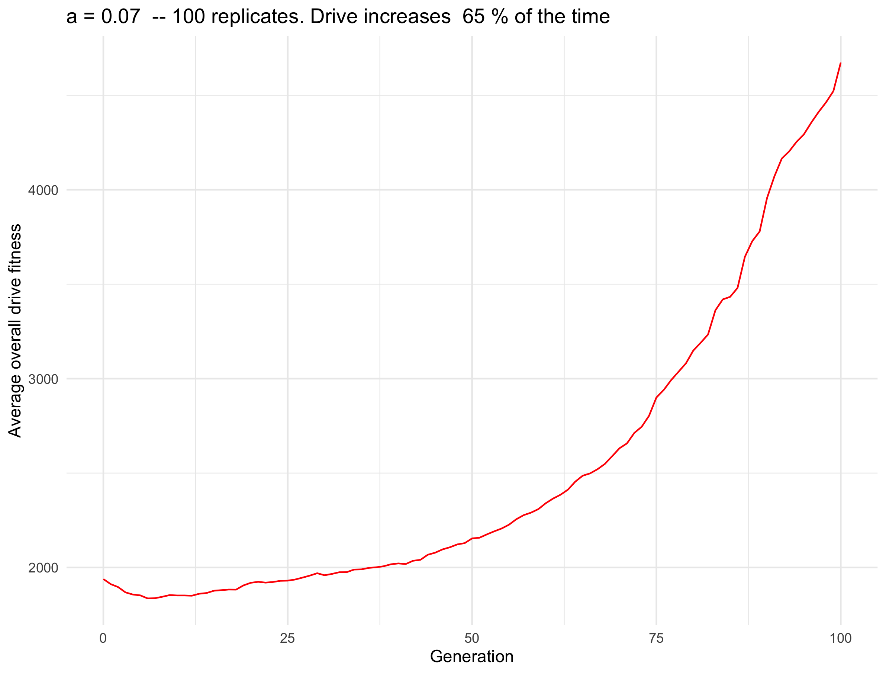

```{r setup, include=FALSE}
knitr::opts_chunk$set(echo = TRUE)
```

## Idea

* "Overall drive fitness", aka (W_DD * N_DD) + (0.5 * W_Dd * N_Dd), might be predictive
* Since N_DD can decrease then increase, and the overall number of drive alleles (2*N_DD + N_Dd) can increase then decrease -- maybe this "middle point" is monotonic

## Files

* SLiM: `nonWF-model-drive-homozygotes.slim`
  + Output line:
  + `GEN:: 10 n_dd:: 5091 n_dwt:: 0 fitness:: 5498.28`
* Python driver: `python_driver_homozygotes.py`
* Text file: `may12_ndd.txt`
* Script: `may12_ndd.sh`
  + Uses `a = 0.02, 0.07, 0.1, 0.25`
  + 20 replicates each
  + Submitted at 12:11pm on 5/13
* Results are in: `/Users/isabelkim/Desktop/year2/underdominance/reaction-diffusion/bistable-R-waves/d_fitness_results`

## Results

### Load all datasets in
```{r}
library(tidyverse)

a0_02 = read_csv("/Users/isabelkim/Desktop/year2/underdominance/reaction-diffusion/bistable-R-waves/d_fitness_results/a0.02_results.csv")

a0_07 = read_csv("/Users/isabelkim/Desktop/year2/underdominance/reaction-diffusion/bistable-R-waves/d_fitness_results/a0.07_results.csv")

a0_1 = read_csv("/Users/isabelkim/Desktop/year2/underdominance/reaction-diffusion/bistable-R-waves/d_fitness_results/a0.1_results.csv")

a0_25 = read_csv("/Users/isabelkim/Desktop/year2/underdominance/reaction-diffusion/bistable-R-waves/d_fitness_results/a0.25_results.csv")
```

### Function to get replicate-averages

```{r}
replicate_average = function(data){
  gen_vector = min(data$gen):max(data$gen)
  n = length(gen_vector)
  avg_ndd = rep(-1,n)
  avg_ndwt = rep(-1,n)
  avg_overall_fitness = rep(-1,n)
  num_replicates = rep(-1,n)
  a = rep(data$a[1], n)
  for (i in 1:n){
    g = gen_vector[i]
    rows = data %>% filter(gen == g)
    num_replicates[i] = nrow(rows)
    avg_ndd[i] = mean(rows$num_dd)
    avg_ndwt[i] = mean(rows$num_dwt)
    avg_overall_fitness[i] = mean(rows$d_fitness)
  }
  replicate_avg_data = tibble(a = a,
                              gen = gen_vector,
                              avg_num_dd = avg_ndd,
                              avg_num_dwt = avg_ndwt,
                              avg_d_fitness = avg_overall_fitness,
                              num_replicates = num_replicates)
  return(replicate_avg_data)
}
```

### Function to get plots
```{r}
library(tidyverse)
plot_drive_fitness_over_time = function(replicate_avg_data, p_increase){
  a = replicate_avg_data$a[1]
  plot = ggplot(replicate_avg_data, aes(x = gen, y = avg_d_fitness)) + theme_minimal() + ggtitle(paste("a =", a, " -- 100 replicates. Drive increases ", p_increase*100, "% of the time")) + geom_line(color = "red") + ylab("Average overall drive fitness") + xlab("Generation")
  
  return(plot)
}
```

### a = 0.02
```{r}
replicate_data = replicate_average(a0_02)
a0_02_plot = plot_drive_fitness_over_time(replicate_data)
#ggsave(plot = a0_02_plot, filename = "/Users/isabelkim/Desktop/year2/underdominance/reaction-diffusion/bistable-R-waves/d_fitness_results/a0.02_d_fitness.png")

a0_02_plot
```

### a = 0.07
```{r}
replicate_data = replicate_average(a0_07)
a0_07_plot = plot_drive_fitness_over_time(replicate_data)

#ggsave(plot = a0_07_plot, filename = "/Users/isabelkim/Desktop/year2/underdominance/reaction-diffusion/bistable-R-waves/d_fitness_results/a0.07_d_fitness.png")

a0_07_plot
```

### a = 0.1
```{r}
replicate_data = replicate_average(a0_1)
a0_1_plot = plot_drive_fitness_over_time(replicate_data)

#ggsave(plot = a0_1_plot, filename = "/Users/isabelkim/Desktop/year2/underdominance/reaction-diffusion/bistable-R-waves/d_fitness_results/a0.1_d_fitness.png")

a0_1_plot
```

### a = 0.25
```{r}
replicate_data = replicate_average(a0_25)
a0_25_plot = plot_drive_fitness_over_time(replicate_data)

#ggsave(plot = a0_25_plot, filename = "/Users/isabelkim/Desktop/year2/underdominance/reaction-diffusion/bistable-R-waves/d_fitness_results/a0.25_d_fitness.png")

a0_25_plot
```

## May 14: Running more replicates

* Already have 20 
* Let's go up to 100 --> 80 more
* For each parameter do 3 array jobs (each will have a header): 30, 30, 20 replicates --> 80 total + 20 from a few days ago = 100 

### Files

* Text file: `may12_ndd.txt`
* SLURM script: `may12_ndd.sh`
* Python driver: `python_driver_homozygotes.py`
* Submitted at 12:51pm
  + Output will be in `/home/ikk23/underdom/out_u40/`
  
### Function to figure out if the drive allele increased or decreased in frequency
```{r}
get_outcome = function(single_replicate_rows){
  num_drive_alleles_gen0 = (2*single_replicate_rows$num_dd[1]) + single_replicate_rows$num_dwt[1]
  num_drive_alleles_gen_last = (2*single_replicate_rows$num_dd[nrow(single_replicate_rows)]) + single_replicate_rows$num_dwt[nrow(single_replicate_rows)]
  
  if (num_drive_alleles_gen0 > num_drive_alleles_gen_last){
    outcome = "decrease"
  } else if (num_drive_alleles_gen0 < num_drive_alleles_gen_last){
    outcome = "increase"
  } else if (num_drive_alleles_gen0 == num_drive_alleles_gen_last){
    print("stayed the same?")
    outcome = "constant"
  } else {
    print("what other outcome is there?")
    return(NULL)
  }
  return(outcome)
}
```
  
### Compile all data

#### a = 0.02

```{r}
path = "/Users/isabelkim/Desktop/year2/underdominance/reaction-diffusion/bistable-R-waves/d_fitness_results/"
compiled_data = read_csv("/Users/isabelkim/Desktop/year2/underdominance/reaction-diffusion/bistable-R-waves/d_fitness_results/a0.02_results.csv")
replicates = min(compiled_data$replicate):max(compiled_data$replicate)
outcome = rep(-1,length(replicates))
for (i in 1:length(replicates)){
  r = replicates[i]
  rows = filter(compiled_data, replicate == r)
  outcome[i] = get_outcome(rows)
}
replicate_outcomes = outcome


for (i in 1:3){
  name = paste0(path,"a0.02_rep",i,".csv")
  data = read_csv(name)
  replicates_of_data = min(data$replicate):max(data$replicate)
  outcome_of_data = rep(-1,length(replicates_of_data))
  for (j in 1:length(replicates_of_data)){
    r = replicates_of_data[j]
    rows = filter(data, replicate == r)
    outcome_of_data[j] = get_outcome(rows)
  }
  replicate_outcomes = c(replicate_outcomes, outcome_of_data)
  compiled_data = rbind(compiled_data, data)
}

table(replicate_outcomes)
p_increase = mean(replicate_outcomes == "increase")
p_increase

# write out csvs
rep_avg = replicate_average(compiled_data)

#write_csv(x = compiled_data, file = "/Users/isabelkim/Desktop/year2/underdominance/reaction-diffusion/bistable-R-waves/d_fitness_results/compiled_results/a0.02_100_replicates_compiled.csv")

#write_csv(x = rep_avg, file = "/Users/isabelkim/Desktop/year2/underdominance/reaction-diffusion/bistable-R-waves/d_fitness_results/compiled_results/a0.02_100_replicates_averaged.csv")

plot = plot_drive_fitness_over_time(rep_avg, p_increase = p_increase)

#ggsave(plot = plot, filename = "/Users/isabelkim/Desktop/year2/underdominance/reaction-diffusion/bistable-R-waves/d_fitness_results/compiled_figures/a0.02_100_replicates.png")
```

```{r}

```

#### a = 0.07

```{r}
path = "/Users/isabelkim/Desktop/year2/underdominance/reaction-diffusion/bistable-R-waves/d_fitness_results/"
compiled_data = read_csv("/Users/isabelkim/Desktop/year2/underdominance/reaction-diffusion/bistable-R-waves/d_fitness_results/a0.07_results.csv")
replicates = min(compiled_data$replicate):max(compiled_data$replicate)
outcome = rep(-1,length(replicates))
for (i in 1:length(replicates)){
  r = replicates[i]
  rows = filter(compiled_data, replicate == r)
  outcome[i] = get_outcome(rows)
}
replicate_outcomes = outcome
for (i in 1:3){
  name = paste0(path,"a0.07_rep",i,".csv")
  data = read_csv(name)
  replicates_of_data = min(data$replicate):max(data$replicate)
  outcome_of_data = rep(-1,length(replicates_of_data))
  for (j in 1:length(replicates_of_data)){
    r = replicates_of_data[j]
    rows = filter(data, replicate == r)
    outcome_of_data[j] = get_outcome(rows)
  }
  replicate_outcomes = c(replicate_outcomes, outcome_of_data)
  compiled_data = rbind(compiled_data, data)
}

rep_avg = replicate_average(compiled_data)
#write_csv(x = compiled_data, file = "/Users/isabelkim/Desktop/year2/underdominance/reaction-diffusion/bistable-R-waves/d_fitness_results/compiled_results/a0.07_100_replicates_compiled.csv")
#write_csv(x = rep_avg, file = "/Users/isabelkim/Desktop/year2/underdominance/reaction-diffusion/bistable-R-waves/d_fitness_results/compiled_results/a0.07_100_replicates_averaged.csv")

p_increase = mean(replicate_outcomes == "increase")
plot = plot_drive_fitness_over_time(rep_avg, p_increase)

#ggsave(plot = plot, filename = "/Users/isabelkim/Desktop/year2/underdominance/reaction-diffusion/bistable-R-waves/d_fitness_results/compiled_figures/a0.07_100_replicates.png")
```

```{r}

```

#### a = 0.1

```{r}
path = "/Users/isabelkim/Desktop/year2/underdominance/reaction-diffusion/bistable-R-waves/d_fitness_results/"
compiled_data = read_csv("/Users/isabelkim/Desktop/year2/underdominance/reaction-diffusion/bistable-R-waves/d_fitness_results/a0.1_results.csv")
replicates = min(compiled_data$replicate):max(compiled_data$replicate)
outcome = rep(-1,length(replicates))
for (i in 1:length(replicates)){
  r = replicates[i]
  rows = filter(compiled_data, replicate == r)
  outcome[i] = get_outcome(rows)
}
replicate_outcomes = outcome

for (i in 1:3){
  name = paste0(path,"a0.1_rep",i,".csv")
  data = read_csv(name)
  replicates_of_data = min(data$replicate):max(data$replicate)
  outcome_of_data = rep(-1,length(replicates_of_data))
  for (j in 1:length(replicates_of_data)){
    r = replicates_of_data[j]
    rows = filter(data, replicate == r)
    outcome_of_data[j] = get_outcome(rows)
  }
  replicate_outcomes = c(replicate_outcomes, outcome_of_data)
  compiled_data = rbind(compiled_data, data)
}

rep_avg = replicate_average(compiled_data)
#write_csv(x = compiled_data, file = "/Users/isabelkim/Desktop/year2/underdominance/reaction-diffusion/bistable-R-waves/d_fitness_results/compiled_results/a0.1_100_replicates_compiled.csv")
#write_csv(x = rep_avg, file = "/Users/isabelkim/Desktop/year2/underdominance/reaction-diffusion/bistable-R-waves/d_fitness_results/compiled_results/a0.1_100_replicates_averaged.csv")

p_increase = mean(replicate_outcomes == "increase")
plot = plot_drive_fitness_over_time(rep_avg, p_increase)
#plot

#ggsave(plot = plot, filename = "/Users/isabelkim/Desktop/year2/underdominance/reaction-diffusion/bistable-R-waves/d_fitness_results/compiled_figures/a0.1_100_replicates.png")
```


```{r}
knitr::include_graphics("../bistable-R-waves/d_fitness_results/a0.1_100_replicates.png")
```

#### a = 0.25

```{r}
path = "/Users/isabelkim/Desktop/year2/underdominance/reaction-diffusion/bistable-R-waves/d_fitness_results/"
compiled_data = read_csv("/Users/isabelkim/Desktop/year2/underdominance/reaction-diffusion/bistable-R-waves/d_fitness_results/a0.25_results.csv")
replicates = min(compiled_data$replicate):max(compiled_data$replicate)
outcome = rep(-1,length(replicates))
for (i in 1:length(replicates)){
  r = replicates[i]
  rows = filter(compiled_data, replicate == r)
  outcome[i] = get_outcome(rows)
}
replicate_outcomes = outcome


for (i in 1:3){
  name = paste0(path,"a0.25_rep",i,".csv")
  data = read_csv(name)
  replicates_of_data = min(data$replicate):max(data$replicate)
  outcome_of_data = rep(-1,length(replicates_of_data))
  for (j in 1:length(replicates_of_data)){
    r = replicates_of_data[j]
    rows = filter(data, replicate == r)
    outcome_of_data[j] = get_outcome(rows)
  }
  replicate_outcomes = c(replicate_outcomes, outcome_of_data)
  compiled_data = rbind(compiled_data, data)
}

p_increase = mean(replicate_outcomes == "increase")
rep_avg = replicate_average(compiled_data)

#write_csv(x = compiled_data, file = "/Users/isabelkim/Desktop/year2/underdominance/reaction-diffusion/bistable-R-waves/d_fitness_results/compiled_results/a0.25_100_replicates_compiled.csv")
#write_csv(x = rep_avg, file = "/Users/isabelkim/Desktop/year2/underdominance/reaction-diffusion/bistable-R-waves/d_fitness_results/compiled_results/a0.25_100_replicates_averaged.csv")


plot = plot_drive_fitness_over_time(rep_avg, p_increase)

#ggsave(plot = plot, filename = "/Users/isabelkim/Desktop/year2/underdominance/reaction-diffusion/bistable-R-waves/d_fitness_results/compiled_figures/a0.25_100_replicates.png")
```


```{r}
knitr::include_graphics("../bistable-R-waves/d_fitness_results/a0.25_100_replicates.png")
```

## Running more parameters -- a = 0.06 and a = 0.08

* SLiM: `nonWF-model-drive-homozygotes.slim`
* Python driver: `python_driver_homozygotes.py`
* Text file: `may12_ndd.txt`
* Script: `may12_ndd.sh`
  + Uses `a = 0.06, a=0.08`
  + 30, 30, 40 replicates = 100 each
  + Submitted at 2:25pm on 5/15

### a = 0.06 results


```{r}
path = "/Users/isabelkim/Desktop/year2/underdominance/reaction-diffusion/bistable-R-waves/d_fitness_results/"
a = 0.06
replicate_outcomes = c()
for (i in 1:3){
  file = paste0(path,"a",a,"_rep",i,".csv")
  data = read_csv(file)
  replicates_of_data = min(data$replicate):max(data$replicate)
  outcome_of_data = rep(-1,length(replicates_of_data))
  for (j in 1:length(replicates_of_data)){
    r = replicates_of_data[j]
    rows = filter(data, replicate == r)
    outcome_of_data[j] = get_outcome(rows)
  }
  replicate_outcomes = c(replicate_outcomes, outcome_of_data)
  if (i == 1){
    compiled_data = data
  } else {
    compiled_data = rbind(compiled_data, data)
  }
}
rep_avg = replicate_average(compiled_data)

# Plot how the number of drive alleles changes with drive fitness
# First need to correct the "replicate" column
starts = which(compiled_data$gen==0)
ends = starts[2:length(starts)] - 1
ends = c(ends, nrow(compiled_data))
replicate_number = rep(-1,nrow(compiled_data))
for (i in 1:length(starts)){
  s = starts[i]
  e = ends[i]
  replicate_number[s:e] = i
}
compiled_data_edit = compiled_data %>% add_column(replicate_number) %>% 
  dplyr::select(a, replicate_number, gen, num_dd, num_dwt, d_fitness)

# Add a column for the overall number of drive alleles
compiled_data_edit = compiled_data_edit %>% 
  mutate(num_d_alleles = 2*num_dd + num_dwt)

# For each replicate, get an "outcome" column
outcome_column = rep(-1, nrow(compiled_data_edit))
for (i in 1:length(starts)){
  s = starts[i]
  e = ends[i]
  rows = compiled_data_edit[s:e,]
  outcome = get_outcome(rows)
  outcome_column[s:e] = outcome
}

compiled_data_edit = compiled_data_edit %>% add_column(outcome = outcome_column) %>%
  dplyr::select(a, replicate_number, gen, num_dd, num_dwt, num_d_alleles, d_fitness, outcome)

# Which replicates had an increase in drive alleles?
inds = which(outcome_column == "increase")
View(compiled_data_edit[inds,])

outliers = compiled_data_edit[inds,] # replicate 2 and 73
a = 0.06
outliers$replicate_number = as.character(outliers$replicate_number)
plot = ggplot(outliers, aes(x = gen, y = d_fitness, color = replicate_number)) + theme_minimal() + ggtitle(paste("a =", a, " -- 2 outlier replicates where drive increased")) + geom_point() + ylab("Overall drive fitness") + xlab("Generation")
#ggsave(plot = plot, filename = "/Users/isabelkim/Desktop/year2/underdominance/reaction-diffusion/bistable-R-waves/d_fitness_results/compiled_figures/a0.06_outlier_increase_replicates.png")

compiled_data_filter = compiled_data_edit %>% filter(!(replicate_number %in% c(2, 73)))
rep_avg_filter = replicate_average(compiled_data_filter)
plot = plot_drive_fitness_over_time(rep_avg_filter,0)

# write csvs out
#write_csv(x = compiled_data, file = "/Users/isabelkim/Desktop/year2/underdominance/reaction-diffusion/bistable-R-waves/d_fitness_results/compiled_results/a0.06_100_replicates_compiled.csv")
#write_csv(x = rep_avg, file = "/Users/isabelkim/Desktop/year2/underdominance/reaction-diffusion/bistable-R-waves/d_fitness_results/compiled_results/a0.06_100_replicates_averaged.csv")

p_increase = mean(replicate_outcomes == "increase")
plot = plot_drive_fitness_over_time(rep_avg, p_increase)
#plot
#ggsave(plot = plot, filename = "/Users/isabelkim/Desktop/year2/underdominance/reaction-diffusion/bistable-R-waves/d_fitness_results/compiled_figures/a0.06_100_replicates.png")
```

Looks really weird
```{r}
knitr::include_graphics("../bistable-R-waves/d_fitness_results/compiled_figures/a0.06_100_replicates.png")
```

Let's separate some replicates
```{r}
first_3_replicates_a0.06 = compiled_data[1:259,]
first_3_replicates_a0.06$replicate = as.character(first_3_replicates_a0.06$replicate)

plot = ggplot(first_3_replicates_a0.06, aes(x = gen, y = d_fitness, color = replicate)) + theme_minimal() + ggtitle(paste("a =", a, " -- first 3 replicates")) + geom_point() + ylab("Overall drive fitness") + xlab("Generation")

#ggsave(plot = plot, filename = "/Users/isabelkim/Desktop/year2/underdominance/reaction-diffusion/bistable-R-waves/d_fitness_results/compiled_figures/a0.06_first_3_replicates.png")
```

```{r}
knitr::include_graphics("../bistable-R-waves/d_fitness_results/compiled_figures/a0.06_first_3_replicates.png")
```

### a = 0.08 results

```{r}
path = "/Users/isabelkim/Desktop/year2/underdominance/reaction-diffusion/bistable-R-waves/d_fitness_results/"
a = 0.08
replicate_outcomes = c()
for (i in 1:3){
  file = paste0(path,"a",a,"_rep",i,".csv")
  data = read_csv(file)
  replicates_of_data = min(data$replicate):max(data$replicate)
  outcome_of_data = rep(-1,length(replicates_of_data))
  for (j in 1:length(replicates_of_data)){
    r = replicates_of_data[j]
    rows = filter(data, replicate == r)
    outcome_of_data[j] = get_outcome(rows)
  }
  replicate_outcomes = c(replicate_outcomes, outcome_of_data)
  if (i == 1){
    compiled_data = data
  } else {
    compiled_data = rbind(compiled_data, data)
  }
}
rep_avg = replicate_average(compiled_data)
#write_csv(x = compiled_data,file = "/Users/isabelkim/Desktop/year2/underdominance/reaction-diffusion/bistable-R-waves/d_fitness_results/compiled_results/a0.08_100_replicates_compiled.csv")
#write_csv(x = rep_avg,file = "/Users/isabelkim/Desktop/year2/underdominance/reaction-diffusion/bistable-R-waves/d_fitness_results/compiled_results/a0.08_100_replicates_averaged.csv")

p_increase = mean(replicate_outcomes == "increase")

plot = plot_drive_fitness_over_time(rep_avg, p_increase)

#ggsave(plot = plot, filename = "/Users/isabelkim/Desktop/year2/underdominance/reaction-diffusion/bistable-R-waves/d_fitness_results/compiled_figures/a0.08_100_replicates.png")
```

```{r}
knitr::include_graphics("../bistable-R-waves/d_fitness_results/a0.08_100_replicates.png")
```

Switch to new markdown: `drive_fitness_results.Rmd` for clearer results

## Focusing more on the transition zone around a = 0.06

```{r}
knitr::include_graphics("../cluster/u_hat=0.4_run/figures/revised_april19_zoomed_in_a_vs_p_increase_uhat4.png")
```
Transition range: between a = 0.056 and a = 0.079

Let's do 10 values of a in between these.
```{r}
a = round(seq(0.056, 0.079, length.out = 10),4)
```

3 array jobs for each parameter --> 30 array jobs total

Submitted at 8:36pm 5/15

### a = 0.056

```{r}
path = "/Users/isabelkim/Desktop/year2/underdominance/reaction-diffusion/bistable-R-waves/d_fitness_results/"
a = 0.056
replicate_outcomes = c()
for (i in 1:3){
  file = paste0(path,"a",a,"_rep",i,".csv")
  data = read_csv(file)
  replicates_of_data = min(data$replicate):max(data$replicate)
  outcome_of_data = rep(-1,length(replicates_of_data))
  for (j in 1:length(replicates_of_data)){
    r = replicates_of_data[j]
    rows = filter(data, replicate == r)
    outcome_of_data[j] = get_outcome(rows)
  }
  replicate_outcomes = c(replicate_outcomes, outcome_of_data)
  if (i == 1){
    compiled_data = data
  } else {
    compiled_data = rbind(compiled_data, data)
  }
}
rep_avg = replicate_average(compiled_data)
p_increase = mean(replicate_outcomes == "increase")
plot = plot_drive_fitness_over_time(rep_avg, p_increase)


# write csvs out
#write_csv(x = compiled_data, file = "/Users/isabelkim/Desktop/year2/underdominance/reaction-diffusion/bistable-R-waves/d_fitness_results/compiled_results/a0.056_100_replicates_compiled.csv")
#write_csv(x = rep_avg, file = "/Users/isabelkim/Desktop/year2/underdominance/reaction-diffusion/bistable-R-waves/d_fitness_results/compiled_results/a0.056_100_replicates_averaged.csv")


#plot
#ggsave(plot = plot, filename = "/Users/isabelkim/Desktop/year2/underdominance/reaction-diffusion/bistable-R-waves/d_fitness_results/compiled_figures/a0.056_100_replicates.png")
```

### a = 0.0586

```{r}
path = "/Users/isabelkim/Desktop/year2/underdominance/reaction-diffusion/bistable-R-waves/d_fitness_results/"
a = 0.0586
replicate_outcomes = c()
for (i in 1:3){
  file = paste0(path,"a",a,"_rep",i,".csv")
  data = read_csv(file)
  replicates_of_data = min(data$replicate):max(data$replicate)
  outcome_of_data = rep(-1,length(replicates_of_data))
  for (j in 1:length(replicates_of_data)){
    r = replicates_of_data[j]
    rows = filter(data, replicate == r)
    outcome_of_data[j] = get_outcome(rows)
  }
  replicate_outcomes = c(replicate_outcomes, outcome_of_data)
  if (i == 1){
    compiled_data = data
  } else {
    compiled_data = rbind(compiled_data, data)
  }
}
rep_avg = replicate_average(compiled_data)
p_increase = mean(replicate_outcomes == "increase")
plot = plot_drive_fitness_over_time(rep_avg, p_increase)

# Plot how the number of drive alleles changes with drive fitness
# First need to correct the "replicate" column
starts = which(compiled_data$gen==0)
ends = starts[2:length(starts)] - 1
ends = c(ends, nrow(compiled_data))
replicate_number = rep(-1,nrow(compiled_data))
for (i in 1:length(starts)){
  s = starts[i]
  e = ends[i]
  replicate_number[s:e] = i
}
compiled_data_edit = compiled_data %>% add_column(replicate_number) %>% 
  dplyr::select(a, replicate_number, gen, num_dd, num_dwt, d_fitness)

# Add a column for the overall number of drive alleles
compiled_data_edit = compiled_data_edit %>% 
  mutate(num_d_alleles = 2*num_dd + num_dwt)

# For each replicate, get an "outcome" column
outcome_column = rep(-1, nrow(compiled_data_edit))
for (i in 1:length(starts)){
  s = starts[i]
  e = ends[i]
  rows = compiled_data_edit[s:e,]
  outcome = get_outcome(rows)
  outcome_column[s:e] = outcome
}

compiled_data_edit = compiled_data_edit %>% add_column(outcome = outcome_column) %>%
  dplyr::select(a, replicate_number, gen, num_dd, num_dwt, num_d_alleles, d_fitness, outcome)

# Which replicate had an increase in drive alleles?
inds = which(outcome_column == "increase")
View(compiled_data_edit[inds,])

# Only plot the outlier
outlier_a0.0586_plot = compiled_data_edit[inds,] %>% ggplot(aes(x = gen, y = d_fitness)) +
  geom_line(color = "red") + ggtitle("a = 0.0586 -- outlier replicate") + theme_minimal() +
  xlab("Generation") + ylab("Overall drive fitness")
#ggsave(plot = outlier_a0.0586_plot, filename = "/Users/isabelkim/Desktop/year2/underdominance/reaction-diffusion/bistable-R-waves/d_fitness_results/compiled_figures/a0.0586_outlier_increase_replicate.png")

# Get rid of outlier. How does the average graph change?
compiled_data_edit_filtered = compiled_data_edit %>% filter(replicate_number != 82)

rep_avg_filtered = replicate_average(compiled_data_edit_filtered)
plot = plot_drive_fitness_over_time(rep_avg_filtered, 0)
#ggsave("/Users/isabelkim/Desktop/year2/underdominance/reaction-diffusion/bistable-R-waves/d_fitness_results/compiled_figures/a0.0586_no_outlier.png")

# write csvs out
#write_csv(x = compiled_data_edit, file = "/Users/isabelkim/Desktop/year2/underdominance/reaction-diffusion/bistable-R-waves/d_fitness_results/compiled_results/a0.0586_100_replicates_compiled.csv")
#write_csv(x = rep_avg, file = "/Users/isabelkim/Desktop/year2/underdominance/reaction-diffusion/bistable-R-waves/d_fitness_results/compiled_results/a0.0586_100_replicates_averaged.csv")


#plot
#ggsave(plot = plot, filename = "/Users/isabelkim/Desktop/year2/underdominance/reaction-diffusion/bistable-R-waves/d_fitness_results/compiled_figures/a0.0586_100_replicates.png")

# Separate just the first 3 replicates
first_replicates_a0.0586 = compiled_data[1:435,]
first_replicates_a0.0586$replicate = as.character(first_replicates_a0.0586$replicate)

plot = ggplot(first_replicates_a0.0586, aes(x = gen, y = d_fitness, color = replicate)) + theme_minimal() + ggtitle(paste("a =", a, " -- first few replicates")) + geom_point() + ylab("Overall drive fitness") + xlab("Generation")
#ggsave(plot = plot, filename = "/Users/isabelkim/Desktop/year2/underdominance/reaction-diffusion/bistable-R-waves/d_fitness_results/compiled_figures/a0.0586_first_3_replicates.png")

```

### a = 0.0611

```{r}
path = "/Users/isabelkim/Desktop/year2/underdominance/reaction-diffusion/bistable-R-waves/d_fitness_results/"
a = 0.0611
replicate_outcomes = c()
for (i in 1:3){
  file = paste0(path,"a",a,"_rep",i,".csv")
  data = read_csv(file)
  replicates_of_data = min(data$replicate):max(data$replicate)
  outcome_of_data = rep(-1,length(replicates_of_data))
  for (j in 1:length(replicates_of_data)){
    r = replicates_of_data[j]
    rows = filter(data, replicate == r)
    outcome_of_data[j] = get_outcome(rows)
  }
  replicate_outcomes = c(replicate_outcomes, outcome_of_data)
  if (i == 1){
    compiled_data = data
  } else {
    compiled_data = rbind(compiled_data, data)
  }
}
rep_avg = replicate_average(compiled_data)
p_increase = mean(replicate_outcomes == "increase")
plot = plot_drive_fitness_over_time(rep_avg, p_increase)


# write csvs out
#write_csv(x = compiled_data, file = "/Users/isabelkim/Desktop/year2/underdominance/reaction-diffusion/bistable-R-waves/d_fitness_results/compiled_results/a0.0611_100_replicates_compiled.csv")
#write_csv(x = rep_avg, file = "/Users/isabelkim/Desktop/year2/underdominance/reaction-diffusion/bistable-R-waves/d_fitness_results/compiled_results/a0.0611_100_replicates_averaged.csv")


#plot
#ggsave(plot = plot, filename = "/Users/isabelkim/Desktop/year2/underdominance/reaction-diffusion/bistable-R-waves/d_fitness_results/compiled_figures/a0.0611_100_replicates.png")
```

### a = 0.0637

```{r}
path = "/Users/isabelkim/Desktop/year2/underdominance/reaction-diffusion/bistable-R-waves/d_fitness_results/"
a = 0.0637
replicate_outcomes = c()
for (i in 1:3){
  file = paste0(path,"a",a,"_rep",i,".csv")
  data = read_csv(file)
  replicates_of_data = min(data$replicate):max(data$replicate)
  outcome_of_data = rep(-1,length(replicates_of_data))
  for (j in 1:length(replicates_of_data)){
    r = replicates_of_data[j]
    rows = filter(data, replicate == r)
    outcome_of_data[j] = get_outcome(rows)
  }
  replicate_outcomes = c(replicate_outcomes, outcome_of_data)
  if (i == 1){
    compiled_data = data
  } else {
    compiled_data = rbind(compiled_data, data)
  }
}
rep_avg = replicate_average(compiled_data)
p_increase = mean(replicate_outcomes == "increase")
plot = plot_drive_fitness_over_time(rep_avg, p_increase)


# write csvs out
#write_csv(x = compiled_data, file = "/Users/isabelkim/Desktop/year2/underdominance/reaction-diffusion/bistable-R-waves/d_fitness_results/compiled_results/a0.0637_100_replicates_compiled.csv")
#write_csv(x = rep_avg, file = "/Users/isabelkim/Desktop/year2/underdominance/reaction-diffusion/bistable-R-waves/d_fitness_results/compiled_results/a0.0637_100_replicates_averaged.csv")


#plot
#ggsave(plot = plot, filename = "/Users/isabelkim/Desktop/year2/underdominance/reaction-diffusion/bistable-R-waves/d_fitness_results/compiled_figures/a0.0637_100_replicates.png")
```

## a = 0.0662
```{r}
path = "/Users/isabelkim/Desktop/year2/underdominance/reaction-diffusion/bistable-R-waves/d_fitness_results/"
a = 0.0662
replicate_outcomes = c()
for (i in 1:3){
  file = paste0(path,"a",a,"_rep",i,".csv")
  data = read_csv(file)
  replicates_of_data = min(data$replicate):max(data$replicate)
  outcome_of_data = rep(-1,length(replicates_of_data))
  for (j in 1:length(replicates_of_data)){
    r = replicates_of_data[j]
    rows = filter(data, replicate == r)
    outcome_of_data[j] = get_outcome(rows)
  }
  replicate_outcomes = c(replicate_outcomes, outcome_of_data)
  if (i == 1){
    compiled_data = data
  } else {
    compiled_data = rbind(compiled_data, data)
  }
}
rep_avg = replicate_average(compiled_data)
p_increase = mean(replicate_outcomes == "increase")
plot = plot_drive_fitness_over_time(rep_avg, p_increase)


# write csvs out
#write_csv(x = compiled_data, file = "/Users/isabelkim/Desktop/year2/underdominance/reaction-diffusion/bistable-R-waves/d_fitness_results/compiled_results/a0.0662_100_replicates_compiled.csv")
#write_csv(x = rep_avg, file = "/Users/isabelkim/Desktop/year2/underdominance/reaction-diffusion/bistable-R-waves/d_fitness_results/compiled_results/a0.0662_100_replicates_averaged.csv")


#plot
#ggsave(plot = plot, filename = "/Users/isabelkim/Desktop/year2/underdominance/reaction-diffusion/bistable-R-waves/d_fitness_results/compiled_figures/a0.0662_100_replicates.png")
```

## a = 0.0688
```{r}
path = "/Users/isabelkim/Desktop/year2/underdominance/reaction-diffusion/bistable-R-waves/d_fitness_results/"
a = 0.0688
replicate_outcomes = c()
for (i in 1:3){
  file = paste0(path,"a",a,"_rep",i,".csv")
  data = read_csv(file)
  replicates_of_data = min(data$replicate):max(data$replicate)
  outcome_of_data = rep(-1,length(replicates_of_data))
  for (j in 1:length(replicates_of_data)){
    r = replicates_of_data[j]
    rows = filter(data, replicate == r)
    outcome_of_data[j] = get_outcome(rows)
  }
  replicate_outcomes = c(replicate_outcomes, outcome_of_data)
  if (i == 1){
    compiled_data = data
  } else {
    compiled_data = rbind(compiled_data, data)
  }
}
rep_avg = replicate_average(compiled_data)
p_increase = mean(replicate_outcomes == "increase")
plot = plot_drive_fitness_over_time(rep_avg, p_increase)


# write csvs out
#write_csv(x = compiled_data, file = "/Users/isabelkim/Desktop/year2/underdominance/reaction-diffusion/bistable-R-waves/d_fitness_results/compiled_results/a0.0688_100_replicates_compiled.csv")
#write_csv(x = rep_avg, file = "/Users/isabelkim/Desktop/year2/underdominance/reaction-diffusion/bistable-R-waves/d_fitness_results/compiled_results/a0.0688_100_replicates_averaged.csv")


#plot
#ggsave(plot = plot, filename = "/Users/isabelkim/Desktop/year2/underdominance/reaction-diffusion/bistable-R-waves/d_fitness_results/compiled_figures/a0.0688_100_replicates.png")
```

## a = 0.0713
```{r}
path = "/Users/isabelkim/Desktop/year2/underdominance/reaction-diffusion/bistable-R-waves/d_fitness_results/"
a = 0.0713
replicate_outcomes = c()
for (i in 1:3){
  file = paste0(path,"a",a,"_rep",i,".csv")
  data = read_csv(file)
  replicates_of_data = min(data$replicate):max(data$replicate)
  outcome_of_data = rep(-1,length(replicates_of_data))
  for (j in 1:length(replicates_of_data)){
    r = replicates_of_data[j]
    rows = filter(data, replicate == r)
    outcome_of_data[j] = get_outcome(rows)
  }
  replicate_outcomes = c(replicate_outcomes, outcome_of_data)
  if (i == 1){
    compiled_data = data
  } else {
    compiled_data = rbind(compiled_data, data)
  }
}
rep_avg = replicate_average(compiled_data)
p_increase = mean(replicate_outcomes == "increase")
plot = plot_drive_fitness_over_time(rep_avg, p_increase)


# write csvs out
#write_csv(x = compiled_data, file = "/Users/isabelkim/Desktop/year2/underdominance/reaction-diffusion/bistable-R-waves/d_fitness_results/compiled_results/a0.0713_100_replicates_compiled.csv")
#write_csv(x = rep_avg, file = "/Users/isabelkim/Desktop/year2/underdominance/reaction-diffusion/bistable-R-waves/d_fitness_results/compiled_results/a0.0713_100_replicates_averaged.csv")


#plot
#ggsave(plot = plot, filename = "/Users/isabelkim/Desktop/year2/underdominance/reaction-diffusion/bistable-R-waves/d_fitness_results/compiled_figures/a0.0713_100_replicates.png")
```

## a = 0.0739

```{r}
path = "/Users/isabelkim/Desktop/year2/underdominance/reaction-diffusion/bistable-R-waves/d_fitness_results/"
a = 0.0739
replicate_outcomes = c()
for (i in 1:3){
  file = paste0(path,"a",a,"_rep",i,".csv")
  data = read_csv(file)
  replicates_of_data = min(data$replicate):max(data$replicate)
  outcome_of_data = rep(-1,length(replicates_of_data))
  for (j in 1:length(replicates_of_data)){
    r = replicates_of_data[j]
    rows = filter(data, replicate == r)
    outcome_of_data[j] = get_outcome(rows)
  }
  replicate_outcomes = c(replicate_outcomes, outcome_of_data)
  if (i == 1){
    compiled_data = data
  } else {
    compiled_data = rbind(compiled_data, data)
  }
}
rep_avg = replicate_average(compiled_data)
p_increase = mean(replicate_outcomes == "increase")
plot = plot_drive_fitness_over_time(rep_avg, p_increase)


# write csvs out
#write_csv(x = compiled_data, file = "/Users/isabelkim/Desktop/year2/underdominance/reaction-diffusion/bistable-R-waves/d_fitness_results/compiled_results/a0.0739_100_replicates_compiled.csv")
#write_csv(x = rep_avg, file = "/Users/isabelkim/Desktop/year2/underdominance/reaction-diffusion/bistable-R-waves/d_fitness_results/compiled_results/a0.0739_100_replicates_averaged.csv")


#plot
#ggsave(plot = plot, filename = "/Users/isabelkim/Desktop/year2/underdominance/reaction-diffusion/bistable-R-waves/d_fitness_results/compiled_figures/a0.0739_100_replicates.png")
```

## a = 0.0764

```{r}
path = "/Users/isabelkim/Desktop/year2/underdominance/reaction-diffusion/bistable-R-waves/d_fitness_results/"
a = 0.0764
replicate_outcomes = c()
for (i in 1:3){
  file = paste0(path,"a",a,"_rep",i,".csv")
  data = read_csv(file)
  replicates_of_data = min(data$replicate):max(data$replicate)
  outcome_of_data = rep(-1,length(replicates_of_data))
  for (j in 1:length(replicates_of_data)){
    r = replicates_of_data[j]
    rows = filter(data, replicate == r)
    outcome_of_data[j] = get_outcome(rows)
  }
  replicate_outcomes = c(replicate_outcomes, outcome_of_data)
  if (i == 1){
    compiled_data = data
  } else {
    compiled_data = rbind(compiled_data, data)
  }
}
rep_avg = replicate_average(compiled_data)
p_increase = mean(replicate_outcomes == "increase")
plot = plot_drive_fitness_over_time(rep_avg, p_increase)


# write csvs out
#write_csv(x = compiled_data, file = "/Users/isabelkim/Desktop/year2/underdominance/reaction-diffusion/bistable-R-waves/d_fitness_results/compiled_results/a0.0764_100_replicates_compiled.csv")
#write_csv(x = rep_avg, file = "/Users/isabelkim/Desktop/year2/underdominance/reaction-diffusion/bistable-R-waves/d_fitness_results/compiled_results/a0.0764_100_replicates_averaged.csv")


#plot
#ggsave(plot = plot, filename = "/Users/isabelkim/Desktop/year2/underdominance/reaction-diffusion/bistable-R-waves/d_fitness_results/compiled_figures/a0.0764_100_replicates.png")
```

## a = 0.079

```{r}
path = "/Users/isabelkim/Desktop/year2/underdominance/reaction-diffusion/bistable-R-waves/d_fitness_results/"
a = 0.079
replicate_outcomes = c()
for (i in 1:3){
  file = paste0(path,"a",a,"_rep",i,".csv")
  data = read_csv(file)
  replicates_of_data = min(data$replicate):max(data$replicate)
  outcome_of_data = rep(-1,length(replicates_of_data))
  for (j in 1:length(replicates_of_data)){
    r = replicates_of_data[j]
    rows = filter(data, replicate == r)
    outcome_of_data[j] = get_outcome(rows)
  }
  replicate_outcomes = c(replicate_outcomes, outcome_of_data)
  if (i == 1){
    compiled_data = data
  } else {
    compiled_data = rbind(compiled_data, data)
  }
}
rep_avg = replicate_average(compiled_data)
p_increase = mean(replicate_outcomes == "increase")
plot = plot_drive_fitness_over_time(rep_avg, p_increase)


# write csvs out
write_csv(x = compiled_data, file = "/Users/isabelkim/Desktop/year2/underdominance/reaction-diffusion/bistable-R-waves/d_fitness_results/compiled_results/a0.079_100_replicates_compiled.csv")
write_csv(x = rep_avg, file = "/Users/isabelkim/Desktop/year2/underdominance/reaction-diffusion/bistable-R-waves/d_fitness_results/compiled_results/a0.079_100_replicates_averaged.csv")


#plot
#ggsave(plot = plot, filename = "/Users/isabelkim/Desktop/year2/underdominance/reaction-diffusion/bistable-R-waves/d_fitness_results/compiled_figures/a0.079_100_replicates.png")
```