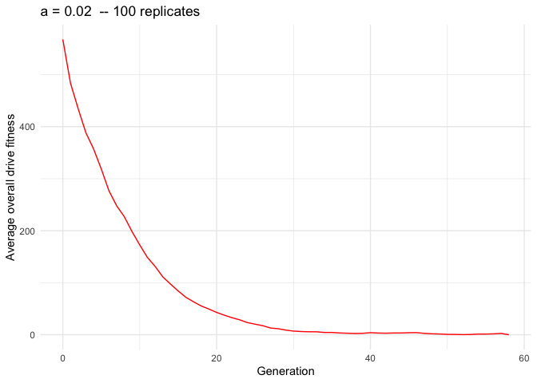

Overall drive fitness
================
Isabel Kim
5/13/2022

## Idea

-   “Overall drive fitness”, aka (W_DD \* N_DD) + (0.5 \* W_Dd \* N_Dd),
    might be predictive
-   Since N_DD can decrease then increase, and the overall number of
    drive alleles (2\*N_DD + N_Dd) can increase then decrease – maybe
    this “middle point” is monotonic

## Files

-   SLiM: `nonWF-model-drive-homozygotes.slim`
    -   Output line:
    -   `GEN:: 10 n_dd:: 5091 n_dwt:: 0 fitness:: 5498.28`
-   Python driver: `python_driver_homozygotes.py`
-   Text file: `may12_ndd.txt`
-   Script: `may12_ndd.sh`
    -   Uses `a = 0.02, 0.07, 0.1, 0.25`
    -   20 replicates each
    -   Submitted at 12:11pm on 5/13
-   Results are in:
    `/Users/isabelkim/Desktop/year2/underdominance/reaction-diffusion/bistable-R-waves/d_fitness_results`

## Results

### Load all datasets in

``` r
library(tidyverse)
```

    ## ── Attaching packages ─────────────────────────────────────── tidyverse 1.3.1 ──

    ## ✓ ggplot2 3.3.5     ✓ purrr   0.3.4
    ## ✓ tibble  3.1.6     ✓ dplyr   1.0.8
    ## ✓ tidyr   1.2.0     ✓ stringr 1.4.0
    ## ✓ readr   2.1.2     ✓ forcats 0.5.1

    ## ── Conflicts ────────────────────────────────────────── tidyverse_conflicts() ──
    ## x dplyr::filter() masks stats::filter()
    ## x dplyr::lag()    masks stats::lag()

``` r
a0_02 = read_csv("/Users/isabelkim/Desktop/year2/underdominance/reaction-diffusion/bistable-R-waves/d_fitness_results/a0.02_results.csv")
```

    ## Rows: 824 Columns: 6

    ## ── Column specification ────────────────────────────────────────────────────────
    ## Delimiter: ","
    ## dbl (6): a, replicate, gen, num_dd, num_dwt, d_fitness
    ## 
    ## ℹ Use `spec()` to retrieve the full column specification for this data.
    ## ℹ Specify the column types or set `show_col_types = FALSE` to quiet this message.

``` r
a0_07 = read_csv("/Users/isabelkim/Desktop/year2/underdominance/reaction-diffusion/bistable-R-waves/d_fitness_results/a0.07_results.csv")
```

    ## Rows: 1912 Columns: 6
    ## ── Column specification ────────────────────────────────────────────────────────
    ## Delimiter: ","
    ## dbl (6): a, replicate, gen, num_dd, num_dwt, d_fitness
    ## 
    ## ℹ Use `spec()` to retrieve the full column specification for this data.
    ## ℹ Specify the column types or set `show_col_types = FALSE` to quiet this message.

``` r
a0_1 = read_csv("/Users/isabelkim/Desktop/year2/underdominance/reaction-diffusion/bistable-R-waves/d_fitness_results/a0.1_results.csv")
```

    ## Rows: 2020 Columns: 6
    ## ── Column specification ────────────────────────────────────────────────────────
    ## Delimiter: ","
    ## dbl (6): a, replicate, gen, num_dd, num_dwt, d_fitness
    ## 
    ## ℹ Use `spec()` to retrieve the full column specification for this data.
    ## ℹ Specify the column types or set `show_col_types = FALSE` to quiet this message.

``` r
a0_25 = read_csv("/Users/isabelkim/Desktop/year2/underdominance/reaction-diffusion/bistable-R-waves/d_fitness_results/a0.25_results.csv")
```

    ## Rows: 2020 Columns: 6
    ## ── Column specification ────────────────────────────────────────────────────────
    ## Delimiter: ","
    ## dbl (6): a, replicate, gen, num_dd, num_dwt, d_fitness
    ## 
    ## ℹ Use `spec()` to retrieve the full column specification for this data.
    ## ℹ Specify the column types or set `show_col_types = FALSE` to quiet this message.

### Function to get replicate-averages

``` r
replicate_average = function(data){
  gen_vector = min(data$gen):max(data$gen)
  n = length(gen_vector)
  avg_ndd = rep(-1,n)
  avg_ndwt = rep(-1,n)
  avg_overall_fitness = rep(-1,n)
  num_replicates = rep(-1,n)
  a = rep(data$a[1], n)
  for (i in 1:n){
    g = gen_vector[i]
    rows = data %>% filter(gen == g)
    num_replicates[i] = nrow(rows)
    avg_ndd[i] = mean(rows$num_dd)
    avg_ndwt[i] = mean(rows$num_dwt)
    avg_overall_fitness[i] = mean(rows$d_fitness)
  }
  replicate_avg_data = tibble(a = a,
                              gen = gen_vector,
                              avg_num_dd = avg_ndd,
                              avg_num_dwt = avg_ndwt,
                              avg_d_fitness = avg_overall_fitness,
                              num_replicates = num_replicates)
  return(replicate_avg_data)
}
```

### Function to get plots

``` r
library(tidyverse)
plot_drive_fitness_over_time = function(replicate_avg_data){
  a = replicate_avg_data$a[1]
  plot = ggplot(replicate_avg_data, aes(x = gen, y = avg_d_fitness)) + theme_minimal() + ggtitle(paste("a =", a, " -- 100 replicates")) + geom_line(color = "red") + ylab("Average overall drive fitness") + xlab("Generation")
  return(plot)
}
```

### a = 0.02

``` r
replicate_data = replicate_average(a0_02)
a0_02_plot = plot_drive_fitness_over_time(replicate_data)
#ggsave(plot = a0_02_plot, filename = "/Users/isabelkim/Desktop/year2/underdominance/reaction-diffusion/bistable-R-waves/d_fitness_results/a0.02_d_fitness.png")

a0_02_plot
```

<!-- -->

### a = 0.07

``` r
replicate_data = replicate_average(a0_07)
a0_07_plot = plot_drive_fitness_over_time(replicate_data)

#ggsave(plot = a0_07_plot, filename = "/Users/isabelkim/Desktop/year2/underdominance/reaction-diffusion/bistable-R-waves/d_fitness_results/a0.07_d_fitness.png")

a0_07_plot
```

<!-- -->

### a = 0.1

``` r
replicate_data = replicate_average(a0_1)
a0_1_plot = plot_drive_fitness_over_time(replicate_data)

#ggsave(plot = a0_1_plot, filename = "/Users/isabelkim/Desktop/year2/underdominance/reaction-diffusion/bistable-R-waves/d_fitness_results/a0.1_d_fitness.png")

a0_1_plot
```

<!-- -->

### a = 0.25

``` r
replicate_data = replicate_average(a0_25)
a0_25_plot = plot_drive_fitness_over_time(replicate_data)

#ggsave(plot = a0_25_plot, filename = "/Users/isabelkim/Desktop/year2/underdominance/reaction-diffusion/bistable-R-waves/d_fitness_results/a0.25_d_fitness.png")

a0_25_plot
```

<!-- -->

## May 14: Running more replicates

-   Already have 20
-   Let’s go up to 100 –> 80 more
-   For each parameter do 3 array jobs (each will have a header): 30,
    30, 20 replicates –> 80 total + 20 from a few days ago = 100

### Files

-   Text file: `may12_ndd.txt`
-   SLURM script: `may12_ndd.sh`
-   Python driver: `python_driver_homozygotes.py`
-   Submitted at 12:51pm
    -   Output will be in `/home/ikk23/underdom/out_u40/`

### Compile all data

#### a = 0.02

``` r
path = "/Users/isabelkim/Desktop/year2/underdominance/reaction-diffusion/bistable-R-waves/d_fitness_results/"
compiled_data = read_csv("/Users/isabelkim/Desktop/year2/underdominance/reaction-diffusion/bistable-R-waves/d_fitness_results/a0.02_results.csv")
```

    ## Rows: 824 Columns: 6
    ## ── Column specification ────────────────────────────────────────────────────────
    ## Delimiter: ","
    ## dbl (6): a, replicate, gen, num_dd, num_dwt, d_fitness
    ## 
    ## ℹ Use `spec()` to retrieve the full column specification for this data.
    ## ℹ Specify the column types or set `show_col_types = FALSE` to quiet this message.

``` r
for (i in 1:3){
  name = paste0(path,"a0.02_rep",i,".csv")
  data = read_csv(name)
  compiled_data = rbind(compiled_data, data)
}
```

    ## Rows: 1189 Columns: 6
    ## ── Column specification ────────────────────────────────────────────────────────
    ## Delimiter: ","
    ## dbl (6): a, replicate, gen, num_dd, num_dwt, d_fitness
    ## 
    ## ℹ Use `spec()` to retrieve the full column specification for this data.
    ## ℹ Specify the column types or set `show_col_types = FALSE` to quiet this message.
    ## Rows: 1289 Columns: 6
    ## ── Column specification ────────────────────────────────────────────────────────
    ## Delimiter: ","
    ## dbl (6): a, replicate, gen, num_dd, num_dwt, d_fitness
    ## 
    ## ℹ Use `spec()` to retrieve the full column specification for this data.
    ## ℹ Specify the column types or set `show_col_types = FALSE` to quiet this message.
    ## Rows: 837 Columns: 6
    ## ── Column specification ────────────────────────────────────────────────────────
    ## Delimiter: ","
    ## dbl (6): a, replicate, gen, num_dd, num_dwt, d_fitness
    ## 
    ## ℹ Use `spec()` to retrieve the full column specification for this data.
    ## ℹ Specify the column types or set `show_col_types = FALSE` to quiet this message.

``` r
rep_avg = replicate_average(compiled_data)
plot = plot_drive_fitness_over_time(rep_avg)

#ggsave(plot = plot, filename = "/Users/isabelkim/Desktop/year2/underdominance/reaction-diffusion/bistable-R-waves/d_fitness_results/a0.02_100_replicates.png")
```

``` r
knitr::include_graphics("../bistable-R-waves/d_fitness_results/a0.02_100_replicates.png")
```

<!-- -->

#### a = 0.07

``` r
path = "/Users/isabelkim/Desktop/year2/underdominance/reaction-diffusion/bistable-R-waves/d_fitness_results/"
compiled_data = read_csv("/Users/isabelkim/Desktop/year2/underdominance/reaction-diffusion/bistable-R-waves/d_fitness_results/a0.07_results.csv")
```

    ## Rows: 1912 Columns: 6
    ## ── Column specification ────────────────────────────────────────────────────────
    ## Delimiter: ","
    ## dbl (6): a, replicate, gen, num_dd, num_dwt, d_fitness
    ## 
    ## ℹ Use `spec()` to retrieve the full column specification for this data.
    ## ℹ Specify the column types or set `show_col_types = FALSE` to quiet this message.

``` r
for (i in 1:3){
  name = paste0(path,"a0.07_rep",i,".csv")
  data = read_csv(name)
  compiled_data = rbind(compiled_data, data)
}
```

    ## Rows: 2944 Columns: 6
    ## ── Column specification ────────────────────────────────────────────────────────
    ## Delimiter: ","
    ## dbl (6): a, replicate, gen, num_dd, num_dwt, d_fitness
    ## 
    ## ℹ Use `spec()` to retrieve the full column specification for this data.
    ## ℹ Specify the column types or set `show_col_types = FALSE` to quiet this message.
    ## Rows: 2926 Columns: 6
    ## ── Column specification ────────────────────────────────────────────────────────
    ## Delimiter: ","
    ## dbl (6): a, replicate, gen, num_dd, num_dwt, d_fitness
    ## 
    ## ℹ Use `spec()` to retrieve the full column specification for this data.
    ## ℹ Specify the column types or set `show_col_types = FALSE` to quiet this message.
    ## Rows: 1988 Columns: 6
    ## ── Column specification ────────────────────────────────────────────────────────
    ## Delimiter: ","
    ## dbl (6): a, replicate, gen, num_dd, num_dwt, d_fitness
    ## 
    ## ℹ Use `spec()` to retrieve the full column specification for this data.
    ## ℹ Specify the column types or set `show_col_types = FALSE` to quiet this message.

``` r
rep_avg = replicate_average(compiled_data)
plot = plot_drive_fitness_over_time(rep_avg)

#ggsave(plot = plot, filename = "/Users/isabelkim/Desktop/year2/underdominance/reaction-diffusion/bistable-R-waves/d_fitness_results/a0.07_100_replicates.png")
```

``` r
knitr::include_graphics("../bistable-R-waves/d_fitness_results/a0.07_100_replicates.png")
```

<!-- -->
#### a = 0.1

``` r
path = "/Users/isabelkim/Desktop/year2/underdominance/reaction-diffusion/bistable-R-waves/d_fitness_results/"
compiled_data = read_csv("/Users/isabelkim/Desktop/year2/underdominance/reaction-diffusion/bistable-R-waves/d_fitness_results/a0.1_results.csv")
```

    ## Rows: 2020 Columns: 6
    ## ── Column specification ────────────────────────────────────────────────────────
    ## Delimiter: ","
    ## dbl (6): a, replicate, gen, num_dd, num_dwt, d_fitness
    ## 
    ## ℹ Use `spec()` to retrieve the full column specification for this data.
    ## ℹ Specify the column types or set `show_col_types = FALSE` to quiet this message.

``` r
for (i in 1:3){
  name = paste0(path,"a0.1_rep",i,".csv")
  data = read_csv(name)
  compiled_data = rbind(compiled_data, data)
}
```

    ## Rows: 3030 Columns: 6
    ## ── Column specification ────────────────────────────────────────────────────────
    ## Delimiter: ","
    ## dbl (6): a, replicate, gen, num_dd, num_dwt, d_fitness
    ## 
    ## ℹ Use `spec()` to retrieve the full column specification for this data.
    ## ℹ Specify the column types or set `show_col_types = FALSE` to quiet this message.
    ## Rows: 3030 Columns: 6
    ## ── Column specification ────────────────────────────────────────────────────────
    ## Delimiter: ","
    ## dbl (6): a, replicate, gen, num_dd, num_dwt, d_fitness
    ## 
    ## ℹ Use `spec()` to retrieve the full column specification for this data.
    ## ℹ Specify the column types or set `show_col_types = FALSE` to quiet this message.
    ## Rows: 2020 Columns: 6
    ## ── Column specification ────────────────────────────────────────────────────────
    ## Delimiter: ","
    ## dbl (6): a, replicate, gen, num_dd, num_dwt, d_fitness
    ## 
    ## ℹ Use `spec()` to retrieve the full column specification for this data.
    ## ℹ Specify the column types or set `show_col_types = FALSE` to quiet this message.

``` r
rep_avg = replicate_average(compiled_data)
plot = plot_drive_fitness_over_time(rep_avg)
#plot

#ggsave(plot = plot, filename = "/Users/isabelkim/Desktop/year2/underdominance/reaction-diffusion/bistable-R-waves/d_fitness_results/a0.1_100_replicates.png")
```

``` r
knitr::include_graphics("../bistable-R-waves/d_fitness_results/a0.1_100_replicates.png")
```

<!-- -->

#### a = 0.25

``` r
path = "/Users/isabelkim/Desktop/year2/underdominance/reaction-diffusion/bistable-R-waves/d_fitness_results/"
compiled_data = read_csv("/Users/isabelkim/Desktop/year2/underdominance/reaction-diffusion/bistable-R-waves/d_fitness_results/a0.25_results.csv")
```

    ## Rows: 2020 Columns: 6
    ## ── Column specification ────────────────────────────────────────────────────────
    ## Delimiter: ","
    ## dbl (6): a, replicate, gen, num_dd, num_dwt, d_fitness
    ## 
    ## ℹ Use `spec()` to retrieve the full column specification for this data.
    ## ℹ Specify the column types or set `show_col_types = FALSE` to quiet this message.

``` r
for (i in 1:3){
  name = paste0(path,"a0.25_rep",i,".csv")
  data = read_csv(name)
  compiled_data = rbind(compiled_data, data)
}
```

    ## Rows: 3030 Columns: 6
    ## ── Column specification ────────────────────────────────────────────────────────
    ## Delimiter: ","
    ## dbl (6): a, replicate, gen, num_dd, num_dwt, d_fitness
    ## 
    ## ℹ Use `spec()` to retrieve the full column specification for this data.
    ## ℹ Specify the column types or set `show_col_types = FALSE` to quiet this message.
    ## Rows: 3030 Columns: 6
    ## ── Column specification ────────────────────────────────────────────────────────
    ## Delimiter: ","
    ## dbl (6): a, replicate, gen, num_dd, num_dwt, d_fitness
    ## 
    ## ℹ Use `spec()` to retrieve the full column specification for this data.
    ## ℹ Specify the column types or set `show_col_types = FALSE` to quiet this message.
    ## Rows: 2020 Columns: 6
    ## ── Column specification ────────────────────────────────────────────────────────
    ## Delimiter: ","
    ## dbl (6): a, replicate, gen, num_dd, num_dwt, d_fitness
    ## 
    ## ℹ Use `spec()` to retrieve the full column specification for this data.
    ## ℹ Specify the column types or set `show_col_types = FALSE` to quiet this message.

``` r
rep_avg = replicate_average(compiled_data)
plot = plot_drive_fitness_over_time(rep_avg)

#ggsave(plot = plot, filename = "/Users/isabelkim/Desktop/year2/underdominance/reaction-diffusion/bistable-R-waves/d_fitness_results/a0.25_100_replicates.png")
```

``` r
knitr::include_graphics("../bistable-R-waves/d_fitness_results/a0.25_100_replicates.png")
```

<!-- -->
