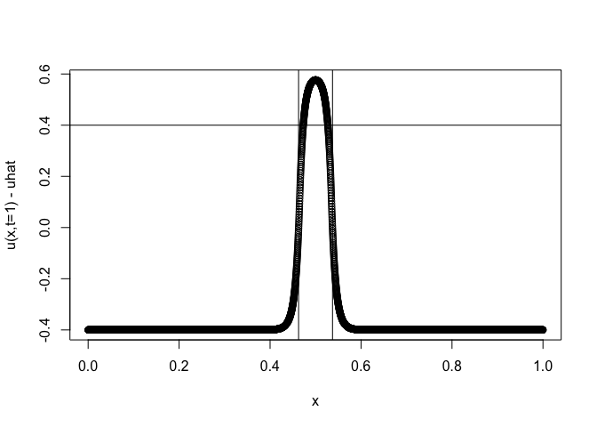
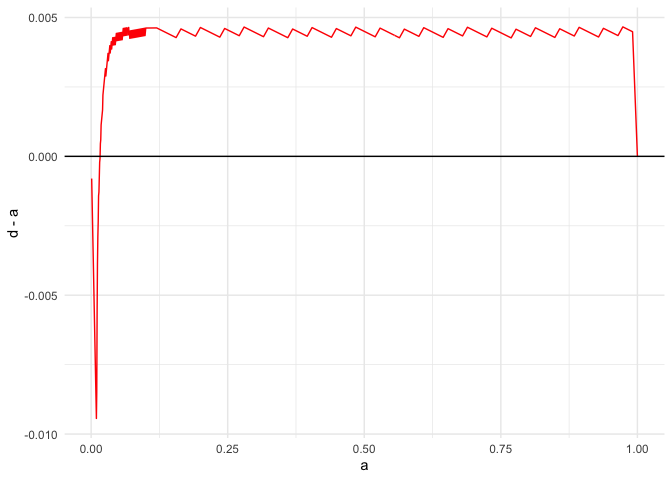
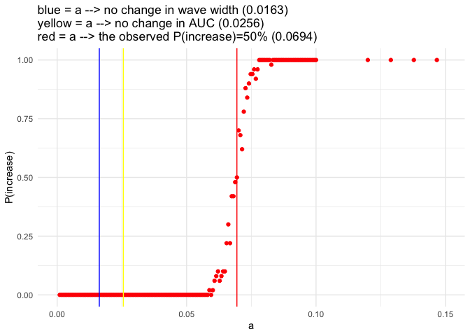
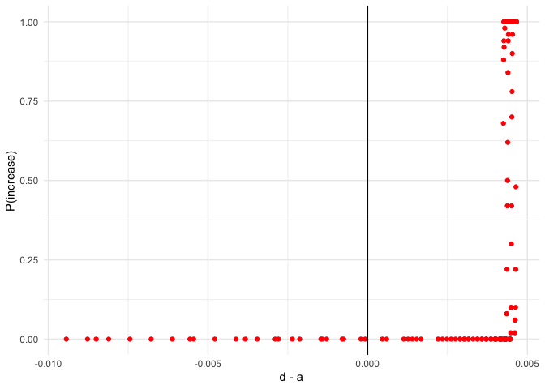

Wave width
================
Isabel Kim
5/11/2022

## Load in functions

``` r
library(tidyverse)
```

    ## ── Attaching packages ─────────────────────────────────────── tidyverse 1.3.1 ──

    ## ✓ ggplot2 3.3.5     ✓ purrr   0.3.4
    ## ✓ tibble  3.1.6     ✓ dplyr   1.0.8
    ## ✓ tidyr   1.2.0     ✓ stringr 1.4.0
    ## ✓ readr   2.1.2     ✓ forcats 0.5.1

    ## ── Conflicts ────────────────────────────────────────── tidyverse_conflicts() ──
    ## x dplyr::filter() masks stats::filter()
    ## x dplyr::lag()    masks stats::lag()

``` r
source("/Users/isabelkim/Desktop/year2/underdominance/reaction-diffusion/scripts/u_functions.R")
```

## One parameter set

``` r
a = 0.07
print(paste0("Drive is between ",0.5-(a/2)," and ",0.5+(a/2)))
```

    ## [1] "Drive is between 0.465 and 0.535"

``` r
sigma = 0.01
uhat = 0.4
b = 1
k=0.2 
alpha =  1 - (2*uhat)
d_d_fitness =   1 + (2*alpha*k)
d_wt_fitness = 1 + ((alpha-1)*k)
wt_wt_fitness = 1
print(paste("d/d fitness:", d_d_fitness, "d/wt fitness:", d_wt_fitness, "wt/wt fitness:", wt_wt_fitness))
```

    ## [1] "d/d fitness: 1.08 d/wt fitness: 0.84 wt/wt fitness: 1"

``` r
find_wave_width(a,b,sigma,k,uhat)
```

<!-- -->

    ## $x_left
    ## [1] 0.4626925
    ## 
    ## $x_right
    ## [1] 0.5373075
    ## 
    ## $wave_width
    ## [1] 0.07461492
    ## 
    ## $change_in_wave_width
    ## [1] 0.004614923

Predict x bounds to be 0.4626925 and 0.5373075. u(x,t=1) \> uhat, so we
predict the drive to succeed.

**Will need to run this code on each a value of the past data and see
the P(increase) vs a plot –> prediction vs truth**

### SLiM widths (check to ensure they’re close to the prediction, on average)

Note that the precision is restricted by the number of cells (200 – each
cell has a width of 0.005).

-   Replicate 1: 0.4625 and 0.5375
-   Replicate 2: 0.4625 and 0.5375
-   Replicate 3: 0.4625 and 0.5375
-   Replicate 4: 0.4625 and 0.5375
-   Replicate 5: 0.4625 and 0.5375

``` r
p_error_left = (abs(0.4626925-0.4625)/0.4626925)*100
p_error_right = (abs(0.5373075-0.5375)/0.5373075)*100

print(paste0(round(p_error_left,4), "% error for x_left and ", round(p_error_right,4), "% error for x_right"))
```

    ## [1] "0.0416% error for x_left and 0.0358% error for x_right"

Conclusion: the wave width matches the mathematical prediction very
well.

## Old uhat=40% data from the cluster – load this in, find wave width for each value of a, and see if when d \> a, the drive is more likely to succeed

-   Summary csv:
    `/Users/isabelkim/Desktop/year2/underdominance/reaction-diffusion/cluster/u_hat=0.4_run/csvs/summary_uhat40_april19_a_full_vs_outcome.csv`

``` r
library(tidyverse)

# uhat = 40% data 
data = read_csv("/Users/isabelkim/Desktop/year2/underdominance/reaction-diffusion/cluster/u_hat=0.4_run/csvs/summary_uhat40_april19_a_full_vs_outcome.csv")
```

    ## Rows: 250 Columns: 6
    ## ── Column specification ────────────────────────────────────────────────────────
    ## Delimiter: ","
    ## dbl (6): a, sigma, k, u_hat, delta, p_increase
    ## 
    ## ℹ Use `spec()` to retrieve the full column specification for this data.
    ## ℹ Specify the column types or set `show_col_types = FALSE` to quiet this message.

``` r
# other parameters
find_wave_width(a,b,sigma,k,uhat)
```

<!-- -->

    ## $x_left
    ## [1] 0.4626925
    ## 
    ## $x_right
    ## [1] 0.5373075
    ## 
    ## $wave_width
    ## [1] 0.07461492
    ## 
    ## $change_in_wave_width
    ## [1] 0.004614923

``` r
b = 1
sigma = 0.01
k = 0.2
uhat = 0.4

n = nrow(data)
wave_width_vector = rep(-1,n)
increase_in_wave_width_vector = rep(-1, n)
for (i in 1:n){
  a = data$a[i]
  res = find_wave_width(a,b,sigma,k,uhat, plot = FALSE)
  wave_width_vector[i] = res$wave_width
  increase_in_wave_width_vector[i] = res$change_in_wave_width
}

edit_data = data %>% add_column(wave_width = wave_width_vector,
                                increase_in_wave_width = increase_in_wave_width_vector)
```

### Plots

#### a vs change in wave width

``` r
a_vs_change_width = ggplot(edit_data, aes(a,increase_in_wave_width)) + geom_line(color="red") + xlab("a") + ylab("d - a") + geom_hline(yintercept = 0) + theme_minimal()

(a_vs_change_width)
```

<!-- -->

#### Which value of a –> d = a? Which value gave no AUC change?

``` r
# get rid of the a = 1 row
edit_data = edit_data %>% filter(a!=1)

indices_in_order = order(abs(edit_data$increase_in_wave_width))
lowest_width_change_index = indices_in_order[1]
row_no_change_in_width = edit_data[lowest_width_change_index,]
a_no_change_in_width = row_no_change_in_width$a


indices_in_order_delta = order(abs(edit_data$delta))
lowest_delta_index = indices_in_order_delta[1]
row_no_auc_change = edit_data[lowest_delta_index,]
a_no_change_in_auc = row_no_auc_change$a

closest_to_p_increase_of_50_indices_in_order = order(abs(edit_data$p_increase - 0.5))
closest_to_50_index = closest_to_p_increase_of_50_indices_in_order[1]
row_p_increase_50 = edit_data[closest_to_50_index,]
a_p_increase_50 = row_p_increase_50$a
```

#### Replot a vs P(increase) with lines for a that gives d = a and a that gives AUC1 = ab, vs the true a that caused P(increase) = 50%

``` r
a_vs_p_increase = ggplot(edit_data, aes(x=a,y=p_increase)) + geom_point(color = "red") + theme_minimal() + xlab("a") + ylab("P(increase)") + geom_vline(xintercept = a_no_change_in_width, color = "blue") + geom_vline(xintercept = a_no_change_in_auc, color = "yellow") + geom_vline(xintercept = a_p_increase_50, color = "red") + ggtitle("blue = a --> no change in wave width (0.0163) \nyellow = a --> no change in AUC (0.0256) \nred = a --> the observed P(increase)=50% (0.0694)") + xlim(0, 0.15)

a_vs_p_increase
```

    ## Warning: Removed 95 rows containing missing values (geom_point).

<!-- -->

``` r
#ggsave(plot=a_vs_p_increase, filename = "/Users/isabelkim/Desktop/year2/underdominance/reaction-diffusion/bistable-R-waves/a_vs_p_increase.png")
```

The value of a that causes no change in wave width is even further off
than the value of a that causes no change in AUC.

#### Change in wave width vs P(increase)

``` r
change_width_vs_p_increase = ggplot(edit_data, aes(x = increase_in_wave_width, y = p_increase)) + geom_point(color = "red") + theme_minimal() + xlab("d - a") + ylab("P(increase)") + geom_vline(xintercept=0)

change_width_vs_p_increase
```

<!-- -->

``` r
#ggsave(plot = change_width_vs_p_increase, filename = "/Users/isabelkim/Desktop/year2/underdominance/reaction-diffusion/bistable-R-waves/change_in_wave_width_vs_p_increase.png")
```
