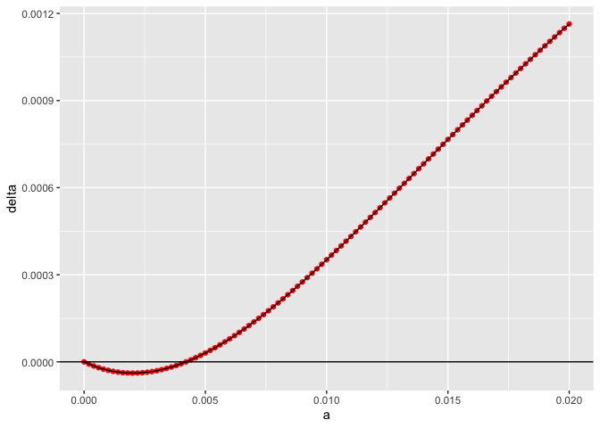
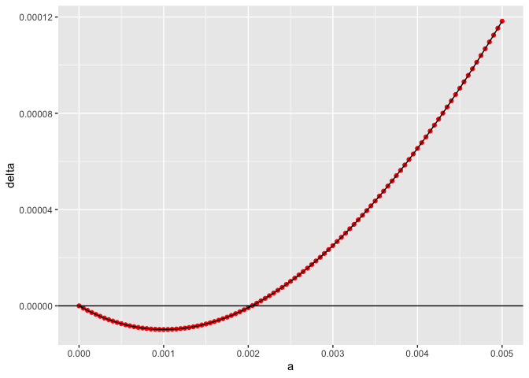
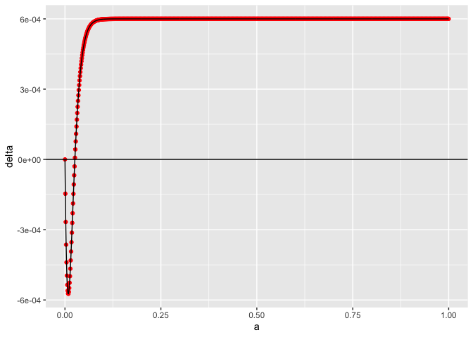

uhat=10% and uhat=5% cluster runs with debugged scripts and 10 gens
until drive + new run –> uhat=40%
================
Isabel Kim
4/11/2022

## uhat=10% jobs

### Planning

-   Before, a_observed was 0.0108 and a_predicted was 0.0041

``` r
library(tidyverse)
```

    ## ── Attaching packages ─────────────────────────────────────── tidyverse 1.3.1 ──

    ## ✓ ggplot2 3.3.5     ✓ purrr   0.3.4
    ## ✓ tibble  3.1.6     ✓ dplyr   1.0.8
    ## ✓ tidyr   1.2.0     ✓ stringr 1.4.0
    ## ✓ readr   2.1.2     ✓ forcats 0.5.1

    ## ── Conflicts ────────────────────────────────────────── tidyverse_conflicts() ──
    ## x dplyr::filter() masks stats::filter()
    ## x dplyr::lag()    masks stats::lag()

``` r
source("/Users/isabelkim/Desktop/year2/underdominance/reaction-diffusion/scripts/auc-equations.R")

sigma = 0.01
k = 0.2
uhat = 0.1

n = 101
a_vector = seq(0, 0.02, length.out=n)
delta_vector = rep(-1,n)

for (i in 1:n){
  delta_vector[i] = factored_delta(a_vector[i],1,sigma,k,uhat)
}


results = tibble(a=a_vector, delta = delta_vector)
p = ggplot(results, aes(x=a,y=delta)) + geom_point(color = "red") + geom_line() + geom_hline(yintercept = 0)

print(p)
```

<!-- -->

``` r
# Find x-intercept
a_not_zero = a_vector[2:n]
delta_not_zero = delta_vector[2:n]
ind = which.min(abs(delta_not_zero))
a_star = a_not_zero[ind]
delta_star = delta_not_zero[ind]
print(paste("Delta is",delta_star,"at a=",a_star))
```

    ## [1] "Delta is -2.22795594990739e-07 at a= 0.0042"

Predicted a is around 0.0042.

-   Let’s do a 100-length vector from 0.001 to 0.02, then a 50-length
    vector from 0.02 to 1.0

``` r
a_seq = c(seq(0.001,0.02,length.out=100),seq(0.03,1.0,length=50))
```

### Files:

-   text file:
    `/Users/isabelkim/Desktop/year2/underdominance/reaction-diffusion/cluster/u_hat=0.1_run/slurm_text/uhat10_april11_full_a_run.txt`
-   SLURM main script:
    `/Users/isabelkim/Desktop/year2/underdominance/reaction-diffusion/cluster/u_hat=0.1_run/slurm_main/uhat10_april11_main.sh`
    -   **Submitted batch job 4277244**
-   SLURM merge script:
    `/Users/isabelkim/Desktop/year2/underdominance/reaction-diffusion/cluster/u_hat=0.1_run/slurm_merge/uhat10_april11_merge.sh`
    -   On the cluster, this is at:
        `/home/ikk23/underdom/merge_scripts/uhat10_april11_merge.sh`
        -   This will create
            `/home/ikk23/underdom/csvs/uhat10_april11_full_a_run.csv` on
            the cluster
-   Csv raw is now at:
    `/Users/isabelkim/Desktop/year2/underdominance/reaction-diffusion/cluster/u_hat=0.1_run/csv_raw/uhat10_april11_full_a_run.csv`
-   Summary csv file is now at:
    `/Users/isabelkim/Desktop/year2/underdominance/reaction-diffusion/cluster/u_hat=0.1_run/csvs/summary_april11_full_range_uhat10.csv`

## uhat=5% jobs

### Planning

-   Before, a_predicted was 0.002 and a_observed was 0.005

``` r
sigma = 0.01
k = 0.2
uhat = 0.05

n = 101
a_vector = seq(0, 0.005, length.out=n)
delta_vector = rep(-1,n)

for (i in 1:n){
  delta_vector[i] = factored_delta(a_vector[i],1,sigma,k,uhat)
}


results = tibble(a=a_vector, delta = delta_vector)
p = ggplot(results, aes(x=a,y=delta)) + geom_point(color = "red") + geom_line() + geom_hline(yintercept = 0)

print(p)
```

<!-- -->

``` r
# Find x-intercept
a_not_zero = a_vector[2:n]
delta_not_zero = delta_vector[2:n]
ind = which.min(abs(delta_not_zero))
a_star = a_not_zero[ind]
delta_star = delta_not_zero[ind]
print(paste("Delta is",delta_star,"at a=",a_star))
```

    ## [1] "Delta is 1.38782493349201e-07 at a= 0.00205"

-   a_predicted is probably around 0.00205

Since a_observed was at 0.005 and P(increase) didn’t level off until
around 0.01, concentrate on a between 0.001 and 0.015

``` r
a_seq = c(seq(0.001,0.015,length.out=100), seq(0.02,1.0,length.out=50))
```

### Files

-   text file:
    `/Users/isabelkim/Desktop/year2/underdominance/reaction-diffusion/cluster/u_hat=0.05_run/slurm_text/uhat5_april11_full_a_run.txt`
-   SLURM main script:
    `/Users/isabelkim/Desktop/year2/underdominance/reaction-diffusion/cluster/u_hat=0.05_run/slurm_main/uhat5_april11_main.sh`
    -   **Submitted batch job 4277417**
-   SLURM merge script:
    `/Users/isabelkim/Desktop/year2/underdominance/reaction-diffusion/cluster/u_hat=0.05_run/slurm_merge/`
    -   On the cluster, this is at:
        `/home/ikk23/underdom/merge_scripts/uhat5_april11_merge.sh`
        -   Creates
            `/home/ikk23/underdom/out_u5/uhat5_april11_full_a_run.csv`
-   Raw csv is now at:
    `/Users/isabelkim/Desktop/year2/underdominance/reaction-diffusion/cluster/u_hat=0.05_run/csv_raw/uhat5_april11_full_a_run.csv`
-   Summary csv is at:
    `/Users/isabelkim/Desktop/year2/underdominance/reaction-diffusion/cluster/u_hat=0.05_run/csvs/summary_april11_full_range_uhat5.csv`

## uhat=40% jobs

-   Before, a_predicted was 0.002 and a_observed was 0.005

``` r
sigma = 0.01
k = 0.2
uhat = 0.4

n = 1000
a_vector = seq(0, 1.0, length.out=n)
delta_vector = rep(-1,n)

for (i in 1:n){
  delta_vector[i] = factored_delta(a_vector[i],1,sigma,k,uhat)
}


results = tibble(a=a_vector, delta = delta_vector)
p = ggplot(results, aes(x=a,y=delta)) + geom_point(color = "red") + geom_line() + geom_hline(yintercept = 0)

print(p)
```

<!-- -->

``` r
# Find x-intercept
a_not_zero = a_vector[2:n]
delta_not_zero = delta_vector[2:n]
ind = which.min(abs(delta_not_zero))
a_star = a_not_zero[ind]
delta_star = delta_not_zero[ind]
print(paste("Delta is",delta_star,"at a=",a_star))
```

    ## [1] "Delta is 7.17735139912009e-06 at a= 0.026026026026026"

-   a_predicted is around 0.026
-   Since a_observed for uhat=20% was 0.0246, we could expect upwards of
    a=0.1 for a_observed here. Concentrate on a = 0.0001 to 0.15

``` r
a_seq = c(seq(0.0001,0.15,length.out=100), seq(0.17,1.0,length.out=50))
```

### Files

-   text file:
    `/Users/isabelkim/Desktop/year2/underdominance/reaction-diffusion/cluster/u_hat=0.4_run/slurm_text/uhat40_april12_full_a_run.txt`
-   SLURM script:
    `/Users/isabelkim/Desktop/year2/underdominance/reaction-diffusion/cluster/u_hat=0.4_run/slurm_main/uhat40_april12_main.sh`
    -   **Submitted batch job 4279105**
-   Merge script:
    `/Users/isabelkim/Desktop/year2/underdominance/reaction-diffusion/cluster/u_hat=0.4_run/slurm_merge/uhat40_april12_merge.sh`
    -   On the cluster:
        `/home/ikk23/underdom/merge_scripts/uhat40_april12_merge.sh`
    -   Will create `uhat40_april12_full_a_run.csv`
