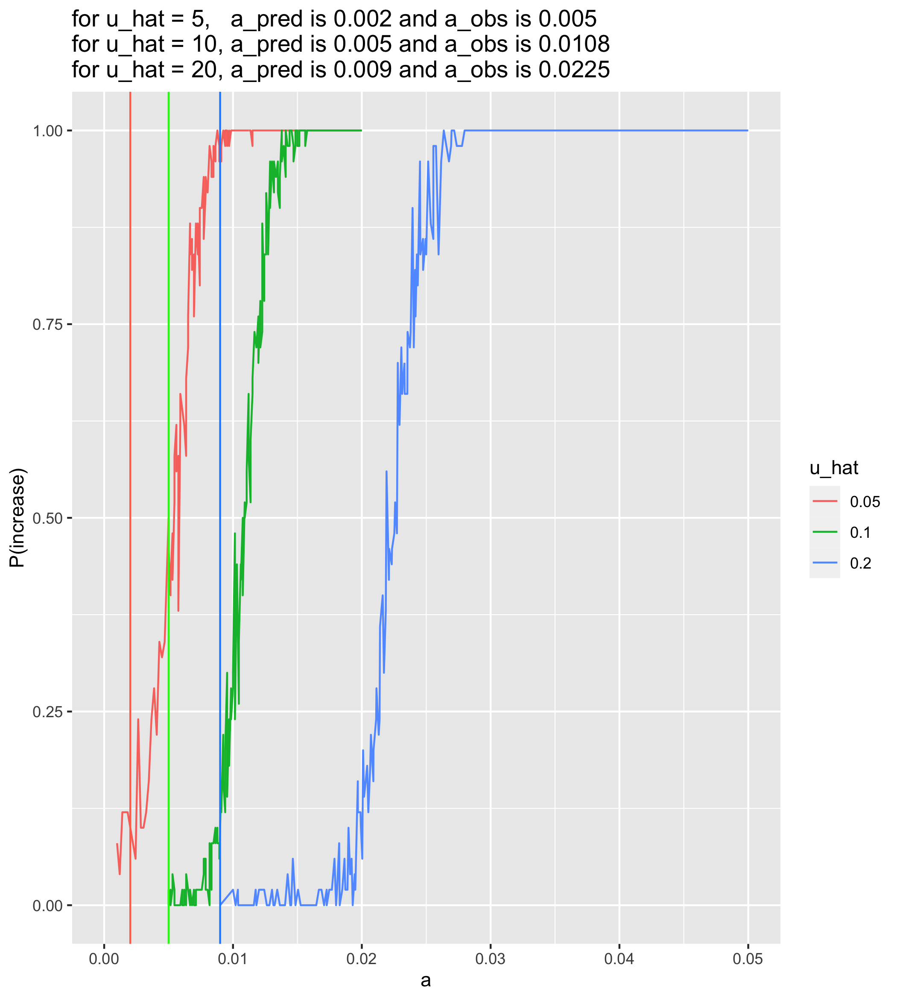
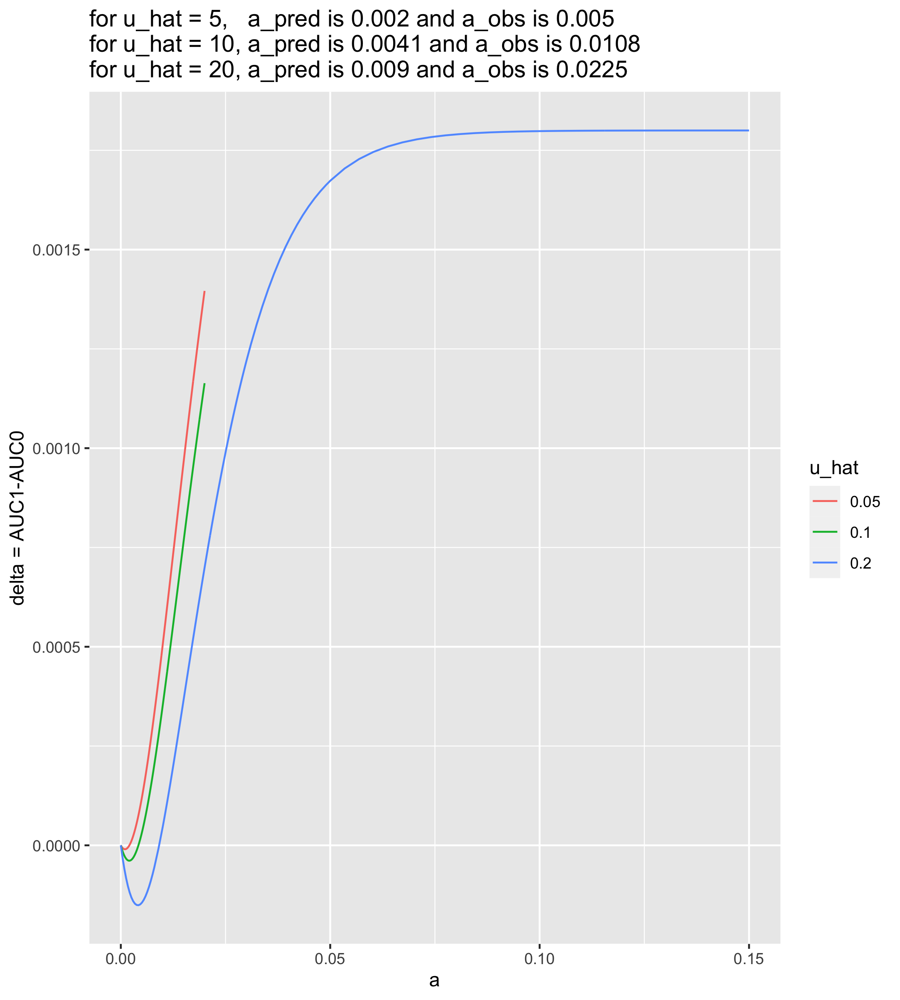

uhat comparison after redoing the delta equation
================
Isabel Kim
4/5/2022

## u_hat = 5 vs u_hat = 10 vs u_hat = 20 - a vs P(increase) on the same axes

``` r
library(tidyverse)
source("/Users/isabelkim/Desktop/year2/underdominance/reaction-diffusion/cluster/plotting_functions.R")

summary_u20 = read_csv("/Users/isabelkim/Desktop/year2/underdominance/reaction-diffusion/cluster/u_hat=0.2_run/csvs/EDITED_DELTA_uhat_0.2_more_replicate_summary.csv")
obs_vs_pred_u20 = get_a_pred_and_a_obs(summary_u20)

summary_u10 = read_csv("/Users/isabelkim/Desktop/year2/underdominance/reaction-diffusion/cluster/u_hat=0.1_run/csvs/EDITED_DELTA_uhat_0.1_more_replicate_summary.csv")
obs_vs_pred_u10 = get_a_pred_and_a_obs(summary_u10)

summary_u5 = read_csv("/Users/isabelkim/Desktop/year2/underdominance/reaction-diffusion/cluster/u_hat=0.05_run/csvs/EDITED_DELTA_uhat_0.05_more_replicate_summary.csv")
obs_vs_pred_u5 = get_a_pred_and_a_obs(summary_u5)

compiled = rbind(summary_u5,summary_u10, summary_u20)
compiled$u_hat = as.character(compiled$u_hat)

compiled_plot = ggplot(data = compiled, aes(x = a, y = p_increase, color = u_hat)) +
  geom_line() +
  xlab("a") +
  ylab("P(increase)") +
  xlim(0, 0.05) +
  geom_vline(xintercept = obs_vs_pred_u5$a_pred, color = "coral1") +
  geom_vline(xintercept = obs_vs_pred_u10$a_pred, color = "green") +
  geom_vline(xintercept = obs_vs_pred_u20$a_pred, color = "dodgerblue") +
  labs(title = paste0("for u_hat = 5,   a_pred is ", round(obs_vs_pred_u5$a_pred, 4),
                      " and a_obs is ", round(obs_vs_pred_u5$a_obs, 4),
                      "\nfor u_hat = 10, a_pred is ", round(obs_vs_pred_u10$a_pred,4), 
                      " and a_obs is ", round(obs_vs_pred_u10$a_obs, 4), 
                      "\nfor u_hat = 20, a_pred is ", round(obs_vs_pred_u20$a_pred,4), 
                      " and a_obs is ", round(obs_vs_pred_u20$a_obs,4)))

#ggsave(filename = "/Users/isabelkim/Desktop/year2/underdominance/reaction-diffusion/cluster/EDITED_DELTA_uhat20_vs_uhat10_vs_uhat5.png", plot = compiled_plot)
```

``` r

```

<!-- -->

The prediction is always \~(1/2) of the observed a value

``` r
diff_u20 = obs_vs_pred_u20$a_obs - obs_vs_pred_u20$a_pred # 0.01352525
fraction_u20 = obs_vs_pred_u20$a_obs/obs_vs_pred_u20$a_pred # obs a is 2.5 higher

diff_u10 = obs_vs_pred_u10$a_obs - obs_vs_pred_u10$a_pred # 0.005757576
fraction_u10 = obs_vs_pred_u10$a_obs/obs_vs_pred_u10$a_pred # obs a is 2.15x higher

diff_u5 = obs_vs_pred_u5$a_obs - obs_vs_pred_u5$a_pred # 0.002973684
fraction_u5 = obs_vs_pred_u5$a_obs/obs_vs_pred_u5$a_pred # obs a is 2.47x higher
```

The observed *a* value that causes P(increase) to be closest to 50% is
about 2-2.5x higher than the value of *a* that causes AUC1 to be closest
to AUC0.

## a vs delta (extended!) for different u_hat

``` r
u20 = read_csv("/Users/isabelkim/Desktop/year2/underdominance/reaction-diffusion/cluster/u_hat=0.2_run/csvs/EDITED_DELTA_a_vs_delta_theoretical.csv")
a_min_u20 = 0.009

u10 = read_csv("/Users/isabelkim/Desktop/year2/underdominance/reaction-diffusion/cluster/u_hat=0.1_run/csvs/EDITED_DELTA_a_vs_delta_theoretical.csv")
a_min_u10 = 0.004126316

u5 = read_csv("/Users/isabelkim/Desktop/year2/underdominance/reaction-diffusion/cluster/u_hat=0.05_run/csvs/EDITED_DELTA_a_vs_delta_theoretical.csv")
a_min_u5 = 0.002026316

compiled_delta = rbind(u5,u10,u20)
compiled_delta$u_hat = as.character(compiled_delta$u_hat)

compiled_delta_plot = ggplot(data = compiled_delta, aes(x = a, y = delta_correct, color = u_hat)) +
  geom_line() +
  xlab("a") +
  ylab("delta = AUC1-AUC0") +
  labs(title = paste0("for u_hat = 5,   a_pred is ", round(a_min_u5, 4),
                      " and a_obs is ", round(obs_vs_pred_u5$a_obs, 4),
                      "\nfor u_hat = 10, a_pred is ", round(a_min_u10,4), 
                      " and a_obs is ", round(obs_vs_pred_u10$a_obs, 4), 
                      "\nfor u_hat = 20, a_pred is ", round(a_min_u20,4), 
                      " and a_obs is ", round(obs_vs_pred_u20$a_obs,4)))

#ggsave(filename = "/Users/isabelkim/Desktop/year2/underdominance/reaction-diffusion/cluster/EDITED_DELTA_delta_vs_a_uhat20_vs_uhat10_vs_uhat5.png", plot = compiled_delta_plot)
```

``` r

```

<!-- -->
