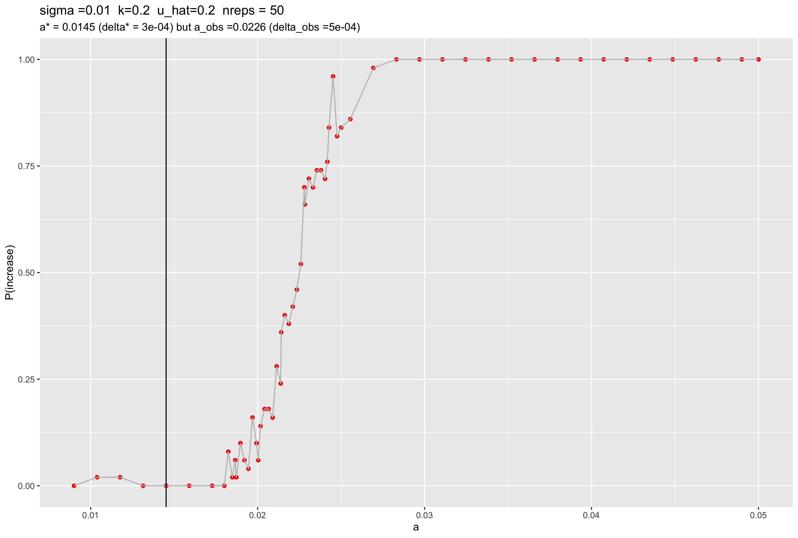
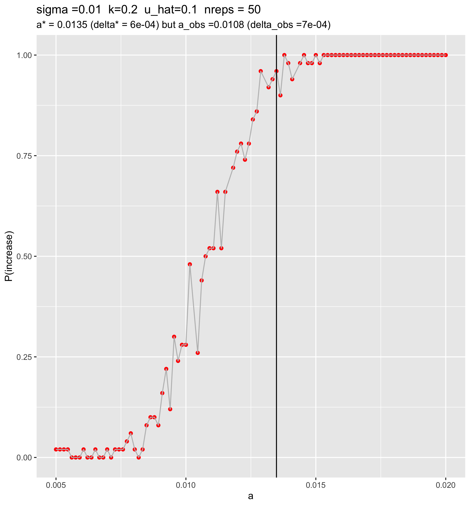
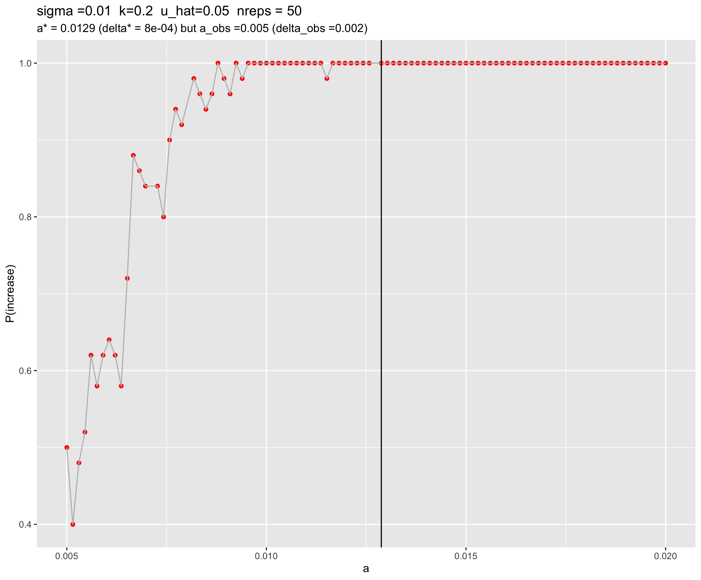
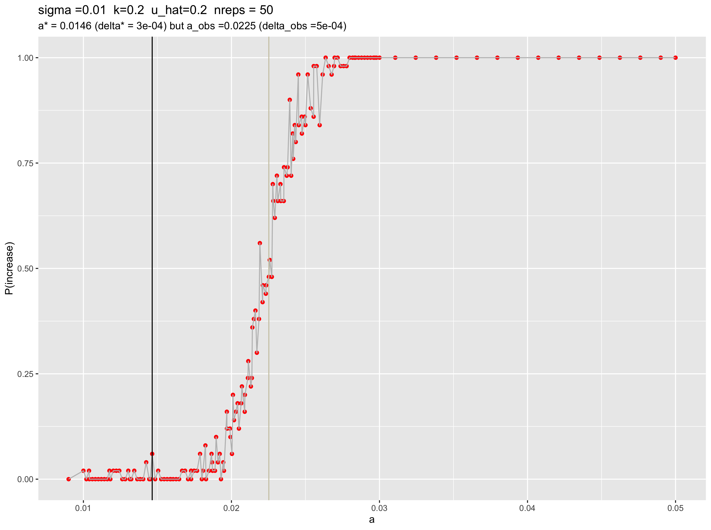

SLURM job monitoring
================
Isabel Kim
3/25/2022

## Files

### Processing pre-cluster

-   `create_slurm_text_file.R` – creates a text file (`slurm_text.txt`)
    that will be used to give command-line arguments to each job in the
    area.

### Needed for the cluster

-   `nonWF-model.slim`
-   `python_driver.py`
-   `slimutil.py` - Sam’s SLiM functions
-   `slurm_text.txt` - command arguments for each job in the array
    -   Created by `create_slurm_text_file.R` – local file
-   `vary_a_slurm.sh`
    -   Separates the job into an array with length = the number of
        lines in `slurm_text.txt`
    -   For each array job, takes the a value (and sigma, k, and u_hat
        values if they’re different than the default), runs slim nrep
        times (default 10), and records whether the drive increased
        (last_rate > initial_rate) or decreased (last_rate \<
        initial_rate). Writes nrep lines into a `.part` file
        -   The `.part` files for each job array are written into
            `/home/ikk23/underdom/out`
-   `merge_a_parts.sh`
    -   Submit this *after the entire job array is complete*
    -   This simply goes into the `/home/ikk23/underdom/out` and merges
        all the files into a big csv, `vary_a.csv` which will be placed
        in `/home/ikk23/underdom/csvs`

### After the cluster

-   Use `plot_cluster_csv_results.R` to create figures

## Job1: `u_hat = 0.2, k = 0.2 (s.t. d/d fitness is 1.24, d/wt fitness is 0.92, and wt/wt fitness is 1.0), sigma = 0.05 --> 0.01, N = 10,000 --> 30,000`

### Did the default job:

-   sigma = 0.05
-   a ranges from 0.01 to 0.99 (`seq(0.01, 0.99, length.out = 100)`)
-   u_hat = 0.2
-   k = 0.2
-   N = 10,000
-   10 replicates

### Increasing N, decreasing sigma, increasing nreps (a from 0.05 to 0.15)

-   Set up:
    -   sigma = 0.01
    -   u_hat = 0.2
    -   k = 0.2
    -   N = 30,000
    -   50 replicates
    -   a should focus on the range between 0.05 and 0.15
        (`seq(0.05, 0.15, length.out = 30)`)

``` r
source("/Users/isabelkim/Desktop/year2/underdominance/reaction-diffusion/scripts/functions-main-model.R")
```

    ## ── Attaching packages ─────────────────────────────────────── tidyverse 1.3.1 ──

    ## ✓ ggplot2 3.3.5     ✓ purrr   0.3.4
    ## ✓ tibble  3.1.6     ✓ dplyr   1.0.8
    ## ✓ tidyr   1.2.0     ✓ stringr 1.4.0
    ## ✓ readr   2.1.2     ✓ forcats 0.5.1

    ## ── Conflicts ────────────────────────────────────────── tidyverse_conflicts() ──
    ## x dplyr::filter() masks stats::filter()
    ## x dplyr::lag()    masks stats::lag()

    ## Loading required package: pracma

    ## 
    ## Attaching package: 'pracma'

    ## The following object is masked from 'package:purrr':
    ## 
    ##     cross

``` r
u_hat = 0.2
sigma = 0.01
k = 0.2

a_vec = seq(0.05, 0.15, length.out = 30)
delta_vec = rep(-1,20)
for (i in 1:20){
  a = a_vec[i]
  delta = check_for_delta_0_when_b_is_1(u_hat, a/sigma, sigma, k)
  delta_vec[i] = delta
  #print(paste("a =",a,"--> delta=",delta))
}

ind = which.min(delta_vec)
min_delta = delta_vec[ind]
min_a  = a_vec[ind]
print(paste("predicted lowest delta=",min_delta,"at a=",min_a))
```

    ## [1] "predicted lowest delta= 0.00108223418495903 at a= 0.05"

-   Text file: `slurm_text_u_20.txt`
-   SLURM script: `vary_a_u20.sh`
-   Merge script: `merge_a_u20.sh`
    -   Creates `vary_a_u20.csv`
-   Same python and SLiM script
-   Results:
    -   Always showed increase
    -   Summary csv – append to this later

### Increasing N, decreasing sigma, increasing nreps (a from 0.009 to 0.049)

-   Set up:
    -   sigma = 0.01
    -   u_hat = 0.2
    -   k = 0.2
    -   N = 30,000
    -   50 replicates
    -   a between 0.009 and 0.049
    -   Text file: `slurm_text_a_low_u_20.txt`
    -   SLURM script: `vary_a_low_u20.sh`
    -   Merge script: `merge_a_low_u20.sh`
        -   Creates `vary_a_low_u20.csv`
    -   Same python and SLiM script
-   Results:
    -   Looks like a sharp boundary point between a = 0.02 and a = 0.03
    -   Narrow in on this in the next run

### Focusing on the boundary range

-   a = seq(0.018, 0.025, length.out=30)
-   Text file: `slurm_text_a_in_range_u20.txt`
-   SLURM script: `vary_a_in_range_u20.sh`
-   Merge script: `merge_a_in_range_u20.sh`

### Final output

-   See
    `/Users/isabelkim/Desktop/year2/underdominance/reaction-diffusion/cluster/u_hat=0.2_run/csvs/uhat_0.2_summary.csv`
    for summary of all of the a-values
-   Figures are in
    `/Users/isabelkim/Desktop/year2/underdominance/reaction-diffusion/cluster/u_hat=0.2_run/figures/`

``` r

```

<!-- -->
\* The value of a that minimized AUC1-AUC0 was **a = 0.0145 (delta =
0.0003)**, but the value of a that produced a probability of drive
increase closest to 50% was **a = 0.0226 (delta = 0.0005)** \* Still a
lot of stochasticity, even with 50 replicates and N = 30,000

## Job2: `u_hat = 0.1, k = 0.2 (d/d fitness = 1.32, d/wt fitness = 0.96, wt/wt fitness = 1), sigma = 0.01, N = 30,000`

``` r
k = 0.2
u_hat = 0.1
get_fitness_values(alpha = 1 - (2*u_hat), 0.2)
```

    ## [1] "w(drive/drive) = 1.32 w(drive/wt) = 0.96 w(wt/wt) = 1"

    ## [1] 1.32 0.96 1.00

What do I expect *a* to be around?

``` r
k = 0.2
u_hat = 0.1
sigma = 0.01

a_trial = 0.01

a_seqs = seq(0.008, 0.05, length.out = 20)
delta_vector = rep(-1,20)
for (i in 1:20){
  a_trial = a_seqs[i]
  delta_vector[i] = check_for_delta_0_when_b_is_1(u_hat, beta = a_trial/sigma, sigma, k)
}
ind = which.min(delta_vector)
a_min = a_seqs[ind]
delta_min = delta_vector[ind]
print(paste("The value of a that minimizes delta (such that delta is", delta_min, " is a*=",a_min))
```

    ## [1] "The value of a that minimizes delta (such that delta is 0.000647640415573102  is a*= 0.0124210526315789"

-   I initially expect a\* to be around 0.0124, so we should make the
    grid for a between 0.005 and 0.02

``` r
grid = seq(0.005, 0.02, length.out = 100)
```

-   Let’s do 100 total jobs
-   SLiM model:
    `/Users/isabelkim/Desktop/year2/underdominance/reaction-diffusion/slim/nonWF-model.slim`
    -   On the cluster:
        `/home/ikk23/underdom/main_scripts/nonWF-model.slim`
-   python driver:
    `/Users/isabelkim/Desktop/year2/underdominance/reaction-diffusion/cluster/python_driver.py`
    -   On the cluster:
        `/home/ikk23/underdom/main_scripts/python_driver.py`
-   python helper:
    `/Users/isabelkim/Desktop/year2/underdominance/reaction-diffusion/cluster/slimutil.py`
    -   On the cluster: `/home/ikk23/underdom/main_scripts/slimutil.py`
-   SLURM text:
    `/Users/isabelkim/Desktop/year2/underdominance/reaction-diffusion/cluster/u_hat=0.1_run/slurm_text/a_0.005_to_0.02.txt`
    -   On the cluster:
        `/home/ikk23/underdom/text_files/a_0.005_to_0.02.txt`
-   SLURM main script:
    `/Users/isabelkim/Desktop/year2/underdominance/reaction-diffusion/cluster/u_hat=0.1_run/slurm_main/`
    -   On the cluster:
        `/home/ikk23/underdom/vary_a_scripts/vary_a_0.005_to_0.02.sh`
-   SLURM merge script:
    `/Users/isabelkim/Desktop/year2/underdominance/reaction-diffusion/cluster/u_hat=0.1_run/slurm_merge/merge_a_0.005_to_0.02.sh`
    -   On the cluster:
        `/home/ikk23/underdom/merge_scripts/merge_a_0.005_to_0.02.sh`

### Final output

-   4 jobs crashed
-   Raw file:
    `/Users/isabelkim/Desktop/year2/underdominance/reaction-diffusion/cluster/u_hat=0.1_run/csv_raw/u10_a_0.005_to_0.02.csv`
-   Summary file:
    `/Users/isabelkim/Desktop/year2/underdominance/reaction-diffusion/cluster/u_hat=0.1_run/csvs/uhat_0.1_summary_missing_4.csv`
-   Plots are in:
    `/Users/isabelkim/Desktop/year2/underdominance/reaction-diffusion/cluster/u_hat=0.1_run/figures/`
-   Original plot:

``` r

```

<!-- -->
The predicted a\* (based on the a value that minimizes delta) seems to
predict the point at which p_increase = 1. It is slightly (not too much)
higher than the a_obs value that produced a p(increase) closest to 50%.

## Job3: `u_hat = 0.05, k = 0.2 (d/d fitness = 1.36, d/wt fitness = 0.98, wt/wt fitness = 1), sigma = 0.01, N = 30,000`

``` r
u_hat = 0.05
k = 0.2
get_fitness_values(alpha = 1-(2*u_hat), k)
```

    ## [1] "w(drive/drive) = 1.36 w(drive/wt) = 0.98 w(wt/wt) = 1"

    ## [1] 1.36 0.98 1.00

Which *a* value?

``` r
k = 0.2
u_hat = 0.05
sigma = 0.01

a_trial = 0.01

a_seqs = seq(0.006, 0.1, length.out = 1000)
delta_vector = rep(-1,20)
for (i in 1:20){
  a_trial = a_seqs[i]
  delta_vector[i] = check_for_delta_0_when_b_is_1(u_hat, beta = a_trial/sigma, sigma, k)
}
ind = which.min(delta_vector)
a_min = a_seqs[ind]
delta_min = delta_vector[ind]
print(paste("The value of a that minimizes delta (such that delta is", delta_min, " is a*=",a_min))
```

    ## [1] "The value of a that minimizes delta (such that delta is 0.00119530981057357  is a*= 0.00778778778778779"

Let’s look at a between 0.005 to 0.02, as before (100 jobs) \* SLURM
text:
`/Users/isabelkim/Desktop/year2/underdominance/reaction-diffusion/cluster/u_hat=0.05_run/slurm_text/u005_a_0.005_to_0.02.txt`
+ On the cluster:
`/home/ikk23/underdom/text_files/u005_a_0.005_to_0.02.txt` \* SLURM vary
a script:
`/Users/isabelkim/Desktop/year2/underdominance/reaction-diffusion/cluster/u_hat=0.05_run/slurm_main/u005_vary_a_005_to_002.sh`
+ On the cluster:
`/home/ikk23/underdom/vary_a_scripts/u005_vary_a_005_to_002.sh` \* SLURM
merge script:
`/Users/isabelkim/Desktop/year2/underdominance/reaction-diffusion/cluster/u_hat=0.05_run/slurm_merge/merge_u5_a_0.005_to_0.02.sh`
+ On the cluster:
`/home/ikk23/underdom/merge_scripts/merge_u5_a_0.005_to_0.02.sh`

### Final output

-   3 jobs crashed
-   Raw csv:
    `/Users/isabelkim/Desktop/year2/underdominance/reaction-diffusion/cluster/u_hat=0.05_run/csv_raw/u5_a_0.005_to_0.02.csv`
-   Summary csv:
    `/Users/isabelkim/Desktop/year2/underdominance/reaction-diffusion/cluster/u_hat=0.05_run/csvs/uhat_0.05_summary_missing_3.csv`
-   Figures are in:
    `/Users/isabelkim/Desktop/year2/underdominance/reaction-diffusion/cluster/u_hat=0.05_run/figures/`
-   Original plot:

``` r

```

<!-- -->

In this case, a\* appears *way* off. It dramatically over-estimates the
transition range.

## Re-run both u10 and u5 to see if more replicates (50 –> 100) help with stochasticity

-   Change from “short” to “regular” partition and changing `/SSD/` to
    `/workdir/`
-   Running the u_hat = 10% job: `vary_a_0.005_to_0.02.sh` (job
    number 4168726)
-   Running the u_hat = 5% job: (job number 4168826)

### Designing more replicates for u_hat=20%

``` r

```

<!-- -->

Look at a between 0.01 and 0.03 \* Text file:
`/Users/isabelkim/Desktop/year2/underdominance/reaction-diffusion/cluster/u_hat=0.2_run/slurm_text/u20_a_0.01_to_0.03_50_replicates.txt`
+ On the cluster:
`/home/ikk23/underdom/text_files/u20_a_0.01_to_0.03_50_replicates.txt`
\* SLURM main script:
`/Users/isabelkim/Desktop/year2/underdominance/reaction-diffusion/cluster/u_hat=0.2_run/slurm_main/u20_vary_a.sh`
+ On the cluster: `/home/ikk23/underdom/vary_a_scripts/u20_vary_a.sh` \*
SLURM merge script:
`/Users/isabelkim/Desktop/year2/underdominance/reaction-diffusion/cluster/u_hat=0.2_run/slurm_merge/merge_u20_a_0.01_to_0.03.sh`
+ On the cluster:
`/home/ikk23/underdom/merge_scripts/merge_u20_a_0.01_to_0.03.sh`

-   Submitted the main script (job number 4168926)

## Re-runs to add more replicates

-   u_hat=20% raw csv file:
    `/Users/isabelkim/Desktop/year2/underdominance/reaction-diffusion/cluster/u_hat=0.2_run/csv_raw/u20_a_0.01_to_0.03.csv`
-   u_hat=10% raw csv file:
    `/Users/isabelkim/Desktop/year2/underdominance/reaction-diffusion/cluster/u_hat=0.1_run/csv_raw/second_run_u10_a_0.005_to_0.02.csv`
-   u_hat=5% raw csv file:
    `/Users/isabelkim/Desktop/year2/underdominance/reaction-diffusion/cluster/u_hat=0.05_run/csv_raw/second_run_u5_a_0.005_to_0.02.csv`

### u_hat = 20%

-   Full summary before this was at:
    `/Users/isabelkim/Desktop/year2/underdominance/reaction-diffusion/cluster/u_hat=0.2_run/csvs/uhat_0.2_summary.csv`,
    so prepare the raw csv file to the summary stage, then rbind this
    all together and replot
-   New compiled summary file:
    `/Users/isabelkim/Desktop/year2/underdominance/reaction-diffusion/cluster/u_hat=0.2_run/csvs/uhat_0.2_more_replicate_summary.csv`
-   New figure (with grey line at a_obs):
    `/Users/isabelkim/Desktop/year2/underdominance/reaction-diffusion/cluster/u_hat=0.2_run/figures/zoomed_in_uhat_0.2_more_replicates.png`

``` r

```

<!-- -->
a_obs and a_predicted has barely changed; once again, we see that
a_predicted \< a_obs. The new replicates *added* some stochasticity.

### u_hat = 10%

-   Full summary
