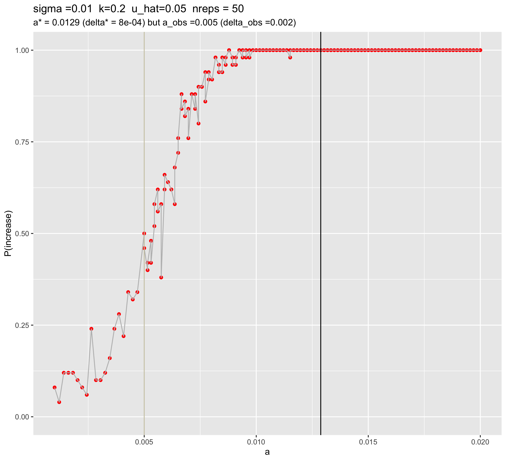

```{r setup, include=FALSE}
knitr::opts_chunk$set(echo = TRUE)
```

## Summary dataset
```{r}
library(tidyverse)
data = read_csv("/Users/isabelkim/Desktop/year2/underdominance/reaction-diffusion/cluster/u_hat=0.05_run/csvs/uhat_5_u0.001_to_0.02_summary.csv")

# a_obs vs a_pred values
source("/Users/isabelkim/Desktop/year2/underdominance/reaction-diffusion/cluster/plotting_functions.R")
obs_v_pred = get_a_pred_and_a_obs(data)

nreps = 50
obs_v_pred
```

## a vs p(increase) - 100 replicates when a > 0.005 and 50 replicates for a < 0.005
```{r}

```

Like with uhat=10, the predicted value of a* (0.01287879) over-estimates the observed a-value that leads to a P(increase) of 50% (a_obs = 0.005). This is far off.

Even with a=0.001, P(increase) is still greater than 0 at this low threshold of 5%. The transition range looks like it's between 0.001 and 0.01 (about 0.009 wide - wider than it was for uhat=20 and uhat=10).

Some stochasticity in the transition range.

## How does delta change with a?

* Black line = predicted value of a*, based on the a that minimizes delta
* Grey line = the observed value of a that gives a P(increase) closest to 50%

```{r}
plot_a_vs_delta = ggplot(data, aes(x = a, y = delta)) + 
  geom_point(color = "purple") + 
  geom_line(color = "grey") +
  geom_vline(xintercept = obs_v_pred$a_pred, color = "black") + 
  ylab("delta = AUC1 - AUC0") + 
  labs(title = paste0("sigma =",data$sigma[1], 
                      "  k=",data$k[1],"  u_hat=", data$u_hat[1],
                      "  nreps = ", nreps), 
       subtitle = paste0("a* = ", round(obs_v_pred$a_pred,4), " (delta* = ", round(obs_v_pred$delta_pred,4),") but a_obs =",round(obs_v_pred$a_obs,4)," (delta_obs =", round(obs_v_pred$delta_obs,4),")")) + 
  geom_vline(xintercept = obs_v_pred$a_obs, color = "cornsilk3")

plot_a_vs_delta
```
Similar to the other uhat results, a_pred captures the minimum, and a_obs is to the left of it.

## How does P(increase) change with delta?

What is the correlation between delta and P(increase)?
```{r}
cor(data$delta, data$p_increase)
```
Negative correlation because we're on the left hand side of the minimum of delta?

```{r}
plot_delta_vs_freq = ggplot(data, aes(x = delta, y = p_increase)) + 
  geom_point(color = "blue") + 
  geom_line(color = "grey") +
  geom_vline(xintercept = obs_v_pred$delta_pred, color = "black") + 
  xlab("delta = AUC1 - AUC0") + 
  ylab("P(increase)") +
  labs(title = paste0("sigma =",data$sigma[1], 
                      "  k=",data$k[1],"  u_hat=", data$u_hat[1],
                      "  nreps = ", nreps), 
       subtitle = paste0("a* = ", round(obs_v_pred$a_pred,4), " (delta* = ", round(obs_v_pred$delta_pred,4),") but a_obs =",round(obs_v_pred$a_obs,4)," (delta_obs =", round(obs_v_pred$delta_obs,4),")")) + 
  geom_vline(xintercept = obs_v_pred$delta_obs, color = "cornsilk3")

plot_delta_vs_freq
```