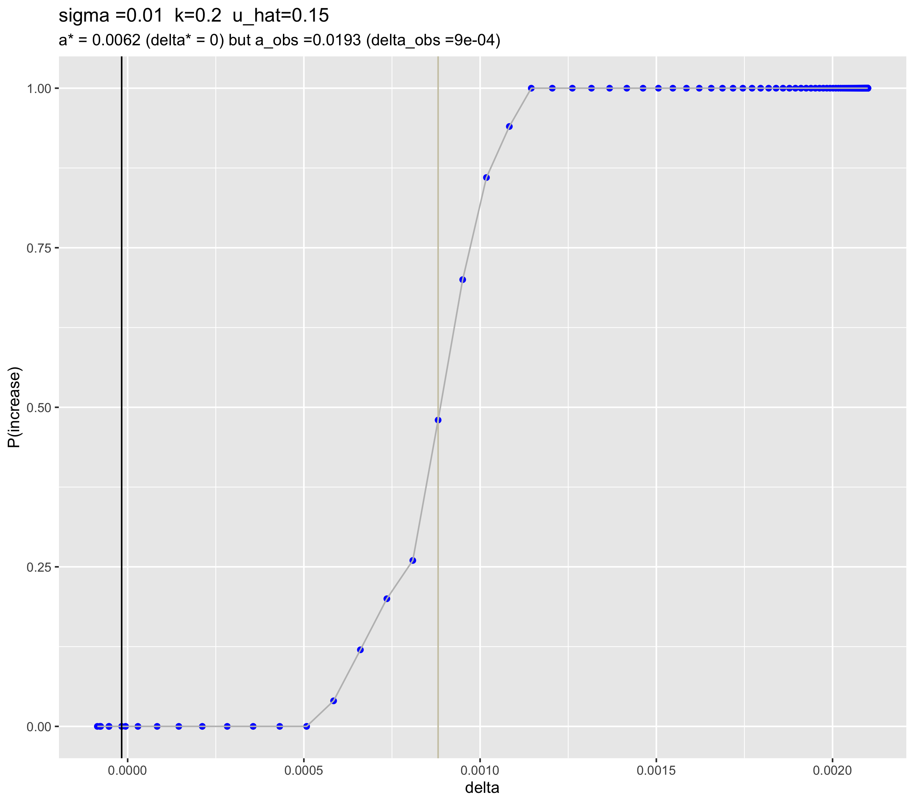

uhat=15% debugged cluster runs with wt gens
================
Isabel Kim
4/13/2022

## Additions

-   10 generations for wild-types to stabilize before the drive is added
-   Adjusted the mutation stacking policy to account for converting
    wild-type genomes to drive in generation 10
-   Fixed the python driver such that if the drive is introduced at 0%
    and therefore has an initial and final frequency equal to 0%, it’s
    counted as a “decrease” (before, this was an “increase” due to the
    way I structured the conditional)

## a vs P(increase)

### Full range of a

``` r
dir = "../../cluster/u_hat=0.15_run/figures/"

fig = "april13_full_a_vs_p_increase_uhat15.png"
knitr::include_graphics(paste0(dir,fig))
```

<!-- -->

### Zoomed in – a from 0 to 0.1

``` r
fig = "april13_zoomed_in_a_vs_p_increase_uhat15.png"
knitr::include_graphics(paste0(dir,fig))
```

<!-- -->

## a vs delta

### Full range of a

``` r
fig = "april13_full_a_vs_delta_uhat15.png"
knitr::include_graphics(paste0(dir,fig))
```

<!-- -->

### Zoomed in – a from 0 to 0.1

``` r
fig = "april13_zoomed_in_a_vs_delta_uhat15.png"
knitr::include_graphics(paste0(dir,fig))
```

<!-- -->

## delta vs P(increase)

``` r
fig = "april13_delta_vs_p_increase_uhat15.png"
knitr::include_graphics(paste0(dir,fig))
```

<!-- -->
