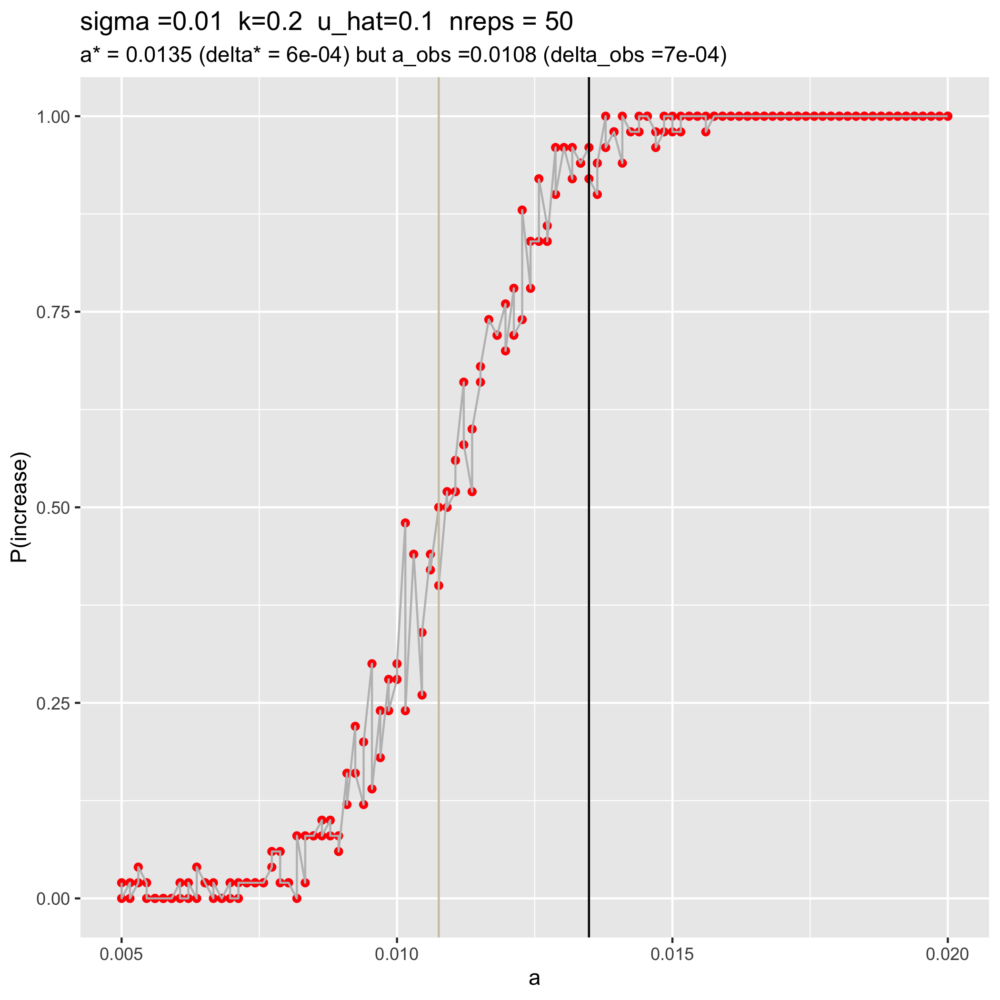
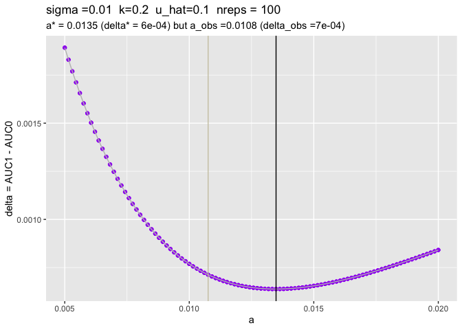
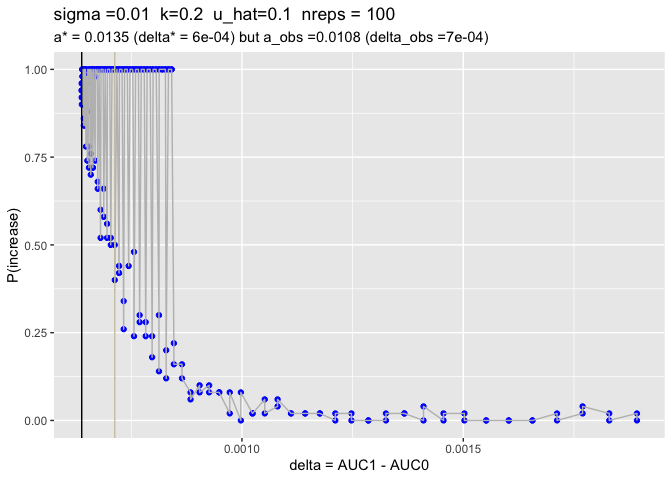

uhat_10_analysis
================
Isabel Kim
3/30/2022

## Summary dataset

``` r
library(tidyverse)
```

    ## ── Attaching packages ─────────────────────────────────────── tidyverse 1.3.1 ──

    ## ✓ ggplot2 3.3.5     ✓ purrr   0.3.4
    ## ✓ tibble  3.1.6     ✓ dplyr   1.0.8
    ## ✓ tidyr   1.2.0     ✓ stringr 1.4.0
    ## ✓ readr   2.1.2     ✓ forcats 0.5.1

    ## ── Conflicts ────────────────────────────────────────── tidyverse_conflicts() ──
    ## x dplyr::filter() masks stats::filter()
    ## x dplyr::lag()    masks stats::lag()

``` r
data = read_csv("/Users/isabelkim/Desktop/year2/underdominance/reaction-diffusion/cluster/u_hat=0.1_run/csvs/uhat_10_more_replicate_summary.csv")
```

    ## Rows: 196 Columns: 7

    ## ── Column specification ────────────────────────────────────────────────────────
    ## Delimiter: ","
    ## dbl (7): a, sigma, beta, k, u_hat, delta, p_increase
    ## 
    ## ℹ Use `spec()` to retrieve the full column specification for this data.
    ## ℹ Specify the column types or set `show_col_types = FALSE` to quiet this message.

``` r
# a_obs vs a_pred values
source("/Users/isabelkim/Desktop/year2/underdominance/reaction-diffusion/cluster/plotting_functions.R")
obs_v_pred = get_a_pred_and_a_obs(data)

nreps = 100
```

## a vs p(increase) - 100 total replicates

``` r

```

<!-- -->
The a_pred value that minimizes delta is 0.01348485 (only slightly less
than the a_pred for u_hat=20). Now, a_pred is an *over-estimate* – the
a_obs value that led to a P(increase) of 50% was 0.01075758. However,
this prediction is not as far off as it was for u_hat=20.

The transition range looks like it’s between a=0.0075 and a=0.014 (about
the same width as for u_hat; around 0.0065).

Lots of stochasticity even with 100 replicates.

## How does delta change with a?

-   Black line = predicted value of a\*, based on the a that minimizes
    delta
-   Grey line = the observed value of a that gives a P(increase) closest
    to 50%

``` r
plot_a_vs_delta = ggplot(data, aes(x = a, y = delta)) + 
  geom_point(color = "purple") + 
  geom_line(color = "grey") +
  geom_vline(xintercept = obs_v_pred$a_pred, color = "black") + 
  ylab("delta = AUC1 - AUC0") + 
  labs(title = paste0("sigma =",data$sigma[1], 
                      "  k=",data$k[1],"  u_hat=", data$u_hat[1],
                      "  nreps = ", nreps), 
       subtitle = paste0("a* = ", round(obs_v_pred$a_pred,4), " (delta* = ", round(obs_v_pred$delta_pred,4),") but a_obs =",round(obs_v_pred$a_obs,4)," (delta_obs =", round(obs_v_pred$delta_obs,4),")")) + 
  geom_vline(xintercept = obs_v_pred$a_obs, color = "cornsilk3")

plot_a_vs_delta
```

<!-- -->
Again, the a_pred value seems to find the minimum. Again, the grey a_obs
line finds a higher delta value, but now it’s on the left-hand side of
the minimum (a\* is an over-estimate).

## How does P(increase) change with delta?

What is the correlation between delta and P(increase)?

``` r
cor(data$delta, data$p_increase)
```

    ## [1] -0.7499646

Negative correlation this time? That doesn’t make sense. If the AUC
increases more, we’d expect the drive to be more likely to succeed.

``` r
plot_delta_vs_freq = ggplot(data, aes(x = delta, y = p_increase)) + 
  geom_point(color = "blue") + 
  geom_line(color = "grey") +
  geom_vline(xintercept = obs_v_pred$delta_pred, color = "black") + 
  xlab("delta = AUC1 - AUC0") + 
  ylab("P(increase)") +
  labs(title = paste0("sigma =",data$sigma[1], 
                      "  k=",data$k[1],"  u_hat=", data$u_hat[1],
                      "  nreps = ", nreps), 
       subtitle = paste0("a* = ", round(obs_v_pred$a_pred,4), " (delta* = ", round(obs_v_pred$delta_pred,4),") but a_obs =",round(obs_v_pred$a_obs,4)," (delta_obs =", round(obs_v_pred$delta_obs,4),")")) + 
  geom_vline(xintercept = obs_v_pred$delta_obs, color = "cornsilk3")

plot_delta_vs_freq
```

<!-- --> I
think this is because with the range of a I used, we’re mainly on the
side of the a-vs-delta curve where delta is decreasing as a is
increasing (LHS).
