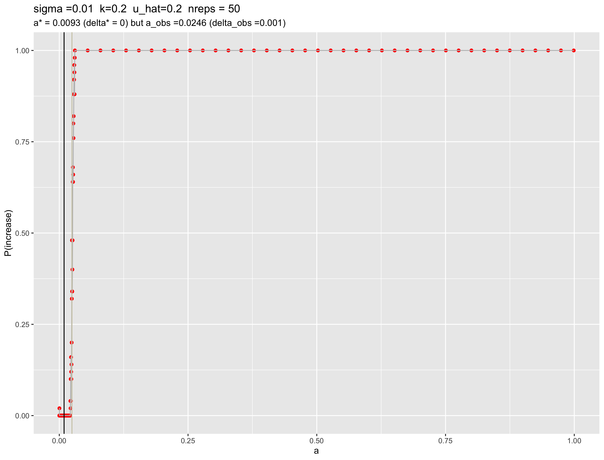
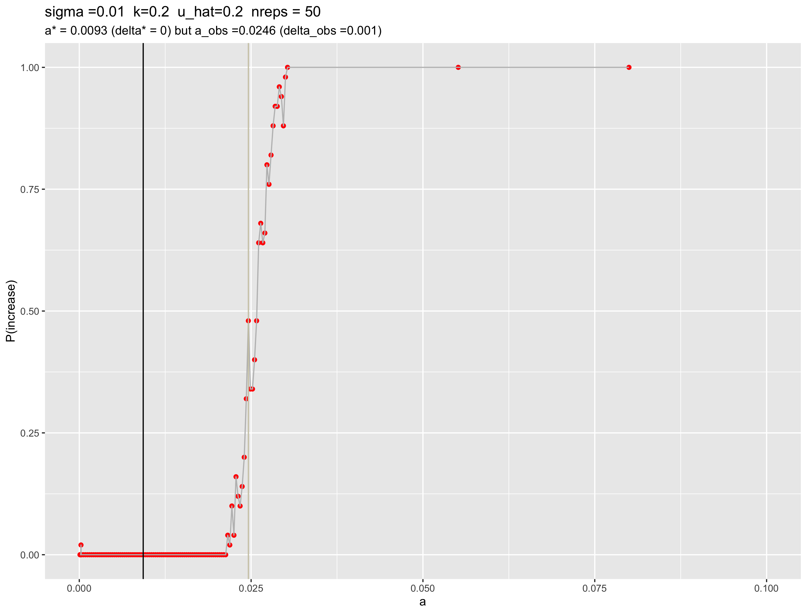
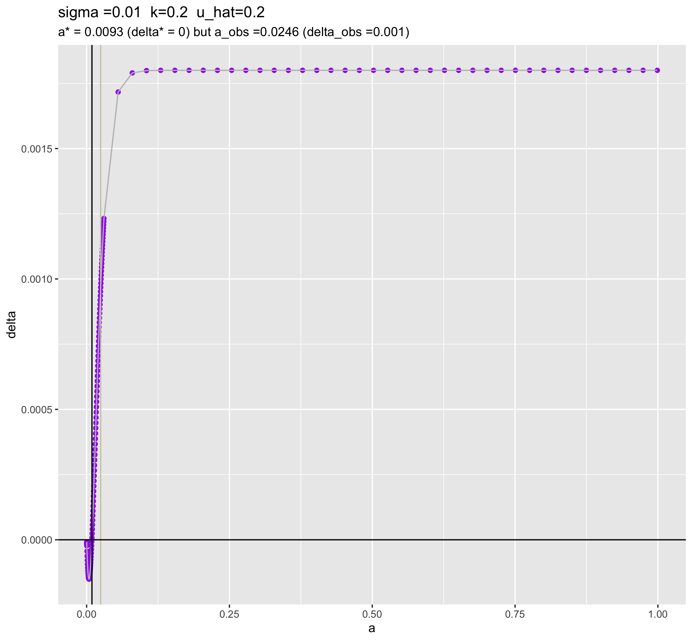
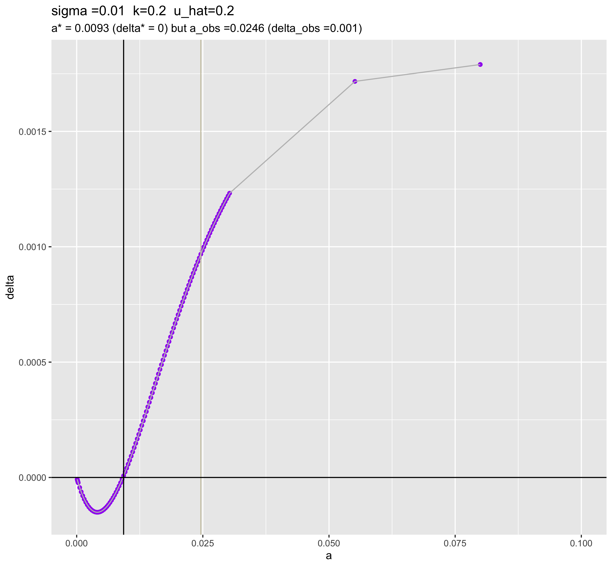
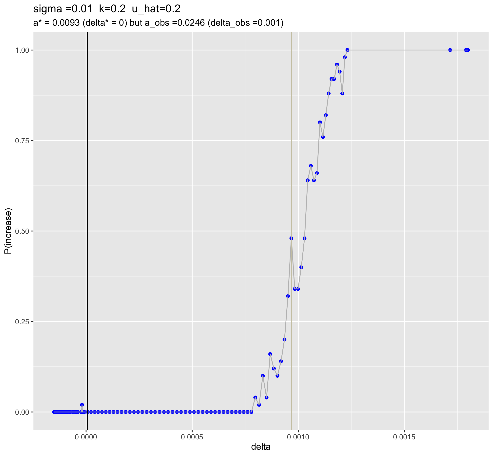

uhat=20% debugged cluster runs with wt gens
================
Isabel Kim
4/11/2022

## Additions

-   10 generations for wild-types to stabilize before the drive is added
-   Adjusted the mutation stacking policy to account for converting
    wild-type genomes to drive in generation 10
-   Fixed the python driver such that if the drive is introduced at 0%
    and therefore has an initial and final frequency equal to 0%, it’s
    counted as a “decrease” (before, this was an “increase” due to the
    way I structured the conditional)

## a vs P(increase)

### Full range of a

-   \[but more jobs are at the transition range – the lower and higher
    ends of a had more spaced out runs\]

``` r
dir = "../../cluster/u_hat=0.2_run/figures/"
knitr::include_graphics(paste0(dir,"april11_full_a_vs_p_increase.png"))
```

<!-- -->

-   a_observed is close to where it was in the previous runs (when the
    drive was released at gen0).
    -   Therefore, a_predicted and a_observed are about the same amount
        off as they were before

### Zoomed in – a between 0 and 0.1

``` r
knitr::include_graphics(paste0(dir,"april11_zoomed_in_a_vs_p_increase.png"))
```

<!-- -->
\* Less stochasticity at the lower range of a – P(increase) is almost
always 0 (due to fixing the bug in the `python_driver.py` script)

## a vs delta (equation)

### Full range of a

``` r
knitr::include_graphics(paste0(dir,"april11_full_a_vs_delta.png"))
```

<!-- -->

Delta levels off around 0.002 once a is around 0.1.

### Zoomed in – a between 0 and 0.1

``` r
knitr::include_graphics(paste0(dir,"april11_zoomed_in_a_vs_delta.png"))
```

<!-- -->
When delta = 0.001, P(increase) = 50%. a_observed is around 0.025.

## delta vs P(increase)

``` r
knitr::include_graphics(paste0(dir,"april11_delta_vs_p_increase.png"))
```

<!-- -->
\* Once delta gets to 0.00125, P(increase) goes to 100%.
