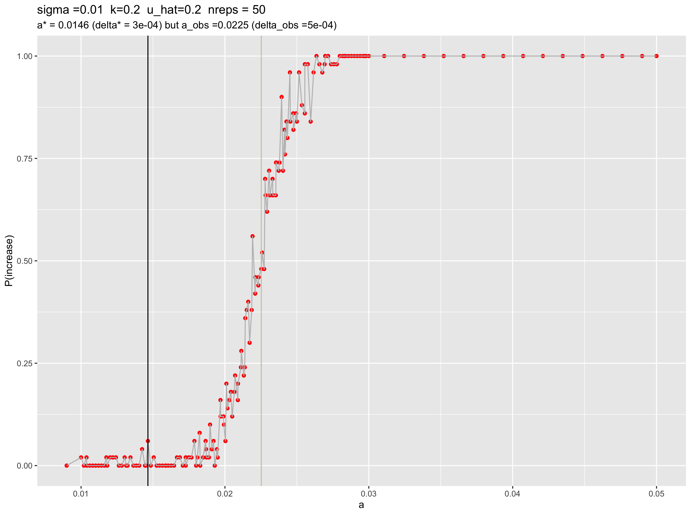
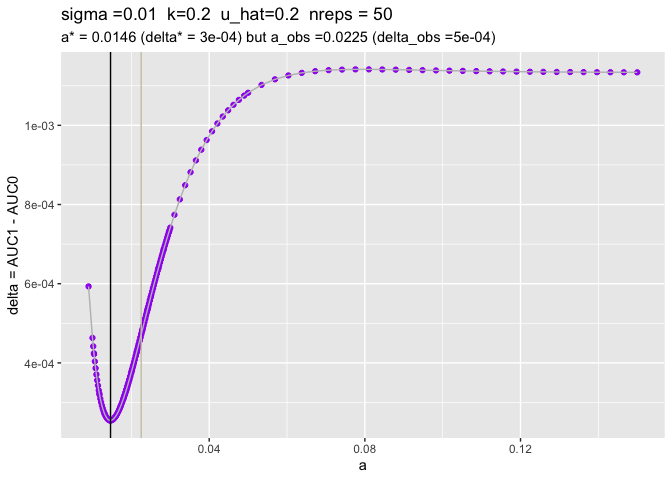
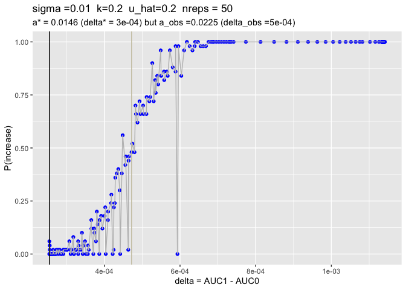

uhat = 20 analysis
================
Isabel Kim
3/30/2022

## Summary dataset

``` r
library(tidyverse)
```

    ## ── Attaching packages ─────────────────────────────────────── tidyverse 1.3.1 ──

    ## ✓ ggplot2 3.3.5     ✓ purrr   0.3.4
    ## ✓ tibble  3.1.6     ✓ dplyr   1.0.8
    ## ✓ tidyr   1.2.0     ✓ stringr 1.4.0
    ## ✓ readr   2.1.2     ✓ forcats 0.5.1

    ## ── Conflicts ────────────────────────────────────────── tidyverse_conflicts() ──
    ## x dplyr::filter() masks stats::filter()
    ## x dplyr::lag()    masks stats::lag()

``` r
data = read_csv("/Users/isabelkim/Desktop/year2/underdominance/reaction-diffusion/cluster/u_hat=0.2_run/csvs/uhat_0.2_more_replicate_summary.csv")
```

    ## Rows: 190 Columns: 7

    ## ── Column specification ────────────────────────────────────────────────────────
    ## Delimiter: ","
    ## dbl (7): a, sigma, beta, k, u_hat, delta, p_increase
    ## 
    ## ℹ Use `spec()` to retrieve the full column specification for this data.
    ## ℹ Specify the column types or set `show_col_types = FALSE` to quiet this message.

## a vs p(increase)

Black line represents the a_pred that minimizes delta in this range,
whereas the grey line shows the a_obs value that led to a P(increase)
closest to 50%

``` r

```

<!-- -->
The a_pred value that minimizes delta is 0.01464646, which is an
under-estimate – the a_obs value that led to a P(increase) of 48% is
0.02252525.

The transition range looks like it’s between a = 0.02 and a = 0.027
(quite short; 0.007 wide).

Even with many values of a (190), N=30000, sigma = 0.01, and up to 100,
there’s a lot of stochasiticity.

## How does delta change with a?

-   Black line = predicted value of a\*, based on the a that minimizes
    delta
-   Grey line = the observed value of a that gives a P(increase) closest
    to 50%

``` r
source("/Users/isabelkim/Desktop/year2/underdominance/reaction-diffusion/cluster/plotting_functions.R")
obs_v_pred = get_a_pred_and_a_obs(data)
obs_v_pred
```

    ## $index_of_pred
    ## [1] 29
    ## 
    ## $a_pred
    ## [1] 0.01464646
    ## 
    ## $delta_pred
    ## [1] 0.0002546032
    ## 
    ## $index_of_obs
    ## [1] 92
    ## 
    ## $a_obs
    ## [1] 0.02252525
    ## 
    ## $p_increase_obs
    ## [1] 0.48
    ## 
    ## $delta_obs
    ## [1] 0.0004718396

``` r
nreps = 50

plot_a_vs_delta = ggplot(data, aes(x = a, y = delta)) + 
  geom_point(color = "purple") + 
  geom_line(color = "grey") +
  geom_vline(xintercept = obs_v_pred$a_pred, color = "black") + 
  ylab("delta = AUC1 - AUC0") + 
  labs(title = paste0("sigma =",data$sigma[1], 
                      "  k=",data$k[1],"  u_hat=", data$u_hat[1],
                      "  nreps = ", nreps), 
       subtitle = paste0("a* = ", round(obs_v_pred$a_pred,4), " (delta* = ", round(obs_v_pred$delta_pred,4),") but a_obs =",round(obs_v_pred$a_obs,4)," (delta_obs =", round(obs_v_pred$delta_obs,4),")")) + 
  geom_vline(xintercept = obs_v_pred$a_obs, color = "cornsilk3")

plot_a_vs_delta
```

<!-- -->
There is a clear minimum value of delta that the black line seems to
capture. The delta_obs value is slightly above the minimum.

## How does P(increase) change with delta?

Would initially expect that at higher delta, P(increase) is higher –
there is a positive correlation

``` r
cor(data$delta, data$p_increase)
```

    ## [1] 0.8460563

Graph:

-   Black line shows the minimum delta value, at which we expect the
    critical propagule to occur.
-   Grey line shows the delta value at which P(increase) is closest to
    50%

``` r
plot_delta_vs_freq = ggplot(data, aes(x = delta, y = p_increase)) + 
  geom_point(color = "blue") + 
  geom_line(color = "grey") +
  geom_vline(xintercept = obs_v_pred$delta_pred, color = "black") + 
  xlab("delta = AUC1 - AUC0") + 
  ylab("P(increase)") +
  labs(title = paste0("sigma =",data$sigma[1], 
                      "  k=",data$k[1],"  u_hat=", data$u_hat[1],
                      "  nreps = ", nreps), 
       subtitle = paste0("a* = ", round(obs_v_pred$a_pred,4), " (delta* = ", round(obs_v_pred$delta_pred,4),") but a_obs =",round(obs_v_pred$a_obs,4)," (delta_obs =", round(obs_v_pred$delta_obs,4),")")) + 
  geom_vline(xintercept = obs_v_pred$delta_obs, color = "cornsilk3")

plot_delta_vs_freq
```

<!-- -->

P(increase) increases mostly linearly with delta until P(increase)=1.
But there is a lot of stochasticity/outliers.
