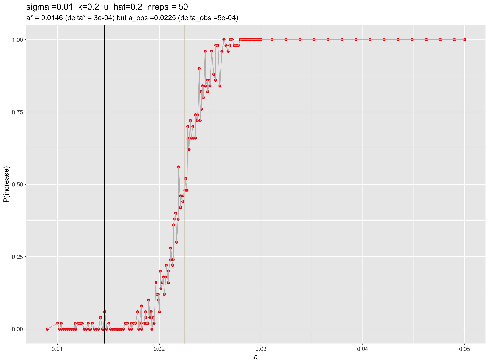

```{r setup, include=FALSE}
knitr::opts_chunk$set(echo = TRUE)
```

## Summary dataset
```{r}
library(tidyverse)
data = read_csv("/Users/isabelkim/Desktop/year2/underdominance/reaction-diffusion/cluster/u_hat=0.2_run/csvs/uhat_0.2_more_replicate_summary.csv")
```

## a vs p(increase)

Black line represents the a_pred that minimizes delta in this range, whereas the grey line shows the a_obs value that led to a P(increase) closest to 50%

```{r}

```
The a_pred value that minimizes delta is 0.01464646, which is an under-estimate -- the a_obs value that led to a P(increase) of 48% is 0.02252525. 

The transition range looks like it's between a = 0.02 and a = 0.027 (quite short).

Even with many values of a (190), N=30000, sigma = 0.01, and up to 100, there's a lot of stochasiticity.

## How does delta change with a?

* Black line = predicted value of a*, based on the a that minimizes delta
* Grey line = the observed value of a that gives a P(increase) closest to 50%

```{r}
source("/Users/isabelkim/Desktop/year2/underdominance/reaction-diffusion/cluster/plotting_functions.R")
obs_v_pred = get_a_pred_and_a_obs(data)
nreps = 50

plot_a_vs_delta = ggplot(data, aes(x = a, y = delta)) + 
  geom_point(color = "purple") + 
  geom_line(color = "grey") +
  geom_vline(xintercept = obs_v_pred$a_pred, color = "black") + 
  ylab("delta = AUC1 - AUC0") + 
  labs(title = paste0("sigma =",data$sigma[1], 
                      "  k=",data$k[1],"  u_hat=", data$u_hat[1],
                      "  nreps = ", nreps), 
       subtitle = paste0("a* = ", round(obs_v_pred$a_pred,4), " (delta* = ", round(obs_v_pred$delta_pred,4),") but a_obs =",round(obs_v_pred$a_obs,4)," (delta_obs =", round(obs_v_pred$delta_obs,4),")")) + 
  geom_vline(xintercept = obs_v_pred$a_obs, color = "cornsilk3")

plot_a_vs_delta
```
There is a clear minimum value of delta that the black line seems to capture. The delta_obs value is slightly above the minimum.


## How does P(increase) change with delta?

Would initially expect that at higher delta, P(increase) is higher -- there is a positive correlation
```{r}
cor(data$delta, data$p_increase)
```

Graph:

* Black line shows the minimum delta value, at which we expect the critical propagule to occur.
* Grey line shows the delta value at which P(increase) is closest to 50%
```{r}
plot_delta_vs_freq = ggplot(data, aes(x = delta, y = p_increase)) + 
  geom_point(color = "blue") + 
  geom_line(color = "grey") +
  geom_vline(xintercept = obs_v_pred$delta_pred, color = "black") + 
  xlab("delta = AUC1 - AUC0") + 
  ylab("P(increase)") +
  labs(title = paste0("sigma =",data$sigma[1], 
                      "  k=",data$k[1],"  u_hat=", data$u_hat[1],
                      "  nreps = ", nreps), 
       subtitle = paste0("a* = ", round(obs_v_pred$a_pred,4), " (delta* = ", round(obs_v_pred$delta_pred,4),") but a_obs =",round(obs_v_pred$a_obs,4)," (delta_obs =", round(obs_v_pred$delta_obs,4),")")) + 
  geom_vline(xintercept = obs_v_pred$delta_obs, color = "cornsilk3")

plot_delta_vs_freq
```

P(increase) increases mostly linearly with delta until P(increase)=1. But there is a lot of stochasticity/outliers. 