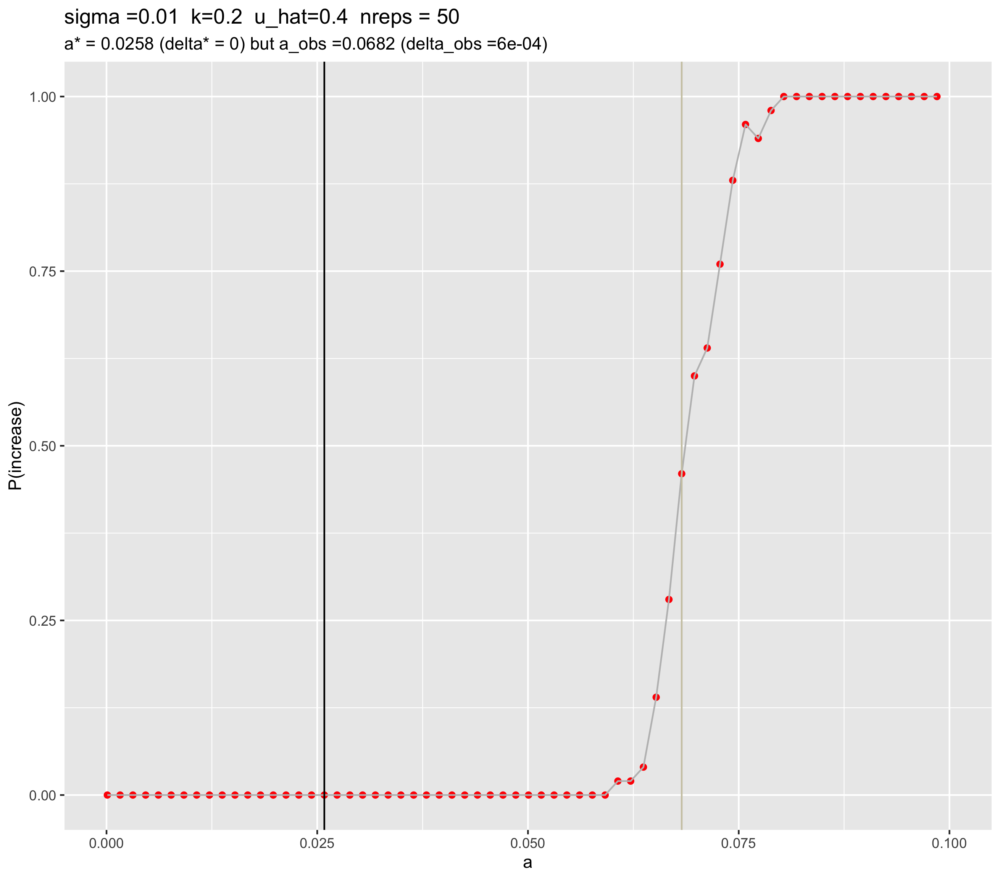

```{r setup, include=FALSE}
knitr::opts_chunk$set(echo = TRUE)
```

## Additions

* 10 generations for wild-types to stabilize before the drive is added
* Adjusted the mutation stacking policy to account for converting wild-type genomes to drive in generation 10
* Fixed the python driver such that if the drive is introduced at 0% and therefore has an initial and final frequency equal to 0%, it's counted as a "decrease" (before, this was an "increase" due to the way I structured the conditional)

## a vs P(increase)

### Full range of a
```{r}

```

### Zoomed in -- a from 0 to 0.1
```{r}

```
* a_observed = 0.0682
  + SLiM visual validation that at a=0.0682, we see P(increase) about 50% of the time:
    * Replicate 1: increases from 0.0 to 0.082, then stablizes (is the advantage of d/d fitness too small?)
    

## a vs delta

### Full range of a
```{r}

```

### Zoomed in -- a between 0 and 0.1
```{r}

```

## delta vs P(increase)

```{r}

```