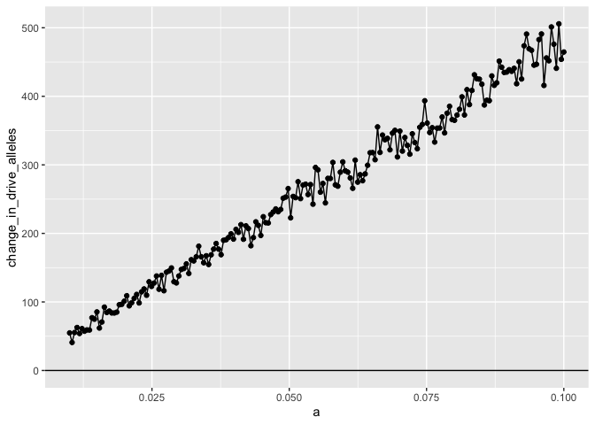
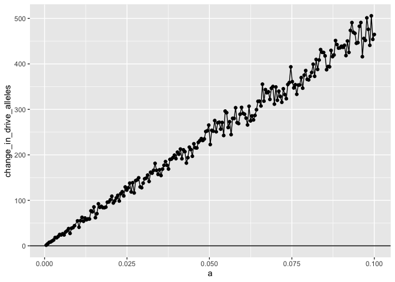

uhat=40% a vs change in number of drive alleles
================
Isabel Kim
4/13/2022

## Description

-   For a given value of a:
    -   Run SLiM 100 times
    -   Obtain just the change in the number of drive alleles from gen11
        to gen10
    -   In csv, print *a* vs *change*
-   Make sure there are a good amount of *a* values below a_predicted
    and above a_predicted (based on the delta equation)
-   Other parameters to keep constant from run to run:
    -   sigma = m = 0.01
    -   k = 0.2
    -   u_hat = 0.4
    -   N = 30,000
    -   Stop the simulation at generation 11
        -   Changing the SLiM simulation to reflect this (transfer new
            version)
-   Need a new python driver parsing function
    -   `python_driver_num_drives.py` – use this instead. Only need to
        specify -a

## a values from before

-   The predicted value of a that will cause delta=0 is a_predicted =
    0.0258
-   But the observed value of a that caused P(increase)=50% was
    a_observed = 0.0682
-   The value of a beyond which/at which P(increase)=100% was a_upper =
    0.07884 –> round to 0.08

### Values to focus on

-   focus mostly on a = 0.01 to a = 0.1

``` r
a_values = seq(0.01,0.1,length.out=200) # 200 jobs --> a increases by 0.00045 only

a_pred_diff = abs(a_values - 0.0258)
a_pred_ind = which.min(a_pred_diff) # 36
a_value_concentrate = a_values[a_pred_ind] # the 36th job is a* = 0.02582915

a_obs_diff = abs(a_values - 0.0682)
a_obs_ind = which.min(a_obs_diff) # 130
a_obs_concentrate = a_values[a_obs_ind] # the 130th job is a_observed = 0.06834171
```

## Files

-   slim file:
    `/Users/isabelkim/Desktop/year2/underdominance/reaction-diffusion/slim/nonWF-model.slim`
    -   on the cluster:
        `/home/ikk23/underdom/main_scripts/nonWF-model.slim`
-   python driver (new):
    `/Users/isabelkim/Desktop/year2/underdominance/reaction-diffusion/cluster/python_driver_num_drives.py`
    -   on the cluster:
        `/home/ikk23/underdom/main_scripts/python_driver_num_drives.py`
-   text file:
    `/Users/isabelkim/Desktop/year2/underdominance/reaction-diffusion/cluster/u_hat=0.4_run/slurm_text/uhat40_a_vs_dr_change_april13.txt`
    -   on the cluster:
        `/home/ikk23/underdom/text_files/uhat40_a_vs_dr_change_april13.txt`
-   main SLURM script:
    `/Users/isabelkim/Desktop/year2/underdominance/reaction-diffusion/cluster/u_hat=0.4_run/slurm_main/uhat40_april13_a_vs_change_main.sh`
    -   on the cluster:
        `/home/ikk23/underdom/vary_a_scripts/uhat40_april13_a_vs_change_main.sh`
    -   **Submitted batch job 4301202 on 4/13 at 7:06pm**
-   merge SLURM script:
    `/Users/isabelkim/Desktop/year2/underdominance/reaction-diffusion/cluster/u_hat=0.4_run/slurm_merge/uhat40_april13_a_vs_change_merge.sh`
    -   creates:
        `/home/ikk23/underdom/out_u40/uhat40_april13_a_vs_change.csv` on
        the cluster
    -   on the cluster:
        `/home/ikk23/underdom/merge_scripts/uhat40_april13_a_vs_change_merge.sh`

## Output

-   Raw csv:
    `/Users/isabelkim/Desktop/year2/underdominance/reaction-diffusion/cluster/u_hat=0.4_run/csv_raw/uhat40_april13_a_vs_change.csv`

``` r
library(tidyverse)
```

    ## ── Attaching packages ─────────────────────────────────────── tidyverse 1.3.1 ──

    ## ✓ ggplot2 3.3.5     ✓ purrr   0.3.4
    ## ✓ tibble  3.1.6     ✓ dplyr   1.0.8
    ## ✓ tidyr   1.2.0     ✓ stringr 1.4.0
    ## ✓ readr   2.1.2     ✓ forcats 0.5.1

    ## ── Conflicts ────────────────────────────────────────── tidyverse_conflicts() ──
    ## x dplyr::filter() masks stats::filter()
    ## x dplyr::lag()    masks stats::lag()

``` r
data = read_csv("/Users/isabelkim/Desktop/year2/underdominance/reaction-diffusion/cluster/u_hat=0.4_run/csv_raw/uhat40_april13_a_vs_change.csv") %>% arrange(a)
```

    ## Rows: 20000 Columns: 2

    ## ── Column specification ────────────────────────────────────────────────────────
    ## Delimiter: ","
    ## dbl (2): a, change
    ## 
    ## ℹ Use `spec()` to retrieve the full column specification for this data.
    ## ℹ Specify the column types or set `show_col_types = FALSE` to quiet this message.

``` r
# average the "change" for replicates of a
# Group by common values of a
nreps = 100
starts = seq(1, nrow(data), by = nreps)
nparams = length(starts)
a_vector = rep(-1,nparams)
change_in_drive_alleles_vector = rep(-1,nparams)

for (i in 1:nparams){
  j = starts[i]
  rows = data[j:(j+nreps-1),]
  
  a_vector[i] = rows$a[1]
  
  change_in_drive_alleles_vector[i] = mean(rows$change)
  
}

# Compile summary tibble
summarize_data = tibble(a = a_vector, change_in_drive_alleles = change_in_drive_alleles_vector)

p = ggplot(summarize_data, aes(x = a, y = change_in_drive_alleles)) + geom_point() + geom_line() + ylim(0, max(summarize_data$change_in_drive_alleles)) + geom_hline(yintercept= 0) 

print(p)
```

<!-- -->

Need to make *a* go even smaller than 0.01 to get the graph to cross the
x-intercept

``` r
# want to use the same increment in a as we had before
a_seq = seq(0.01,0.1,length.out=200)
increment = a_seq[2] - a_seq[1]

upper = 0.01 - increment

seq_low = seq(5.025156e-05,upper,by=increment)
a_seq = seq_low[2:21]
```

20 more jobs, from 0.0005025129 to 0.009095478

## New

-   text file:
    `/Users/isabelkim/Desktop/year2/underdominance/reaction-diffusion/cluster/u_hat=0.4_run/slurm_text/lower_uhat40_a_vs_dr_change_april13.txt`
    -   on the cluster:
        `/home/ikk23/underdom/text_files/uhat40_a_vs_dr_change_april13.txt`
-   main SLURM script:
    `/Users/isabelkim/Desktop/year2/underdominance/reaction-diffusion/cluster/u_hat=0.4_run/slurm_main/lower_uhat40_april13_a_vs_change_main.sh`
    -   on the cluster:
        `/home/ikk23/underdom/vary_a_scripts/lower_uhat40_april13_a_vs_change_main.sh`
    -   **Submitted batch job 4301476 on 4/13 at 10:18pm**
-   merge SLURM script:
    `/Users/isabelkim/Desktop/year2/underdominance/reaction-diffusion/cluster/u_hat=0.4_run/slurm_merge/lower_uhat40_april13_a_vs_change_merge.sh`
    -   creates:
        `/home/ikk23/underdom/out_u40/lower_uhat40_april13_a_vs_change`
        on the cluster
    -   on the cluster:
        `/home/ikk23/underdom/merge_scripts/lower_uhat40_april13_a_vs_change_merge.sh`
-   raw csv:
    `/Users/isabelkim/Desktop/year2/underdominance/reaction-diffusion/cluster/u_hat=0.4_run/csv_raw/lower_uhat40_april13_a_vs_change.csv`

Create concacenated file

``` r
library(tidyverse)
lower = read_csv("/Users/isabelkim/Desktop/year2/underdominance/reaction-diffusion/cluster/u_hat=0.4_run/csv_raw/lower_uhat40_april13_a_vs_change.csv") %>% arrange(a)

upper = read_csv("/Users/isabelkim/Desktop/year2/underdominance/reaction-diffusion/cluster/u_hat=0.4_run/csv_raw/uhat40_april13_a_vs_change.csv") %>% arrange(a)

data = rbind(lower, upper)

# output this csv
write_csv(x = data, file = "/Users/isabelkim/Desktop/year2/underdominance/reaction-diffusion/cluster/u_hat=0.4_run/csvs/uhat40_april14_a_full_vs_change.csv")
```

Create summary (avg replicate) file

``` r
data = read_csv("/Users/isabelkim/Desktop/year2/underdominance/reaction-diffusion/cluster/u_hat=0.4_run/csvs/uhat40_april14_a_full_vs_change.csv")
```

    ## Rows: 22000 Columns: 2
    ## ── Column specification ────────────────────────────────────────────────────────
    ## Delimiter: ","
    ## dbl (2): a, change
    ## 
    ## ℹ Use `spec()` to retrieve the full column specification for this data.
    ## ℹ Specify the column types or set `show_col_types = FALSE` to quiet this message.

``` r
nreps = 100
starts = seq(1, nrow(data), by = nreps)
nparams = length(starts)
a_vector = rep(-1,nparams)
change_in_drive_alleles_vector = rep(-1,nparams)

for (i in 1:nparams){
  j = starts[i]
  rows = data[j:(j+nreps-1),]
  
  a_vector[i] = rows$a[1]
  
  change_in_drive_alleles_vector[i] = mean(rows$change)
  
}

# Compile summary tibble
summarize_data = tibble(a = a_vector, change_in_drive_alleles = change_in_drive_alleles_vector)

# plot
p = ggplot(summarize_data, aes(x = a, y = change_in_drive_alleles)) + geom_point() + geom_line() + ylim(0, max(summarize_data$change_in_drive_alleles)) + geom_hline(yintercept= 0) 

print(p)
```

<!-- -->

``` r
ggsave(plot = p, filename = "/Users/isabelkim/Desktop/year2/underdominance/reaction-diffusion/cluster/u_hat=0.4_run/figures/uhat40_a_vs_change_in_dr_alleles.png")
```

    ## Saving 7 x 5 in image

Still not crossing 0 when a = 0.000502512866532663?

Run 10 jobs at the lowest range

``` r
a_seq_lowest = seq(0.00009, 0.000502512866532663, length.out=10)
```

## PROBLEM

-   When the drive is initially released (at generation 10), there are
    only drive homozygotes. They have a reproductive advantage compared
    to the only other genotype there, the wild-types. Thus, none of the
    drive homozygotes released should have any trouble finding a mate.
    This resembles more of a *Fisher* wave, with a selective advantage,
    than a bistable wave. The bistable dynamics would come more into
    play if we have *heterozygotes* with a reproductive disadvantage.
    -   The point is that we aren’t modeling the “reaction” correctly
        between generation 10 to generation 11. The drive is essentially
        *expected* to increase from generation 10 to generation 11 if
        only homozygotes are present.

### How to combat?

-   Release both homozygotes and heterozygotes?
-   Release just heterozygotes? (Would the drive ever spread?)
-   Look at another generation transition point?

## Plotting the number of drive alleles over time locally

1.  Run SLiM for 110 generations. Copy and paste the SLiM output console
    into a text file within the
    `/Users/isabelkim/Desktop/year2/underdominance/reaction-diffusion/cluster/u_hat=0.4_run/num_drive_testing/`
    folder.

-   ex: `a0_0005.txt`

2.  Run the python script `num_drives_and_gen.py` within this same
    folder. Provide the path to the text file as an argument, and pipe
    the output to a csv. The csv will contain a “gen” column
    (generation - 10) and a “num_drive_alleles” column.

-   ex: `python num_drives_and_gen.py a0_0005.txt > a0_0005.csv`

3.  Go into the R script, `plot_output.R`. Only need to input the csv
    name (without the path), like `a0_0005.csv` and the value of a (here
    `a=0.0005`). This will print out a figure named “a_VALUE.png” in the
    subdirectory,
    `/Users/isabelkim/Desktop/year2/underdominance/reaction-diffusion/cluster/u_hat=0.4_run/num_drive_testing/figures/`
