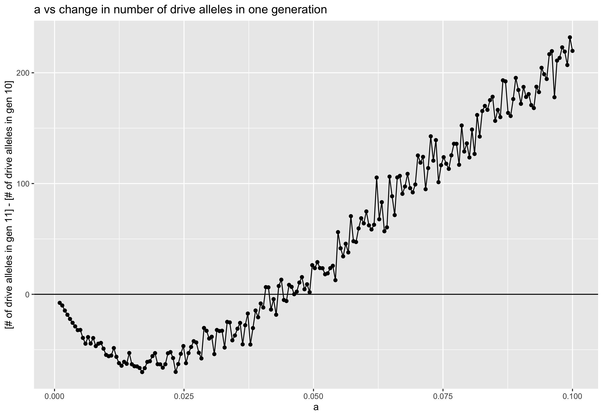
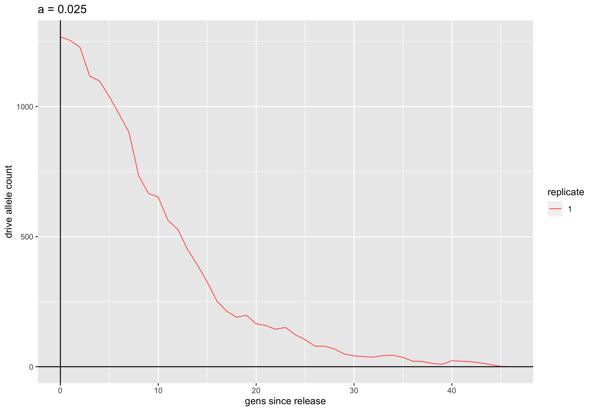
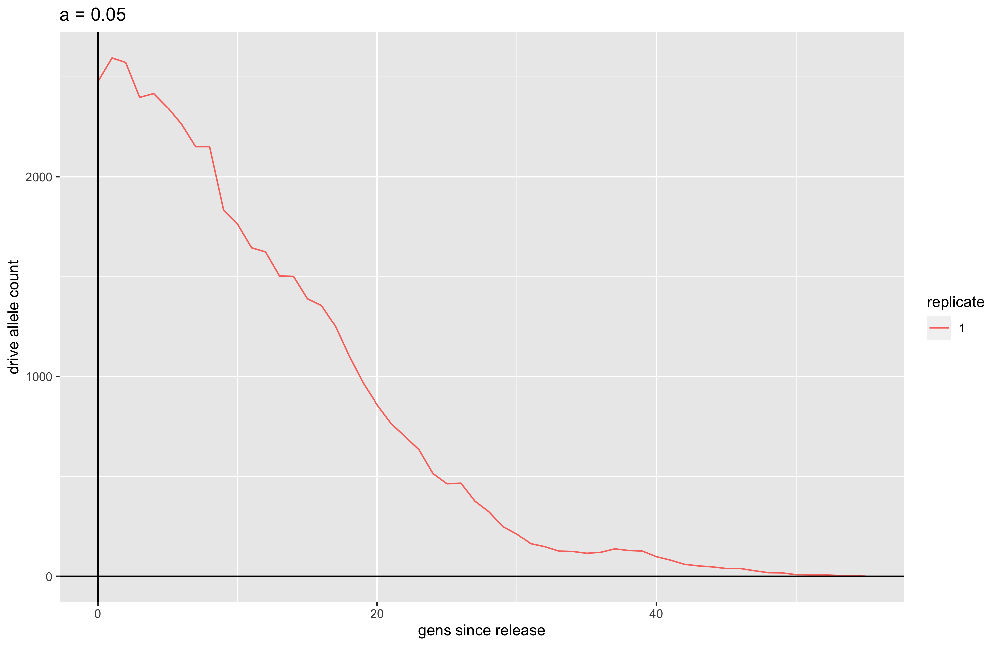
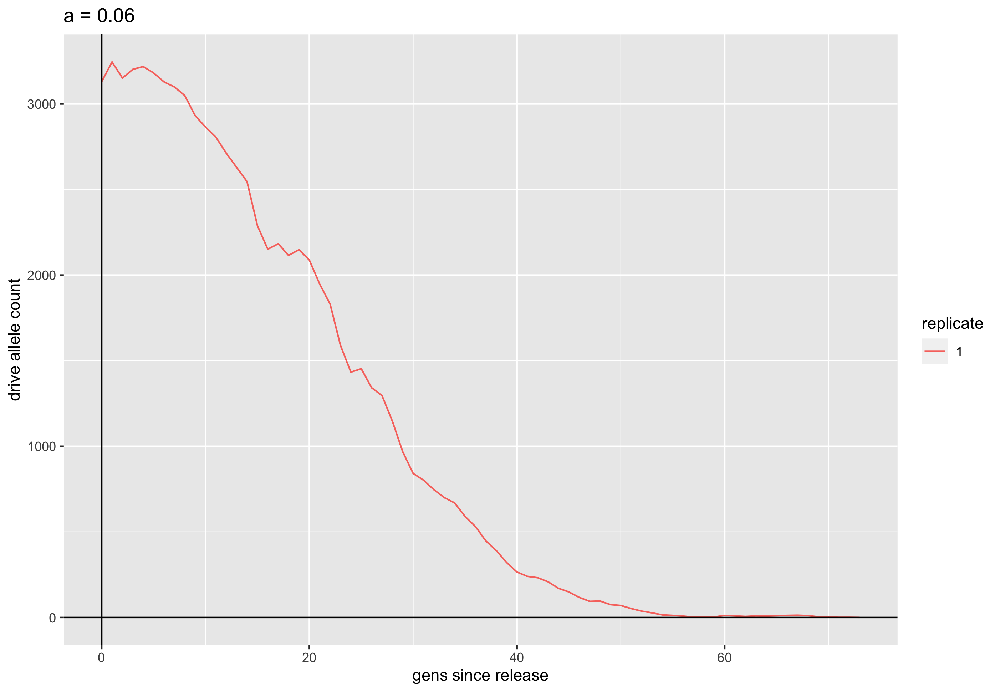

uhat=40% - a vs change in number of drive alleles with the revised slim
model
================
Isabel Kim
4/19/2022

## Parameters

-   uhat = 40%
-   sigma = 0.01
-   k = 0.2
-   m = 0.001
-   N = 30,000
-   window = \[0.499, 0.501\]
-   a_predicted = 0.025

## Cluster job: a vs (# of drive alleles in gen11)-(# of drive alleles in gen10)

### Description

-   With our revised SLiM model, does the number of drive alleles ever
    *decrease* from gen10 to 11? Does the difference=0 around the
    predicted value of a\*=0.025?
    -   Run SLiM for just 1 generation of the drive (stop at generation
        11), with 100 replicates for each parameter of a.

### Files

-   slim file:
    `/Users/isabelkim/Desktop/year2/underdominance/reaction-diffusion/slim/nonWF-model.slim`
    -   on the cluster:
        `/home/ikk23/underdom/main_scripts/nonWF-model.slim`
-   python driver (changed):
    `/Users/isabelkim/Desktop/year2/underdominance/reaction-diffusion/cluster/python_driver_num_drives.py`
    -   on the cluster:
        `/home/ikk23/underdom/main_scripts/python_driver_num_drives.py`
-   text file:
    `/Users/isabelkim/Desktop/year2/underdominance/reaction-diffusion/cluster/u_hat=0.4_run/slurm_text/april19_uhat40_a_vs_1_gen_change.txt`
    -   on the cluster:
        `/home/ikk23/underdom/text_files/april19_uhat40_a_vs_1_gen_change.txt`
-   main SLURM script:
    `/Users/isabelkim/Desktop/year2/underdominance/reaction-diffusion/cluster/u_hat=0.4_run/slurm_main/april19_uhat40_a_vs_1_gen_change.sh`
    -   on the cluster:
        `/home/ikk23/underdom/vary_a_scripts/april19_uhat40_a_vs_1_gen_change.sh`
    -   **Submitted batch job 4309459 on 4/19 at 6:49pm**
-   merge SLURM script:
    `/Users/isabelkim/Desktop/year2/underdominance/reaction-diffusion/cluster/u_hat=0.4_run/slurm_merge/merge_april19_a_vs_1_gen_change.sh`
    -   creates:
        `/home/ikk23/underdom/out_u40/revised_slim_uhat40_a_vs_change_april_19.csv`
        on the cluster
    -   on the cluster:
        `/home/ikk23/underdom/merge_scripts/merge_april19_a_vs_1_gen_change.sh`

## Results

### Files

-   Raw csv:
    `/Users/isabelkim/Desktop/year2/underdominance/reaction-diffusion/cluster/u_hat=0.4_run/csv_raw/revised_slim_uhat40_a_vs_change_april_19.csv`
-   Summary csv:
    `/Users/isabelkim/Desktop/year2/underdominance/reaction-diffusion/cluster/u_hat=0.4_run/csvs/summary_of_revised_slim_uhat40_a_vs_change_april_19.csv`

### Processing

``` r
library(tidyverse)
data = read_csv("/Users/isabelkim/Desktop/year2/underdominance/reaction-diffusion/cluster/u_hat=0.4_run/csv_raw/revised_slim_uhat40_a_vs_change_april_19.csv") %>% arrange(a)

# average the "change" for replicates of a
# Group by common values of a
nreps = 100
starts = seq(1, nrow(data), by = nreps)
nparams = length(starts)
a_vector = rep(-1,nparams)
change_in_drive_alleles_vector = rep(-1,nparams)

for (i in 1:nparams){
  j = starts[i]
  rows = data[j:(j+nreps-1),]
  
  a_vector[i] = rows$a[1]
  
  change_in_drive_alleles_vector[i] = mean(rows$change)
  
}

# Compile summary tibble
summarize_data = tibble(a = a_vector, change_in_drive_alleles = change_in_drive_alleles_vector)
#write_csv(x = summarize_data, file = "/Users/isabelkim/Desktop/year2/underdominance/reaction-diffusion/cluster/u_hat=0.4_run/csvs/summary_of_revised_slim_uhat40_a_vs_change_april_19.csv")

p = ggplot(summarize_data, aes(x = a, y = change_in_drive_alleles)) + geom_point() + geom_line()  + geom_hline(yintercept= 0) + ylab("[# of drive alleles in gen 11] - [# of drive alleles in gen 10]") + ggtitle("a vs change in number of drive alleles in one generation")


#ggsave(plot = p, filename = "/Users/isabelkim/Desktop/year2/underdominance/reaction-diffusion/cluster/u_hat=0.4_run/num_drive_testing/figures/revised_slim_a_vs_change_uhat40.png")
```

``` r

```

<!-- -->

Crosses 0 at around a=0.045. At a\*=0.025, the drive allele count still
decreases from gen10 to gen11.

## Plotting the change in the overall number of drive alleles over 100 generations (1 replicate only, run locally)

### a = 0.025 (a_predicted)

``` r
fig_dir = "../../cluster/u_hat=0.4_run/num_drive_testing/figures/"
file = "a_0.025_revised_model.png"
knitr::include_graphics(paste0(fig_dir, file))
```

<!-- -->
Monotonic decrease.

### a = 0.045 (where the change is around 0 averaged over 100 replicates)

``` r
file = "a0.045_revised_model.png"
knitr::include_graphics(paste0(fig_dir, file))
```

<!-- -->
The drive allele number *does* increase for a few generations (\~6) but
then decreases. But this initial “bump” isn’t that worisome.

### a = 0.05

``` r
file = "a_0.05_revised_model.png"
knitr::include_graphics(paste0(fig_dir, file))
```

<!-- -->
Very small initial bump, then decrease.

### a = 0.06

``` r
file = "a_0.06_revised_model.png"
knitr::include_graphics(paste0(fig_dir, file))
```

<!-- -->
Almost monotonic decrease.

### a = 0.0682 (the old a_observed)

``` r
file = "a_0.0682_revised_model.png"
knitr::include_graphics(paste0(fig_dir, file))
```

<!-- -->
Drive allele count stays relatively stable for 25 generations before
\~monotically increasing.

### a = 0.075

``` r
file = "a_0.075_revised_model.png"
knitr::include_graphics(paste0(fig_dir, file))
```

<!-- -->
Drive allele count stays relatively stable for 25 generations before
\~monotically increasing.

## Conclusions

-   GOOD that the number of drive alleles can decrease from generation
    10 to 11 now.
-   But similar as to before, the change in drive alleles from
    generation 10 to 11 isn’t entirely predictive of whether the drive
    will ultimately spread. See graph a=0.06 for example. The drive
    allele count may increase for 1 or 2 generations before almost
    monotically decreasing. It’s good that this initial “bump” isn’t as
    prominent anymore, however.
