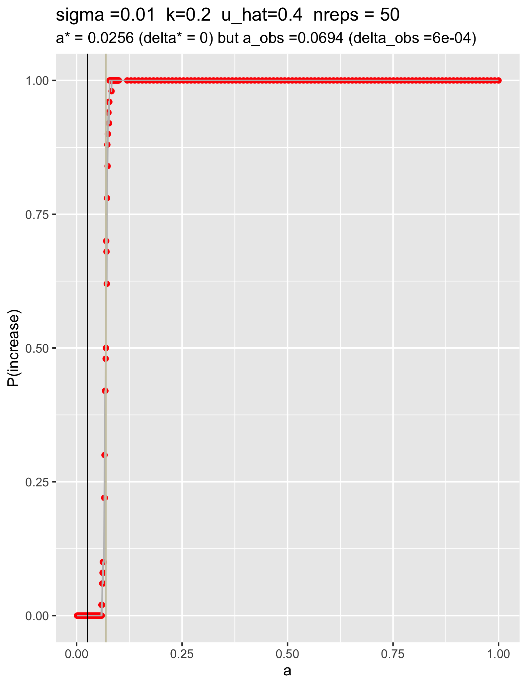
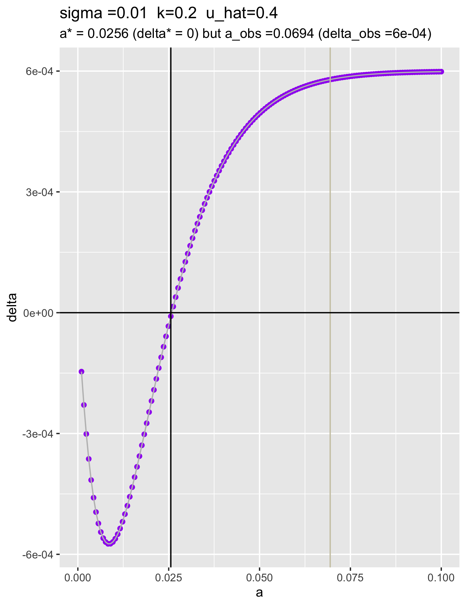
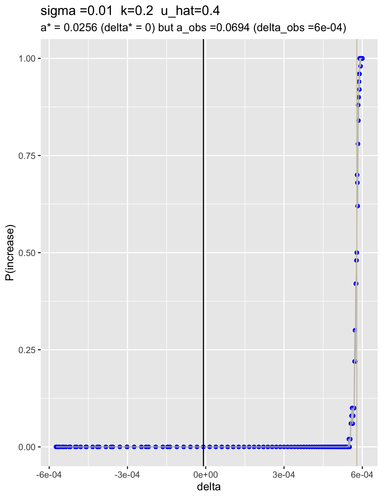

```{r setup, include=FALSE}
knitr::opts_chunk$set(echo = TRUE)
```

## Parameters

* uhat = 40%
* sigma = 0.01
* k = 0.2
* m = 0.001
* N = 30,000
* window = [0.499, 0.501]
* a_predicted = 0.025

## Cluster job: a vs outcome (whether the overall rate of the drive increased or decreased)

### Description

Same job as before, but this time with the revised SLiM model.

The predicted value of a that causes delta=0 is around 0.025. The last SLiM model saw an a_observed of 0.0682. The change in the number of drive alleles from generation 10 to 11 was equal to 0 around a=0.045.

### Files

* Text file: `/Users/isabelkim/Desktop/year2/underdominance/reaction-diffusion/cluster/u_hat=0.4_run/slurm_text/april19_uhat40_full_a_vs_outcome.txt`
  + 250 jobs
  + `a = c(seq(0.001,0.1,length.out=150), seq(0.12,1.0, length.out=100))`
* SLURM main script: `/Users/isabelkim/Desktop/year2/underdominance/reaction-diffusion/cluster/u_hat=0.4_run/slurm_main/april19_uhat40_a_full_vs_outcome.sh`
  + **Submitted batch job 4310084 on 4/19 8:46pm**
* SLURM merge script: `/Users/isabelkim/Desktop/year2/underdominance/reaction-diffusion/cluster/u_hat=0.4_run/slurm_merge/merge_april19_uhat40_a_full_vs_outcome.sh`
  + On the cluster: `/home/ikk23/underdom/merge_scripts/merge_april19_uhat40_a_full_vs_outcome.sh`
  + Creates `uhat40_april19_a_full_vs_outcome.csv`

## Results

### Files

* Raw csv: `/Users/isabelkim/Desktop/year2/underdominance/reaction-diffusion/cluster/u_hat=0.4_run/csv_raw/uhat40_april19_a_full_vs_outcome.csv`
* Summary csv: `/Users/isabelkim/Desktop/year2/underdominance/reaction-diffusion/cluster/u_hat=0.4_run/csvs/summary_uhat40_april19_a_full_vs_outcome.csv`


### Plots

#### a vs P(increase) - full range
```{r}

```

a_observed is almost the same value as it was in the last SLiM model.

#### a vs P(increase) -- zoomed in

```{r}
knitr::include_graphics("../../cluster/u_hat=0.4_run/figures/revised_april19_zoomed_in_a_vs_p_increase_uhat4.png")
```
* P(increase) = 0.0 at a*=0.025
* P(increase) = ~0.25 at a=0.0654
* P(increase) = 0.5 at a=0.0694
* P(increase) = ~0.75 at a=0.0721
* P(increase) = ~0.9 at a=0.0748


#### a vs delta -- zoomed in (same plot that we had for the last slim model)
```{r}

```

#### delta vs P(increase) -- full range
```{r}

```

## Conclusions

* The organization of the SLiM generation cycle doesn't affect the long-term success of the drive very much. Results here are almost identical to what they were for the last SLiM model. Focusing on the window around the midpoint might yield different results, however.