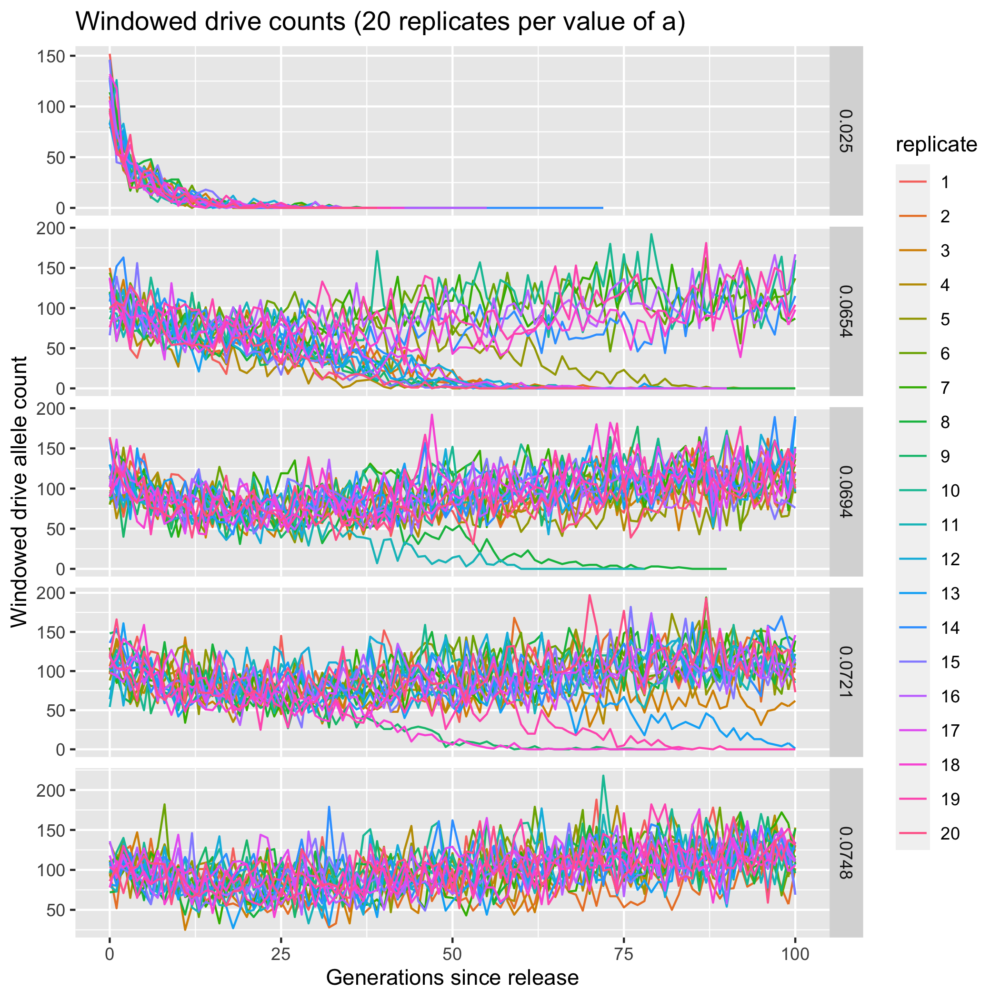
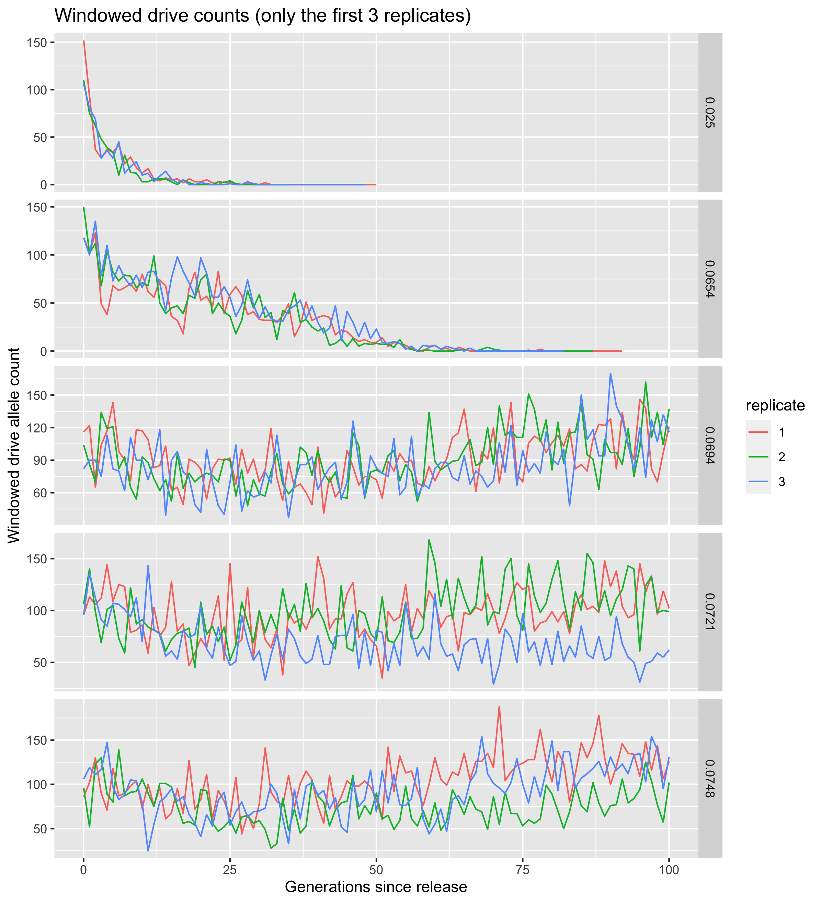

uhat=40% windowed drive analysis
================
Isabel Kim
4/20/2022

## Parameters

-   Values of a:
    -   a=0.025 –> P(increase) = 0.0
    -   a=0.0654 –> P(increase) = 0.25
    -   a=0.0694 –> P(increase) = 0.50
    -   a=0.0721 –> P(increase) = 0.75
    -   a=0.0748 –> P(increase) = 0.90
-   20 replicates each
-   uhat = 40%
-   sigma = 0.01
-   k = 0.2
-   m = 0.001
-   N = 30,000
-   window = \[0.499, 0.501\]

## Files

-   SLiM model (re-transfer):
    `/Users/isabelkim/Desktop/year2/underdominance/reaction-diffusion/slim/nonWF-model.slim`
-   Python driver:
    `/Users/isabelkim/Desktop/year2/underdominance/reaction-diffusion/cluster/python_driver_windowed.py`
    -   This will print out a csv line for each generation of each
        replicate.
    -   The columns are:
        `a,replicate,gen,overall_d_count, overall_d_rate, windowed_d_count, windowed_dd_count, windowed_dwt_count`
        -   Creates one `X.part` file per value of a
-   Text file:
    `/Users/isabelkim/Desktop/year2/underdominance/reaction-diffusion/cluster/u_hat=0.4_run/slurm_text/april20_windowed_drive_analysis_uhat40.txt`
-   Main SLURM script:
    `/Users/isabelkim/Desktop/year2/underdominance/reaction-diffusion/cluster/u_hat=0.4_run/slurm_main/april20_windowed_drive_analysis_uhat40.sh`
    -   **Submitted batch job 4311589 on 4/20 at 11:30**
-   Merge script:
    `/Users/isabelkim/Desktop/year2/underdominance/reaction-diffusion/cluster/u_hat=0.4_run/slurm_merge/merge_april20_windowed_drive_uhat40.sh`
    -   But note that the *unmerged* 5 `.part` files contain results for
        different values of a
    -   This creates `uhat40_april20_windowed_drive_counts.csv`
    -   On the cluster at:
        `/home/ikk23/underdom/merge_scripts/merge_april20_windowed_drive_uhat40.sh`

## Results

### Files

-   csv raw:
    `/Users/isabelkim/Desktop/year2/underdominance/reaction-diffusion/cluster/u_hat=0.4_run/csv_raw/compiled_uhat40_april20_windowed_drive_counts.csv`

### Processing

``` r
library(tidyverse)

file = "/Users/isabelkim/Desktop/year2/underdominance/reaction-diffusion/cluster/u_hat=0.4_run/csv_raw/compiled_uhat40_april20_windowed_drive_counts.csv"

data = read_csv(file) %>% arrange(a)

data_adjust = data
data_adjust$replicate = as.factor(data$replicate + 1)
data_adjust$a = as.character(data$a)

plot = ggplot(data = data_adjust, aes(x = gen, y = windowed_d_count, color =replicate)) + geom_line() + facet_grid(a ~ ., scales = "free_y") + ylab("Windowed drive allele count") + xlab("Generations since release") + ggtitle("Windowed drive counts (20 replicates per value of a)")

fig_path = "/Users/isabelkim/Desktop/year2/underdominance/reaction-diffusion/cluster/u_hat=0.4_run/window_testing/"

ggsave(plot = plot, filename = paste0(fig_path,"all_runs_windowed_drive_counts.png"))

# remove some replicates to get a better view
data_filtered = data %>% filter(replicate < 3)
data_filtered$replicate = as.factor(data_filtered$replicate + 1)
data_filtered$a = as.character(data_filtered$a)
plot_filtered = ggplot(data = data_filtered, aes(x = gen, y = windowed_d_count, color =replicate)) + 
  geom_line() + 
  facet_grid(a ~ ., scales = "free_y") + 
  ylab("Windowed drive allele count") + 
  xlab("Generations since release") + 
  ggtitle("Windowed drive counts (only the first 3 replicates)")
ggsave(plot = plot_filtered, filename = paste0(fig_path,"first_3_replicates_windowed_drive_counts.png"))
```

### Compiled figures

#### All replicates & all 5 values of a - the number of drive alleles in the window over time

``` r

```

<!-- -->

#### Only the first 3 replicates - the number of drive alleles in the window over time

``` r

```

<!-- -->

### Function to plot

``` r
library(tidyverse)
```

    ## ── Attaching packages ─────────────────────────────────────── tidyverse 1.3.1 ──

    ## ✓ ggplot2 3.3.5     ✓ purrr   0.3.4
    ## ✓ tibble  3.1.6     ✓ dplyr   1.0.8
    ## ✓ tidyr   1.2.0     ✓ stringr 1.4.0
    ## ✓ readr   2.1.2     ✓ forcats 0.5.1

    ## ── Conflicts ────────────────────────────────────────── tidyverse_conflicts() ──
    ## x dplyr::filter() masks stats::filter()
    ## x dplyr::lag()    masks stats::lag()

``` r
# Plot the number of drive alleles, number of drive homozygotes, and number of drive heterozygotes in the small window around x=0.5 for a given value of a (5 to choose from) and a certain replicate (20 to choose from)
create_replicate_in_window_plot = function(full_data,a_value,replicate_number){
  r = replicate_number - 1 # replicates start at 0 because python is indexed at 0
  filtered_data = full_data %>% filter(a == a_value, replicate == r)
  
  examine = c(filtered_data$windowed_d_count, filtered_data$windowed_dd_count, 
              filtered_data$windowed_dwt_count)
  lower = min(examine)
  upper = max(examine)
  
  p = ggplot(filtered_data, aes(x = gen)) + 
    geom_line(aes(y=windowed_d_count),color = "purple") + 
    geom_line(aes(y = windowed_dd_count), color = "red") +
    geom_line(aes(y = windowed_dwt_count), color = "orange") +
    ylim(lower, upper) + xlab("Generations since release") +
    ylab("Count") + ggtitle(paste0("a = ",a_value,", replicate = ",replicate_number, ": \nCount of drive alleles (purple), drive homozygotes (red),\nand drive heterozygotes (orange) in [0.499, 0.501] window"))
  
  return(p)
}
```

### a=0.025 only

#### The number of drive alleles, drive homozygotes, and drive heterozygotes in the window

##### Replicate 1

``` r
a_0.025 = data %>% filter(a==0.025) 

create_replicate_plot = function(full_data,a,replicate_number){
  r = replicate_number - 1 # replicates start at 0 because python is indexed at 0
  filtered_data = full_data 
}
```
