```{r setup, include=FALSE}
knitr::opts_chunk$set(echo = TRUE)
```

## Visual results from SLiM

### a = 0.025

```{r eval=F}
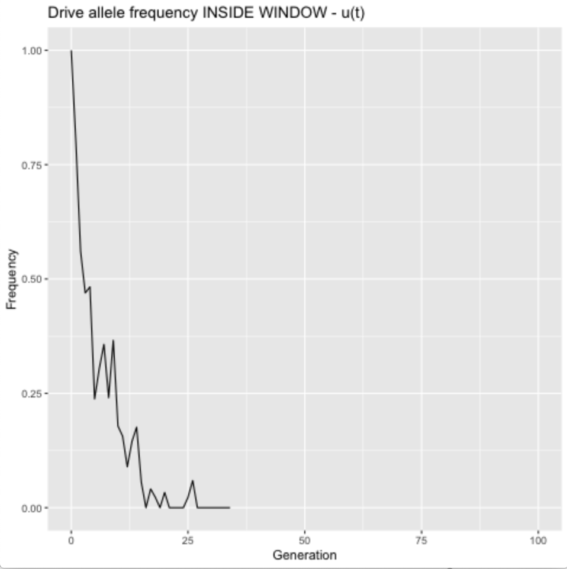
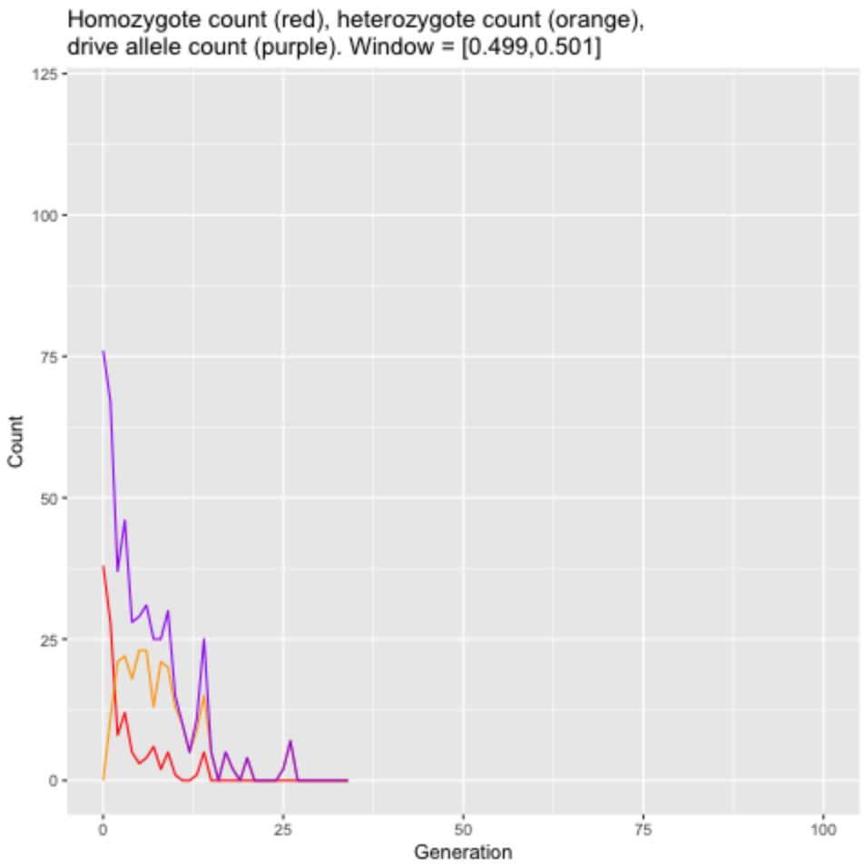
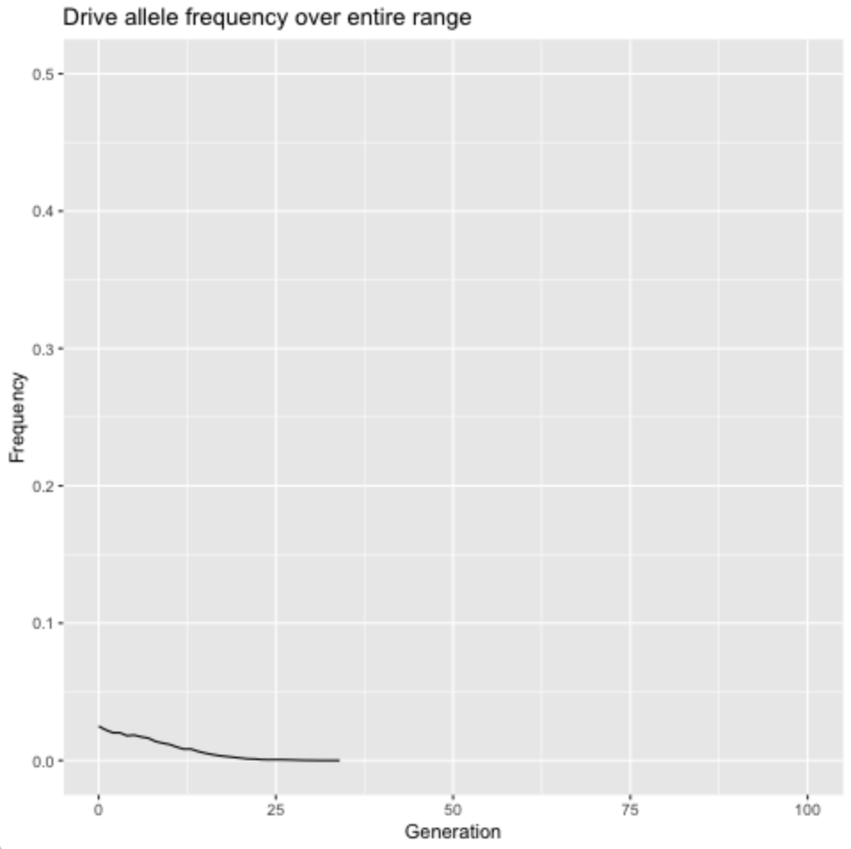
```

### a=0.0694

```{r eval=F}
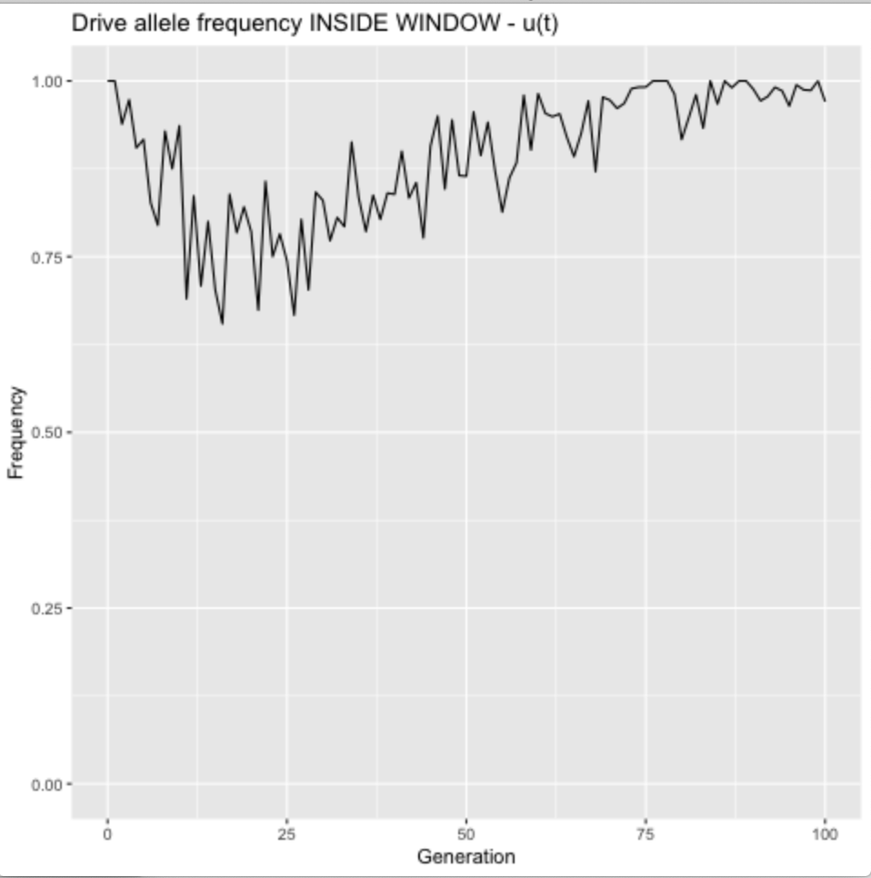
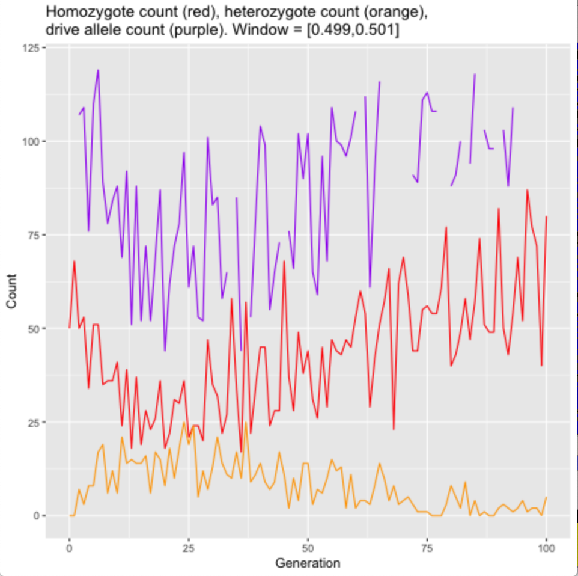
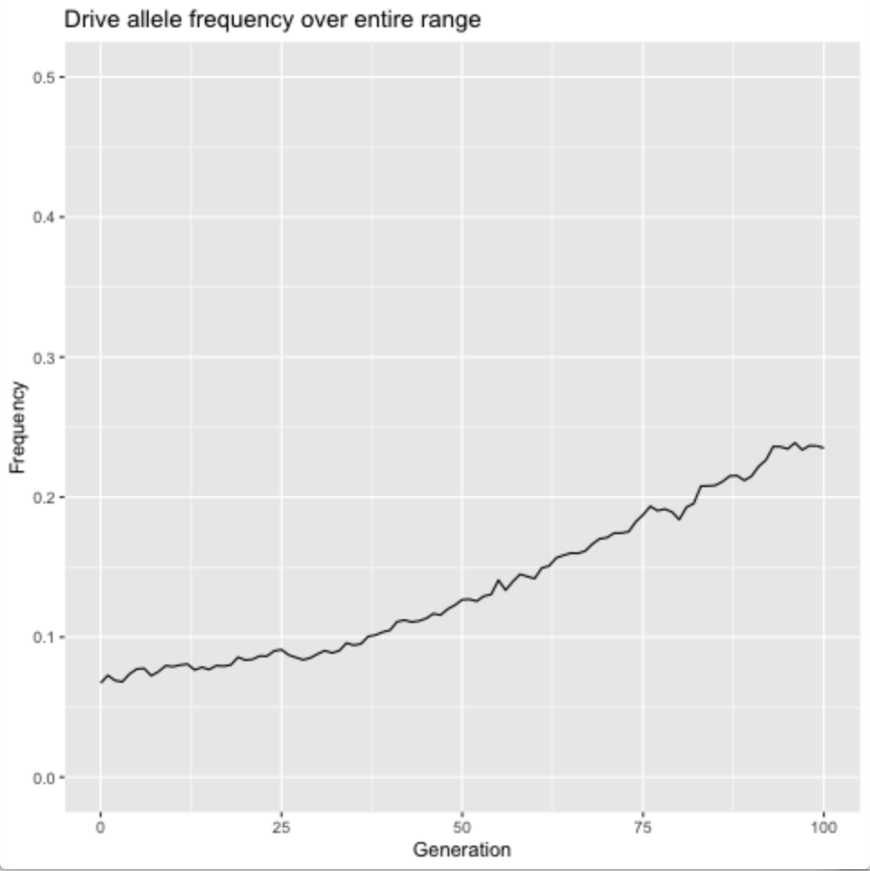
```

### a = 0.0748
```{r eval=F}
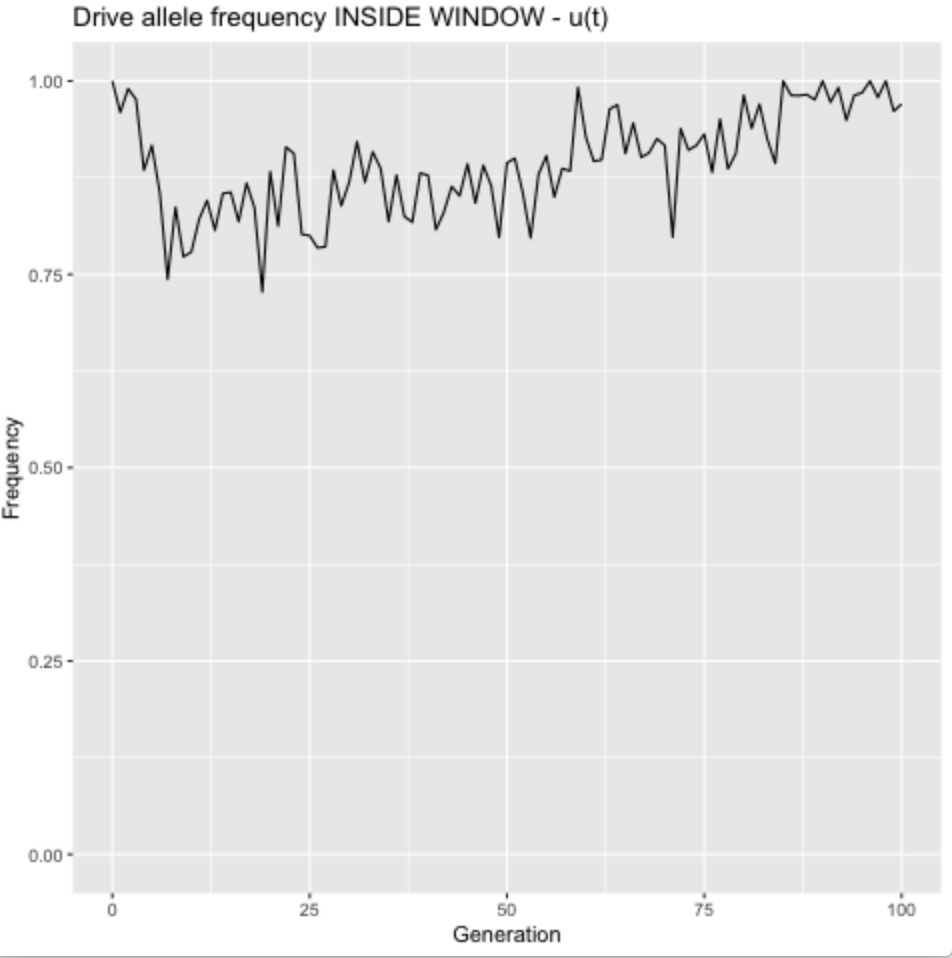
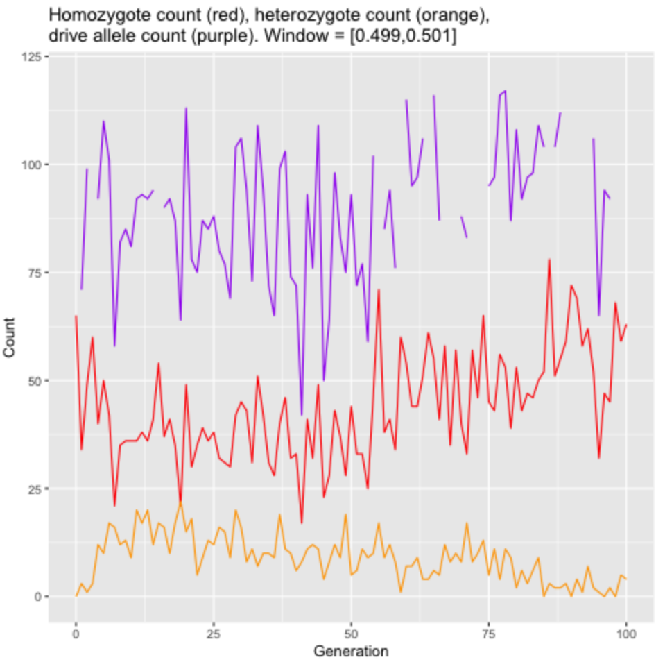
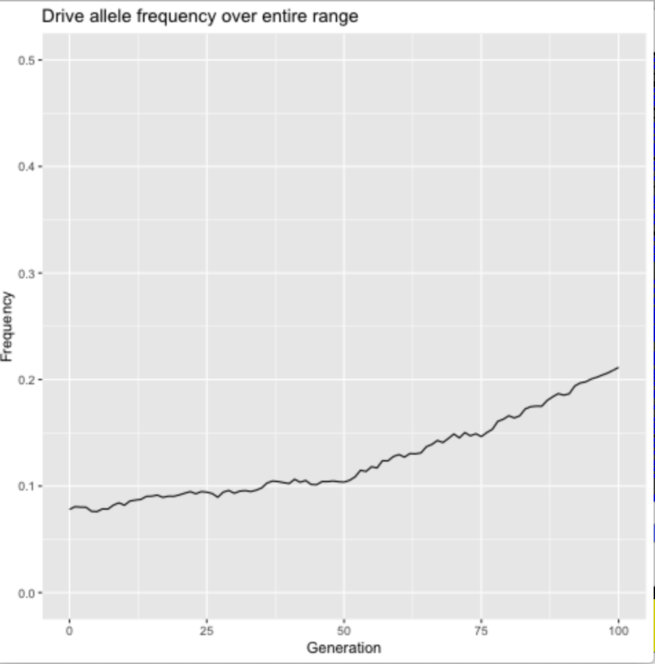
```

## Need to run more replicates to get at the underlying shape of these u(t, x=0) curves --> *cluster*

### Parameters

* Values of a:
  + a=0.025 --> P(increase) = 0.0
  + a=0.0654 --> P(increase) = 0.25
  + a=0.0694 --> P(increase) = 0.50
  + a=0.0721 --> P(increase) = 0.75
  + a=0.0748 --> P(increase) = 0.90
* 20 replicates each
* uhat = 40%
* sigma = 0.01
* k = 0.2
* m = 0.001
* N = 30,000
* window = [0.499, 0.501]

+ Resubmitted to cluster: 6:21pm 4/20
  * Output: `uhat40_april20_windowed_drive_rate_and_counts.csv`

### Results

#### Files

* Raw csv (compiled): `/Users/isabelkim/Desktop/year2/underdominance/reaction-diffusion/cluster/u_hat=0.4_run/csv_raw/new_mod/uhat40_april20_windowed_drive_rate_and_counts.csv`
* Separated files:
  + a=0.025: `/Users/isabelkim/Desktop/year2/underdominance/reaction-diffusion/cluster/u_hat=0.4_run/csv_raw/new_mod/a0.025_revised_uhat40_april20.csv`
  + a=0.0654: `/Users/isabelkim/Desktop/year2/underdominance/reaction-diffusion/cluster/u_hat=0.4_run/csv_raw/new_mod/a0.0654_revised_uhat40_april20.csv`
  + a=0.0694: `/Users/isabelkim/Desktop/year2/underdominance/reaction-diffusion/cluster/u_hat=0.4_run/csv_raw/new_mod/a0.0694_revised_uhat40_april20.csv`
  + a=0.0721: `/Users/isabelkim/Desktop/year2/underdominance/reaction-diffusion/cluster/u_hat=0.4_run/csv_raw/new_mod/a0.0721_revised_uhat40_april20.csv`
  + a=0.0748: `/Users/isabelkim/Desktop/year2/underdominance/reaction-diffusion/cluster/u_hat=0.4_run/csv_raw/new_mod/a0.0748_revised_uhat40_april20.csv`

#### a = 0.025

```{r eval=F}
fig_dir = "/Users/isabelkim/Desktop/year2/underdominance/reaction-diffusion/cluster/u_hat=0.4_run/figures/new_mod/"
library(tidyverse)
file = "/Users/isabelkim/Desktop/year2/underdominance/reaction-diffusion/cluster/u_hat=0.4_run/csv_raw/new_mod/a0.025_revised_uhat40_april20.csv"

data = read_csv(file) %>% mutate(replicate = as.factor(replicate + 1))

rate_dr_all_replicates = ggplot(data = data, mapping = aes(x=gen,y=windowed_drive_rate, color = replicate)) + geom_line() + xlab("Gens since release") + ylab("Rate") + ggtitle("a = 0.025 - drive rate in [0.499,0.501] window")

# Group by generation, then average over the replicates
gens = c(min(data$gen):max(data$gen))
n = length(gens)
a_vector = rep(0.025, n)
overall_d_count_vector = rep(-1, n)
overall_d_rate_vector = rep(-1,n)
windowed_d_count_vector = rep(-1,n)
windowed_dd_count_vector = rep(-1,n)
windowed_dwt_count_vector = rep(-1,n)
windowed_drive_rate_vector = rep(-1,n)
for (i in 1:n){
  generation = gens[i]
  all_rows = data %>% filter(gen == generation)
  overall_d_count_vector[i] = mean(all_rows$overall_d_count)
  overall_d_rate_vector[i] = mean(all_rows$overall_d_rate)
  windowed_d_count_vector[i] = mean(all_rows$windowed_d_count)
  windowed_dd_count_vector[i] = mean(all_rows$windowed_dd_count)
  windowed_dwt_count_vector[i] = mean(all_rows$windowed_dwt_count)
  windowed_drive_rate_vector[i] = mean(all_rows$windowed_drive_rate)
}

replicate_summary = tibble(a = a_vector,
                           gen = gens,
                           overall_d_count = overall_d_count_vector,
                           overall_d_rate = overall_d_rate_vector,
                           windowed_d_count = windowed_d_count_vector,
                           windowed_dd_count = windowed_dd_count_vector,
                           windowed_dwt_count = windowed_dwt_count_vector,
                           windowed_drive_rate = windowed_drive_rate_vector)
#write_csv(x = replicate_summary, file = "/Users/isabelkim/Desktop/year2/underdominance/reaction-diffusion/cluster/u_hat=0.4_run/csv_raw/new_mod/a0.025_revised_uhat40_april22_replicate_summary.csv")

rp = ggplot(data = replicate_summary, aes(x=gen, y = windowed_drive_rate)) + geom_line(color = "red") + xlab("Generations since release") + ylab("Drive rate within [0.499, 0.501]") + ggtitle("a = 0.025")

#ggsave(plot = rp,filename = paste0(fig_dir, "a=0.025_uhat40_windowed_drive_rate_averaged.png"))

#ggsave(filename = paste0(fig_dir, "a=0.025_uhat40_windowed_drive_rate_all_replicates.png"), plot  = rate_dr_all_replicates)
```

```{r}
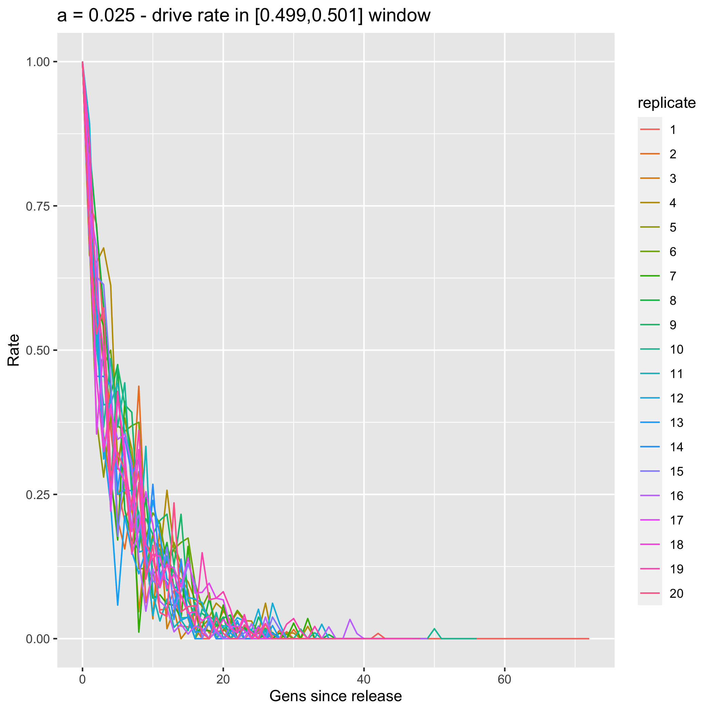
```

Rapid decrease.

##### Averaged a = 0.025 plot
```{r}
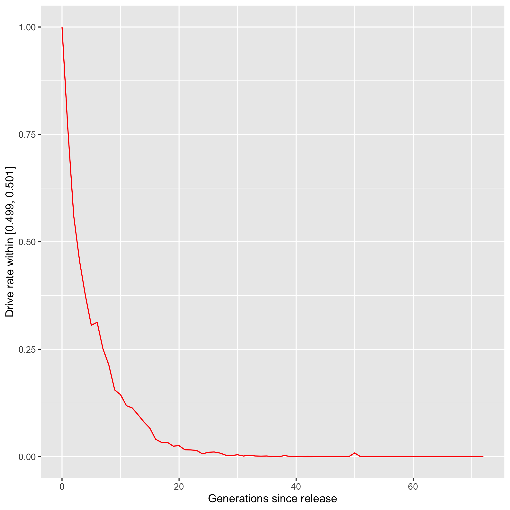
```

#### a = 0.0654
```{r eval=F}
a = 0.0654

file = paste0("/Users/isabelkim/Desktop/year2/underdominance/reaction-diffusion/cluster/u_hat=0.4_run/csv_raw/new_mod/a",a,"_revised_uhat40_april20.csv")

data = read_csv(file,col_names = c("a","replicate","gen","overall_d_count", "overall_d_rate", "windowed_d_count", "windowed_dd_count", "windowed_dwt_count", "windowed_drive_rate")) %>% mutate(replicate = as.factor(replicate + 1))

rate_dr_all_replicates = ggplot(data = data, mapping = aes(x=gen,y=windowed_drive_rate, color = replicate)) + geom_line() + xlab("Gens since release") + ylab("Rate") + ggtitle(paste0("a = ",a," - drive rate in [0.499,0.501] window"))

#ggsave(filename = paste0(fig_dir, "a=",a,"_uhat40_windowed_drive_rate_all_replicates.png"), plot  = rate_dr_all_replicates)

# Zoom in on replicate 10 and replicate 9
data_filter = data %>% filter(replicate %in% c(9,10))

rep_9_10_plot = ggplot(data = data_filter, mapping = aes(x=gen,y=windowed_drive_rate, color = replicate)) + geom_line() + xlab("Gens since release") + ylab("Rate") + ggtitle(paste0("a = ",a," - drive rate in [0.499,0.501] window - \nreplicates 9 and 10 only"))

#ggsave(filename = paste0(fig_dir, "a=",a,"_uhat40_windowed_drive_rate_replicate_9_and_10.png"), plot  = rep_9_10_plot)
# Group by generation, then average over the replicates
gens = c(min(data$gen):max(data$gen))
n = length(gens)
a_vector = rep(0.0654, n)
overall_d_count_vector = rep(-1, n)
overall_d_rate_vector = rep(-1,n)
windowed_d_count_vector = rep(-1,n)
windowed_dd_count_vector = rep(-1,n)
windowed_dwt_count_vector = rep(-1,n)
windowed_drive_rate_vector = rep(-1,n)
for (i in 1:n){
  generation = gens[i]
  all_rows = data %>% filter(gen == generation)
  overall_d_count_vector[i] = mean(all_rows$overall_d_count)
  overall_d_rate_vector[i] = mean(all_rows$overall_d_rate)
  windowed_d_count_vector[i] = mean(all_rows$windowed_d_count)
  windowed_dd_count_vector[i] = mean(all_rows$windowed_dd_count)
  windowed_dwt_count_vector[i] = mean(all_rows$windowed_dwt_count)
  windowed_drive_rate_vector[i] = mean(all_rows$windowed_drive_rate)
}

replicate_summary = tibble(a = a_vector,
                           gen = gens,
                           overall_d_count = overall_d_count_vector,
                           overall_d_rate = overall_d_rate_vector,
                           windowed_d_count = windowed_d_count_vector,
                           windowed_dd_count = windowed_dd_count_vector,
                           windowed_dwt_count = windowed_dwt_count_vector,
                           windowed_drive_rate = windowed_drive_rate_vector)
#write_csv(x = replicate_summary, file = "/Users/isabelkim/Desktop/year2/underdominance/reaction-diffusion/cluster/u_hat=0.4_run/csv_raw/new_mod/a0.0654_revised_uhat40_april22_replicate_summary.csv")

rp = ggplot(data = replicate_summary, aes(x=gen, y = windowed_drive_rate)) + geom_line(color = "red") + xlab("Generations since release") + ylab("Drive rate within [0.499, 0.501]") + ggtitle("a = 0.0654") + ylim(0,1)

ggsave(plot = rp,filename = paste0(fig_dir, "a=0.0654_uhat40_windowed_drive_rate_averaged.png"))
```

all replicates
```{r}
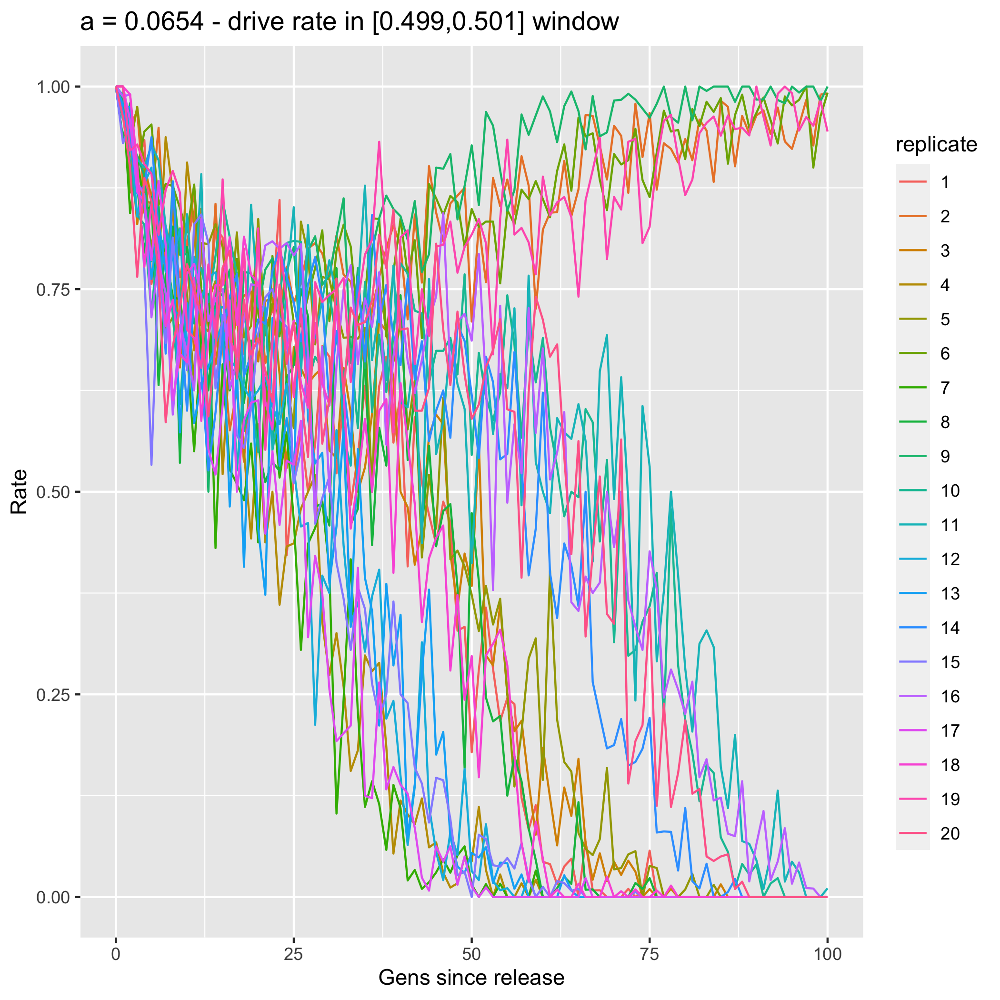
```

only replicates 9 and 10 (1 increases and 1 decreases)
```{r}
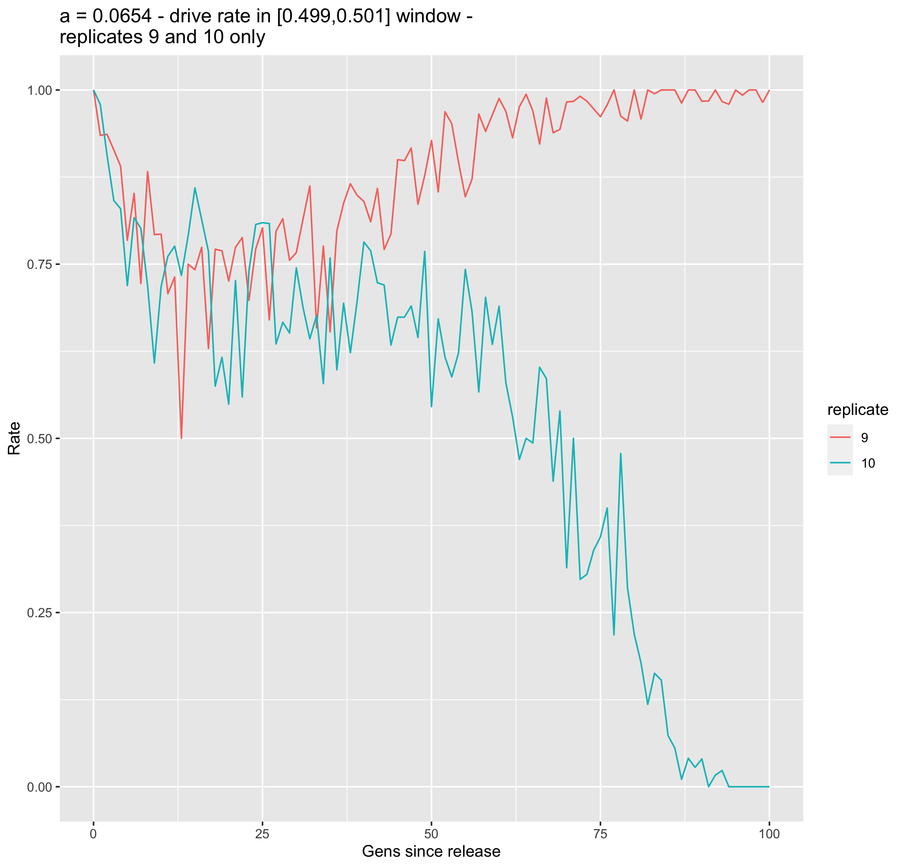
```

##### Average plot for a = 0.0654
```{r}
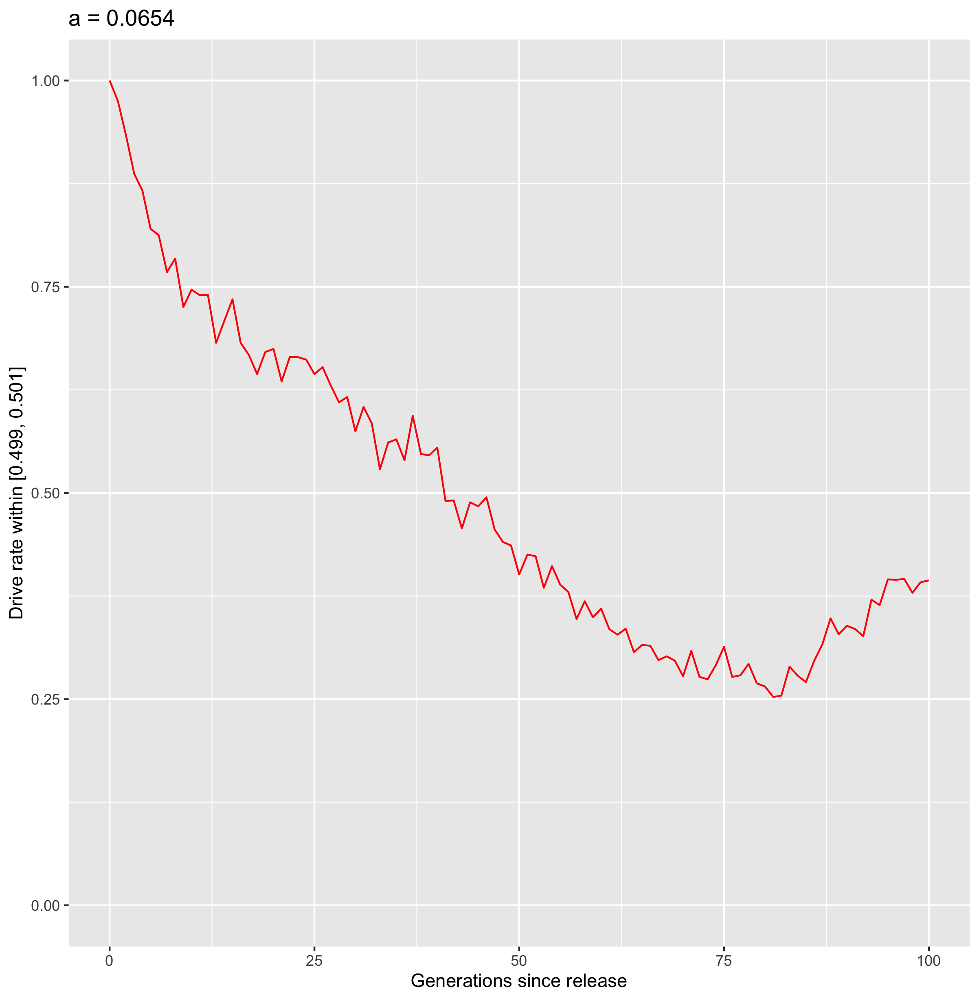
```


#### a = 0.0694
```{r eval=F}
a = 0.0694

file = paste0("/Users/isabelkim/Desktop/year2/underdominance/reaction-diffusion/cluster/u_hat=0.4_run/csv_raw/new_mod/a",a,"_revised_uhat40_april20.csv")

data = read_csv(file,col_names = c("a","replicate","gen","overall_d_count", "overall_d_rate", "windowed_d_count", "windowed_dd_count", "windowed_dwt_count", "windowed_drive_rate")) %>% mutate(replicate = as.factor(replicate + 1))

rate_dr_all_replicates = ggplot(data = data, mapping = aes(x=gen,y=windowed_drive_rate, color = replicate)) + geom_line() + xlab("Gens since release") + ylab("Rate") + ggtitle(paste0("a = ",a," - drive rate in [0.499,0.501] window"))

# 5,6,13
data_filter = data %>% filter(replicate %in% c(5,6,13))

reps_plot = ggplot(data = data_filter, mapping = aes(x=gen,y=windowed_drive_rate, color = replicate)) + geom_line() + xlab("Gens since release") + ylab("Rate") + ggtitle(paste0("a = ",a," - drive rate in [0.499,0.501] window - \nreplicates 5, 6, and 13 only"))

gens = c(min(data$gen):max(data$gen))
n = length(gens)
a_vector = rep(0.0694, n)
overall_d_count_vector = rep(-1, n)
overall_d_rate_vector = rep(-1,n)
windowed_d_count_vector = rep(-1,n)
windowed_dd_count_vector = rep(-1,n)
windowed_dwt_count_vector = rep(-1,n)
windowed_drive_rate_vector = rep(-1,n)
for (i in 1:n){
  generation = gens[i]
  all_rows = data %>% filter(gen == generation)
  overall_d_count_vector[i] = mean(all_rows$overall_d_count)
  overall_d_rate_vector[i] = mean(all_rows$overall_d_rate)
  windowed_d_count_vector[i] = mean(all_rows$windowed_d_count)
  windowed_dd_count_vector[i] = mean(all_rows$windowed_dd_count)
  windowed_dwt_count_vector[i] = mean(all_rows$windowed_dwt_count)
  windowed_drive_rate_vector[i] = mean(all_rows$windowed_drive_rate)
}

replicate_summary = tibble(a = a_vector,
                           gen = gens,
                           overall_d_count = overall_d_count_vector,
                           overall_d_rate = overall_d_rate_vector,
                           windowed_d_count = windowed_d_count_vector,
                           windowed_dd_count = windowed_dd_count_vector,
                           windowed_dwt_count = windowed_dwt_count_vector,
                           windowed_drive_rate = windowed_drive_rate_vector)
#write_csv(x = replicate_summary, file = "/Users/isabelkim/Desktop/year2/underdominance/reaction-diffusion/cluster/u_hat=0.4_run/csv_raw/new_mod/a0.0694_revised_uhat40_april22_replicate_summary.csv")

rp = ggplot(data = replicate_summary, aes(x=gen, y = windowed_drive_rate)) + geom_line(color = "red") + xlab("Generations since release") + ylab("Drive rate within [0.499, 0.501]") + ggtitle("a = 0.0694") + ylim(0,1)

#ggsave(plot = rp,filename = paste0(fig_dir, "a=0.0694_uhat40_windowed_drive_rate_averaged.png"))

#ggsave(filename = paste0(fig_dir, "a=",a,"_uhat40_windowed_drive_rate_replicates_5_6_13.png"), plot  = reps_plot)
```

all replicates
```{r}
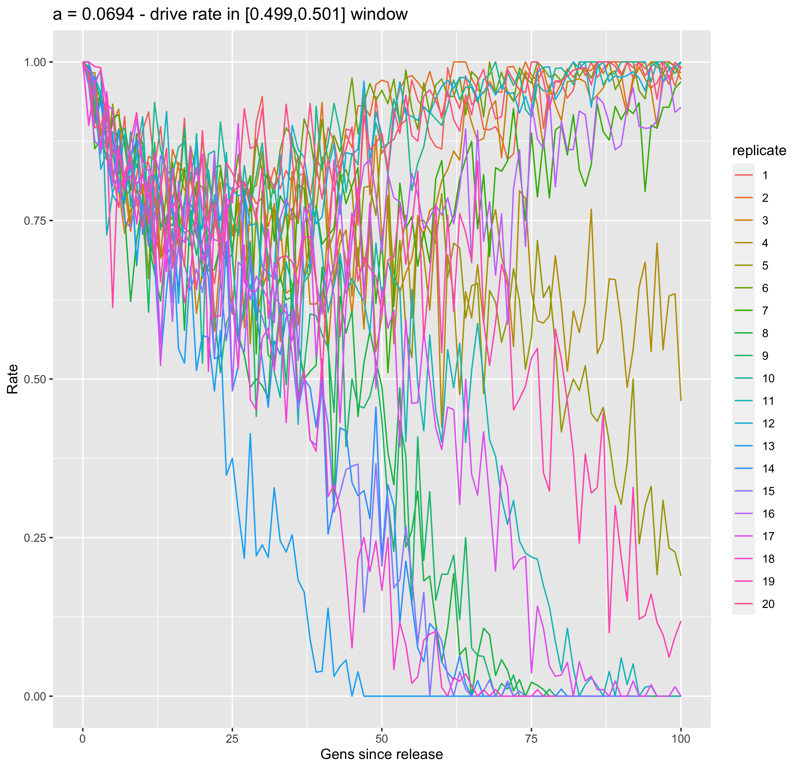
```

only replicates 5,6,13 
```{r}
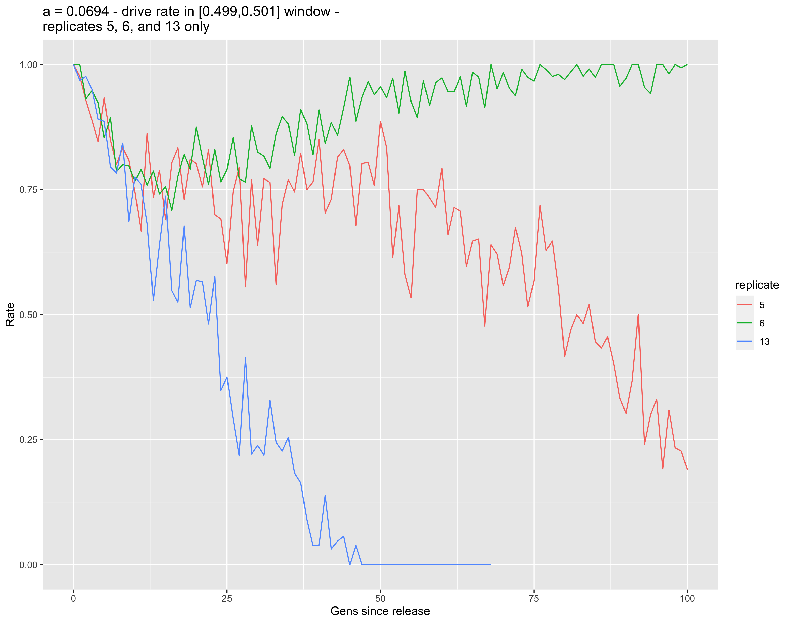
```

##### Average plot for a=0.0694
```{r}
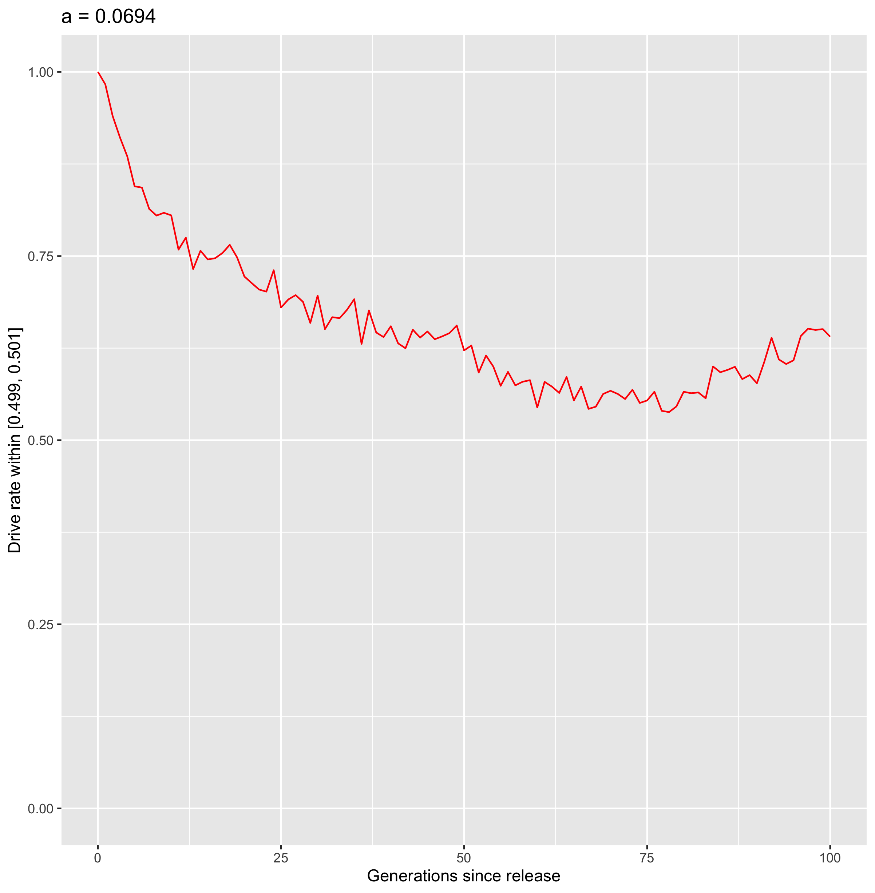
```


#### a = 0.0721
```{r eval=F}
a = 0.0721

file = paste0("/Users/isabelkim/Desktop/year2/underdominance/reaction-diffusion/cluster/u_hat=0.4_run/csv_raw/new_mod/a",a,"_revised_uhat40_april20.csv")

data = read_csv(file,col_names = c("a","replicate","gen","overall_d_count", "overall_d_rate", "windowed_d_count", "windowed_dd_count", "windowed_dwt_count", "windowed_drive_rate")) %>% mutate(replicate = as.factor(replicate + 1))

rate_dr_all_replicates = ggplot(data = data, mapping = aes(x=gen,y=windowed_drive_rate, color = replicate)) + geom_line() + xlab("Gens since release") + ylab("Rate") + ggtitle(paste0("a = ",a," - drive rate in [0.499,0.501] window"))

#ggsave(filename = paste0(fig_dir, "a=",a,"_uhat40_windowed_drive_rate_all_replicates.png"), plot  = rate_dr_all_replicates)

# examine only the replicates where the drive ultimately went to fixation
drive_wins = data %>% filter(replicate %in% c(1,3,4,5,6,7))

dw = ggplot(data = drive_wins, mapping = aes(x=gen,y=windowed_drive_rate, color = replicate)) + geom_line() + xlab("Gens since release") + ylab("Rate") + ggtitle(paste0("a = ",a," - drive rate in [0.499,0.501] window - \nreplicates 1,3,4,5,6,7 only")) + ylim(0,1)


#ggsave(filename = paste0(fig_dir, "a=",a,"_uhat40_windowed_drive_rate_replicates_that_win.png"), plot  = dw)

gens = c(min(data$gen):max(data$gen))
n = length(gens)
a_vector = rep(0.0721, n)
overall_d_count_vector = rep(-1, n)
overall_d_rate_vector = rep(-1,n)
windowed_d_count_vector = rep(-1,n)
windowed_dd_count_vector = rep(-1,n)
windowed_dwt_count_vector = rep(-1,n)
windowed_drive_rate_vector = rep(-1,n)
for (i in 1:n){
  generation = gens[i]
  all_rows = data %>% filter(gen == generation)
  overall_d_count_vector[i] = mean(all_rows$overall_d_count)
  overall_d_rate_vector[i] = mean(all_rows$overall_d_rate)
  windowed_d_count_vector[i] = mean(all_rows$windowed_d_count)
  windowed_dd_count_vector[i] = mean(all_rows$windowed_dd_count)
  windowed_dwt_count_vector[i] = mean(all_rows$windowed_dwt_count)
  windowed_drive_rate_vector[i] = mean(all_rows$windowed_drive_rate)
}

replicate_summary = tibble(a = a_vector,
                           gen = gens,
                           overall_d_count = overall_d_count_vector,
                           overall_d_rate = overall_d_rate_vector,
                           windowed_d_count = windowed_d_count_vector,
                           windowed_dd_count = windowed_dd_count_vector,
                           windowed_dwt_count = windowed_dwt_count_vector,
                           windowed_drive_rate = windowed_drive_rate_vector)
#write_csv(x = replicate_summary, file = "/Users/isabelkim/Desktop/year2/underdominance/reaction-diffusion/cluster/u_hat=0.4_run/csv_raw/new_mod/a0.0721_revised_uhat40_april22_replicate_summary.csv")

rp = ggplot(data = replicate_summary, aes(x=gen, y = windowed_drive_rate)) + geom_line(color = "red") + xlab("Generations since release") + ylab("Drive rate within [0.499, 0.501]") + ggtitle("a = 0.0721") + ylim(0,1)

#ggsave(plot = rp,filename = paste0(fig_dir, "a=0.0721_uhat40_windowed_drive_rate_averaged.png"))

```

all replicates
```{r}
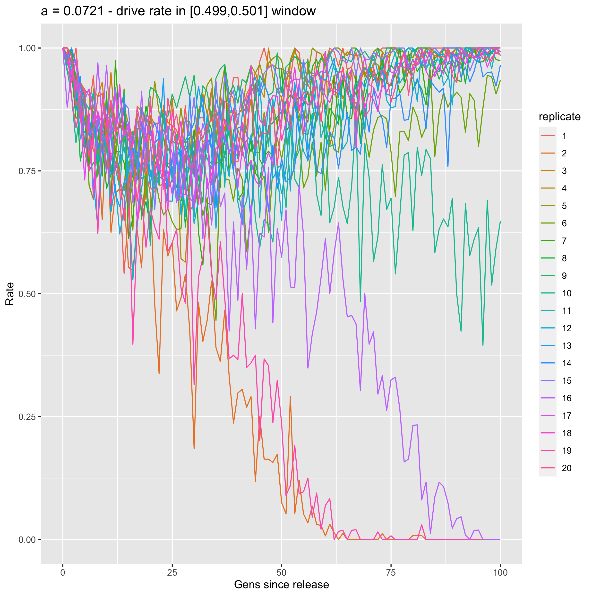
```

only replicates where the drive succeeded
```{r}
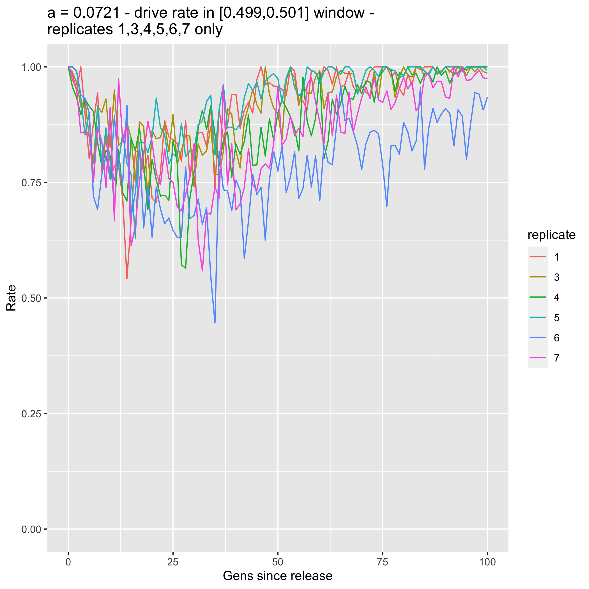
```

##### Average plot for a = 0.0721
```{r}
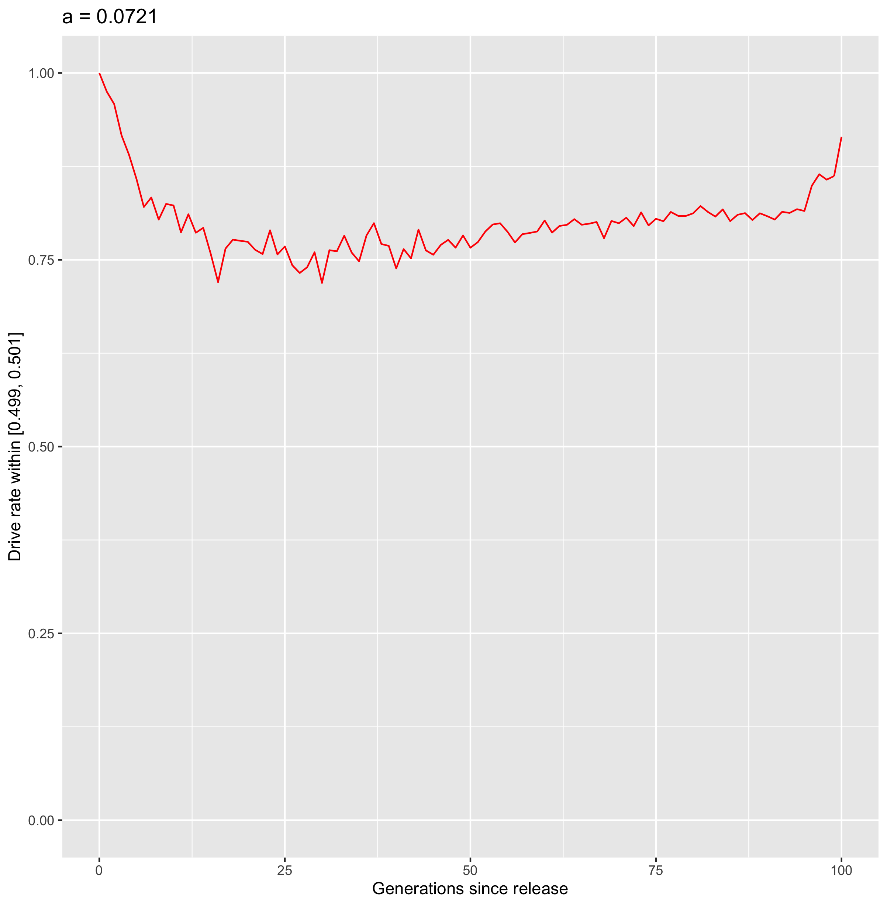
```

#### a = 0.0748
```{r eval=F}
a = 0.0748

file = paste0("/Users/isabelkim/Desktop/year2/underdominance/reaction-diffusion/cluster/u_hat=0.4_run/csv_raw/new_mod/a",a,"_revised_uhat40_april20.csv")

data = read_csv(file,col_names = c("a","replicate","gen","overall_d_count", "overall_d_rate", "windowed_d_count", "windowed_dd_count", "windowed_dwt_count", "windowed_drive_rate")) %>% mutate(replicate = as.factor(replicate + 1))

rate_dr_all_replicates = ggplot(data = data, mapping = aes(x=gen,y=windowed_drive_rate, color = replicate)) + geom_line() + xlab("Gens since release") + ylab("Rate") + ggtitle(paste0("a = ",a," - drive rate in [0.499,0.501] window"))

#ggsave(filename = paste0(fig_dir, "a=",a,"_uhat40_windowed_drive_rate_all_replicates.png"), plot  = rate_dr_all_replicates)

# a handful of replicates that increased
few_reps = data %>% filter(replicate %in% c(1,16,20))

frp = ggplot(data = few_reps, mapping = aes(x=gen,y=windowed_drive_rate, color = replicate)) + geom_line() + xlab("Gens since release") + ylab("Rate") + ggtitle(paste0("a = ",a," - drive rate in [0.499,0.501] window - \nreplicates 1,16, and 20")) + ylim(0,1)

#ggsave(filename = paste0(fig_dir, "a=",a,"_uhat40_windowed_drive_rate_replicates_1_16_20.png"), plot  = frp)

gens = c(min(data$gen):max(data$gen))
n = length(gens)
a_vector = rep(0.0748, n)
overall_d_count_vector = rep(-1, n)
overall_d_rate_vector = rep(-1,n)
windowed_d_count_vector = rep(-1,n)
windowed_dd_count_vector = rep(-1,n)
windowed_dwt_count_vector = rep(-1,n)
windowed_drive_rate_vector = rep(-1,n)
for (i in 1:n){
  generation = gens[i]
  all_rows = data %>% filter(gen == generation)
  overall_d_count_vector[i] = mean(all_rows$overall_d_count)
  overall_d_rate_vector[i] = mean(all_rows$overall_d_rate)
  windowed_d_count_vector[i] = mean(all_rows$windowed_d_count)
  windowed_dd_count_vector[i] = mean(all_rows$windowed_dd_count)
  windowed_dwt_count_vector[i] = mean(all_rows$windowed_dwt_count)
  windowed_drive_rate_vector[i] = mean(all_rows$windowed_drive_rate)
}

replicate_summary = tibble(a = a_vector,
                           gen = gens,
                           overall_d_count = overall_d_count_vector,
                           overall_d_rate = overall_d_rate_vector,
                           windowed_d_count = windowed_d_count_vector,
                           windowed_dd_count = windowed_dd_count_vector,
                           windowed_dwt_count = windowed_dwt_count_vector,
                           windowed_drive_rate = windowed_drive_rate_vector)
#write_csv(x = replicate_summary, file = "/Users/isabelkim/Desktop/year2/underdominance/reaction-diffusion/cluster/u_hat=0.4_run/csv_raw/new_mod/a0.0748_revised_uhat40_april22_replicate_summary.csv")

rp = ggplot(data = replicate_summary, aes(x=gen, y = windowed_drive_rate)) + geom_line(color = "red") + xlab("Generations since release") + ylab("Drive rate within [0.499, 0.501]") + ggtitle("a = 0.0748") + ylim(0,1)

#ggsave(plot = rp,filename = paste0(fig_dir, "a=0.0748_uhat40_windowed_drive_rate_averaged.png"))

```

all replicates
```{r}
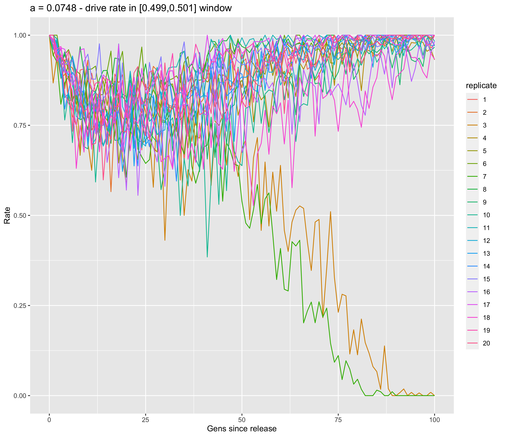
```

a few replicates where the drive succeeds
```{r}
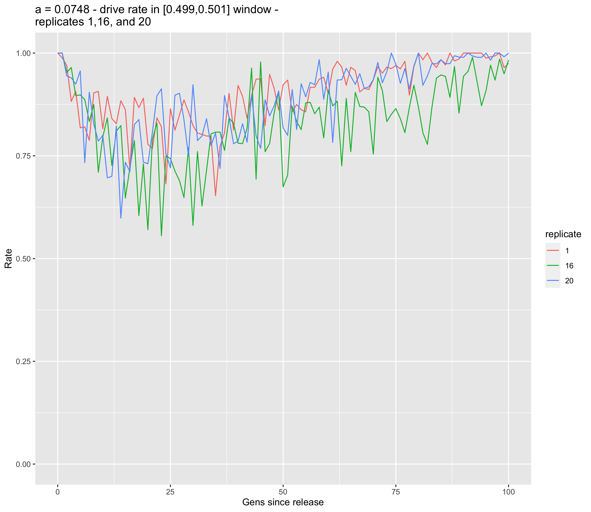
```

##### Average replicate plot for a = 0.0748
```{r}
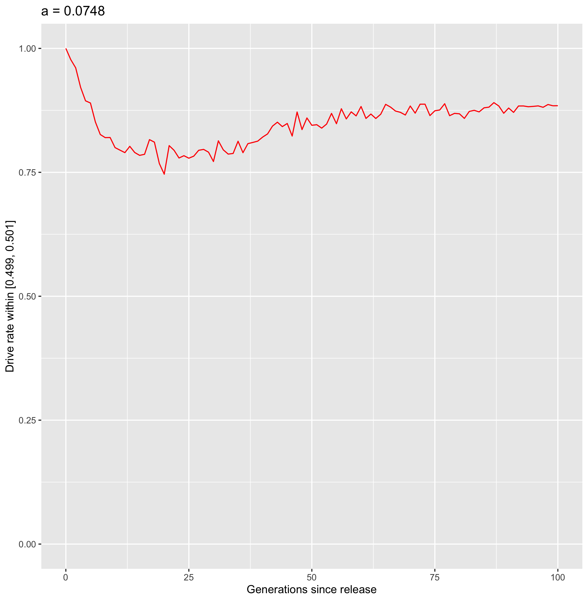
```