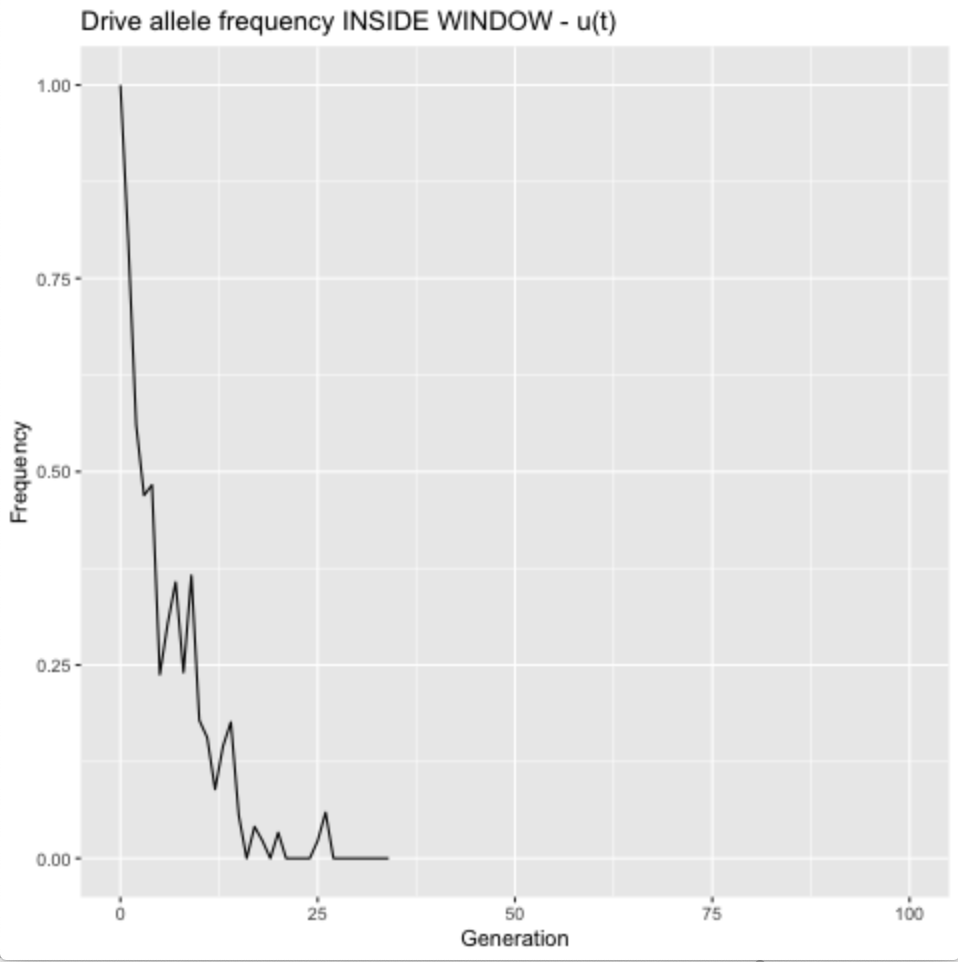
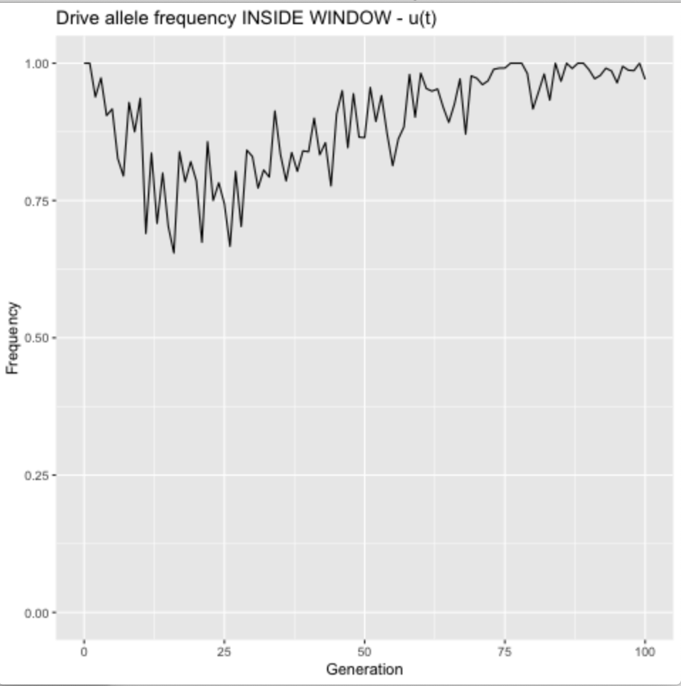
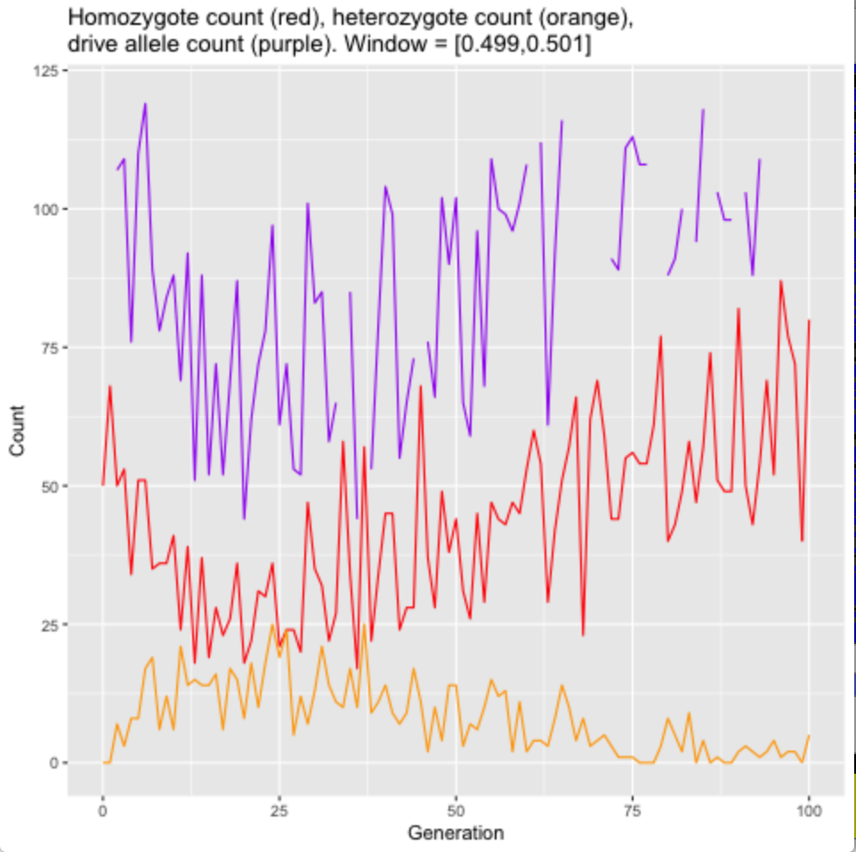
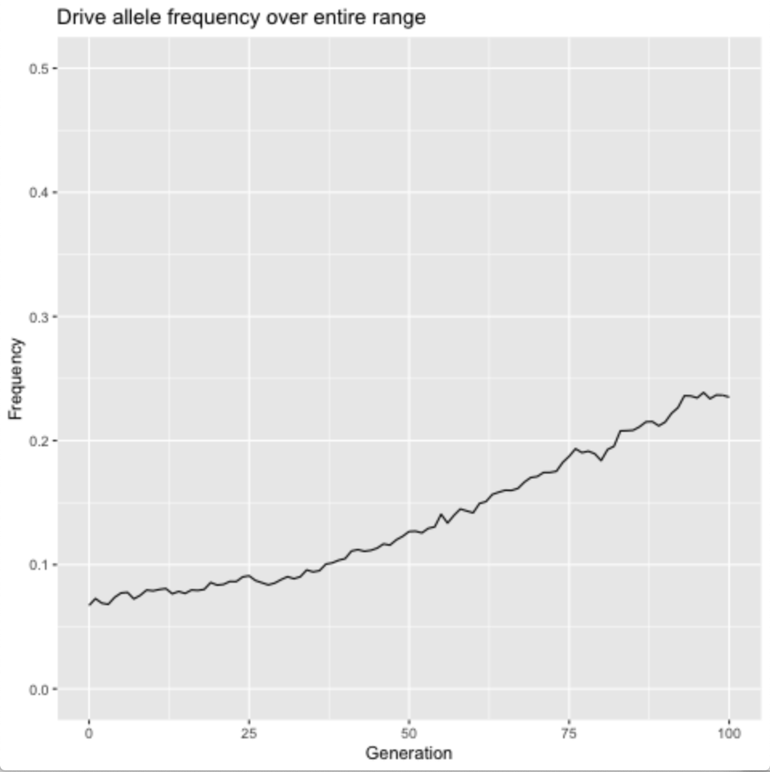
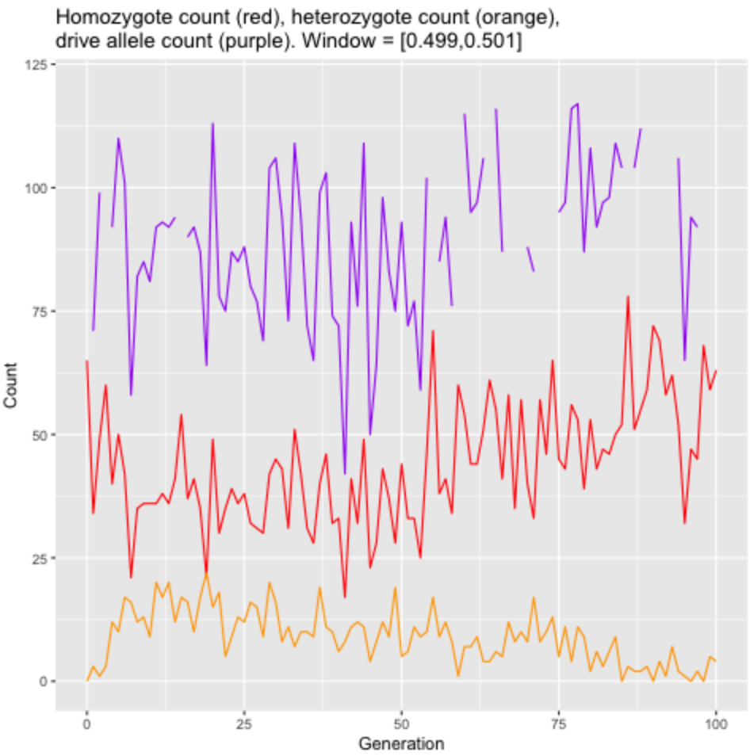
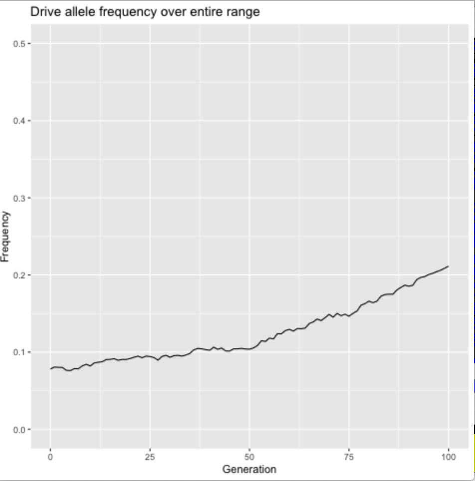

```{r setup, include=FALSE}
knitr::opts_chunk$set(echo = TRUE)
```

## a = 0.025

```{r}

knitr::include_graphics("./window_testing/live-plots/a=0.025_allele_counts.png")
knitr::include_graphics("./window_testing/live-plots/a=0.025_overall_drive_rate.png")
```

## a=0.0694

```{r}



```

## a = 0.0748
```{r}
knitr::include_graphics("./window_testing/live-plots/a=0.0748_drive_rate_in_window.png")


```