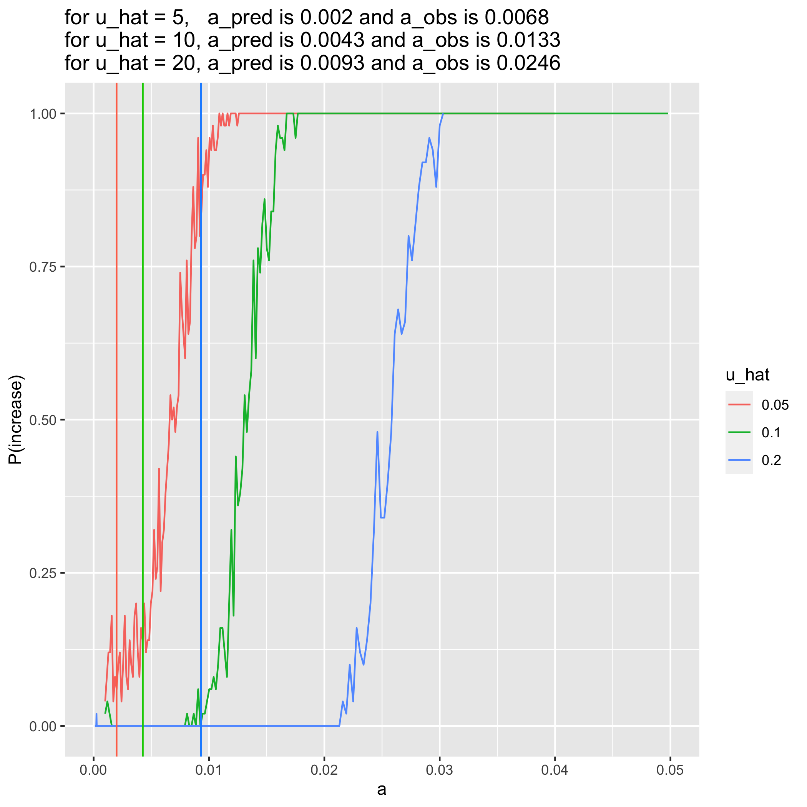
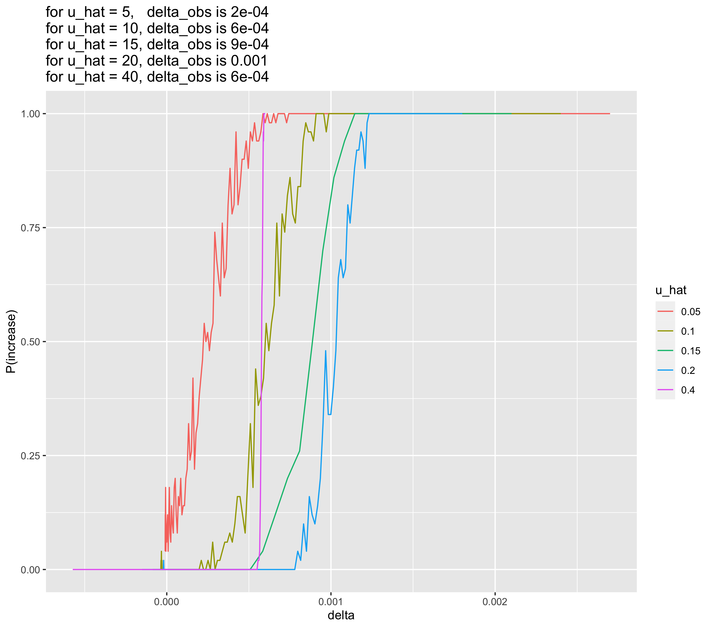
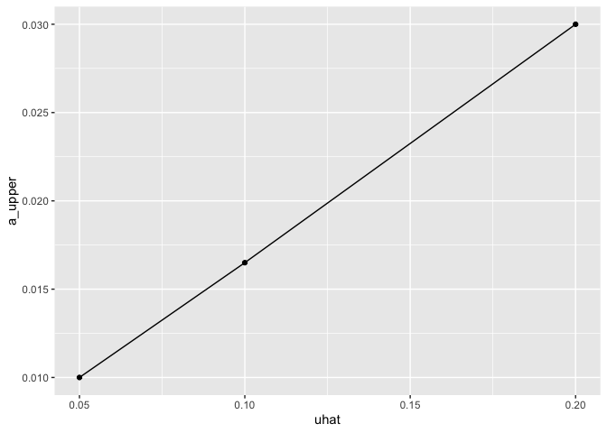
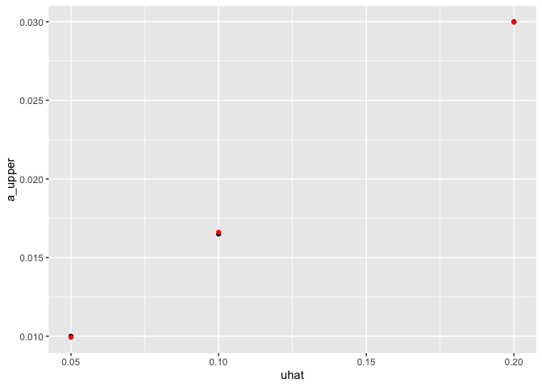
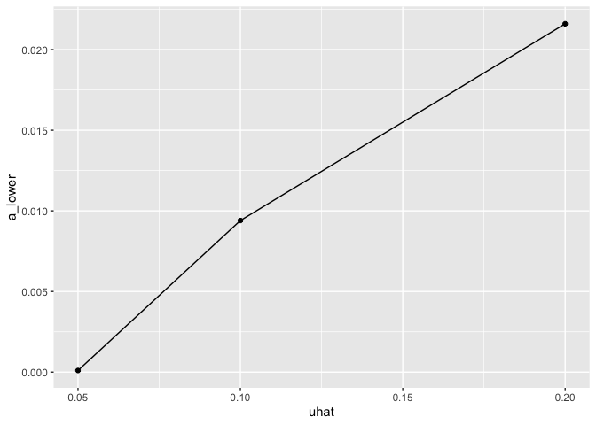
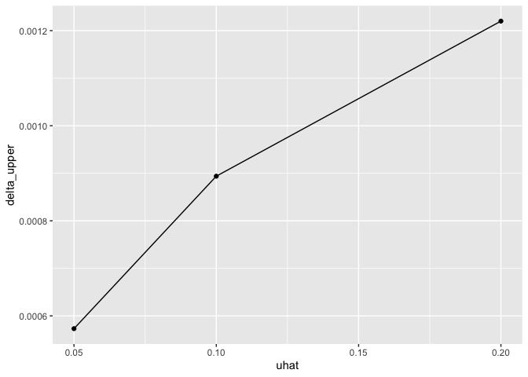
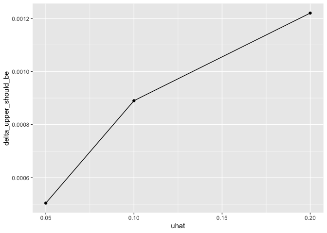

uhat=20, 10, and 5% comparison after debugging + wt gens
================
Isabel Kim
4/12/2022

## Compile csvs

``` r
library(tidyverse)
```

    ## ── Attaching packages ─────────────────────────────────────── tidyverse 1.3.1 ──

    ## ✓ ggplot2 3.3.5     ✓ purrr   0.3.4
    ## ✓ tibble  3.1.6     ✓ dplyr   1.0.8
    ## ✓ tidyr   1.2.0     ✓ stringr 1.4.0
    ## ✓ readr   2.1.2     ✓ forcats 0.5.1

    ## ── Conflicts ────────────────────────────────────────── tidyverse_conflicts() ──
    ## x dplyr::filter() masks stats::filter()
    ## x dplyr::lag()    masks stats::lag()

``` r
source("/Users/isabelkim/Desktop/year2/underdominance/reaction-diffusion/cluster/plotting_functions.R")

summary_u20 = read_csv("/Users/isabelkim/Desktop/year2/underdominance/reaction-diffusion/cluster/u_hat=0.2_run/csvs/summary_april11_full_range_uhat20.csv")
```

    ## Rows: 150 Columns: 6

    ## ── Column specification ────────────────────────────────────────────────────────
    ## Delimiter: ","
    ## dbl (6): a, sigma, k, u_hat, delta, p_increase
    ## 
    ## ℹ Use `spec()` to retrieve the full column specification for this data.
    ## ℹ Specify the column types or set `show_col_types = FALSE` to quiet this message.

``` r
obs_vs_pred_u20 = get_a_pred_and_a_obs(summary_u20)

summary_u10 = read_csv("/Users/isabelkim/Desktop/year2/underdominance/reaction-diffusion/cluster/u_hat=0.1_run/csvs/summary_april11_full_range_uhat10.csv")
```

    ## Rows: 150 Columns: 6
    ## ── Column specification ────────────────────────────────────────────────────────
    ## Delimiter: ","
    ## dbl (6): a, sigma, k, u_hat, delta, p_increase
    ## 
    ## ℹ Use `spec()` to retrieve the full column specification for this data.
    ## ℹ Specify the column types or set `show_col_types = FALSE` to quiet this message.

``` r
obs_vs_pred_u10 = get_a_pred_and_a_obs(summary_u10)

summary_u5 = read_csv("/Users/isabelkim/Desktop/year2/underdominance/reaction-diffusion/cluster/u_hat=0.05_run/csvs/summary_april11_full_range_uhat5.csv")
```

    ## Rows: 150 Columns: 6
    ## ── Column specification ────────────────────────────────────────────────────────
    ## Delimiter: ","
    ## dbl (6): a, sigma, k, u_hat, delta, p_increase
    ## 
    ## ℹ Use `spec()` to retrieve the full column specification for this data.
    ## ℹ Specify the column types or set `show_col_types = FALSE` to quiet this message.

``` r
obs_vs_pred_u5 = get_a_pred_and_a_obs(summary_u5)

compiled = rbind(summary_u5,summary_u10, summary_u20)
compiled$u_hat = as.character(compiled$u_hat)
#View(compiled)

compiled$p_increase[150] = 1.0 # fix
```

## Compare a vs P(increase) graphs

``` r
compiled_plot = ggplot(data = compiled, aes(x = a, y = p_increase, color = u_hat)) +
  geom_line() +
  xlab("a") +
  ylab("P(increase)") +
  xlim(0, 0.05) +
  geom_vline(xintercept = obs_vs_pred_u5$a_pred, color = "coral1") +
  geom_vline(xintercept = obs_vs_pred_u10$a_pred, color = "green3") +
  geom_vline(xintercept = obs_vs_pred_u20$a_pred, color = "dodgerblue") +
  labs(title = paste0("for u_hat = 5,   a_pred is ", round(obs_vs_pred_u5$a_pred, 4),
                      " and a_obs is ", round(obs_vs_pred_u5$a_obs, 4),
                      "\nfor u_hat = 10, a_pred is ", round(obs_vs_pred_u10$a_pred,4), 
                      " and a_obs is ", round(obs_vs_pred_u10$a_obs, 4), 
                      "\nfor u_hat = 20, a_pred is ", round(obs_vs_pred_u20$a_pred,4), 
                      " and a_obs is ", round(obs_vs_pred_u20$a_obs,4)))

#ggsave(filename = "/Users/isabelkim/Desktop/year2/underdominance/reaction-diffusion/cluster/u_hat_comparisons/april12-a_vs_p.png",plot = compiled_plot)
```

``` r

```

<!-- -->

## Compare delta vs P(increase) graphs

``` r
compiled_delta_v_p_increase = ggplot(data = compiled, aes(x = delta, y = p_increase, color = u_hat)) +
  geom_line() +
  xlab("delta") +
  ylab("P(increase)") +
  labs(title = paste0("for u_hat = 5,   delta_obs is ", round(obs_vs_pred_u5$delta_obs, 4),
                      "\nfor u_hat = 10, delta_obs is ", round(obs_vs_pred_u10$delta_obs,4), 
                      "\nfor u_hat = 20, delta_obs is ", round(obs_vs_pred_u20$delta_obs,4)))

#ggsave(filename = "/Users/isabelkim/Desktop/year2/underdominance/reaction-diffusion/cluster/u_hat_comparisons/april12-delta_vs_p.png",plot = compiled_delta_v_p_increase)
```

``` r

```

<!-- -->

## What are the delta transition range boundaries (delta_min – below which P(increase)=0 and delta_max – above which P(increase)=1.0)?

``` r
uhat5 = compiled %>% filter(u_hat=="0.05")
uhat10 = compiled %>% filter(u_hat=="0.1")
uhat20 = compiled %>% filter(u_hat=="0.2")

# View each file
```

-   For uhat=5%, there is no delta_min because P(increase) is always >
    0, but the lowest value of delta_min=-(9.84e-06) and delta_max=
    around 0.000573111
-   For uhat=10%, delta_min = around 0.000308603 (except for some
    outliers) and delta_max = 0.000893806
-   For uhat=20%, delta_min=0.000797672 (besides the outlier at
    delta=-1.91e-5) and delta_max=0.001219991

## What are the a value transition range boundaries?

-   For uhat=5%, a_min again doesn’t really exist but the minimum ran
    here is a_min=0.0001 a_max is around 0.01
-   For uhat=10%, a_min is around 0.0094 and a_max is around 0.0165
-   For uhat=20%, a_min is around 0.0216 and a_max is around 0.03

## Plot these

### Create new data frame

``` r
uhats = c(0.05,0.1,0.2)
a_mins = c(0.0001,0.0094,0.0216)
a_maxs = c(0.01,0.0165,0.03)
delta_mins = c(-(9.84e-06), 0.000308603,0.000797672)
delta_maxs = c(0.000573111,0.000893806,0.001219991)

transitions = tibble(uhat = uhats,
                     a_lower = a_mins,
                     a_upper = a_maxs,
                     delta_lower = delta_mins,
                     delta_upper = delta_maxs)
```

### uhat vs the upper value for a (above which P(increase) is always 100%)

``` r
u_vs_a_upper = ggplot(transitions, aes(x=uhat,y=a_upper)) + geom_point() + geom_line()
u_vs_a_upper
```

<!-- -->

-   *linear* relationship between uhat and a_upper
    -   If uhat goes up by x, then the a_value should go up by mx
-   What is the equation for this line?

``` r
mod = lm(a_upper ~ uhat, data = transitions)
summary(mod)
```

    ## 
    ## Call:
    ## lm(formula = a_upper ~ uhat, data = transitions)
    ## 
    ## Residuals:
    ##          1          2          3 
    ##  7.143e-05 -1.071e-04  3.571e-05 
    ## 
    ## Coefficients:
    ##              Estimate Std. Error t value Pr(>|t|)   
    ## (Intercept) 0.0032500  0.0001637   19.86   0.0320 * 
    ## uhat        0.1335714  0.0012372  107.97   0.0059 **
    ## ---
    ## Signif. codes:  0 '***' 0.001 '**' 0.01 '*' 0.05 '.' 0.1 ' ' 1
    ## 
    ## Residual standard error: 0.0001336 on 1 degrees of freedom
    ## Multiple R-squared:  0.9999, Adjusted R-squared:  0.9998 
    ## F-statistic: 1.166e+04 on 1 and 1 DF,  p-value: 0.005896

a_upper = 0.0032500 + 0.1335714(uhat)

``` r
predicted_a_upper = 0.0032500 + (0.1335714*transitions$uhat)

transitions_edit = transitions %>% add_column(predicted_a_upper)

plot = ggplot(transitions_edit) + geom_point(aes(x=uhat,y=a_upper),color="black") + geom_point(aes(x=uhat,y=predicted_a_upper),color="red")

plot
```

<!-- -->
\* Wonder if we can use this equation.

### uhat vs the lower value for a (below which P(increase) is always 100%)

``` r
u_vs_a_lower = ggplot(transitions_edit, aes(x=uhat,y=a_lower)) + geom_point() + geom_line()

u_vs_a_lower
```

<!-- -->
Not as linear, but there’s probably some error in the a_min for uhat=5%.

### uhat vs delta_upper

``` r
u_vs_delta_upper = ggplot(transitions_edit, aes(x=uhat,y=delta_upper)) + geom_point() + geom_line()

u_vs_delta_upper
```

<!-- -->
Also not very informative

But delta_upper should be intrinsically linked to a_upper.

``` r
source("/Users/isabelkim/Desktop/year2/underdominance/reaction-diffusion/scripts/auc-equations.R")

delta_upper_should_be = rep(-1,3)
for (i in 1:3){
  delta_upper_should_be[i] = factored_delta(a=transitions_edit$a_upper[i],
                                            b = 1,
                                            sigma=0.01,
                                            k=0.2,
                                            uhat = transitions_edit$uhat[i])
}

transitions_edit2 = transitions_edit %>% add_column(delta_upper_should_be=delta_upper_should_be)

u_vs_delta_upper_edit = ggplot(transitions_edit2, aes(x=uhat,y=delta_upper_should_be)) + geom_point() + geom_line()


u_vs_delta_upper_edit
```

<!-- -->
\* Would be useful to run uhat=15%. \* Still not linear?
