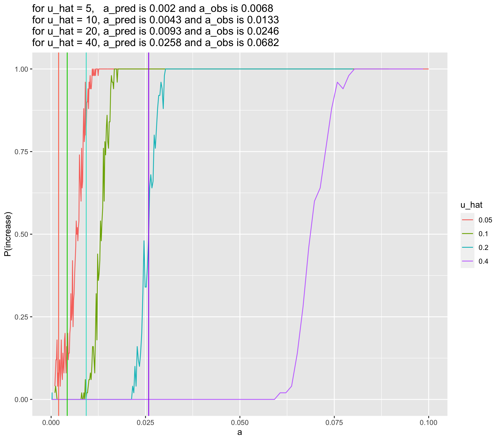

```{r setup, include=FALSE}
knitr::opts_chunk$set(echo = TRUE)
```

## Compile csvs
```{r eval=F}
library(tidyverse)
source("/Users/isabelkim/Desktop/year2/underdominance/reaction-diffusion/cluster/plotting_functions.R")

summary_u40 = read_csv("/Users/isabelkim/Desktop/year2/underdominance/reaction-diffusion/cluster/u_hat=0.4_run/csvs/summary_april12_full_range_uhat40.csv")
obs_vs_pred_u40 = get_a_pred_and_a_obs(summary_u40)

summary_u20 = read_csv("/Users/isabelkim/Desktop/year2/underdominance/reaction-diffusion/cluster/u_hat=0.2_run/csvs/summary_april11_full_range_uhat20.csv")
obs_vs_pred_u20 = get_a_pred_and_a_obs(summary_u20)

summary_u15 = read_csv("/Users/isabelkim/Desktop/year2/underdominance/reaction-diffusion/cluster/u_hat=0.15_run/csvs/summary_april13_full_range_uhat15.csv")
obs_vs_pred_u15 = get_a_pred_and_a_obs(summary_u15)
# adjust
obs_vs_pred_u15$a_pred = 0.006154545
obs_vs_pred_u15$delta_pred = -0.000017000
obs_vs_pred_u15$index_of_pred = 7

summary_u10 = read_csv("/Users/isabelkim/Desktop/year2/underdominance/reaction-diffusion/cluster/u_hat=0.1_run/csvs/summary_april11_full_range_uhat10.csv")
obs_vs_pred_u10 = get_a_pred_and_a_obs(summary_u10)

summary_u5 = read_csv("/Users/isabelkim/Desktop/year2/underdominance/reaction-diffusion/cluster/u_hat=0.05_run/csvs/summary_april11_full_range_uhat5.csv")
obs_vs_pred_u5 = get_a_pred_and_a_obs(summary_u5)

compiled = rbind(summary_u5,summary_u10,summary_u15,summary_u20,summary_u40)
compiled$u_hat = as.character(compiled$u_hat)
View(compiled)
```

## Compare a vs P(increase) graphs
```{r eval=F}
compiled_plot = ggplot(data = compiled, aes(x = a, y = p_increase, color = u_hat)) +
  geom_line() +
  xlab("a") +
  ylab("P(increase)") +
  xlim(0, 0.1) +
  labs(title = paste0("for u_hat = 5,   a_pred is ", round(obs_vs_pred_u5$a_pred, 4),
                      " and a_obs is ", round(obs_vs_pred_u5$a_obs, 4),
                      "\nfor u_hat = 10, a_pred is ", round(obs_vs_pred_u10$a_pred,4), 
                      " and a_obs is ", round(obs_vs_pred_u10$a_obs, 4),
                      "\nfor u_hat = 15, a_pred is ", round(obs_vs_pred_u15$a_pred,4),
                      " and a_obs is ", round(obs_vs_pred_u15$a_obs, 4),
                      "\nfor u_hat = 20, a_pred is ", round(obs_vs_pred_u20$a_pred,4), 
                      " and a_obs is ", round(obs_vs_pred_u20$a_obs,4),
                      "\nfor u_hat = 40, a_pred is ",round(obs_vs_pred_u40$a_pred,4),
                      " and a_obs is ", round(obs_vs_pred_u40$a_obs,4)))
#ggsave(filename = "/Users/isabelkim/Desktop/year2/underdominance/reaction-diffusion/cluster/u_hat_comparisons/april12-a_vs_p_uhat_5_10_15_20_40_no_lines.png",plot = compiled_plot)


p = compiled_plot +
  geom_vline(xintercept = obs_vs_pred_u5$a_pred, color = "coral1") +
  geom_vline(xintercept = obs_vs_pred_u10$a_pred, color = "yellow4") +
  geom_vline(xintercept = obs_vs_pred_u15$a_pred, color = "seagreen3") +
  geom_vline(xintercept = obs_vs_pred_u20$a_pred, color = "deepskyblue2") +
  geom_vline(xintercept = obs_vs_pred_u40$a_pred, color = "magenta2")

#ggsave(filename = "/Users/isabelkim/Desktop/year2/underdominance/reaction-diffusion/cluster/u_hat_comparisons/april12-a_vs_p_uhat_5_10_15_20_40_with_lines.png",plot = p)
```

### just uhat=5, 10, and 20:
```{r}
knitr::include_graphics("../../cluster/u_hat_comparisons/april12-a_vs_p.png")
```

### uhat = 5, 10, 20, 40
```{r}

```

### uhat = 5, 10, 15, 20, 40 without any prediction lines

```{r}
knitr::include_graphics("../../cluster/u_hat_comparisons/april12-a_vs_p_uhat_5_10_15_20_40_no_lines.png")
```
### uhat = 5, 10, 15, 20, 40 *with* a_pred prediction lines
```{r}
knitr::include_graphics("../../cluster/u_hat_comparisons/april12-a_vs_p_uhat_5_10_15_20_40_with_lines.png")
```


## Compare delta vs P(increase) graphs for uhat = 5, 10, 15, 20, 40
```{r eval=F}
compiled_delta_v_p_increase = ggplot(data = compiled, aes(x = delta, y = p_increase, color = u_hat)) +
  geom_line() +
  xlab("delta") +
  ylab("P(increase)") +
  labs(title = paste0("for u_hat = 5,   delta_obs is ", round(obs_vs_pred_u5$delta_obs, 4),
                      "\nfor u_hat = 10, delta_obs is ", round(obs_vs_pred_u10$delta_obs,4),
                      "\nfor u_hat = 15, delta_obs is ", round(obs_vs_pred_u15$delta_obs,4),
                      "\nfor u_hat = 20, delta_obs is ", round(obs_vs_pred_u20$delta_obs,4),
                      "\nfor u_hat = 40, delta_obs is ",round(obs_vs_pred_u40$delta_obs,4)))

#ggsave(filename = "/Users/isabelkim/Desktop/year2/underdominance/reaction-diffusion/cluster/u_hat_comparisons/april12-delta_vs_p.png",plot = compiled_delta_v_p_increase)
```


```{r}
knitr::include_graphics("../../cluster/u_hat_comparisons/april12-delta_vs_p.png")
```

The transition range for uhat=40 seems very sharp -- probably didn't have enough data in this region. 

## What are the delta transition range boundaries (delta_min -- below which P(increase)=0 and delta_max -- above which P(increase)=1.0)?

```{r eval=F}
uhat5 = compiled %>% filter(u_hat=="0.05")
uhat10 = compiled %>% filter(u_hat=="0.1")
uhat15 = compiled %>% filter(u_hat == "0.15")
uhat20 = compiled %>% filter(u_hat=="0.2")
uhat40 = compiled %>% filter(u_hat == "0.4")

# View each file
```

* For uhat=5%, there is no delta_min because P(increase) is always > 0, but the lowest value of delta_min=-(9.84e-06) and delta_max= around 0.000573111
* For uhat=10%, delta_min = around 0.000308603 (except for some outliers) and delta_max = 0.000893806
* For uhat=15%, delta_min = around 0.000584299 and delta_max = 0.00108
* For uhat=20%, delta_min=0.000797672 (besides the outlier at delta=-1.91e-5) and delta_max=0.001219991
* For uhat=40%, delta_min=0.000555901 and delta_max=0.000590642

## What are the a value transition range boundaries?

* For uhat=5%, a_min again doesn't really exist but the minimum ran here is a_min=0.0001 a_max is around 0.01
* For uhat=10%, a_min is around 0.0094 and a_max is around 0.0165
* For uhat=15%, a_min is around 0.01523 and a_max is around 0.0223
* For uhat=20%, a_min is around 0.0216 and a_max is around 0.03
* For uhat=40%, a_min=0.06067 and a_max=0.07884

## Plot these

### Create new data frame
```{r}
library(tidyverse)
uhats = c(0.05,0.1,0.15 ,0.2, 0.4)
a_mins = c(0.0001,0.0094,0.01523,0.0216,0.0607)
a_maxs = c(0.01,0.0165,0.0223,0.03,0.07884)
delta_mins = c(-(9.84e-06), 0.000308603,0.000584299,0.000797672,0.000555901)
delta_maxs = c(0.000573111,0.000893806,0.00108,0.001219991,0.000590642)

transitions = tibble(uhat = uhats,
                     a_lower = a_mins,
                     a_upper = a_maxs,
                     delta_lower = delta_mins,
                     delta_upper = delta_maxs)
```

### uhat vs the upper value for a (above which P(increase) is always 100%)
```{r}
u_vs_a_upper = ggplot(transitions, aes(x=uhat,y=a_upper)) + geom_point() + geom_line()
u_vs_a_upper
```

* *linear* relationship between uhat and a_upper
  + If uhat goes up by x, then the a_value should go up by mx
* What is the equation for this line?

```{r}
mod = lm(a_upper ~ uhat, data = transitions)
summary(mod)
```
a_upper = -0.004610 + 0.200764(uhat) ?

```{r}
predicted_a_upper = -0.004610 + (0.200764*transitions$uhat)

transitions_edit = transitions %>% add_column(predicted_a_upper)

plot = ggplot(transitions_edit) + geom_point(aes(x=uhat,y=a_upper),color="black") + geom_point(aes(x=uhat,y=predicted_a_upper),color="red")

plot
```
*But this equation only involves SLiM results, not the delta or AUC equation at all.

### uhat vs the lower value for a (below which P(increase) is always 100%)
```{r}
u_vs_a_lower = ggplot(transitions_edit, aes(x=uhat,y=a_lower)) + geom_point() + geom_line()

u_vs_a_lower
```
Not very linear

### uhat vs delta_upper

```{r}
u_vs_delta_upper = ggplot(transitions_edit, aes(x=uhat,y=delta_upper)) + geom_point() + geom_line()

u_vs_delta_upper
```
Weird that the slope becomes negative between uhat=20% and uhat=40%?


