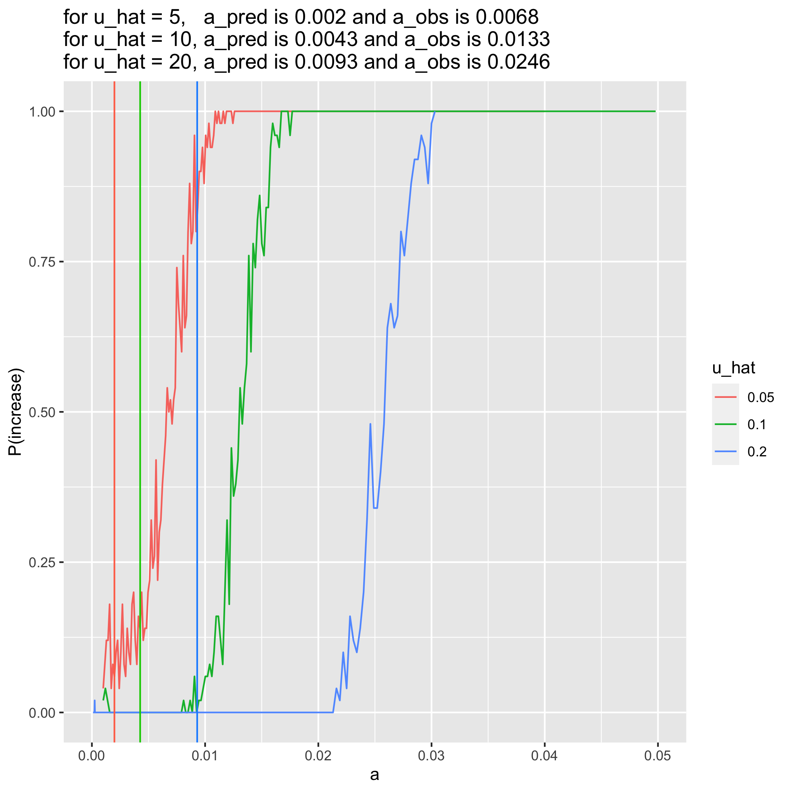
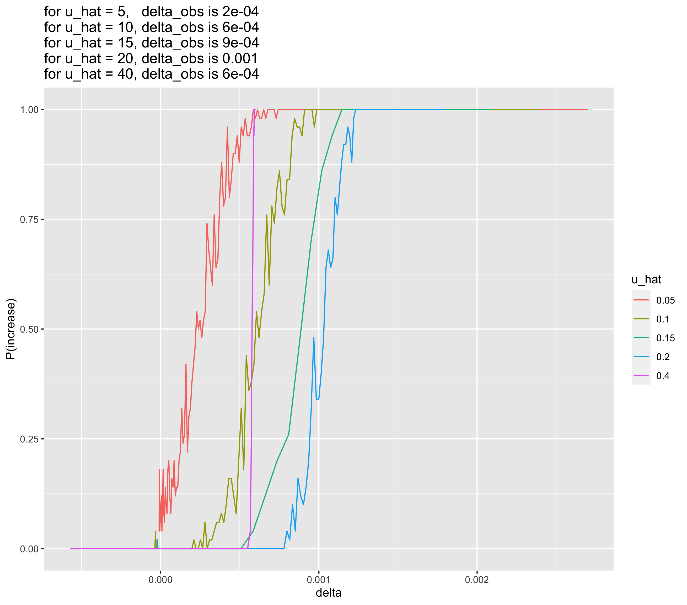

uhat=40, 20, 15, 10, and 5% comparison after debugging + wt gens
================
Isabel Kim
4/12/2022

## Compile csvs

``` r
library(tidyverse)
source("/Users/isabelkim/Desktop/year2/underdominance/reaction-diffusion/cluster/plotting_functions.R")

summary_u40 = read_csv("/Users/isabelkim/Desktop/year2/underdominance/reaction-diffusion/cluster/u_hat=0.4_run/csvs/summary_april12_full_range_uhat40.csv")
obs_vs_pred_u40 = get_a_pred_and_a_obs(summary_u40)

summary_u20 = read_csv("/Users/isabelkim/Desktop/year2/underdominance/reaction-diffusion/cluster/u_hat=0.2_run/csvs/summary_april11_full_range_uhat20.csv")
obs_vs_pred_u20 = get_a_pred_and_a_obs(summary_u20)

summary_u15 = read_csv("/Users/isabelkim/Desktop/year2/underdominance/reaction-diffusion/cluster/u_hat=0.15_run/csvs/summary_april13_full_range_uhat15.csv")
obs_vs_pred_u15 = get_a_pred_and_a_obs(summary_u15)
# adjust
obs_vs_pred_u15$a_pred = 0.006154545
obs_vs_pred_u15$delta_pred = -0.000017000
obs_vs_pred_u15$index_of_pred = 7

summary_u10 = read_csv("/Users/isabelkim/Desktop/year2/underdominance/reaction-diffusion/cluster/u_hat=0.1_run/csvs/summary_april11_full_range_uhat10.csv")
obs_vs_pred_u10 = get_a_pred_and_a_obs(summary_u10)

summary_u5 = read_csv("/Users/isabelkim/Desktop/year2/underdominance/reaction-diffusion/cluster/u_hat=0.05_run/csvs/summary_april11_full_range_uhat5.csv")
obs_vs_pred_u5 = get_a_pred_and_a_obs(summary_u5)

compiled = rbind(summary_u5,summary_u10,summary_u15,summary_u20,summary_u40)
compiled$u_hat = as.character(compiled$u_hat)
View(compiled)
```

## Compare a vs P(increase) graphs

``` r
compiled_plot = ggplot(data = compiled, aes(x = a, y = p_increase, color = u_hat)) +
  geom_line() +
  xlab("a") +
  ylab("P(increase)") +
  xlim(0, 0.1) +
  labs(title = paste0("for u_hat = 5,   a_pred is ", round(obs_vs_pred_u5$a_pred, 4),
                      " and a_obs is ", round(obs_vs_pred_u5$a_obs, 4),
                      "\nfor u_hat = 10, a_pred is ", round(obs_vs_pred_u10$a_pred,4), 
                      " and a_obs is ", round(obs_vs_pred_u10$a_obs, 4),
                      "\nfor u_hat = 15, a_pred is ", round(obs_vs_pred_u15$a_pred,4),
                      " and a_obs is ", round(obs_vs_pred_u15$a_obs, 4),
                      "\nfor u_hat = 20, a_pred is ", round(obs_vs_pred_u20$a_pred,4), 
                      " and a_obs is ", round(obs_vs_pred_u20$a_obs,4),
                      "\nfor u_hat = 40, a_pred is ",round(obs_vs_pred_u40$a_pred,4),
                      " and a_obs is ", round(obs_vs_pred_u40$a_obs,4)))
#ggsave(filename = "/Users/isabelkim/Desktop/year2/underdominance/reaction-diffusion/cluster/u_hat_comparisons/april12-a_vs_p_uhat_5_10_15_20_40_no_lines.png",plot = compiled_plot)


p = compiled_plot +
  geom_vline(xintercept = obs_vs_pred_u5$a_pred, color = "coral1") +
  geom_vline(xintercept = obs_vs_pred_u10$a_pred, color = "yellow4") +
  geom_vline(xintercept = obs_vs_pred_u15$a_pred, color = "seagreen3") +
  geom_vline(xintercept = obs_vs_pred_u20$a_pred, color = "deepskyblue2") +
  geom_vline(xintercept = obs_vs_pred_u40$a_pred, color = "magenta2")

#ggsave(filename = "/Users/isabelkim/Desktop/year2/underdominance/reaction-diffusion/cluster/u_hat_comparisons/april12-a_vs_p_uhat_5_10_15_20_40_with_lines.png",plot = p)
```

### just uhat=5, 10, and 20:

``` r

```

<!-- -->

### uhat = 5, 10, 20, 40

``` r
knitr::include_graphics("../../cluster/u_hat_comparisons/april12-a_vs_p_uhat_5_10_20_40.png")
```

<!-- -->

### uhat = 5, 10, 15, 20, 40 without any prediction lines

``` r

```

<!-- -->
### uhat = 5, 10, 15, 20, 40 *with* a_pred prediction lines

``` r
knitr::include_graphics("../../cluster/u_hat_comparisons/april12-a_vs_p_uhat_5_10_15_20_40_with_lines.png")
```

<!-- -->

## Compare delta vs P(increase) graphs for uhat = 5, 10, 15, 20, 40

``` r
compiled_delta_v_p_increase = ggplot(data = compiled, aes(x = delta, y = p_increase, color = u_hat)) +
  geom_line() +
  xlab("delta") +
  ylab("P(increase)") +
  labs(title = paste0("for u_hat = 5,   delta_obs is ", round(obs_vs_pred_u5$delta_obs, 4),
                      "\nfor u_hat = 10, delta_obs is ", round(obs_vs_pred_u10$delta_obs,4),
                      "\nfor u_hat = 15, delta_obs is ", round(obs_vs_pred_u15$delta_obs,4),
                      "\nfor u_hat = 20, delta_obs is ", round(obs_vs_pred_u20$delta_obs,4),
                      "\nfor u_hat = 40, delta_obs is ",round(obs_vs_pred_u40$delta_obs,4)))

#ggsave(filename = "/Users/isabelkim/Desktop/year2/underdominance/reaction-diffusion/cluster/u_hat_comparisons/april12-delta_vs_p.png",plot = compiled_delta_v_p_increase)
```

``` r

```

<!-- -->

The transition range for uhat=40 seems very sharp – probably didn’t have
enough data in this region.

## Check a vs delta

``` r
compiled_delta_v_a = ggplot(data = compiled, aes(x = a, y = delta, color = u_hat)) +
  geom_line() +
  xlab("a") +
  ylab("delta") +
  labs(title = paste0("for u_hat = 5,   delta_obs is ", round(obs_vs_pred_u5$delta_obs, 4),
                      "\nfor u_hat = 10, delta_obs is ", round(obs_vs_pred_u10$delta_obs,4),
                      "\nfor u_hat = 15, delta_obs is ", round(obs_vs_pred_u15$delta_obs,4),
                      "\nfor u_hat = 20, delta_obs is ", round(obs_vs_pred_u20$delta_obs,4),
                      "\nfor u_hat = 40, delta_obs is ",round(obs_vs_pred_u40$delta_obs,4)))

#ggsave(plot=compiled_delta_v_a, filename = "/Users/isabelkim/Desktop/year2/underdominance/reaction-diffusion/cluster/u_hat_comparisons/april13_compiled_a_vs_delta.png")
```

``` r

```

<!-- -->

## What are the delta transition range boundaries (delta_min – below which P(increase)=0 and delta_max – above which P(increase)=1.0)?

``` r
uhat5 = compiled %>% filter(u_hat=="0.05")
uhat10 = compiled %>% filter(u_hat=="0.1")
uhat15 = compiled %>% filter(u_hat == "0.15")
uhat20 = compiled %>% filter(u_hat=="0.2")
uhat40 = compiled %>% filter(u_hat == "0.4")

# View each file
```

-   For uhat=5%, there is no delta_min because P(increase) is always >
    0, but the lowest value of delta_min=-(9.84e-06) and delta_max=
    around 0.000573111
-   For uhat=10%, delta_min = around 0.000308603 (except for some
    outliers) and delta_max = 0.000893806
-   For uhat=15%, delta_min = around 0.000584299 and delta_max = 0.00108
-   For uhat=20%, delta_min=0.000797672 (besides the outlier at
    delta=-1.91e-5) and delta_max=0.001219991
-   For uhat=40%, delta_min=0.000555901 and delta_max=0.000590642

## What are the a value transition range boundaries?

-   For uhat=5%, a_min again doesn’t really exist but the minimum ran
    here is a_min=0.0001 a_max is around 0.01
-   For uhat=10%, a_min is around 0.0094 and a_max is around 0.0165
-   For uhat=15%, a_min is around 0.01523 and a_max is around 0.0223
-   For uhat=20%, a_min is around 0.0216 and a_max is around 0.03
-   For uhat=40%, a_min=0.06067 and a_max=0.07884

## Plot these

### Create new data frame

``` r
library(tidyverse)
```

    ## ── Attaching packages ─────────────────────────────────────── tidyverse 1.3.1 ──

    ## ✓ ggplot2 3.3.5     ✓ purrr   0.3.4
    ## ✓ tibble  3.1.6     ✓ dplyr   1.0.8
    ## ✓ tidyr   1.2.0     ✓ stringr 1.4.0
    ## ✓ readr   2.1.2     ✓ forcats 0.5.1

    ## ── Conflicts ────────────────────────────────────────── tidyverse_conflicts() ──
    ## x dplyr::filter() masks stats::filter()
    ## x dplyr::lag()    masks stats::lag()

``` r
uhats = c(0.05,0.1,0.15 ,0.2, 0.4)
a_mins = c(0.0001,0.0094,0.01523,0.0216,0.0607)
a_observed = c(0.00679798, 0.01328283, 0.01927273, 0.0246,0.06823636 )
delta_observed = c(0.000238392, 0.00062167, 0.000880852, 0.000967741,0.000576682)
a_maxs = c(0.01,0.0165,0.0223,0.03,0.07884)
delta_mins = c(-(9.84e-06), 0.000308603,0.000584299,0.000797672,0.000555901)
delta_maxs = c(0.000573111,0.000893806,0.00108,0.001219991,0.000590642)

transitions = tibble(uhat = uhats,
                     a_lower = a_mins,
                     a_upper = a_maxs,
                     a_observed = a_observed,
                     delta_lower = delta_mins,
                     delta_upper = delta_maxs,
                     delta_observed = delta_observed)
```

### uhat vs the upper value for a (above which P(increase) is always 100%)

``` r
u_vs_a_upper = ggplot(transitions, aes(x=uhat,y=a_upper)) + geom_point() + geom_line()
u_vs_a_upper
```

<!-- -->

-   *linear* relationship between uhat and a_upper
    -   If uhat goes up by x, then the a_value should go up by mx
-   What is the equation for this line?

``` r
mod = lm(a_upper ~ uhat, data = transitions)
summary(mod)
```

    ## 
    ## Call:
    ## lm(formula = a_upper ~ uhat, data = transitions)
    ## 
    ## Residuals:
    ##         1         2         3         4         5 
    ##  0.004571  0.001033 -0.003205 -0.005543  0.003144 
    ## 
    ## Coefficients:
    ##              Estimate Std. Error t value Pr(>|t|)   
    ## (Intercept) -0.004610   0.003954  -1.166  0.32795   
    ## uhat         0.200764   0.018239  11.008  0.00161 **
    ## ---
    ## Signif. codes:  0 '***' 0.001 '**' 0.01 '*' 0.05 '.' 0.1 ' ' 1
    ## 
    ## Residual standard error: 0.004928 on 3 degrees of freedom
    ## Multiple R-squared:  0.9758, Adjusted R-squared:  0.9678 
    ## F-statistic: 121.2 on 1 and 3 DF,  p-value: 0.001606

a_upper = -0.004610 + 0.200764(uhat) ?

``` r
predicted_a_upper = -0.004610 + (0.200764*transitions$uhat)

transitions_edit = transitions %>% add_column(predicted_a_upper)

plot = ggplot(transitions_edit) + geom_point(aes(x=uhat,y=a_upper),color="black") + geom_point(aes(x=uhat,y=predicted_a_upper),color="red")

plot
```

<!-- -->
\*But this equation only involves SLiM results, not the delta or AUC
equation at all.

### uhat vs a_observed?

``` r
u_vs_a_obs = ggplot(transitions_edit, aes(x = uhat, y = a_observed)) + geom_point() + geom_line()

u_vs_a_obs
```

<!-- -->
Similar results to uhat vs a_upper – appears linear for uhat=5% to
uhat=20%, then increases more from uhat=20% to uhat=40% (not sure if
this is due to lack of data here though)

### uhat vs delta_observed?

``` r
u_vs_delta_obs = ggplot(transitions_edit, aes(x = uhat, y = delta_observed)) + geom_point() + geom_line()

u_vs_delta_obs
```

<!-- -->

### uhat vs the lower value for a (below which P(increase) is always 100%)

``` r
u_vs_a_lower = ggplot(transitions_edit, aes(x=uhat,y=a_lower)) + geom_point() + geom_line()

u_vs_a_lower
```

<!-- -->
Not very linear

### uhat vs delta_upper

``` r
u_vs_delta_upper = ggplot(transitions_edit, aes(x=uhat,y=delta_upper)) + geom_point() + geom_line()

u_vs_delta_upper
```

<!-- -->
Weird that the slope becomes negative between uhat=20% and uhat=40%?

## delta equation as a function of a and u_hat

### Apply equation to a range of uhats

``` r
source("/Users/isabelkim/Desktop/year2/underdominance/reaction-diffusion/scripts/auc-equations.R")

u_hat = seq(0.05,0.45,by=0.05)
n = length(u_hat) # 9

a_grid = seq(0.0, 1.0, length.out=1000)

delta_u_5 = rep(-1, 1000)
delta_u_10 = rep(-1,1000)
delta_u_15 = rep(-1,1000)
delta_u_20 = rep(-1,1000)
delta_u_25 = rep(-1,1000)
delta_u_30 = rep(-1,1000)
delta_u_35 = rep(-1,1000)
delta_u_40 = rep(-1,1000)
delta_u_45 = rep(-1,1000)

# for plotting
a_grid_expanded = c(a_grid, a_grid, a_grid, a_grid, a_grid, a_grid, a_grid, a_grid, a_grid)
u_hat_expanded = c(rep(0.05,1000), rep(0.1,1000), rep(0.15,1000),rep(0.2,1000),rep(0.25,1000),
                   rep(0.3,1000),rep(0.35,1000),rep(0.4,1000),rep(0.45,1000))
u_hat_expanded_string = as.character(u_hat_expanded)

b=1
sigma=0.01
k = 0.2
for (i in 1:1000){
  a = a_grid[i]
  delta_u_5[i] = factored_delta(a,b,sigma,k,0.05)
  delta_u_10[i] = factored_delta(a,b,sigma,k,0.1)
  delta_u_15[i] = factored_delta(a,b,sigma,k,0.15)
  delta_u_20[i] = factored_delta(a,b,sigma,k,0.2)
  delta_u_25[i] = factored_delta(a,b,sigma,k,0.25)
  delta_u_30[i] = factored_delta(a,b,sigma,k,0.3)
  delta_u_35[i] = factored_delta(a,b,sigma,k,0.35)
  delta_u_40[i] = factored_delta(a,b,sigma,k,0.4)
  delta_u_45[i] = factored_delta(a,b,sigma,k,0.45)
}

delta_expanded = c(delta_u_5, delta_u_10, delta_u_15, delta_u_20, delta_u_25, 
                   delta_u_30, delta_u_35, delta_u_40, delta_u_45)

delta_vs_a_and_u = tibble(a = a_grid_expanded, delta = delta_expanded, uhat = u_hat_expanded_string) 
```

### Plot a vs delta, colored by uhat

``` r
p = ggplot(delta_vs_a_and_u, aes(x = a, y = delta, color = uhat)) + geom_line() + geom_hline(yintercept = 0) + geom_vline(xintercept=0)

#ggsave(plot= p, filename = "/Users/isabelkim/Desktop/year2/underdominance/reaction-diffusion/cluster/u_hat_comparisons/april13_delta_vs_full_a_by_u.png")

#### Zooming in on only the transition region
p_zoom = p + xlim(0,0.1)

#ggsave(plot= p_zoom, filename = "/Users/isabelkim/Desktop/year2/underdominance/reaction-diffusion/cluster/u_hat_comparisons/april13_delta_vs_fzoomed_in_a_by_u.png")
```

``` r

```

<!-- -->

#### Zoomed in - a from 0 to 0.1

``` r

```

<!-- -->
The increase in a_pred increases at a faster rate than the increase in
uhat – note the difference in the x-intercept between uhat=5% and
uhat=10% vs uhat=40% and uhat=45% – once uhat gets pretty high, a bigger
increase in *a* is needed in order for the drive to spread..

## Conclusions

-   The a_predicted is always lower than the a_observed.
-   Predictions get worse as uhat increases (it’s especially bad for
    uhat=40%)
-   The delta value at which P(increase)=100% increases with uhat (a
    greater increase in AUC is needed for the drive to spread as the
    frequency threshold gets higher).
    -   But an exception is with uhat=40% – this transition is very
        sharp and occurs at a low delta value compared to the other
        runs’. (There could be an issue of not enough data in this
        region though). This causes the strange upside-down U shape in
        the “a vs delta_observed” plot.
-   The threshold for a (at which delta=0) is expected to increase
    non-linearly with uhat (as uhat increases, a larger increase in a is
    needed). But in the actual data, the a_observed
