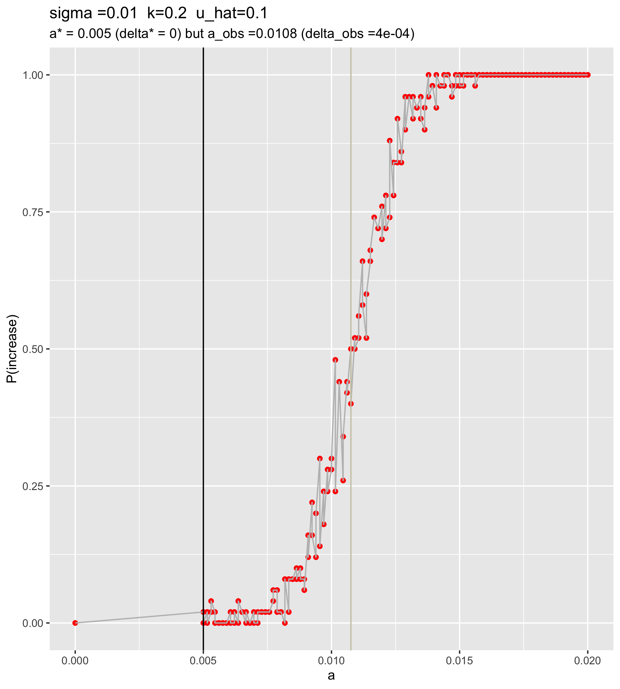
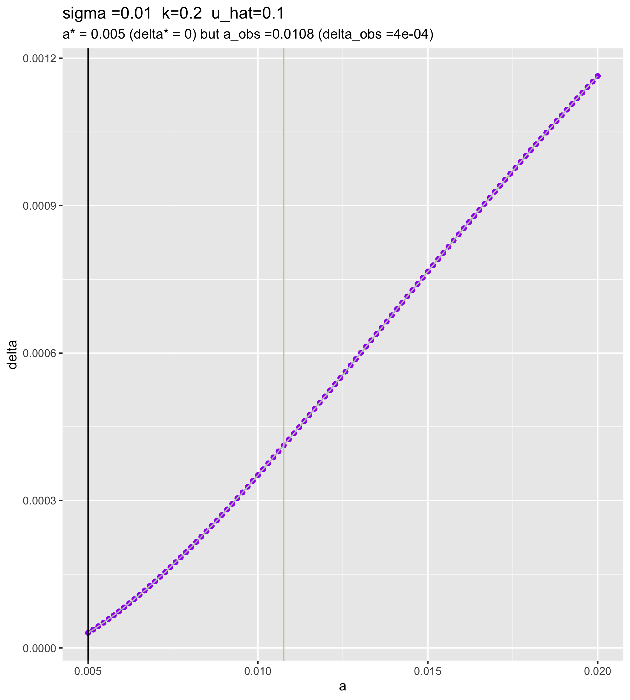
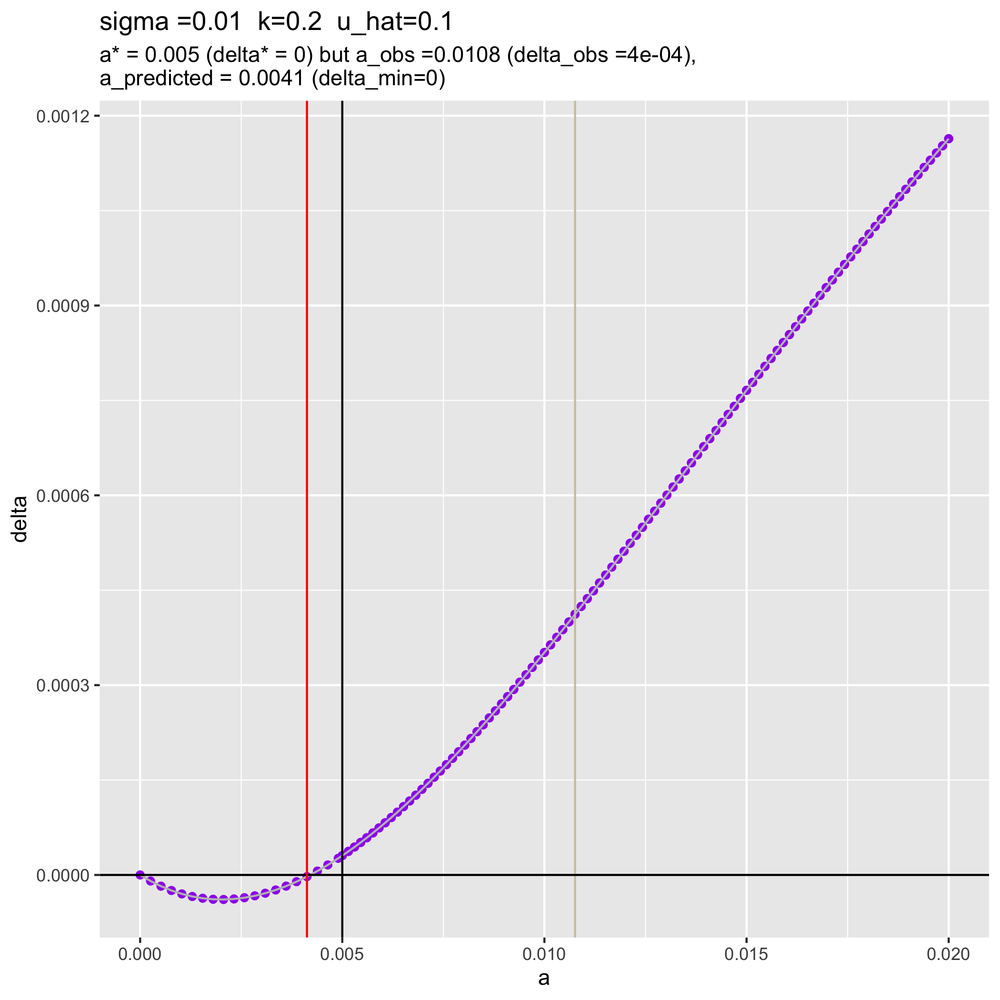
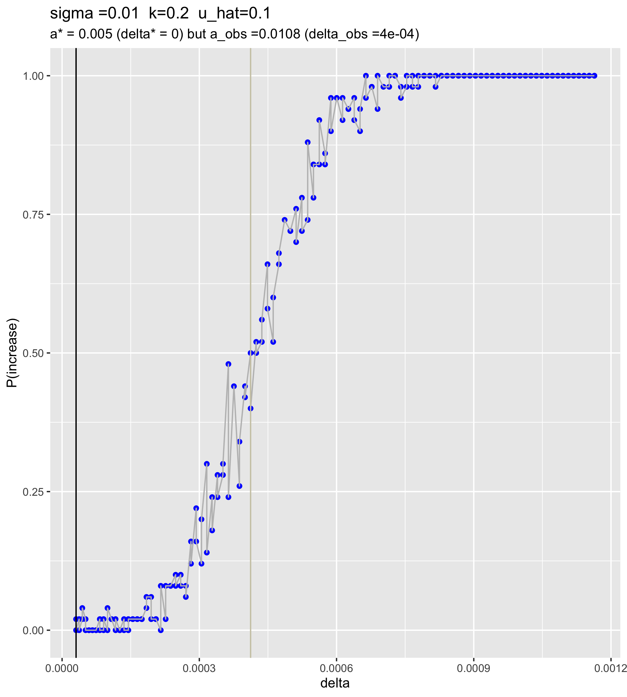
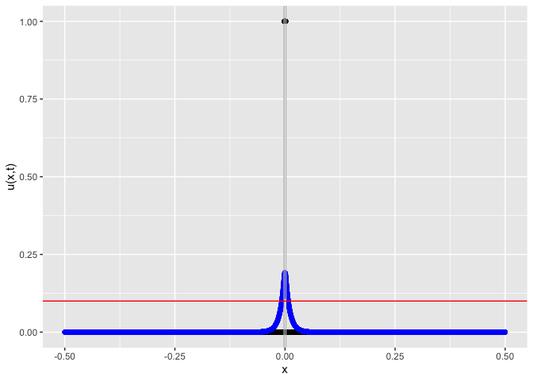
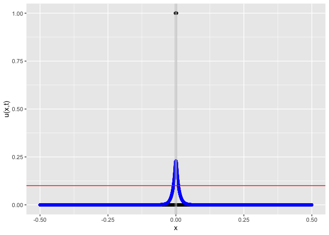
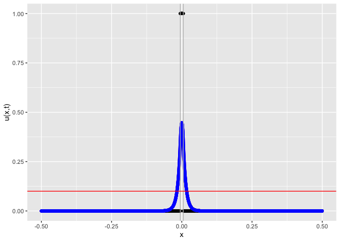

Redoing the uhat=10% plots with the correct delta value
================
Isabel Kim
4/5/2022

## Load in packages and functions

``` r
library(tidyverse)
source("/Users/isabelkim/Desktop/year2/underdominance/reaction-diffusion/scripts/functions-main-model.R")
source("/Users/isabelkim/Desktop/year2/underdominance/reaction-diffusion/cluster/plotting_functions.R")
```

## uhat=10% files

-   Summary csv file from before:
    `/Users/isabelkim/Desktop/year2/underdominance/reaction-diffusion/cluster/u_hat=0.1_run/csvs/uhat_10_more_replicate_summary.csv`

Read in the replicate summary file from before

``` r
csv = read_csv("/Users/isabelkim/Desktop/year2/underdominance/reaction-diffusion/cluster/u_hat=0.1_run/csvs/uhat_10_more_replicate_summary.csv")
dim(csv)
head(csv)
```

Go through and add the correct delta

``` r
n = 196
corr_delta = rep(-1,n)
for (i in 1:n){
  a = csv$a[i]
  b = 1
  sigma = csv$sigma[i]
  k = csv$k[i]
  uhat = csv$u_hat[i]
  corr_delta[i] = delta(a,b,sigma,k,uhat)
}

ind_min = which.min(abs(corr_delta))
min_delta = corr_delta[ind_min]
a_that_mins = csv$a[ind_min]
print(paste("The minimum value of delta is:",min_delta,"--> at a=",a_that_mins)) # a = 0.005, the minimum value in the run

csv_edit = csv %>% add_column(delta_correct = corr_delta)

# Save this csv file
write_csv(file="/Users/isabelkim/Desktop/year2/underdominance/reaction-diffusion/cluster/u_hat=0.1_run/csvs/EDITED_DELTA_uhat_0.1_more_replicate_summary.csv",x=csv_edit)
```

Edited csv file is at:
`/Users/isabelkim/Desktop/year2/underdominance/reaction-diffusion/cluster/u_hat=0.1_run/csvs/EDITED_DELTA_uhat_0.2_more_replicate_summary.csv`

## Replot the a vs P(increase) graph

``` r
data = csv_edit

# Manually add a a=0, p_increase = 0 row for a this graph only
delta_a_0 = delta(a=0,b=1,sigma=0.01,k=0.2,uhat=0.1)

data_a_graph = csv_edit %>% add_row(a=0.0,sigma=0.01,beta=0.0,k=0.2,u_hat=0.1,delta=delta_a_0,p_increase=0.0,delta_correct=delta_a_0)

obs_vs_pred = get_a_pred_and_a_obs(data)
a_prop = obs_vs_pred$a_pred
delta_min = obs_vs_pred$delta_pred
a_obs = obs_vs_pred$a_obs
delta_obs = obs_vs_pred$delta_obs
p_increase_obs = obs_vs_pred$p_increase_obs

# Plot p(increase) as a function of a
plot_freqs_and_a = ggplot(data_a_graph, aes(x = a, y = p_increase)) + 
  geom_point(color = "red") + 
  geom_line(color = "grey") +
  geom_vline(xintercept = a_prop) + 
  ylab("P(increase)") + 
  labs(title = paste0("sigma =",data$sigma[1], 
                      "  k=",data$k[1],"  u_hat=", data$u_hat[1]), 
       subtitle = paste0("a* = ", round(a_prop,4), " (delta* = ", round(delta_min,4),") but a_obs =",round(a_obs,4)," (delta_obs =", round(delta_obs,4),")")) +
  ylim(0,1) + 
  geom_vline(xintercept = a_obs, color = "cornsilk3")

#ggsave(plot = plot_freqs_and_a, filename = "/Users/isabelkim/Desktop/year2/underdominance/reaction-diffusion/cluster/u_hat=0.1_run/figures/EDITED_DELTA_a_vs_p_increase.png")
```

``` r

```

<!-- -->
Adding the a=0,P(increase)=0 point adds some weirdness.

## Replot the a vs delta graph

``` r
plot_a_vs_delta = ggplot(csv_edit, aes(x = a, y = delta_correct)) + 
  geom_point(color = "purple") + 
  geom_line(color = "grey") +
  geom_vline(xintercept = a_prop) + 
  ylab("delta") + 
  labs(title = paste0("sigma =",data$sigma[1], 
                      "  k=",data$k[1],"  u_hat=", data$u_hat[1]), 
       subtitle = paste0("a* = ", round(a_prop,4), " (delta* = ", round(delta_min,4),") but a_obs =",round(a_obs,4)," (delta_obs =", round(delta_obs,4),")")) +
  geom_vline(xintercept = a_obs, color = "cornsilk3")

#ggsave(plot = plot_a_vs_delta, "/Users/isabelkim/Desktop/year2/underdominance/reaction-diffusion/cluster/u_hat=0.1_run/figures/EDITED_DELTA_a_vs_delta.png") 
```

``` r

```

<!-- -->
### Extend a to lower values (below the minimum a used in the cluster
runs)

``` r
a_lowers = seq(0, 0.0049, length.out = 20)
sigma = 0.01
b=1
uhat=0.1
k=0.2
delta_lowers = rep(-1,20)
for (i in 1:20){
  a = a_lowers[i]
  delta_lowers[i] = delta(a,b,sigma,k,uhat)
}

a_extend = c(a_lowers, csv_edit$a)
delta_extend = c(delta_lowers, csv_edit$delta_correct)
n = length(delta_extend)
a_vs_delta_tibble = tibble(a = a_extend, sigma = rep(0.01, n), beta = a_extend/0.01, k = rep(0.2,n), u_hat = rep(0.1,n), delta_correct = delta_extend)

# output
#write_csv(file = "/Users/isabelkim/Desktop/year2/underdominance/reaction-diffusion/cluster/u_hat=0.1_run/csvs/EDITED_DELTA_a_vs_delta_theoretical.csv", x = a_vs_delta_tibble)
```

csv file of delta values predicted for various a values:
`/Users/isabelkim/Desktop/year2/underdominance/reaction-diffusion/cluster/u_hat=0.1_run/csvs/EDITED_DELTA_a_vs_delta_theoretical.csv`

Plot a vs delta extended

``` r
# Which delta is closest to 0 (besides when a = 0)?

plot_ext_a_v_delta = ggplot(a_vs_delta_tibble, aes(x = a, y = delta_correct)) + 
  geom_point(color = "purple") + 
  geom_line(color = "grey") +
  geom_vline(xintercept = a_prop) + 
  ylab("delta") + 
  labs(title = paste0("sigma =",data$sigma[1], 
                      "  k=",data$k[1],"  u_hat=", data$u_hat[1]),
       subtitle = paste0("a* = ", round(a_prop,4), " (delta* = ", round(delta_min,4),") but a_obs =",round(a_obs,4)," (delta_obs =", round(delta_obs,4),")"))+
  geom_vline(xintercept = a_obs, color = "cornsilk3") +
  geom_hline(yintercept = 0, color = "black")

# Grab the value of a at the x-intercept
# Exclude a=0
a_not_0 = a_vs_delta_tibble$a[2:216]
delta_not_a_0 = a_vs_delta_tibble$delta_correct[2:216]

ind_int = which.min(abs(delta_not_a_0-0))
delta_closest_to_zero = delta_not_a_0[ind_int]
a_min = a_not_0[ind_int]

a_star = 0.004126316 # This is the predicted value of a that will --> critical propagule

p = ggplot(a_vs_delta_tibble, aes(x = a, y = delta_correct)) + 
  geom_point(color = "purple") + 
  geom_line(color = "grey") +
  geom_vline(xintercept = a_prop) + 
  ylab("delta") + 
  labs(title = paste0("sigma =",data$sigma[1], 
                      "  k=",data$k[1],"  u_hat=", data$u_hat[1]),
       subtitle = paste0("a* = ", round(a_prop,4), " (delta* = ", round(delta_min,4),") but a_obs =",round(a_obs,4)," (delta_obs =", round(delta_obs,4),"),\na_predicted = ",round(a_min,4)," (delta_min=",round(delta_closest_to_zero,4),")"))+
  geom_vline(xintercept = a_obs, color = "cornsilk3") +
  geom_hline(yintercept = 0, color = "black") +
  geom_vline(xintercept = a_min, color = "red")

#ggsave(plot = p, "/Users/isabelkim/Desktop/year2/underdominance/reaction-diffusion/cluster/u_hat=0.1_run/figures/EDITED_DELTA_extended_scale_a_vs_delta.png") 
```

``` r

```

<!-- -->

The predicted value of a that would get AUC1 closest to (a\*b) is
`a_star = 0.004126316`, which wasn’t included in the cluster runs (but
which would probably lead to P(increase)=0).

## Replot the delta vs P(increase) graph

``` r
plot_delta_vs_p_increase = ggplot(csv_edit, aes(x = delta_correct, y = p_increase)) +
  geom_point(color = "blue") + 
  geom_line(color = "grey") +
  geom_vline(xintercept = delta_min) + 
  ylab("P(increase)") + 
  xlab("delta") +
  labs(title = paste0("sigma =",data$sigma[1], 
                      "  k=",data$k[1],"  u_hat=", data$u_hat[1]), 
       subtitle = paste0("a* = ", round(a_prop,4), " (delta* = ", round(delta_min,4),") but a_obs =",round(a_obs,4)," (delta_obs =", round(delta_obs,4),")")) +
  geom_vline(xintercept = delta_obs, color = "cornsilk3")

#ggsave(plot = plot_delta_vs_p_increase, "/Users/isabelkim/Desktop/year2/underdominance/reaction-diffusion/cluster/u_hat=0.1_run/figures/EDITED_DELTA_delta_vs_p_increase.png") 
```

``` r

```

<!-- -->
## Analytical AUC predictions for some a

### a = 0.004126316 - the value of a that causes AUC1 to be closest to a\*b (not in the cluster runs)

``` r
a_pred_res = u_t0_to_t1(x_grid=seq(-0.5,0.5,by=0.0001),a=0.004126316,b=1,sigma=0.01,k=0.2,u_hat=0.1)
```

<!-- -->

``` r
print(paste("Trapezoidal AUC: ", a_pred_res$theta1_trapz, "Mathematica AUC: ", auc_mathematica(a=0.004126316,b=1,sigma=0.01,k=0.2,uhat=0.1) , "my equation AUC (wrong): ", a_pred_res$theta1_factored))
```

    ## [1] "Trapezoidal AUC:  0.00412365891557685 Mathematica AUC:  0.00412365902519165 my equation AUC (wrong):  0.00643070974880568"

The Mathematica prediction is much closer

### a = 0.005, the minimizing value for delta out of those included in the cluster runs

``` r
a_pred_res = u_t0_to_t1(x_grid=seq(-0.5,0.5,by=0.0001),a=0.005,b=1,sigma=0.01,k=0.2,u_hat=0.1)
```

<!-- -->

``` r
print(paste("Trapezoidal AUC: ", a_pred_res$theta1_trapz, "Mathematica AUC: ", auc_mathematica(a=0.005,b=1,sigma=0.01,k=0.2,uhat=0.1) , "my equation AUC (wrong): ", a_pred_res$theta1_factored))
```

    ## [1] "Trapezoidal AUC:  0.00503056938171001 Mathematica AUC:  0.00503056938177687 my equation AUC (wrong):  0.00689220292559658"

### a = 0.01075758, the value of a that had P(increase) closest to 50%

``` r
a_pred_res = u_t0_to_t1(x_grid=seq(-0.5,0.5,by=0.0001),a=0.01075758,b=1,sigma=0.01,k=0.2,u_hat=0.1)
```

<!-- -->

``` r
print(paste("Trapezoidal AUC: ", a_pred_res$theta1_trapz, "Mathematica AUC: ", auc_mathematica(a=0.01075758,b=1,sigma=0.01,k=0.2,uhat=0.1) , "my equation AUC (wrong): ", a_pred_res$theta1_factored))
```

    ## [1] "Trapezoidal AUC:  0.0111696900539846 Mathematica AUC:  0.0111696902335547 my equation AUC (wrong):  0.0114702598529552"
