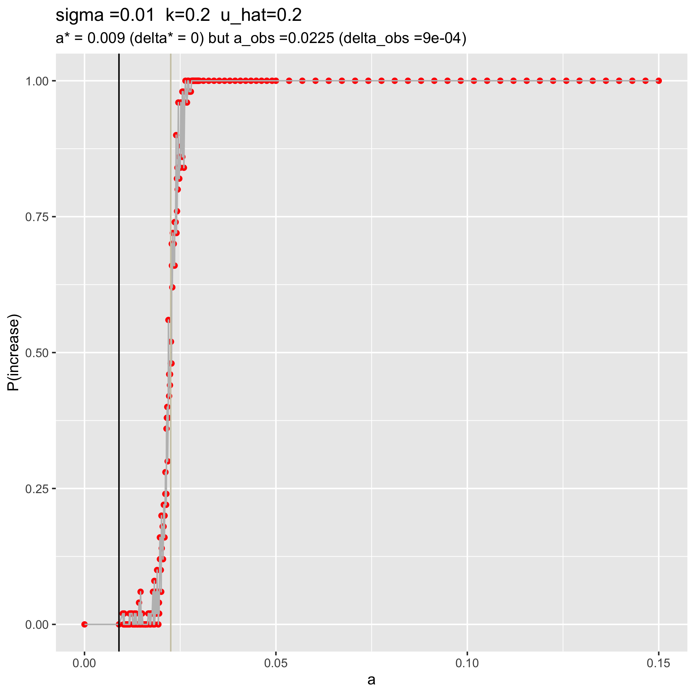
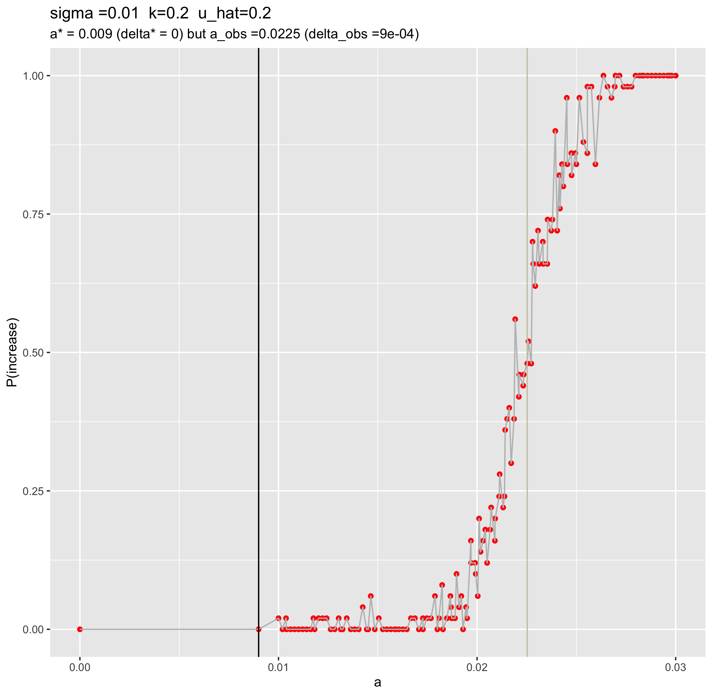
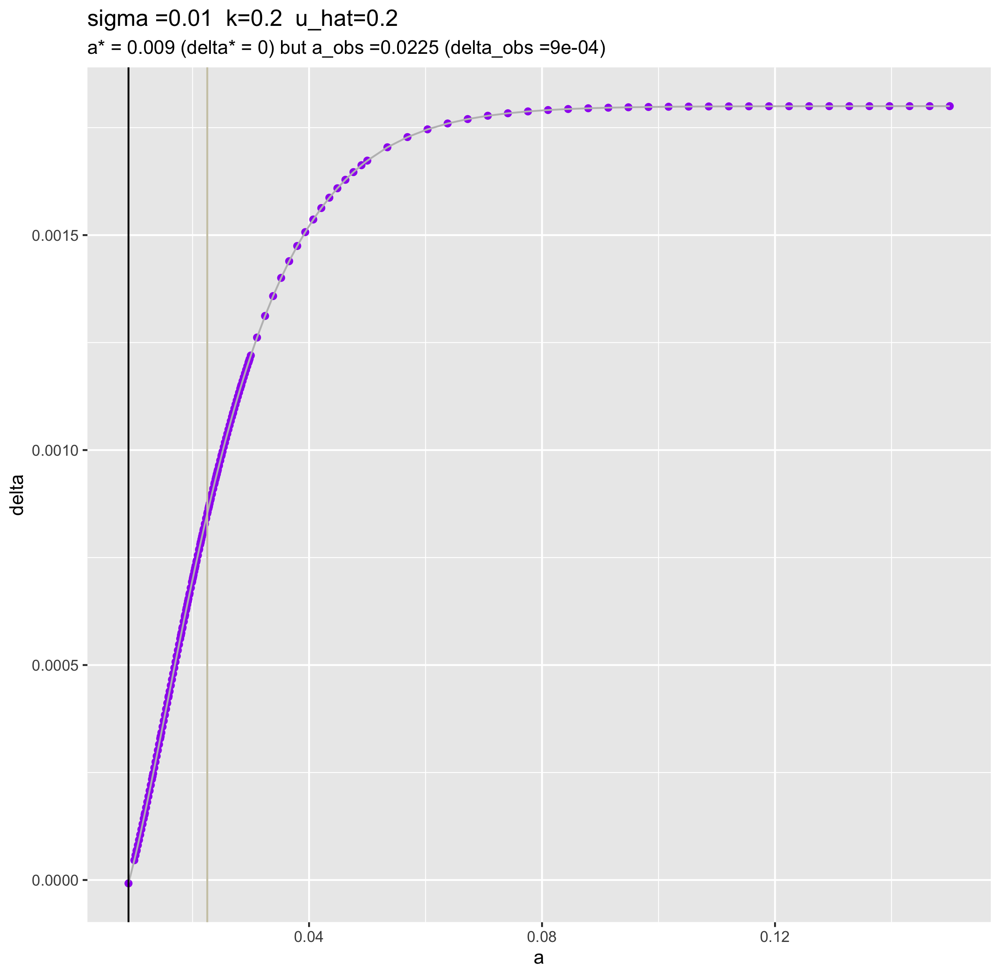
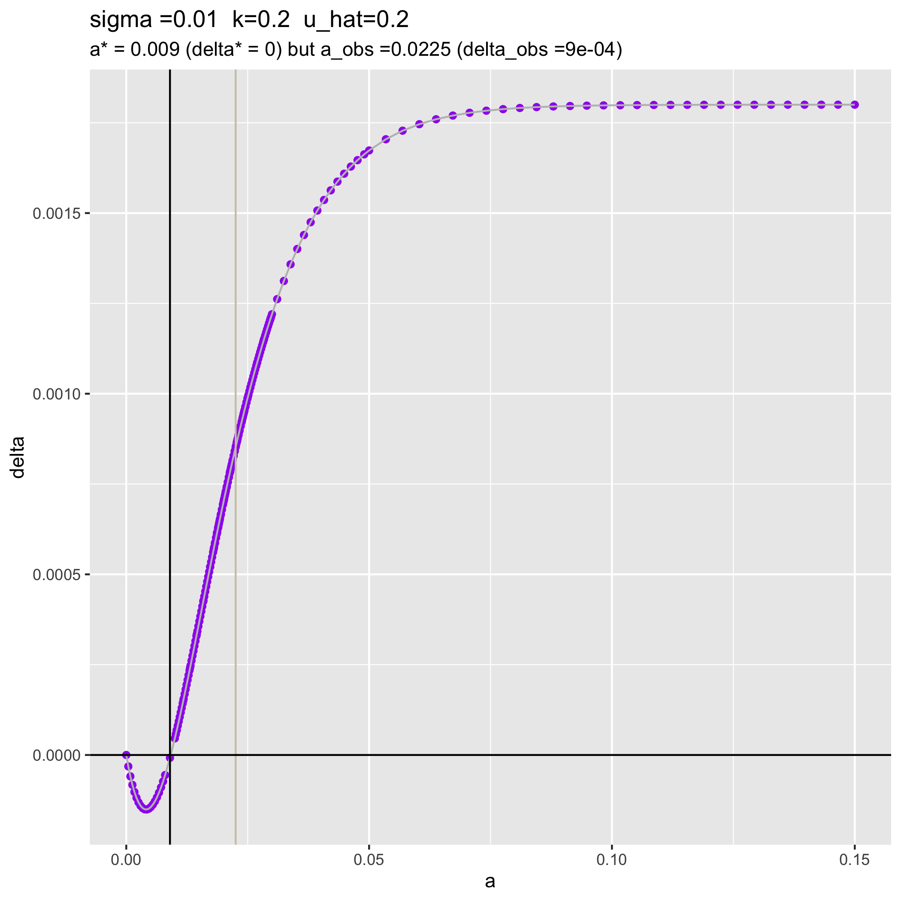
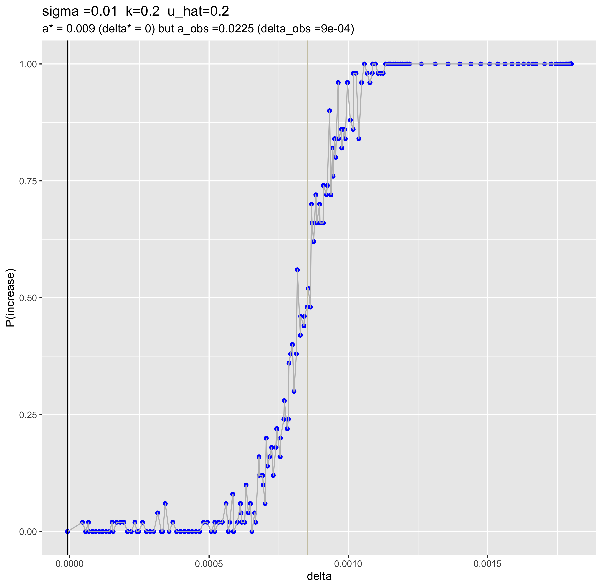
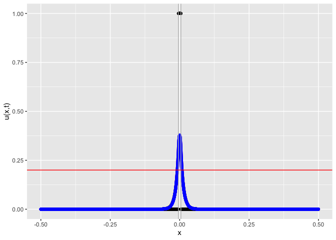
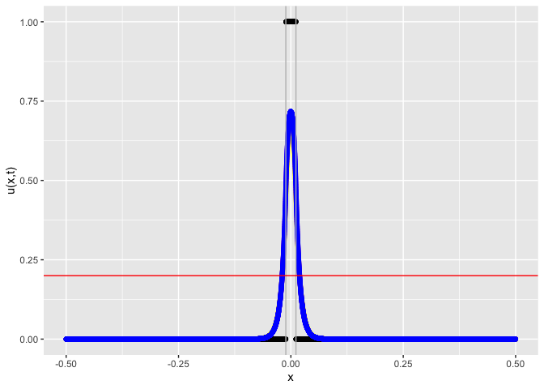

Redoing the uhat=20% plots with the correct delta value
================
Isabel Kim
4/5/2022

## Load in packages and functions

``` r
library(tidyverse)
source("/Users/isabelkim/Desktop/year2/underdominance/reaction-diffusion/scripts/functions-main-model.R")
```

## uhat=20% files

-   Summary csv file from before:
    `/Users/isabelkim/Desktop/year2/underdominance/reaction-diffusion/cluster/u_hat=0.2_run/csvs/uhat_0.2_more_replicate_summary.csv`

Read in the replicate summary file from before

``` r
csv = read_csv("/Users/isabelkim/Desktop/year2/underdominance/reaction-diffusion/cluster/u_hat=0.2_run/csvs/uhat_0.2_more_replicate_summary.csv")
dim(csv)
head(csv)
```

Go through and add the correct delta

``` r
n = 190
corr_delta = rep(-1,n)
for (i in 1:n){
  a = csv$a[i]
  b = 1
  sigma = csv$sigma[i]
  k = csv$k[i]
  uhat = csv$u_hat[i]
  corr_delta[i] = delta(a,b,sigma,k,uhat)
}

ind_min = which.min(corr_delta)
min_delta = corr_delta[ind_min]
a_that_mins = csv$a[ind_min]
print(paste("The minimum value of delta is:",min_delta,"--> at a=",a_that_mins))

csv_edit = csv %>% add_column(delta_correct = corr_delta)

# Save this csv file
#write_csv(file="/Users/isabelkim/Desktop/year2/underdominance/reaction-diffusion/cluster/u_hat=0.2_run/csvs/EDITED_DELTA_uhat_0.2_more_replicate_summary.csv",x=csv_edit)
```

Edited csv file is at:
`Users/isabelkim/Desktop/year2/underdominance/reaction-diffusion/cluster/u_hat=0.2_run/csvs/EDITED_DELTA_uhat_0.2_more_replicate_summary.csv`

### Replot the a vs P(increase) graph

``` r
data = csv_edit

# Manually add a a=0, p_increase = 0 row for a this graph only
delta_a_0 = delta(a=0,b=1,sigma=0.01,k=0.2,uhat=0.2)
row = c(0.0,0.01,0.0,0.2,0.2,delta_a_0,0,delta_a_0)

data_a_graph = csv_edit %>% add_row(a=0.0,sigma=0.01,beta=0.0,k=0.2,u_hat=0.2,delta=delta_a_0,p_increase=0.0,delta_correct=delta_a_0)

obs_vs_pred = get_a_pred_and_a_obs(data)
a_prop = obs_vs_pred$a_pred
delta_min = obs_vs_pred$delta_pred
a_obs = obs_vs_pred$a_obs
delta_obs = obs_vs_pred$delta_obs
p_increase_obs = obs_vs_pred$p_increase_obs

# Plot p(increase) as a function of a
plot_freqs_and_a = ggplot(data_a_graph, aes(x = a, y = p_increase)) + 
  geom_point(color = "red") + 
  geom_line(color = "grey") +
  geom_vline(xintercept = a_prop) + 
  ylab("P(increase)") + 
  labs(title = paste0("sigma =",data$sigma[1], 
                      "  k=",data$k[1],"  u_hat=", data$u_hat[1]), 
       subtitle = paste0("a* = ", round(a_prop,4), " (delta* = ", round(delta_min,4),") but a_obs =",round(a_obs,4)," (delta_obs =", round(delta_obs,4),")")) +
  ylim(0,1) + 
  geom_vline(xintercept = a_obs, color = "cornsilk3")

#ggsave(plot = plot_freqs_and_a, filename = "/Users/isabelkim/Desktop/year2/underdominance/reaction-diffusion/cluster/u_hat=0.2_run/figures/EDITED_DELTA_a_vs_p_increase.png")
```

``` r

```

<!-- -->

Zoom in

``` r
freq_vs_a_zoomed_in = ggplot(data_a_graph, aes(x = a, y = p_increase)) + 
  geom_point(color = "red") + 
  geom_line(color = "grey") +
  geom_vline(xintercept = a_prop) + 
  ylab("P(increase)") + 
  labs(title = paste0("sigma =",data$sigma[1], 
                      "  k=",data$k[1],"  u_hat=", data$u_hat[1]), 
       subtitle = paste0("a* = ", round(a_prop,4), " (delta* = ", round(delta_min,4),") but a_obs =",round(a_obs,4)," (delta_obs =", round(delta_obs,4),")")) +
  ylim(0,1) + 
  geom_vline(xintercept = a_obs, color = "cornsilk3") + xlim(0.0,0.03)

#ggsave(plot = freq_vs_a_zoomed_in, filename = "/Users/isabelkim/Desktop/year2/underdominance/reaction-diffusion/cluster/u_hat=0.2_run/figures/EDITED_DELTA_zoomed_in_a_vs_p_increase.png")
```

``` r

```

<!-- -->

### Replot the a vs delta graph

``` r
plot_a_vs_delta = ggplot(csv_edit, aes(x = a, y = delta_correct)) + 
  geom_point(color = "purple") + 
  geom_line(color = "grey") +
  geom_vline(xintercept = a_prop) + 
  ylab("delta") + 
  labs(title = paste0("sigma =",data$sigma[1], 
                      "  k=",data$k[1],"  u_hat=", data$u_hat[1]), 
       subtitle = paste0("a* = ", round(a_prop,4), " (delta* = ", round(delta_min,4),") but a_obs =",round(a_obs,4)," (delta_obs =", round(delta_obs,4),")")) +
  geom_vline(xintercept = a_obs, color = "cornsilk3")

#ggsave(plot = plot_a_vs_delta, "/Users/isabelkim/Desktop/year2/underdominance/reaction-diffusion/cluster/u_hat=0.2_run/figures/EDITED_DELTA_a_vs_delta.png") 
```

``` r

```

<!-- -->

#### Extend a to lower values (below the minimum a used in the cluster runs)

``` r
a_lowers = seq(0, 0.008, length.out = 20)
sigma = 0.01
b=1
uhat=0.2
k=0.2
delta_lowers = rep(-1,20)
for (i in 1:20){
  a = a_lowers[i]
  delta_lowers[i] = delta(a,b,sigma,k,uhat)
}

a_extend = c(a_lowers, csv_edit$a)
delta_extend = c(delta_lowers, csv_edit$delta_correct)
n = length(delta_extend)
a_vs_delta_tibble = tibble(a = a_extend, sigma = rep(0.01, n), beta = a_extend/0.01, k = rep(0.2,n), u_hat = rep(0.2,n), delta_correct = delta_extend)

# output
#write_csv(file = "/Users/isabelkim/Desktop/year2/underdominance/reaction-diffusion/cluster/u_hat=0.2_run/csvs/EDITED_DELTA_a_vs_delta_theoretical.csv", x = a_vs_delta_tibble)
```

csv file of delta values predicted for various a values:
`/Users/isabelkim/Desktop/year2/underdominance/reaction-diffusion/cluster/u_hat=0.2_run/csvs/EDITED_DELTA_a_vs_delta_theoretical.csv`

Plot a vs delta extended

``` r
# Which delta is closest to 0 (besides when a = 0)?

plot_ext_a_v_delta = ggplot(a_vs_delta_tibble, aes(x = a, y = delta_correct)) + 
  geom_point(color = "purple") + 
  geom_line(color = "grey") +
  geom_vline(xintercept = a_prop) + 
  ylab("delta") + 
  labs(title = paste0("sigma =",data$sigma[1], 
                      "  k=",data$k[1],"  u_hat=", data$u_hat[1]),
       subtitle = paste0("a* = ", round(a_prop,4), " (delta* = ", round(delta_min,4),") but a_obs =",round(a_obs,4)," (delta_obs =", round(delta_obs,4),")"))+
  geom_vline(xintercept = a_obs, color = "cornsilk3") +
  geom_hline(yintercept = 0, color = "black")

#ggsave(plot = plot_ext_a_v_delta, "/Users/isabelkim/Desktop/year2/underdominance/reaction-diffusion/cluster/u_hat=0.2_run/figures/EDITED_DELTA_extended_scale_a_vs_delta.png") 
```

``` r

```

<!-- -->

### Replot the delta vs P(increase) graph

``` r
plot_delta_vs_p_increase = ggplot(csv_edit, aes(x = delta_correct, y = p_increase)) +
  geom_point(color = "blue") + 
  geom_line(color = "grey") +
  geom_vline(xintercept = delta_min) + 
  ylab("P(increase)") + 
  xlab("delta") +
  labs(title = paste0("sigma =",data$sigma[1], 
                      "  k=",data$k[1],"  u_hat=", data$u_hat[1]), 
       subtitle = paste0("a* = ", round(a_prop,4), " (delta* = ", round(delta_min,4),") but a_obs =",round(a_obs,4)," (delta_obs =", round(delta_obs,4),")")) +
  geom_vline(xintercept = delta_obs, color = "cornsilk3")

#ggsave(plot = plot_delta_vs_p_increase, "/Users/isabelkim/Desktop/year2/underdominance/reaction-diffusion/cluster/u_hat=0.2_run/figures/EDITED_DELTA_delta_vs_p_increase.png") 
```

``` r

```

<!-- -->

### Analytical AUC predictions for some a

#### a = 0.009, the minimizing value for delta

``` r
a_pred_res = u_t0_to_t1(x_grid=seq(-0.5,0.5,by=0.0001),a=0.009,b=1,sigma=0.01,k=0.2,u_hat=0.2)
```

<!-- -->

``` r
# auc PREDICTIONS
print(paste("Trapezoidal AUC: ", a_pred_res$theta1_trapz, "Mathematica AUC: ", auc_mathematica(a=0.009,b=1,sigma=0.01,k=0.2,uhat=0.2) , "my equation AUC (wrong): ", a_pred_res$theta1_factored))
```

    ## [1] "Trapezoidal AUC:  0.0089921596863651 Mathematica AUC:  0.00899215968642639 my equation AUC (wrong):  0.00959314851613026"

### a = 0.02252525, the value of a that caused P(increase) closest to 50%

``` r
a_obs_res = u_t0_to_t1(x_grid=seq(-0.5,0.5,by=0.0001),a=0.02252525,b=1,sigma=0.01,k=0.2,u_hat=0.2)
```

<!-- -->

``` r
print(paste("Trapezoidal AUC: ", a_obs_res$theta1_trapz, "Mathematica AUC: ", auc_mathematica(a=0.02252525,b=1,sigma=0.01,k=0.2,uhat=0.2) , "my equation AUC (wrong): ", a_obs_res$theta1_factored))
```

    ## [1] "Trapezoidal AUC:  0.023377553687982 Mathematica AUC:  0.0233775537972766 my equation AUC (wrong):  0.0229970894765596"
