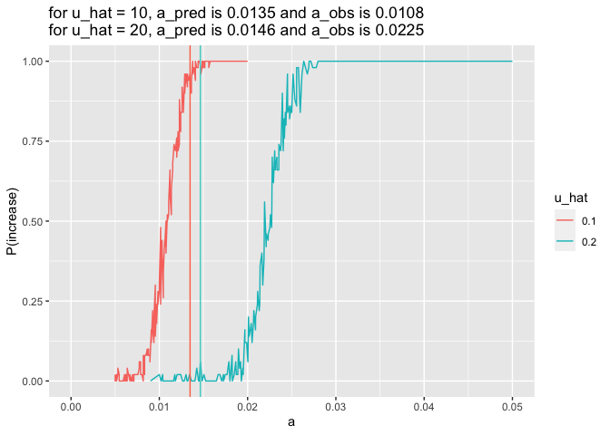
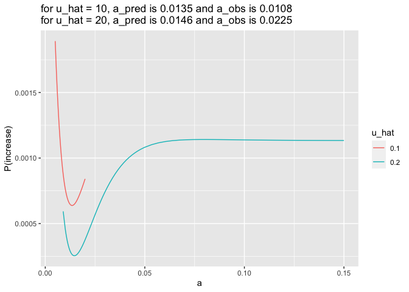

uhat_comparison
================
Isabel Kim
3/30/2022

## u_hat = 10 vs u_hat = 20 - a vs P(increase) on the same axes

``` r
library(tidyverse)
```

    ## ── Attaching packages ─────────────────────────────────────── tidyverse 1.3.1 ──

    ## ✓ ggplot2 3.3.5     ✓ purrr   0.3.4
    ## ✓ tibble  3.1.6     ✓ dplyr   1.0.8
    ## ✓ tidyr   1.2.0     ✓ stringr 1.4.0
    ## ✓ readr   2.1.2     ✓ forcats 0.5.1

    ## ── Conflicts ────────────────────────────────────────── tidyverse_conflicts() ──
    ## x dplyr::filter() masks stats::filter()
    ## x dplyr::lag()    masks stats::lag()

``` r
source("/Users/isabelkim/Desktop/year2/underdominance/reaction-diffusion/cluster/plotting_functions.R")

summary_u10 = read_csv("/Users/isabelkim/Desktop/year2/underdominance/reaction-diffusion/cluster/u_hat=0.1_run/csvs/uhat_10_more_replicate_summary.csv")
```

    ## Rows: 196 Columns: 7

    ## ── Column specification ────────────────────────────────────────────────────────
    ## Delimiter: ","
    ## dbl (7): a, sigma, beta, k, u_hat, delta, p_increase
    ## 
    ## ℹ Use `spec()` to retrieve the full column specification for this data.
    ## ℹ Specify the column types or set `show_col_types = FALSE` to quiet this message.

``` r
obs_vs_pred_u10 = get_a_pred_and_a_obs(summary_u10)

summary_u20 = read_csv("/Users/isabelkim/Desktop/year2/underdominance/reaction-diffusion/cluster/u_hat=0.2_run/csvs/uhat_0.2_more_replicate_summary.csv")
```

    ## Rows: 190 Columns: 7
    ## ── Column specification ────────────────────────────────────────────────────────
    ## Delimiter: ","
    ## dbl (7): a, sigma, beta, k, u_hat, delta, p_increase
    ## 
    ## ℹ Use `spec()` to retrieve the full column specification for this data.
    ## ℹ Specify the column types or set `show_col_types = FALSE` to quiet this message.

``` r
obs_vs_pred_u20 = get_a_pred_and_a_obs(summary_u20)

compiled = rbind(summary_u10, summary_u20)
compiled$u_hat = as.character(compiled$u_hat)

compiled_plot = ggplot(data = compiled, aes(x = a, y = p_increase, color = u_hat)) +
  geom_line() +
  xlab("a") +
  ylab("P(increase)") +
  xlim(0, 0.05) +
  geom_vline(xintercept = obs_vs_pred_u10$a_pred, color = "coral1") +
  geom_vline(xintercept = obs_vs_pred_u20$a_pred, color = "mediumturquoise") +
  labs(title = paste0("for u_hat = 10, a_pred is ", round(obs_vs_pred_u10$a_pred,4), " and a_obs is ", round(obs_vs_pred_u10$a_obs, 4), "\nfor u_hat = 20, a_pred is ", round(obs_vs_pred_u20$a_pred,4), " and a_obs is ", round(obs_vs_pred_u20$a_obs,4)))

#ggsave(filename = "/Users/isabelkim/Desktop/year2/underdominance/reaction-diffusion/cluster/uhat20_vs_uhat10.png", plot = compiled_plot)

compiled_plot
```

    ## Warning: Removed 29 row(s) containing missing values (geom_path).

<!-- -->

It makes sense that when the invasion frequency is lower, a smaller
release area is required in order for the drive to spread – this is why
the coral line (uhat=10) is behind the blue line (uhat=20). The observed
values of a that cause P(increase)=50% are about 0.01 apart. However,
the predicted values of a are way too close. delta should be more
sensitive to changes in u_hat.

## a vs delta for different u_hat

``` r
compiled_delta_plot = ggplot(data = compiled, aes(x = a, y = delta, color = u_hat)) +
  geom_line() +
  xlab("a") +
  ylab("P(increase)") +
  labs(title = paste0("for u_hat = 10, a_pred is ", round(obs_vs_pred_u10$a_pred,4), " and a_obs is ", round(obs_vs_pred_u10$a_obs, 4), "\nfor u_hat = 20, a_pred is ", round(obs_vs_pred_u20$a_pred,4), " and a_obs is ", round(obs_vs_pred_u20$a_obs,4)))

compiled_delta_plot
```

<!-- -->

Where they overlap, these curves have very similar shapes, but the
P(increase) is always higher when u_hat=10% (makes sense with a lower
invasion frequency).
