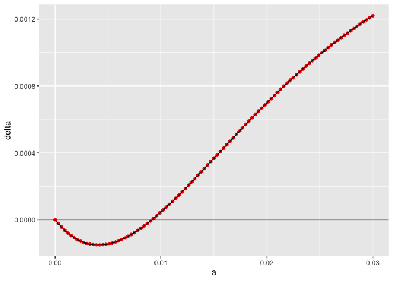
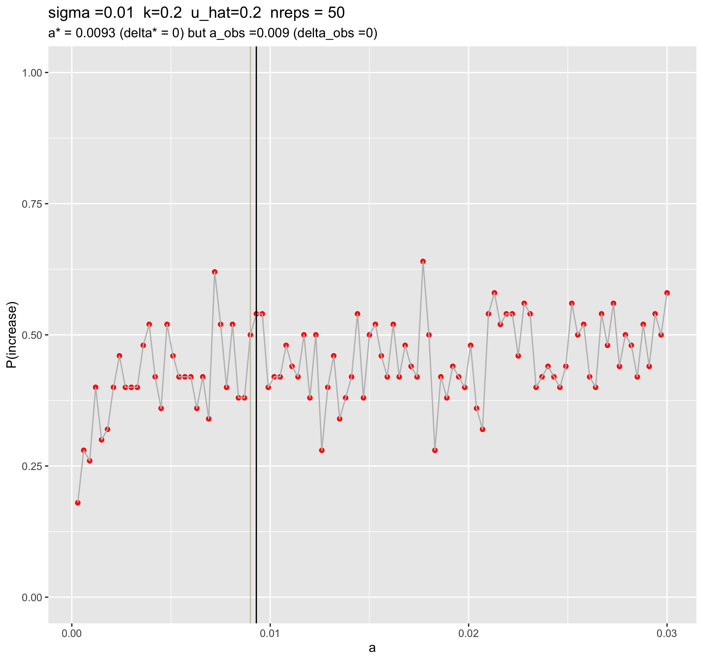
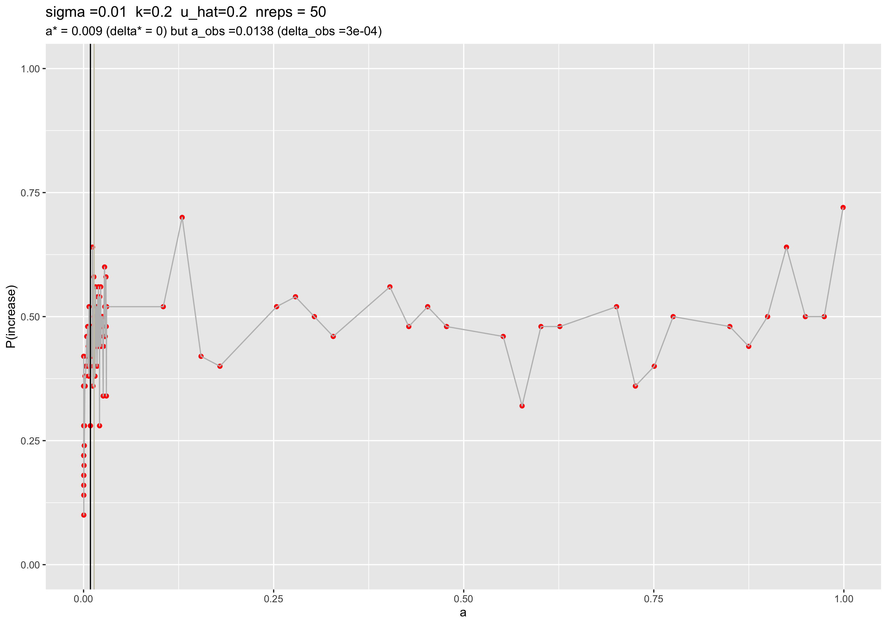

Second batch of cluster runs (with the right delta equation)
================
Isabel Kim
4/6/2022

## Python driver changes

-   Added functions to calculate delta (according to the Mathematica
    equation) in the cluster csv output file.
-   Now the csv will have 6 columns: `a,sigma,k,u_hat,delta,outcome`

## Before submitting to the cluster…

-   Know your sigma, k, and uhat.
-   Create a grid of *a* values.
-   Evaluate *delta* over the grid using
    `factored_delta(a,b,sigma,k,uhat)` with b=1
-   Find the x-intercept (besides a = 0). This is where the critical
    propagule is predicted to occur. Evaluate *a* around this range.

### Example

#### 1. Determine a good range of *a* values for uhat=20% 2nd runs

``` r
source("/Users/isabelkim/Desktop/year2/underdominance/reaction-diffusion/scripts/auc-equations.R")

sigma = 0.01
k = 0.2
uhat = 0.2

n = 101
a_vector = seq(0, 0.03, length.out=n)
delta_vector = rep(-1,n)

for (i in 1:n){
  delta_vector[i] = factored_delta(a_vector[i],1,sigma,k,uhat)
}

library(tidyverse)
```

    ## ── Attaching packages ─────────────────────────────────────── tidyverse 1.3.1 ──

    ## ✓ ggplot2 3.3.5     ✓ purrr   0.3.4
    ## ✓ tibble  3.1.6     ✓ dplyr   1.0.8
    ## ✓ tidyr   1.2.0     ✓ stringr 1.4.0
    ## ✓ readr   2.1.2     ✓ forcats 0.5.1

    ## ── Conflicts ────────────────────────────────────────── tidyverse_conflicts() ──
    ## x dplyr::filter() masks stats::filter()
    ## x dplyr::lag()    masks stats::lag()

``` r
results = tibble(a=a_vector, delta = delta_vector)
p = ggplot(results, aes(x=a,y=delta)) + geom_point(color = "red") + geom_line() + geom_hline(yintercept = 0)

print(p)
```

<!-- -->

``` r
# exclude the a=0 case
a_not_zero = a_vector[2:n]
delta_not_zero = delta_vector[2:n]
ind = which.min(abs(delta_not_zero))
a_star = a_not_zero[ind]
delta_star = delta_not_zero[ind]
print(paste("Delta is",delta_star,"at a=",a_star))
```

    ## [1] "Delta is 7.71857901060168e-06 at a= 0.0093"

Predict that a\* is around 0.009 for uhat=20%

But for the uhat=20% runs, a_obs that caused P(increase)=50% was at
0.0225, so extend the grid for a to at least 0.03

#### 4. Use `create_slurm_text_file.R` to create the text file for the SLURM job

-   ex: for `uhat=20`, use
    `/Users/isabelkim/Desktop/year2/underdominance/reaction-diffusion/cluster/u_hat=0.2_run/slurm_text/second_run.txt`
    -   100 jobs
    -   50 replicates each

#### 5. Create a new shell script to run this

-   ex:
    `/Users/isabelkim/Desktop/year2/underdominance/reaction-diffusion/cluster/u_hat=0.2_run/slurm_main/second_run_vary_a_uhat20.sh`
-   Submit to cluster
    -   `Submitted batch job 4257186` at 4:21pm April 7th

#### 6. Create a script to merge the output .part files once the job is finished

-   ex:
    `/Users/isabelkim/Desktop/year2/underdominance/reaction-diffusion/cluster/u_hat=0.2_run/slurm_merge/second_run_uhat20_merge.sh`
    -   Creates `second_run_uhat20.csv` in my
        `/home/ikk23/underdom/csvs/` folder on the cluster
    -   `/Users/isabelkim/Desktop/year2/underdominance/reaction-diffusion/cluster/u_hat=0.2_run/csv_raw/second_run_uhat20.csv`

#### 7. Analyze output

-   Raw csv:
    `/Users/isabelkim/Desktop/year2/underdominance/reaction-diffusion/cluster/u_hat=0.2_run/csv_raw/second_run_uhat20.csv`
-   Summary csv:
    `/Users/isabelkim/Desktop/year2/underdominance/reaction-diffusion/cluster/u_hat=0.2_run/csvs/summary_second_run_uhat20.csv`

This figure looks a lot different than last time – out predicted a is so
close to the observed a. Is this real?

``` r

```

<!-- -->
Do more runs at the lower and upper range + 2x as many replicates in
this range.

#### Validate in SLiM

-   At a=0.009, do we see success 50% of the time?

-   100 generations:

    -   Replicate 1: decrease
    -   Replicate 2: increase
    -   Replicate 3: increase
    -   Replicate 4: increase
    -   Replicate 5: decrease
    -   Replicate 6: increase
    -   Replicate 7: decrease

-   Yes, this seems plausible.

-   When a is super low (0.0003), do we still get success 18% of the
    time (20% / 1 out of 5)?

-   100 generations:

    -   Replicate 1: decrease (loss)
    -   Replicate 2: increase (but probably wouldn’t ultimately fix)
    -   Replicate 3: increase
    -   Replicate 4: decrease
    -   Replicate 5: decrease

-   Could be plausible

#### Next run

-   Slurm text:
    `/Users/isabelkim/Desktop/year2/underdominance/reaction-diffusion/cluster/u_hat=0.2_run/slurm_text/second_run.txt`
    again

    -   150 jobs

-   Slurm main job:
    `/Users/isabelkim/Desktop/year2/underdominance/reaction-diffusion/cluster/u_hat=0.2_run/slurm_main/second_run_vary_a_uhat20.sh`
    like before but modified job name and array length

    -   `Submitted batch job 4263810`

-   Slurm merge job:
    `/Users/isabelkim/Desktop/year2/underdominance/reaction-diffusion/cluster/u_hat=0.2_run/slurm_merge/second_run_uhat20_merge.sh`
    like before but now outputs csv file called
    `second_run_full_range_uhat20.csv`

-   Merging with some jobs missing as of 3pm:
    `second_run_full_range_uhat20_3pm.csv`

``` r

```

<!-- -->
Something is definitely off. Even when a –> 1.0, there’s still less than
a 75% chance of the drive even spreading.

#### Checking a near 1.0 visually
