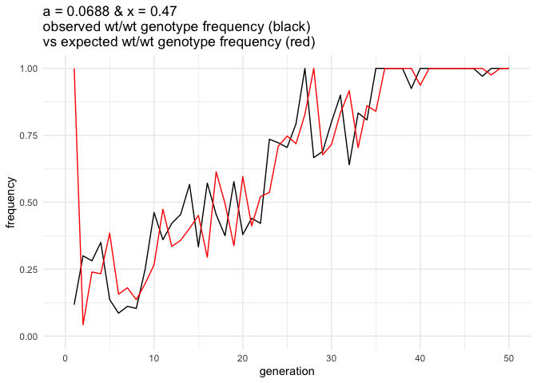

SLiM notes
================
Isabel Kim
5/22/2022

## SLiM model: `/Users/isabelkim/Desktop/year2/underdominance/reaction-diffusion/slim/nonWF-model-hwe-vs-observed-freqs.slim`

-   3 X values: 0.47, 0.5, 0.54

-   In generation 10 (the release generation, with viability selection
    too): start tracking the local rate of the drive at each x-position,
    ex: `sim.setValue("x1_drive_rates", c(drive_allele_freq))`

-   In generation 11 onwards:

    -   For each x-position, get the local rate of the drive and current
        observed genotype frequencies
    -   Use the last generation’s rate of the drive u(x,t-1) to derive
        the expected HWE genotype frequencies
    -   Use the last generation’s rate of the drive u(x,t-1) and the
        fitness values to derive the expected genotype frequencies under
        viability selection
    -   Report all of this out. Example output:

-   `X1:: 0.47 GEN:: 12 obs_freq(DD):: 0.590909 HWE_exp_freq(DD):: 0.782544 viability_exp_freq(DD):: 0.820579 obs_freq(DWT):: 0.409091 HWE_exp_freq(DWT):: 0.204142 viability_exp_freq(DWT):: 0.166494 obs_freq(WT):: 0.0 HWE_exp_freq(WT):: 0.0133136 viability_exp_freq(WT):: 0.0129266`

-   `X2:: 0.5 GEN:: 12 obs_freq(DD):: 0.969697 HWE_exp_freq(DD):: 1.0 viability_exp_freq(DD):: 1.0 obs_freq(DWT):: 0.030303 HWE_exp_freq(DWT):: 0.0 viability_exp_freq(DWT):: 0.0 obs_freq(WT):: 0.0 HWE_exp_freq(WT):: 0.0 viability_exp_freq(WT):: 0.0`

-   `X3:: 0.54 GEN:: 12 obs_freq(DD):: 0.0606061 HWE_exp_freq(DD):: 0.140625 viability_exp_freq(DD):: 0.162216 obs_freq(DWT):: 0.333333 HWE_exp_freq(DWT):: 0.46875 viability_exp_freq(DWT):: 0.420561 obs_freq(WT):: 0.181818 HWE_exp_freq(WT):: 0.390625 viability_exp_freq(WT):: 0.417223`

### Issues

-   This seems way off. Should I be using the last generation’s rate of
    the drive? Wait, shouldn’t HWE genotype frequencies be based on the
    current rate of the drive? Idk!
    -   Look into this tomorrow (Monday, 5/23)

### Monday 5/23 notes

-   No, use x(t-1) to predict x(t+1) frequencies

-   Also add the expected frequency of the drive when viability
    selection acts on HWE frequencies

-   Get rid of the HWE output –> this isn’t really relevant; we already
    have the viability selection predictions.

-   New output lines look like:

-   `X1:: 0.47 GEN:: 11 obs_drive_freq:: 0.942308 predicted_viability_drive_freq:: 0.0 obs_freq(DD):: 0.884615 viability_exp_freq(DD):: 0.0 obs_freq(DWT):: 0.115385 viability_exp_freq(DWT):: 0.0 obs_freq(WT):: 0.0 viability_exp_freq(WT):: 1.0`

-   `X2:: 0.5 GEN:: 11 obs_drive_freq:: 0.961538 predicted_viability_drive_freq:: 0.0 obs_freq(DD):: 0.923077 viability_exp_freq(DD):: 0.0 obs_freq(DWT):: 0.0769231 viability_exp_freq(DWT):: 0.0 obs_freq(WT):: 0.0 viability_exp_freq(WT):: 1.0`

-   `X3:: 0.54 GEN:: 11 obs_drive_freq:: 0.633333 predicted_viability_drive_freq:: 0.0 obs_freq(DD):: 0.153846 viability_exp_freq(DD):: 0.0 obs_freq(DWT):: 0.179487 viability_exp_freq(DWT):: 0.0 obs_freq(WT):: 0.0512821 viability_exp_freq(WT):: 1.0`

### Python script for analyzing output from SLiM locally: `parse_slim_output.py`

-   Call this script and provide the value of a, replicate number, and
    path to text file where SLiM console output is. Pipe the script to a
    csv.
-   Output will be a csv file with 12 columns:
    `a,replicate_number,x,gen,d_allele_freq, exp_d_allele_freq, dd_freq, exp_dd_freq, dwt_freq, exp_dwt_freq, wtwt_freq, exp_wtwt_freq`
    -   Number of rows = (number of generations run for -11)\*3

### R plotting functions

Function to plot the expected vs observed drive frequencies

``` r
library(tidyverse)
```

    ## ── Attaching packages ─────────────────────────────────────── tidyverse 1.3.1 ──

    ## ✓ ggplot2 3.3.5     ✓ purrr   0.3.4
    ## ✓ tibble  3.1.6     ✓ dplyr   1.0.8
    ## ✓ tidyr   1.2.0     ✓ stringr 1.4.0
    ## ✓ readr   2.1.2     ✓ forcats 0.5.1

    ## ── Conflicts ────────────────────────────────────────── tidyverse_conflicts() ──
    ## x dplyr::filter() masks stats::filter()
    ## x dplyr::lag()    masks stats::lag()

``` r
plot_drive_freq = function(full_dataset, this_x, cutoff_gen = 100){
  if (!(this_x %in% c(0.47,0.5,0.54))){
    print("invalid x")
    return(NULL)
  }
  
  x_separated_data = full_dataset %>% filter(x==this_x)
  
  p = ggplot(x_separated_data, aes(x = gen)) + geom_line(aes(y = d_allele_freq), color = "black") + 
    geom_line(aes(y = exp_d_allele_freq), color = "red") + xlab("generation") + ylab("frequency") +
    ylim(0,1) + ggtitle(paste0("a = ", x_separated_data$a[1], " & x = ", this_x,"\nobserved drive frequency (black)\nvs expected drive frequency (red)")) + theme_minimal() + xlim(0, cutoff_gen)
  print(p)
  return(p)
}
```

Function to plot the observed d/d homozygote frequency vs expected

``` r
plot_dd_freq = function(full_dataset, this_x, cutoff_gen = 100){
  if (!(this_x %in% c(0.47,0.5,0.54))){
    print("invalid x")
    return(NULL)
  }
  
  x_separated_data = full_dataset %>% filter(x==this_x)
  
  p = ggplot(x_separated_data, aes(x = gen)) + geom_line(aes(y = dd_freq), color = "black") + 
    geom_line(aes(y = exp_dd_freq), color = "red") + xlab("generation") + ylab("frequency") +
    ylim(0,1) + ggtitle(paste0("a = ", x_separated_data$a[1], " & x = ", this_x,"\nobserved d/d genotype frequency (black)\nvs expected d/d genotype frequency (red)")) + theme_minimal() + xlim(0, cutoff_gen)
  print(p)
  return(p)
}
```

Function to plot the observed d/wt heterozygote frequency vs expected

``` r
plot_dwt_freq = function(full_dataset, this_x, cutoff_gen = 100){
  if (!(this_x %in% c(0.47,0.5,0.54))){
    print("invalid x")
    return(NULL)
  }
  
  x_separated_data = full_dataset %>% filter(x==this_x)
  
  p = ggplot(x_separated_data, aes(x = gen)) + geom_line(aes(y = dwt_freq), color = "black") + 
    geom_line(aes(y = exp_dwt_freq), color = "red") + xlab("generation") + ylab("frequency") +
    ylim(0,1) + ggtitle(paste0("a = ", x_separated_data$a[1], " & x = ", this_x,"\nobserved d/wt genotype frequency (black)\nvs expected d/wt genotype frequency (red)")) + theme_minimal() + xlim(0, cutoff_gen)
  print(p)
  return(p)
}
```

Function to plot the observed wt/wt homozygote frequency vs expected

``` r
plot_wtwt_freq = function(full_dataset, this_x, cutoff_gen = 100){
  if (!(this_x %in% c(0.47,0.5,0.54))){
    print("invalid x")
    return(NULL)
  }
  
  x_separated_data = full_dataset %>% filter(x==this_x)
  
  p = ggplot(x_separated_data, aes(x = gen)) + geom_line(aes(y = wtwt_freq), color = "black") + 
    geom_line(aes(y = exp_wtwt_freq), color = "red") + xlab("generation") + ylab("frequency") +
    ylim(0,1) + ggtitle(paste0("a = ", x_separated_data$a[1], " & x = ", this_x,"\nobserved wt/wt genotype frequency (black)\nvs expected wt/wt genotype frequency (red)")) + theme_minimal() + xlim(0, cutoff_gen)
  print(p)
  return(p)
}
```

Function to create *all* plots

``` r
create_all_plots = function(full_dataset, this_x, cutoff_gen = 100){
  drive_allele_plot = plot_drive_freq(full_dataset, this_x, cutoff_gen)
  dd_plot = plot_dd_freq(full_dataset, this_x, cutoff_gen)
  dwt_plot = plot_dwt_freq(full_dataset, this_x, cutoff_gen)
  wtwt_plot = plot_wtwt_freq(full_dataset, this_x, cutoff_gen)
  
  plot_list = list(drive_allele_plot = drive_allele_plot,
                   dd_plot = dd_plot,
                   dwt_plot = dwt_plot,
                   wtwt_plot = wtwt_plot)
  return(plot_list)
}
```

#### a = 0.08

Run script to get output:
`/Users/isabelkim/Desktop/year2/underdominance/reaction-diffusion/compare-hwe-freqs/slim-pc-csvs/a0.08_rep1.csv`

``` bash
OUTPUT_TEXT_FILE=/Users/isabelkim/Desktop/year2/underdominance/reaction-diffusion/compare-hwe-freqs/slim-pc-output/a0.08.txt
A=0.08
REP=1
OUTPUT_CSV=/Users/isabelkim/Desktop/year2/underdominance/reaction-diffusion/compare-hwe-freqs/slim-pc-csvs/a0.08_rep1.csv

cd /Users/isabelkim/Desktop/year2/underdominance/reaction-diffusion/compare-hwe-freqs

python parse_slim_output.py $A $REP $OUTPUT_TEXT_FILE > $OUTPUT_CSV
```

Read into R and plot the expected drive frequency vs observed drive
frequency for the different x-values

##### x = 0.47 output

``` r
a008_output = read_csv("/Users/isabelkim/Desktop/year2/underdominance/reaction-diffusion/compare-hwe-freqs/slim-pc-csvs/a0.08_rep1.csv")
```

    ## Rows: 300 Columns: 12
    ## ── Column specification ────────────────────────────────────────────────────────
    ## Delimiter: ","
    ## dbl (12): a, replicate_number, x, gen, d_allele_freq, exp_d_allele_freq, dd_...
    ## 
    ## ℹ Use `spec()` to retrieve the full column specification for this data.
    ## ℹ Specify the column types or set `show_col_types = FALSE` to quiet this message.

``` r
# Separate based on x-position
x1 = a008_output %>% filter(x == 0.47)
x2 = a008_output %>% filter(x == 0.5)
x3 = a008_output %>% filter(x == 0.54)

x1_plot_list = create_all_plots(a008_output, this_x = 0.47, cutoff_gen = 50)
```

    ## Warning: Removed 50 row(s) containing missing values (geom_path).
    ## Removed 50 row(s) containing missing values (geom_path).

<!-- -->

    ## Warning: Removed 50 row(s) containing missing values (geom_path).
    ## Removed 50 row(s) containing missing values (geom_path).

<!-- -->

    ## Warning: Removed 50 row(s) containing missing values (geom_path).
    ## Removed 50 row(s) containing missing values (geom_path).

<!-- -->

    ## Warning: Removed 50 row(s) containing missing values (geom_path).
    ## Removed 50 row(s) containing missing values (geom_path).

<!-- -->

For the drive allele frequency, the d/d homozygous frequency, and the
wt/wt homozygous frequency all look like the observed line would follow
the expected line if the observed frequency was in the next generation.
Right now, the predicted frequencies are based on the last generation’s
drive allele frequency. Should I try it with the current generation’s
drive allele frequency?

The drive heterozygote frequency is the furthest off in shape from the
expected line.

##### x = 0.5 output

``` r
x1_plot_list = create_all_plots(a008_output, this_x = 0.5, cutoff_gen = 50)
```

    ## Warning: Removed 50 row(s) containing missing values (geom_path).
    ## Removed 50 row(s) containing missing values (geom_path).

<!-- -->

    ## Warning: Removed 50 row(s) containing missing values (geom_path).
    ## Removed 50 row(s) containing missing values (geom_path).

<!-- -->

    ## Warning: Removed 50 row(s) containing missing values (geom_path).
    ## Removed 50 row(s) containing missing values (geom_path).

<!-- -->

    ## Warning: Removed 50 row(s) containing missing values (geom_path).
    ## Removed 50 row(s) containing missing values (geom_path).

<!-- --> Again,
there’s a lag in shape of all graphs except the d/wt heterozygote graph.

##### x = 0.54 output

``` r
x1_plot_list = create_all_plots(a008_output, this_x = 0.54, cutoff_gen = 50)
```

    ## Warning: Removed 50 row(s) containing missing values (geom_path).
    ## Removed 50 row(s) containing missing values (geom_path).

<!-- -->

    ## Warning: Removed 50 row(s) containing missing values (geom_path).
    ## Removed 50 row(s) containing missing values (geom_path).

<!-- -->

    ## Warning: Removed 50 row(s) containing missing values (geom_path).
    ## Removed 50 row(s) containing missing values (geom_path).

<!-- -->

    ## Warning: Removed 50 row(s) containing missing values (geom_path).
    ## Removed 50 row(s) containing missing values (geom_path).

<!-- --> There’s
the same lag in shape, but the observed values also tend to fluctuate
more than the predicted values too.

##### a = 0.08 when SLiM model is edited to use x(t) for predicted frequencies rather than x(t-1)

``` bash
A=0.08
REPLICATE=1
OUTPUT=/Users/isabelkim/Desktop/year2/underdominance/reaction-diffusion/compare-hwe-freqs/slim-pc-output/a0.08_current_rate.txt
CSV=/Users/isabelkim/Desktop/year2/underdominance/reaction-diffusion/compare-hwe-freqs/slim-pc-csvs/a0.08_current_rate.csv

cd /Users/isabelkim/Desktop/year2/underdominance/reaction-diffusion/compare-hwe-freqs/
python parse_slim_output.py $A $REPLICATE $OUTPUT > $CSV
```

``` r
output = read_csv("/Users/isabelkim/Desktop/year2/underdominance/reaction-diffusion/compare-hwe-freqs/slim-pc-csvs/a0.08_current_rate.csv")
```

    ## Rows: 300 Columns: 12
    ## ── Column specification ────────────────────────────────────────────────────────
    ## Delimiter: ","
    ## dbl (12): a, replicate_number, x, gen, d_allele_freq, exp_d_allele_freq, dd_...
    ## 
    ## ℹ Use `spec()` to retrieve the full column specification for this data.
    ## ℹ Specify the column types or set `show_col_types = FALSE` to quiet this message.

``` r
x1_plot_list = create_all_plots(output, this_x = 0.47, cutoff_gen = 50)
```

    ## Warning: Removed 50 row(s) containing missing values (geom_path).
    ## Removed 50 row(s) containing missing values (geom_path).

<!-- -->

    ## Warning: Removed 50 row(s) containing missing values (geom_path).
    ## Removed 50 row(s) containing missing values (geom_path).

<!-- -->

    ## Warning: Removed 50 row(s) containing missing values (geom_path).
    ## Removed 50 row(s) containing missing values (geom_path).

<!-- -->

    ## Warning: Removed 50 row(s) containing missing values (geom_path).
    ## Removed 50 row(s) containing missing values (geom_path).

<!-- -->

``` r
x1_plot_list
```

    ## $drive_allele_plot

    ## Warning: Removed 50 row(s) containing missing values (geom_path).
    ## Removed 50 row(s) containing missing values (geom_path).

<!-- -->

    ## 
    ## $dd_plot

    ## Warning: Removed 50 row(s) containing missing values (geom_path).
    ## Removed 50 row(s) containing missing values (geom_path).

<!-- -->

    ## 
    ## $dwt_plot

    ## Warning: Removed 50 row(s) containing missing values (geom_path).
    ## Removed 50 row(s) containing missing values (geom_path).

<!-- -->

    ## 
    ## $wtwt_plot

    ## Warning: Removed 50 row(s) containing missing values (geom_path).
    ## Removed 50 row(s) containing missing values (geom_path).

<!-- -->

-   Lag is mostly gone in shape. The drive allele x(t) matches the \[wAA
    x^2(t) + wAa x(t) (1 - x(t))\]/w_mean well? Might be just slightly
    lower? Does this actually mean anything though?
-   The dd homozygous frequency freq(DD) = (wAA/wmean)\*(x^2 (t)) well…
    but what does this mean?
-   Same with the wildtype homozygous frequency
-   But the heterozygote frequency was higher than expected for most of
    these early generations.

But it doesn’t actually make sense to use the current generation’s drive
allele frequency. If the drive allele frequency was x(t-1), we’d expect
the percent of homozygotes to be \[x(t-1)\]^2 in the next generation.
But due to fitness differences, this percentage can be weighed up or
down. This results in the predictions for the *next* generation.

#### a = 0.0688 using x(t-1) for predictions

``` bash
A=0.0688
REPLICATE=1
TEXT=/Users/isabelkim/Desktop/year2/underdominance/reaction-diffusion/compare-hwe-freqs/slim-pc-output/a0.0688.txt
CSV=/Users/isabelkim/Desktop/year2/underdominance/reaction-diffusion/compare-hwe-freqs/slim-pc-csvs/a0.0688_rep1.csv

python parse_slim_output.py $A $REPLICATE $TEXT > $CSV
```

``` r
output = read_csv("/Users/isabelkim/Desktop/year2/underdominance/reaction-diffusion/compare-hwe-freqs/slim-pc-csvs/a0.0688_rep1.csv")
```

    ## Rows: 300 Columns: 12
    ## ── Column specification ────────────────────────────────────────────────────────
    ## Delimiter: ","
    ## dbl (12): a, replicate_number, x, gen, d_allele_freq, exp_d_allele_freq, dd_...
    ## 
    ## ℹ Use `spec()` to retrieve the full column specification for this data.
    ## ℹ Specify the column types or set `show_col_types = FALSE` to quiet this message.

``` r
x1_list = create_all_plots(output, 0.47, 50)
```

    ## Warning: Removed 50 row(s) containing missing values (geom_path).
    ## Removed 50 row(s) containing missing values (geom_path).

<!-- -->

    ## Warning: Removed 50 row(s) containing missing values (geom_path).
    ## Removed 50 row(s) containing missing values (geom_path).

<!-- -->

    ## Warning: Removed 50 row(s) containing missing values (geom_path).
    ## Removed 50 row(s) containing missing values (geom_path).

<!-- -->

    ## Warning: Removed 50 row(s) containing missing values (geom_path).
    ## Removed 50 row(s) containing missing values (geom_path).

<!-- -->

``` r
x2_list = create_all_plots(output, 0.5, 50)
```

    ## Warning: Removed 50 row(s) containing missing values (geom_path).
    ## Removed 50 row(s) containing missing values (geom_path).

<!-- -->

    ## Warning: Removed 50 row(s) containing missing values (geom_path).
    ## Removed 50 row(s) containing missing values (geom_path).

<!-- -->

    ## Warning: Removed 50 row(s) containing missing values (geom_path).
    ## Removed 50 row(s) containing missing values (geom_path).

<!-- -->

    ## Warning: Removed 50 row(s) containing missing values (geom_path).
    ## Removed 50 row(s) containing missing values (geom_path).

<!-- -->

``` r
x3_list = create_all_plots(output, 0.54, 50)
```

    ## Warning: Removed 50 row(s) containing missing values (geom_path).
    ## Removed 50 row(s) containing missing values (geom_path).

<!-- -->

    ## Warning: Removed 50 row(s) containing missing values (geom_path).
    ## Removed 50 row(s) containing missing values (geom_path).

<!-- -->

    ## Warning: Removed 50 row(s) containing missing values (geom_path).
    ## Removed 50 row(s) containing missing values (geom_path).

<!-- -->

    ## Warning: Removed 50 row(s) containing missing values (geom_path).
    ## Removed 50 row(s) containing missing values (geom_path).

<!-- --> \* Why
are the peaks in drive allele frequency or dd frequency always 1
generation before they are predicted? The predicted drive allele
frequency is based on the last *observed* value, ie \[wAA x^2(t-1) + wAa
x(t-1) (1-x(t-1))\]/wMean + So when x(t-1) was high in the last
generation, the frequency in the next generation will also tend to be
high. This explains the shape. The red line should lag behind the black.

### Conclusion

On a generation-by-generation basis, the frequencies are far off from
what they’re predicted to be (based on HWE and viability selection).

### Changing the fitness values to wAA/mean(W) where the mean(W) depends on the current frequency of the drive allele, rather than the old wAA/wAA

#### a = 0.0688

``` bash
A=0.0688
REPLICATE=1
TEXT=/Users/isabelkim/Desktop/year2/underdominance/reaction-diffusion/compare-hwe-freqs/slim-pc-output/a0.0688_new_fitness.txt
CSV=/Users/isabelkim/Desktop/year2/underdominance/reaction-diffusion/compare-hwe-freqs/slim-pc-csvs/a0.0688_new_fitness.csv

python parse_slim_output.py $A $REPLICATE $TEXT > $CSV
```

``` r
output = read_csv("/Users/isabelkim/Desktop/year2/underdominance/reaction-diffusion/compare-hwe-freqs/slim-pc-csvs/a0.0688_new_fitness.csv")
```

    ## Rows: 261 Columns: 12
    ## ── Column specification ────────────────────────────────────────────────────────
    ## Delimiter: ","
    ## dbl (12): a, replicate_number, x, gen, d_allele_freq, exp_d_allele_freq, dd_...
    ## 
    ## ℹ Use `spec()` to retrieve the full column specification for this data.
    ## ℹ Specify the column types or set `show_col_types = FALSE` to quiet this message.

``` r
x1_list = create_all_plots(output, 0.47, 50)
```

    ## Warning: Removed 37 row(s) containing missing values (geom_path).
    ## Removed 37 row(s) containing missing values (geom_path).

<!-- -->

    ## Warning: Removed 37 row(s) containing missing values (geom_path).
    ## Removed 37 row(s) containing missing values (geom_path).

<!-- -->

    ## Warning: Removed 37 row(s) containing missing values (geom_path).
    ## Removed 37 row(s) containing missing values (geom_path).

<!-- -->

    ## Warning: Removed 37 row(s) containing missing values (geom_path).
    ## Removed 37 row(s) containing missing values (geom_path).

<!-- -->

``` r
x2_list = create_all_plots(output, 0.5, 50)
```

    ## Warning: Removed 37 row(s) containing missing values (geom_path).
    ## Removed 37 row(s) containing missing values (geom_path).

<!-- -->

    ## Warning: Removed 37 row(s) containing missing values (geom_path).
    ## Removed 37 row(s) containing missing values (geom_path).

<!-- -->

    ## Warning: Removed 37 row(s) containing missing values (geom_path).
    ## Removed 37 row(s) containing missing values (geom_path).

<!-- -->

    ## Warning: Removed 37 row(s) containing missing values (geom_path).
    ## Removed 37 row(s) containing missing values (geom_path).

<!-- -->

``` r
x3_list = create_all_plots(output, 0.54, 50)
```

    ## Warning: Removed 37 row(s) containing missing values (geom_path).
    ## Removed 37 row(s) containing missing values (geom_path).

<!-- -->

    ## Warning: Removed 37 row(s) containing missing values (geom_path).
    ## Removed 37 row(s) containing missing values (geom_path).

<!-- -->

    ## Warning: Removed 37 row(s) containing missing values (geom_path).
    ## Removed 37 row(s) containing missing values (geom_path).

<!-- -->

    ## Warning: Removed 37 row(s) containing missing values (geom_path).
    ## Removed 37 row(s) containing missing values (geom_path).

<!-- --> Not
sure if this actually helped? Should maybe track the deviations from HWE
better.

### Tracking deviations from HWE

-   Add this to each row in a csv
-   % error = \|expected − observed\|/expected

``` r
raw_csv = read_csv("/Users/isabelkim/Desktop/year2/underdominance/reaction-diffusion/compare-hwe-freqs/slim-pc-csvs/a0.0688_new_fitness.csv")
```

    ## Rows: 261 Columns: 12
    ## ── Column specification ────────────────────────────────────────────────────────
    ## Delimiter: ","
    ## dbl (12): a, replicate_number, x, gen, d_allele_freq, exp_d_allele_freq, dd_...
    ## 
    ## ℹ Use `spec()` to retrieve the full column specification for this data.
    ## ℹ Specify the column types or set `show_col_types = FALSE` to quiet this message.

``` r
csv_deviation_hwes = raw_csv %>% mutate(d_freq_percent_error = abs(exp_d_allele_freq-d_allele_freq)/exp_d_allele_freq,
                                        dd_freq_percent_error = abs(exp_dd_freq - dd_freq)/exp_dd_freq,
                                        dwt_freq_percent_error = abs(exp_dwt_freq - dwt_freq)/exp_dwt_freq,
                                        wtwt_freq_percent_error = abs(exp_wtwt_freq - wtwt_freq)/exp_wtwt_freq)

x1_percent_error_d_plot = csv_deviation_hwes %>% filter(x == 0.47) %>%
  ggplot(aes(x = gen, y = d_freq_percent_error)) + theme_minimal() + xlab("gen") + ylab("% error") + ylim(0,1) +
  xlim(0,50) + ggtitle("a = 0.0688 & x = 0.47 % error for d_freq") + geom_line(color = "green") 

x1_percent_error_dd_plot = csv_deviation_hwes %>% filter(x == 0.47) %>%
  ggplot(aes(x = gen, y = dd_freq_percent_error)) + theme_minimal() + xlab("gen") + ylab("% error") + ylim(0,1) +
  xlim(0,50) + ggtitle("a = 0.0688 & x = 0.47 % error for dd_freq") + geom_line(color = "red") 


x2_percent_error_d_plot = csv_deviation_hwes %>% filter(x == 0.5) %>%
  ggplot(aes(x = gen, y = d_freq_percent_error)) + theme_minimal() + xlab("gen") + ylab("% error") + ylim(0,1) +
  xlim(0,50) + ggtitle("a = 0.0688 & x = 0.5 % error for d_freq") + geom_line(color = "green") 

x2_percent_error_dd_plot = csv_deviation_hwes %>% filter(x == 0.5) %>%
  ggplot(aes(x = gen, y = dd_freq_percent_error)) + theme_minimal() + xlab("gen") + ylab("% error") + ylim(0,1) +
  xlim(0,50) + ggtitle("a = 0.0688 & x = 0.5 % error for dd_freq") + geom_line(color = "red") 

x3_percent_error_d_plot = csv_deviation_hwes %>% filter(x == 0.54) %>%
  ggplot(aes(x = gen, y = d_freq_percent_error)) + theme_minimal() + xlab("gen") + ylab("% error") + ylim(0,1) +
  xlim(0,50) + ggtitle("a = 0.0688 & x = 0.54 % error for d_freq") + geom_line(color = "green") 

x3_percent_error_dd_plot = csv_deviation_hwes %>% filter(x == 0.54) %>%
  ggplot(aes(x = gen, y = dd_freq_percent_error)) + theme_minimal() + xlab("gen") + ylab("% error") + ylim(0,1) +
  xlim(0,50) + ggtitle("a = 0.0688 & x = 0.54 % error for dd_freq") + geom_line(color = "red") 

print(x1_percent_error_d_plot)
```

    ## Warning: Removed 39 row(s) containing missing values (geom_path).

<!-- -->

``` r
print(x1_percent_error_dd_plot)
```

    ## Warning: Removed 39 row(s) containing missing values (geom_path).

<!-- -->

``` r
print(x2_percent_error_d_plot)
```

    ## Warning: Removed 50 row(s) containing missing values (geom_path).

<!-- -->

``` r
print(x2_percent_error_dd_plot)
```

    ## Warning: Removed 50 row(s) containing missing values (geom_path).

<!-- -->

``` r
print(x3_percent_error_d_plot)
```

    ## Warning: Removed 45 row(s) containing missing values (geom_path).

<!-- -->

``` r
print(x3_percent_error_dd_plot)
```

    ## Warning: Removed 45 row(s) containing missing values (geom_path).

<!-- -->

Really high % error differences between the observed frequencies and
expected frequencies.

What could be causing these differences?

### Using the early() drive frequency as the x(t)

#### a = 0.0688

``` bash
A=0.0688
REPLICATE=1
TEXT=/Users/isabelkim/Desktop/year2/underdominance/reaction-diffusion/compare-hwe-freqs/slim-pc-output/a0.0688_early_freq.txt
CSV=/Users/isabelkim/Desktop/year2/underdominance/reaction-diffusion/compare-hwe-freqs/slim-pc-csvs/a0.0688_early_freq.csv

python parse_slim_output.py $A $REPLICATE $TEXT > $CSV
```

``` r
output = read_csv("/Users/isabelkim/Desktop/year2/underdominance/reaction-diffusion/compare-hwe-freqs/slim-pc-csvs/a0.0688_early_freq.csv")
```

    ## Rows: 192 Columns: 12
    ## ── Column specification ────────────────────────────────────────────────────────
    ## Delimiter: ","
    ## dbl (12): a, replicate_number, x, gen, d_allele_freq, exp_d_allele_freq, dd_...
    ## 
    ## ℹ Use `spec()` to retrieve the full column specification for this data.
    ## ℹ Specify the column types or set `show_col_types = FALSE` to quiet this message.

``` r
x1_list = create_all_plots(output, 0.47, 50)
```

    ## Warning: Removed 14 row(s) containing missing values (geom_path).
    ## Removed 14 row(s) containing missing values (geom_path).

<!-- -->

    ## Warning: Removed 14 row(s) containing missing values (geom_path).
    ## Removed 14 row(s) containing missing values (geom_path).

<!-- -->

    ## Warning: Removed 14 row(s) containing missing values (geom_path).
    ## Removed 14 row(s) containing missing values (geom_path).

<!-- -->

    ## Warning: Removed 14 row(s) containing missing values (geom_path).
    ## Removed 14 row(s) containing missing values (geom_path).

<!-- -->

``` r
x2_list = create_all_plots(output, 0.5, 50)
```

    ## Warning: Removed 14 row(s) containing missing values (geom_path).
    ## Removed 14 row(s) containing missing values (geom_path).

<!-- -->

    ## Warning: Removed 14 row(s) containing missing values (geom_path).
    ## Removed 14 row(s) containing missing values (geom_path).

<!-- -->

    ## Warning: Removed 14 row(s) containing missing values (geom_path).
    ## Removed 14 row(s) containing missing values (geom_path).

<!-- -->

    ## Warning: Removed 14 row(s) containing missing values (geom_path).
    ## Removed 14 row(s) containing missing values (geom_path).

<!-- -->

``` r
x3_list = create_all_plots(output, 0.54, 50)
```

    ## Warning: Removed 14 row(s) containing missing values (geom_path).
    ## Removed 14 row(s) containing missing values (geom_path).

<!-- -->

    ## Warning: Removed 14 row(s) containing missing values (geom_path).
    ## Removed 14 row(s) containing missing values (geom_path).

<!-- -->

    ## Warning: Removed 14 row(s) containing missing values (geom_path).
    ## Removed 14 row(s) containing missing values (geom_path).

<!-- -->

    ## Warning: Removed 14 row(s) containing missing values (geom_path).
    ## Removed 14 row(s) containing missing values (geom_path).

<!-- -->

Not nearly as much as a lag! But the magnitudes are still a little off.

Percent errors:

``` r
csv_deviation_hwes = output %>% mutate(d_freq_percent_error = abs(exp_d_allele_freq-d_allele_freq)/exp_d_allele_freq,
                                        dd_freq_percent_error = abs(exp_dd_freq - dd_freq)/exp_dd_freq,
                                        dwt_freq_percent_error = abs(exp_dwt_freq - dwt_freq)/exp_dwt_freq,
                                        wtwt_freq_percent_error = abs(exp_wtwt_freq - wtwt_freq)/exp_wtwt_freq)

x1_percent_error_d_plot = csv_deviation_hwes %>% filter(x == 0.47) %>%
  ggplot(aes(x = gen, y = d_freq_percent_error)) + theme_minimal() + xlab("gen") + ylab("% error") + ylim(0,1) +
  xlim(0,50) + ggtitle("a = 0.0688 & x = 0.47 % error for d_freq") + geom_line(color = "green") 

x1_percent_error_dd_plot = csv_deviation_hwes %>% filter(x == 0.47) %>%
  ggplot(aes(x = gen, y = dd_freq_percent_error)) + theme_minimal() + xlab("gen") + ylab("% error") + ylim(0,1) +
  xlim(0,50) + ggtitle("a = 0.0688 & x = 0.47 % error for dd_freq") + geom_line(color = "red") 


x2_percent_error_d_plot = csv_deviation_hwes %>% filter(x == 0.5) %>%
  ggplot(aes(x = gen, y = d_freq_percent_error)) + theme_minimal() + xlab("gen") + ylab("% error") + ylim(0,1) +
  xlim(0,50) + ggtitle("a = 0.0688 & x = 0.5 % error for d_freq") + geom_line(color = "green") 

x2_percent_error_dd_plot = csv_deviation_hwes %>% filter(x == 0.5) %>%
  ggplot(aes(x = gen, y = dd_freq_percent_error)) + theme_minimal() + xlab("gen") + ylab("% error") + ylim(0,1) +
  xlim(0,50) + ggtitle("a = 0.0688 & x = 0.5 % error for dd_freq") + geom_line(color = "red") 

x3_percent_error_d_plot = csv_deviation_hwes %>% filter(x == 0.54) %>%
  ggplot(aes(x = gen, y = d_freq_percent_error)) + theme_minimal() + xlab("gen") + ylab("% error") + ylim(0,1) +
  xlim(0,50) + ggtitle("a = 0.0688 & x = 0.54 % error for d_freq") + geom_line(color = "green") 

x3_percent_error_dd_plot = csv_deviation_hwes %>% filter(x == 0.54) %>%
  ggplot(aes(x = gen, y = dd_freq_percent_error)) + theme_minimal() + xlab("gen") + ylab("% error") + ylim(0,1) +
  xlim(0,50) + ggtitle("a = 0.0688 & x = 0.54 % error for dd_freq") + geom_line(color = "red") 

print(x1_percent_error_d_plot)
```

    ## Warning: Removed 22 row(s) containing missing values (geom_path).

<!-- -->

``` r
print(x1_percent_error_dd_plot)
```

    ## Warning: Removed 23 row(s) containing missing values (geom_path).

<!-- -->

``` r
print(x2_percent_error_d_plot)
```

    ## Warning: Removed 17 row(s) containing missing values (geom_path).

<!-- -->

``` r
print(x2_percent_error_dd_plot)
```

    ## Warning: Removed 17 row(s) containing missing values (geom_path).

<!-- -->

``` r
print(x3_percent_error_d_plot)
```

    ## Warning: Removed 20 row(s) containing missing values (geom_path).

<!-- -->

``` r
print(x3_percent_error_dd_plot)
```

    ## Warning: Removed 20 row(s) containing missing values (geom_path).

<!-- -->

Percent error increases as the generation increases, but it’s lower than
it was before. More faith that these HWE frequencies (with viability
selection applied) predicts the late() frequencies well.
