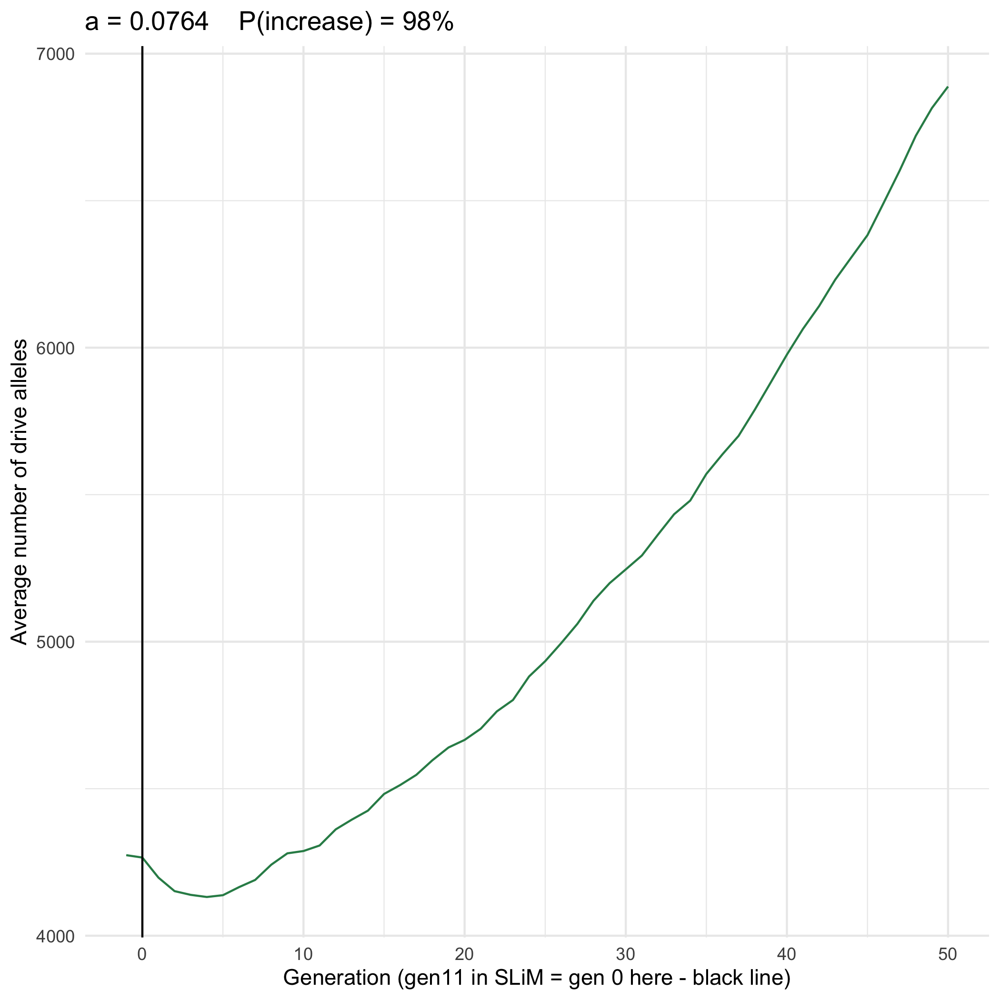

```{r setup, include=FALSE}
knitr::opts_chunk$set(echo = TRUE)
```

## Files

* SLiM model (with viability selection disabled in generation 10): `nonWF-model-drive-homozygotes.slim`
  + Output: `GEN:: 13 n_dd:: 112 n_dwt:: 651 fitness:: 394.38 number_of_drive_alleles:: 875 popsize:: 25940`
* Python driver: `python_driver_disable_gen10.py`
* Text file: `may21-slurm-text.txt`
  + Values of a:
    1. a = 0.02
    2. a = 0.056
    3. a = 0.0586
    4. a = 0.06
    5. a = 0.0611
    6. a = 0.0637
    7. a = 0.0662
    8. a = 0.0688
    9. a = 0.07
    10. a = 0.0713
    11. a = 0.0739
    12. a = 0.0764
    13. a = 0.0790
    14. a = 0.08
    15. 0.1
    16. 0.25
  + (16) values of a, each has 2 array jobs of 50 replicates each --> 100 total replicates
* SLURM script: `may21-slurm-script.sh`
  + `Submitted batch job 4356951` on 5/21 at 5:22pm

## Functions for analyzing cluster results and plotting

* Cluster output should be in `/Users/isabelkim/Desktop/year2/underdominance/reaction-diffusion/diagnostics-may21/cluster-csvs/` and should be in the format `aVALUE_repVALUE.csv`
  + ex: `a0.02_rep1.csv`

```{r}
library(tidyverse)

compile_and_average_csvs_and_plot = function(a, save_data = TRUE, cutoff_gen = 25){
  dir = "/Users/isabelkim/Desktop/year2/underdominance/reaction-diffusion/diagnostics-may21/cluster-csvs/"
  csv1 = read_csv(file = paste0(dir,"a",a,"_rep1.csv"))
  csv2 = read_csv(file = paste0(dir,"a",a,"_rep2.csv"))
  compiled_data = rbind(csv1,csv2)
  
  # Add an outcome column to each replicate and replace the replicate number
  gen_start_points = which(compiled_data$gen == -1)
  gen_end_points = gen_start_points[2:100] - 1
  gen_end_points = c(gen_end_points, nrow(compiled_data))
  
  replicate_column = rep(-1,nrow(compiled_data))
  outcome_column = rep(-1,nrow(compiled_data))
  for (i in 1:100){
    s = gen_start_points[i]
    e = gen_end_points[i]
    replicate_rows = compiled_data[s:e,]
    replicate_column[s:e] = rep(i,length(s:e))
    start_d_alleles = replicate_rows$num_d_alleles[1]
    end_d_alleles = replicate_rows$num_d_alleles[nrow(replicate_rows)]
    if (start_d_alleles > end_d_alleles){
      outcome_column[s:e] = rep("decrease", length(s:e))
    } else if (start_d_alleles < end_d_alleles){
      outcome_column[s:e] = rep("increase", length(s:e))
    } else {
      outcome_column[s:e] = rep("constant", length(s:e))
    }
  }
  
  compiled_data_edit = compiled_data %>% 
    add_column(replicate_number = replicate_column,eventual_outcome = outcome_column) %>%
    dplyr::select(a, replicate_number, gen, num_dd, num_dwt, 
                  num_d_alleles, d_fitness,popsize,eventual_outcome)
  
  output_dir_compiled = "/Users/isabelkim/Desktop/year2/underdominance/reaction-diffusion/diagnostics-may21/compiled_csvs/"
  output_dir_averaged = "/Users/isabelkim/Desktop/year2/underdominance/reaction-diffusion/diagnostics-may21/averaged_csvs/"
  
  compiled_file_name = paste0(output_dir_compiled, "a",a,"_compiled_csv_may_21.csv")
  averaged_file_name = paste0(output_dir_averaged, "a",a,"_averaged_csv_may_21.csv")
  
  if (save_data){
    write_csv(x = compiled_data_edit, file = compiled_file_name)
    print(paste("Writing out to", compiled_file_name))
  }
  
  # Report percent of replicates with drive increase
  p_increase = mean(outcome_column[gen_start_points] == "increase")
  print(paste("For a =",a,"--> P(increase) =",p_increase))
  
  # Average the data across replicates
  gen_vector = min(compiled_data_edit$gen):max(compiled_data_edit$gen)
  a_vector = rep(a, length(gen_vector))
  
  # fill in
  num_dd_vector = rep(-1,length(gen_vector)) 
  num_dwt_vector = rep(-1,length(gen_vector))
  num_d_alleles_vector = rep(-1,length(gen_vector))
  d_fitness_vector = rep(-1,length(gen_vector))
  popsize_vector = rep(-1,length(gen_vector))
  num_replicates = rep(-1,length(gen_vector))
  
  for (i in 1:length(gen_vector)){
    g = gen_vector[i]
    # Grab all rows associated with this generation
    gen_rows = compiled_data_edit %>% filter(gen == g)
    num_replicates[i] = nrow(gen_rows)
    num_dd_vector[i] = mean(gen_rows$num_dd)
    num_dwt_vector[i] = mean(gen_rows$num_dwt)
    num_d_alleles_vector[i] = mean(gen_rows$num_d_alleles)
    d_fitness_vector[i] = mean(gen_rows$d_fitness)
    popsize_vector[i] = mean(gen_rows$popsize)
  }
  avg_tibble = tibble(a = a_vector, 
                      gen = gen_vector, 
                      avg_num_dd = num_dd_vector,
                      avg_num_dwt = num_dwt_vector, 
                      avg_num_d_alleles = num_d_alleles_vector,
                      avg_d_fitness = d_fitness_vector,
                      avg_popsize = popsize_vector,
                      num_replicates = num_replicates)
  
  if (save_data){
    write_csv(x = avg_tibble, file = averaged_file_name)
    print(paste("Writing out to", averaged_file_name))
  }
  
  # Plot
  # Get rid of gen10 and gens too far out
  short_data = avg_tibble %>% filter(gen <= cutoff_gen)
  
  p = ggplot(short_data,aes(x = gen, y = avg_num_d_alleles)) + 
    geom_line(color = "seagreen") + theme_minimal() +
    ggtitle(paste0("a = ",a,"    P(increase) = ",p_increase*100,"%")) +
    xlab("Generation (gen11 in SLiM = gen 0 here - black line)") +
    ylab("Average number of drive alleles") +
    geom_vline(xintercept = 0)
  
  if (save_data){
    plot_dir = "/Users/isabelkim/Desktop/year2/underdominance/reaction-diffusion/diagnostics-may21/plots/"
    plot_name = paste0(plot_dir,"a",a,"_num_drive_alleles_cutoff_gen",cutoff_gen,".png")
    ggsave(plot = p, filename = plot_name)
    print(paste("Saving plot to",plot_name))
  }
  
  result_list = list(compiled_data = compiled_data_edit,
                     averaged_data = avg_tibble,
                     p_increase = p_increase,
                     plot = p)
  return(result_list)
}
```

## a = 0.02

```{r eval=F}
res = compile_and_average_csvs_and_plot(a=0.02, cutoff_gen = 50)
```

* Compiled csv: `/Users/isabelkim/Desktop/year2/underdominance/reaction-diffusion/diagnostics-may21/compiled_csvs/a0.02_compiled_csv_may_21.csv`
* Averaged csv: `/Users/isabelkim/Desktop/year2/underdominance/reaction-diffusion/diagnostics-may21/averaged_csvs/a0.02_averaged_csv_may_21.csv`
* p_increase = 0%


```{r}

```

## a = 0.056
```{r eval=F}
res = compile_and_average_csvs_and_plot(a=0.056, cutoff_gen = 50)
```

* Compiled csv: `/Users/isabelkim/Desktop/year2/underdominance/reaction-diffusion/diagnostics-may21/compiled_csvs/a0.056_compiled_csv_may_21.csv`
* Averaged csv: `/Users/isabelkim/Desktop/year2/underdominance/reaction-diffusion/diagnostics-may21/averaged_csvs/a0.056_averaged_csv_may_21.csv`
* p_increase = 0%

```{r}

```
## a = 0.0586

```{r eval=F}
res = compile_and_average_csvs_and_plot(a=0.0586, cutoff_gen = 50)
```

* Compiled csv: `/Users/isabelkim/Desktop/year2/underdominance/reaction-diffusion/diagnostics-may21/compiled_csvs/a0.0586_compiled_csv_may_21.csv`
* Averaged csv: `/Users/isabelkim/Desktop/year2/underdominance/reaction-diffusion/diagnostics-may21/averaged_csvs/a0.0586_averaged_csv_may_21.csv`
* p_increase = 3%

```{r}

```
## a = 0.06


```{r eval=F}
res = compile_and_average_csvs_and_plot(a=0.06, cutoff_gen = 50)
```

* Compiled csv: `/Users/isabelkim/Desktop/year2/underdominance/reaction-diffusion/diagnostics-may21/compiled_csvs/a0.06_compiled_csv_may_21.csv`
* Averaged csv: `/Users/isabelkim/Desktop/year2/underdominance/reaction-diffusion/diagnostics-may21/averaged_csvs/a0.06_averaged_csv_may_21.csv`
* p_increase = 0%

```{r}

```


## a = 0.0611

```{r eval=F}
res = compile_and_average_csvs_and_plot(a=0.0611, cutoff_gen = 50)
```

* Compiled csv: `/Users/isabelkim/Desktop/year2/underdominance/reaction-diffusion/diagnostics-may21/compiled_csvs/a0.0611_compiled_csv_may_21.csv`
* Averaged csv: `/Users/isabelkim/Desktop/year2/underdominance/reaction-diffusion/diagnostics-may21/averaged_csvs/a0.0611_averaged_csv_may_21.csv`
* p_increase = 6%

```{r}

```


## a = 0.0637

```{r eval=F}
res = compile_and_average_csvs_and_plot(a=0.0637, cutoff_gen = 50)
```

* Compiled csv: `/Users/isabelkim/Desktop/year2/underdominance/reaction-diffusion/diagnostics-may21/compiled_csvs/a0.0637_compiled_csv_may_21.csv`
* Averaged csv: `/Users/isabelkim/Desktop/year2/underdominance/reaction-diffusion/diagnostics-may21/averaged_csvs/a0.0637_averaged_csv_may_21.csv`
* p_increase = 13%

```{r}

```

## a = 0.0662

```{r eval=F}
res = compile_and_average_csvs_and_plot(a=0.0662, cutoff_gen = 50)
```

* Compiled csv: `/Users/isabelkim/Desktop/year2/underdominance/reaction-diffusion/diagnostics-may21/compiled_csvs/a0.0662_compiled_csv_may_21.csv`
* Averaged csv: `/Users/isabelkim/Desktop/year2/underdominance/reaction-diffusion/diagnostics-may21/averaged_csvs/a0.0662_averaged_csv_may_21.csv`
* p_increase = 22%

```{r}
knitr::include_graphics("../diagnostics-may21/plots/a0.0662_num_drive_alleles_cutoff_gen50.png")
```

## a = 0.0688

```{r eval=F}
res = compile_and_average_csvs_and_plot(a=0.0688, cutoff_gen = 50)
```

* Compiled csv: `/Users/isabelkim/Desktop/year2/underdominance/reaction-diffusion/diagnostics-may21/compiled_csvs/a0.0688_compiled_csv_may_21.csv`
* Averaged csv: `/Users/isabelkim/Desktop/year2/underdominance/reaction-diffusion/diagnostics-may21/averaged_csvs/a0.0688_averaged_csv_may_21.csv`
* p_increase = 52%

```{r}

```
This one probably looks weird because there are some replicates that increase and some that decrease. But should look into.


```{r eval=F}
compiled_csv = read_csv("/Users/isabelkim/Desktop/year2/underdominance/reaction-diffusion/diagnostics-may21/compiled_csvs/a0.0688_compiled_csv_may_21.csv")

# get first 3 replicates
first3 = compiled_csv %>% filter(replicate_number %in% 1:3)

first3$replicate_number = as.character(first3$replicate_number)


first3= filter(first3, gen <= 50)
first3_plot = ggplot(first3, aes(x=gen,y=num_d_alleles,color=replicate_number)) +
    geom_line() + theme_minimal() +
    ggtitle("a = 0.0688 first 3 replicates") +
    xlab("Generation (gen11 in SLiM = gen 0 here - black line)") +
    ylab("Average number of drive alleles") +
    geom_vline(xintercept = 0)

#ggsave(plot = first3_plot, filename = "/Users/isabelkim/Desktop/year2/underdominance/reaction-diffusion/diagnostics-may21/plots/a0.0688_first3_replicates.png")
```

```{r}

```

 
## a = 0.07

```{r eval=F}
res = compile_and_average_csvs_and_plot(a=0.07, cutoff_gen = 50)
```

* Compiled csv: `/Users/isabelkim/Desktop/year2/underdominance/reaction-diffusion/diagnostics-may21/compiled_csvs/a0.07_compiled_csv_may_21.csv`
* Averaged csv: `/Users/isabelkim/Desktop/year2/underdominance/reaction-diffusion/diagnostics-may21/averaged_csvs/a0.07_averaged_csv_may_21.csv`
* p_increase = 58%

```{r}

```
Upside-down bump? Need to separate replicates.


```{r eval=F}
compiled_csv = read_csv("/Users/isabelkim/Desktop/year2/underdominance/reaction-diffusion/diagnostics-may21/compiled_csvs/a0.07_compiled_csv_may_21.csv")

# get first 3 replicates
first3 = compiled_csv %>% filter(replicate_number %in% 1:3)

first3$replicate_number = as.character(first3$replicate_number)


first3= filter(first3, gen <= 50)
first3_plot = ggplot(first3, aes(x=gen,y=num_d_alleles,color=replicate_number)) +
    geom_line() + theme_minimal() +
    ggtitle("a = 0.07 first 3 replicates") +
    xlab("Generation (gen11 in SLiM = gen 0 here - black line)") +
    ylab("Average number of drive alleles") +
    geom_vline(xintercept = 0)

#ggsave(plot = first3_plot, filename = "/Users/isabelkim/Desktop/year2/underdominance/reaction-diffusion/diagnostics-may21/plots/a0.07_first3_replicates.png")
```


```{r}

```

What's going on in replicate 2? Number of homozygotes initially decreases, then increases
```{r eval=F}
rep2_only = read_csv("/Users/isabelkim/Desktop/year2/underdominance/reaction-diffusion/diagnostics-may21/compiled_csvs/a0.07_compiled_csv_may_21.csv") %>% filter(replicate_number == 2) %>% filter(gen <= 50)

genotype_plot = ggplot(rep2_only, aes(x = gen)) + geom_line(aes(y = num_dd), color = "blue") + geom_line(aes(y = num_dwt), color = "red") + geom_line(aes(y = num_d_alleles), color = "green") + xlab("Generation (gen11 in SLiM = gen 0 here - black line)") + geom_vline(xintercept = 0) + ylab("Count") + ggtitle("a = 0.07 \nblue = number dd\nred = number dwt \ngreen = number drive alleles") + theme_minimal()

#ggsave(plot = genotype_plot, filename ="/Users/isabelkim/Desktop/year2/underdominance/reaction-diffusion/diagnostics-may21/plots/a0.07_only1_replicate_genotype_counts.png")
```


```{r}

```
The minimum in number of drive alleles occurs around when the number of dd = number of dwt. After this generation, the number of dwt exceeds the number of dd. The number of dd doesn't decline as much as it did in the start; it decreases / stays somewhat constant for the rest of the simulation.

## a = 0.0713

```{r eval=F}
res = compile_and_average_csvs_and_plot(a=0.0713, cutoff_gen = 50)
```

* Compiled csv: `/Users/isabelkim/Desktop/year2/underdominance/reaction-diffusion/diagnostics-may21/compiled_csvs/a0.0713_compiled_csv_may_21.csv`
* Averaged csv: `/Users/isabelkim/Desktop/year2/underdominance/reaction-diffusion/diagnostics-may21/averaged_csvs/a0.0713_averaged_csv_may_21.csv`
* p_increase = 66%

```{r}

```

## a = 0.0739


```{r eval=F}
res = compile_and_average_csvs_and_plot(a=0.0739, cutoff_gen = 50)
```

* Compiled csv: `/Users/isabelkim/Desktop/year2/underdominance/reaction-diffusion/diagnostics-may21/compiled_csvs/a0.0739_compiled_csv_may_21.csv`
* Averaged csv: `/Users/isabelkim/Desktop/year2/underdominance/reaction-diffusion/diagnostics-may21/averaged_csvs/a0.0739_averaged_csv_may_21.csv`
* p_increase = 90%

```{r}

```

## a = 0.0764

```{r eval=F}
res = compile_and_average_csvs_and_plot(a=0.0764, cutoff_gen = 50)
```

* Compiled csv: `/Users/isabelkim/Desktop/year2/underdominance/reaction-diffusion/diagnostics-may21/compiled_csvs/a0.0764_compiled_csv_may_21.csv`
* Averaged csv: `/Users/isabelkim/Desktop/year2/underdominance/reaction-diffusion/diagnostics-may21/averaged_csvs/a0.0764_averaged_csv_may_21.csv`
* p_increase = 98%

```{r}

```
Still this weird downwards bump even when drive increases 98% of the time.

## a = 0.079

```{r eval=F}
res = compile_and_average_csvs_and_plot(a=0.079, cutoff_gen = 50)
```

* Compiled csv: `/Users/isabelkim/Desktop/year2/underdominance/reaction-diffusion/diagnostics-may21/compiled_csvs/a0.079_compiled_csv_may_21.csv`
* Averaged csv: `/Users/isabelkim/Desktop/year2/underdominance/reaction-diffusion/diagnostics-may21/averaged_csvs/a0.079_averaged_csv_may_21.csv`
* p_increase = 98%

```{r}

```

## a = 0.08

```{r eval=F}
res = compile_and_average_csvs_and_plot(a=0.08, cutoff_gen = 50)
```

* Compiled csv: `/Users/isabelkim/Desktop/year2/underdominance/reaction-diffusion/diagnostics-may21/compiled_csvs/a0.08_compiled_csv_may_21.csv`
* Averaged csv: `/Users/isabelkim/Desktop/year2/underdominance/reaction-diffusion/diagnostics-may21/averaged_csvs/a0.08_averaged_csv_may_21.csv`
* p_increase = 99%

```{r}

```

## a = 0.1

```{r eval=F}
res = compile_and_average_csvs_and_plot(a=0.1, cutoff_gen = 50)
```

* Compiled csv: `/Users/isabelkim/Desktop/year2/underdominance/reaction-diffusion/diagnostics-may21/compiled_csvs/a0.1_compiled_csv_may_21.csv`
* Averaged csv: `/Users/isabelkim/Desktop/year2/underdominance/reaction-diffusion/diagnostics-may21/averaged_csvs/a0.1_averaged_csv_may_21.csv`
* p_increase = 100%

```{r}

```

## a = 0.25

```{r eval=F}
res = compile_and_average_csvs_and_plot(a=0.25, cutoff_gen = 50)
```

* Compiled csv: `/Users/isabelkim/Desktop/year2/underdominance/reaction-diffusion/diagnostics-may21/compiled_csvs/a0.25_compiled_csv_may_21.csv`
* Averaged csv: `/Users/isabelkim/Desktop/year2/underdominance/reaction-diffusion/diagnostics-may21/averaged_csvs/a0.25_averaged_csv_may_21.csv`
* p_increase = 100%

```{r}

```

