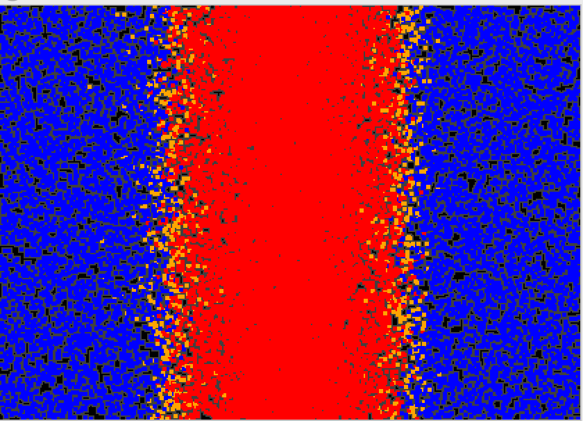
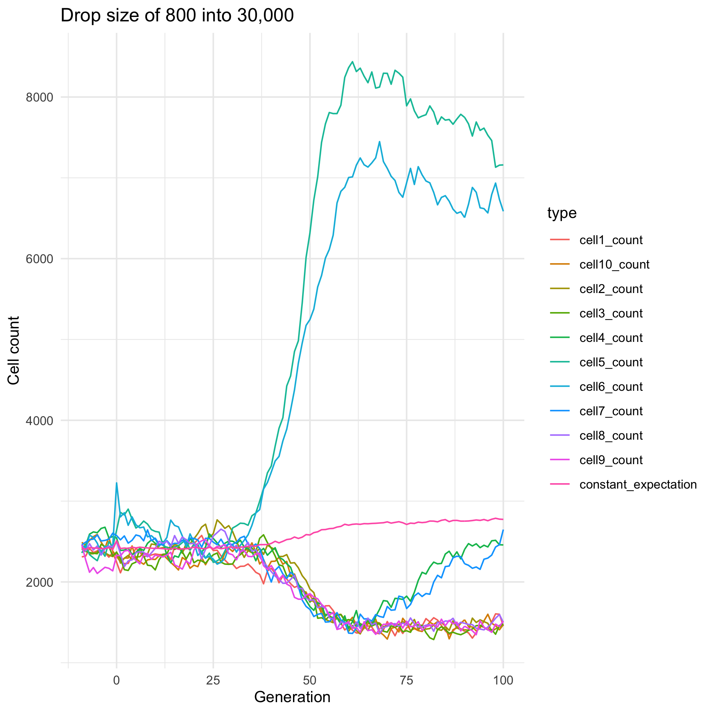
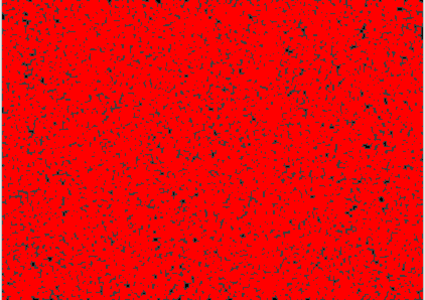
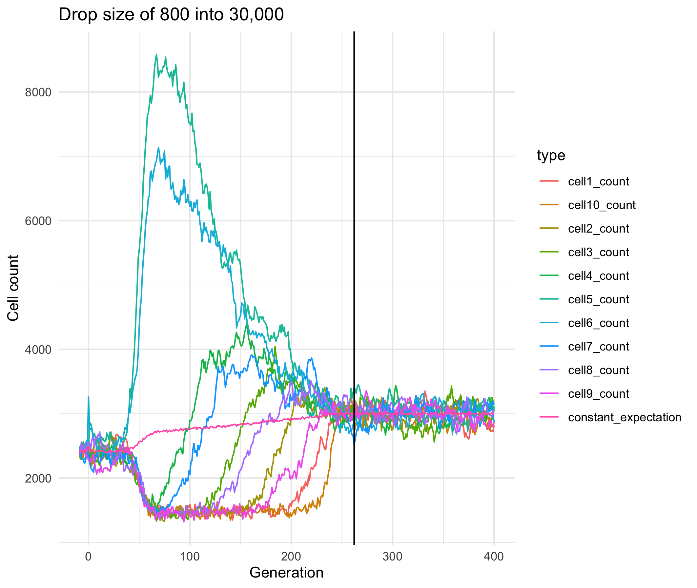
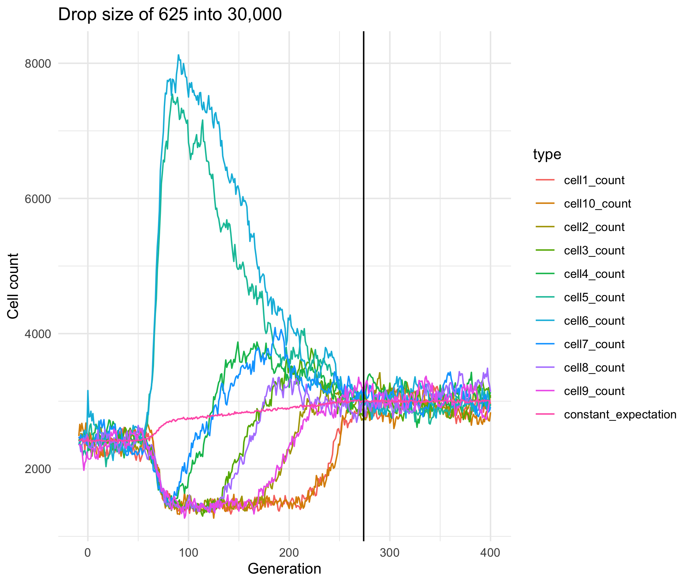
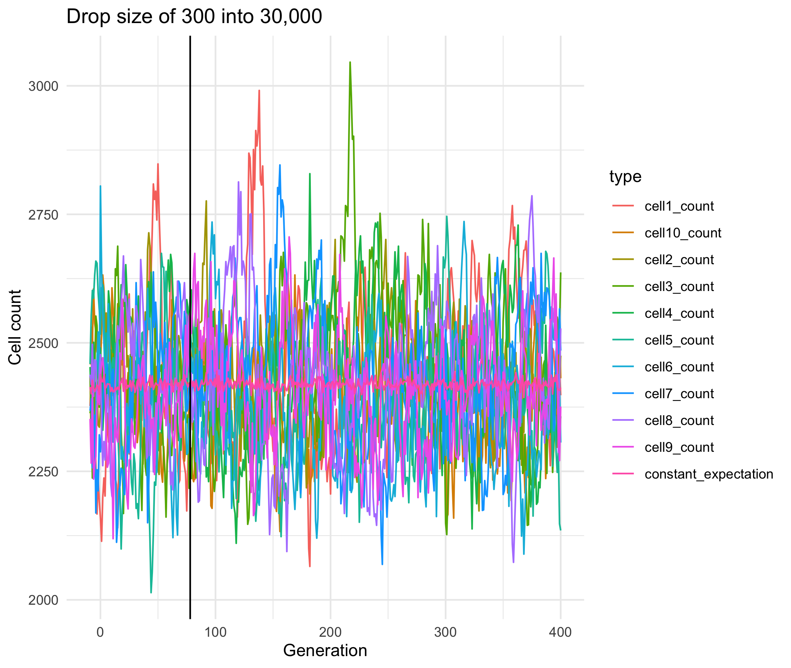

Check for clustering issues
================
Isabel Kim
6/7/2022

## Goal

-   Divide the 0-1 landscape into 10 cells; check that there’s no big
    clustering issue – after like 10 generations after the drive drop,
    the cell population sizes should be \~equal again.

-   Use SLiM copy: `copy-june7-nonWF-diffusion-model.slim`

-   Use the Python script: `single-run-cell-counts.py`

    -   Go to directory
    -   Pass in the path to a text file with SLiM console output
    -   Pipe out a csv

## Drop size of 800 into 30,000

``` bash
SLIM_OUTPUT=/Users/isabelkim/Desktop/year2/underdominance/reaction-diffusion/new-slim-diffusion-files/text_out/out_m800.txt
CSV=/Users/isabelkim/Desktop/year2/underdominance/reaction-diffusion/new-slim-diffusion-files/csv_out/cell_counts_m800.csv

cd /Users/isabelkim/Desktop/year2/underdominance/reaction-diffusion/new-slim-diffusion-files/
python single-run-cell-counts.py $SLIM_OUTPUT > $CSV
```

### Function to pivot data into a format that’s easier to plot with

``` r
pivot_and_plot_cell_counts = function(raw_csv, drop_size, show_plot = T){
  # gen, count, type
  # 1, 2000, constant_expectation
  # 1, 2120, cell_count_1
  # ....
  # so 11*(110) rows x 3 columns
  generation_vector = c()
  count = c()
  type = c()
  last_gen = max(raw_csv$gen)
  
  for (i in -9:last_gen){
    this_row = raw_csv %>% filter(gen == i)
    these_gens = rep(i,11)
    these_counts = c(this_row$constant_expectation, 
                     this_row$cell1_count,
                     this_row$cell2_count,
                     this_row$cell3_count,
                     this_row$cell4_count,
                     this_row$cell5_count,
                     this_row$cell6_count,
                     this_row$cell7_count,
                     this_row$cell8_count,
                     this_row$cell9_count,
                     this_row$cell10_count)
    these_types = c("constant_expectation", 
                    "cell1_count", 
                    "cell2_count", 
                    "cell3_count", 
                    "cell4_count", 
                    "cell5_count", 
                    "cell6_count",
                    "cell7_count",
                    "cell8_count",
                    "cell9_count",
                    "cell10_count")
    generation_vector = c(generation_vector,these_gens)
    count = c(count, these_counts)
    type = c(type, these_types)
  }
  pivot_csv = tibble(gen = generation_vector,
                     count = count,
                     type = type)
  
  line_plot = ggplot(data = pivot_csv, mapping = aes(x = gen, y = count, color = type)) +
    geom_line() + theme_minimal() + xlab("Generation") + ylab("Cell count") + ggtitle(paste0("Drop size of ",drop_size," into 30,000"))
  
  if (show_plot){
    print(line_plot)
  }
  
  return(list(pivot_csv = pivot_csv, line_plot = line_plot))
  
}
```

### Plot output

``` r
library(tidyverse)
csv = read_csv("/Users/isabelkim/Desktop/year2/underdominance/reaction-diffusion/new-slim-diffusion-files/csv_out/cell_counts_m800.csv")

res = pivot_and_plot_cell_counts(raw_csv = csv, drop_size = 800)
ggsave(plot = res$line_plot, filename = "/Users/isabelkim/Desktop/year2/underdominance/reaction-diffusion/new-slim-diffusion-files/figures/cell_counts_m800.png")
```

``` r

```

<!-- -->

``` r

```

<!-- -->

The drive still hasn’t fixed by the end of the simulation. The count is
the highest in the middle 2 cells – from 0.4 to 0.6.

### Run simulation for longer –> keep drop size of 800

Drive fixes around generation 272 (262)

``` bash
SLIM_OUTPUT=/Users/isabelkim/Desktop/year2/underdominance/reaction-diffusion/new-slim-diffusion-files/text_out/out_m800.txt
CSV=/Users/isabelkim/Desktop/year2/underdominance/reaction-diffusion/new-slim-diffusion-files/csv_out/cell_counts_m800_run_longer.csv

cd /Users/isabelkim/Desktop/year2/underdominance/reaction-diffusion/new-slim-diffusion-files/
python single-run-cell-counts.py $SLIM_OUTPUT > $CSV
```

### Plot output

``` r
csv = read_csv("/Users/isabelkim/Desktop/year2/underdominance/reaction-diffusion/new-slim-diffusion-files/csv_out/cell_counts_m800_run_longer.csv")

res = pivot_and_plot_cell_counts(raw_csv = csv, drop_size = 800)

p = res$line_plot + geom_vline(xintercept = 272 - 10)

ggsave(plot = p, filename = "/Users/isabelkim/Desktop/year2/underdominance/reaction-diffusion/new-slim-diffusion-files/figures/cell_counts_m800_run_till_gen410.png")
```

``` r

```

<!-- -->

``` r

```

<!-- -->

Around the time that the drive fixes, the cell counts equalize.

## Drop size of 625 into 30,000 – run for 410 generation

Drive fixes at generation 284 (274)

``` bash
SLIM_OUTPUT=/Users/isabelkim/Desktop/year2/underdominance/reaction-diffusion/new-slim-diffusion-files/text_out/out_m625.txt
CSV=/Users/isabelkim/Desktop/year2/underdominance/reaction-diffusion/new-slim-diffusion-files/csv_out/cell_counts_m625_run_to_gen410.csv

cd /Users/isabelkim/Desktop/year2/underdominance/reaction-diffusion/new-slim-diffusion-files/
python single-run-cell-counts.py $SLIM_OUTPUT > $CSV
```

``` r
csv = read_csv("/Users/isabelkim/Desktop/year2/underdominance/reaction-diffusion/new-slim-diffusion-files/csv_out/cell_counts_m625_run_to_gen410.csv")

res = pivot_and_plot_cell_counts(raw_csv = csv, drop_size = 625)

p = res$line_plot + geom_vline(xintercept = 284 - 10)

ggsave(plot = p, filename = "/Users/isabelkim/Desktop/year2/underdominance/reaction-diffusion/new-slim-diffusion-files/figures/cell_counts_m625_run_till_gen410.png")
```

``` r

```

<!-- -->

## Drop size of 300 into 30,000 – run for 410 generations

Drive is lost in generation 88 (78)

``` bash
SLIM_OUTPUT=/Users/isabelkim/Desktop/year2/underdominance/reaction-diffusion/new-slim-diffusion-files/text_out/out_m300.txt
CSV=/Users/isabelkim/Desktop/year2/underdominance/reaction-diffusion/new-slim-diffusion-files/csv_out/cell_counts_m300_run_to_gen410.csv

cd /Users/isabelkim/Desktop/year2/underdominance/reaction-diffusion/new-slim-diffusion-files/
python single-run-cell-counts.py $SLIM_OUTPUT > $CSV
```

``` r
csv = read_csv("/Users/isabelkim/Desktop/year2/underdominance/reaction-diffusion/new-slim-diffusion-files/csv_out/cell_counts_m300_run_to_gen410.csv")

res = pivot_and_plot_cell_counts(raw_csv = csv, drop_size = 300)

p = res$line_plot + geom_vline(xintercept = 88 - 10)

ggsave(plot = p, filename = "/Users/isabelkim/Desktop/year2/underdominance/reaction-diffusion/new-slim-diffusion-files/figures/cell_counts_m300_run_till_gen410.png")
```

``` r

```

<!-- -->
