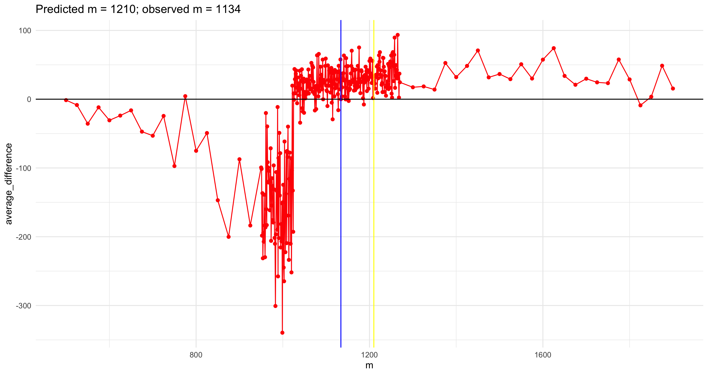
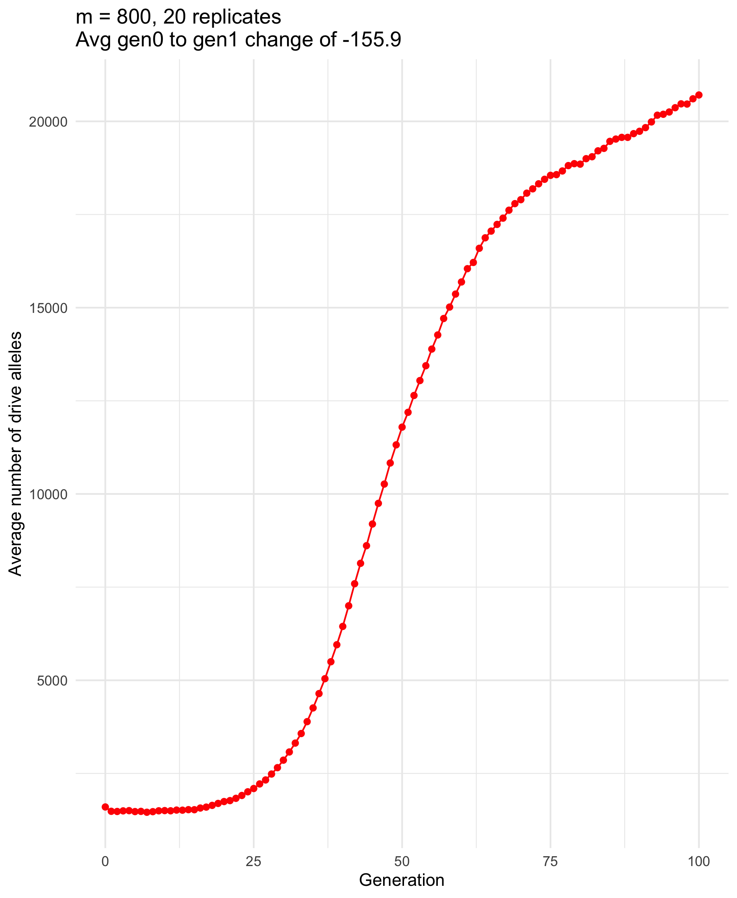
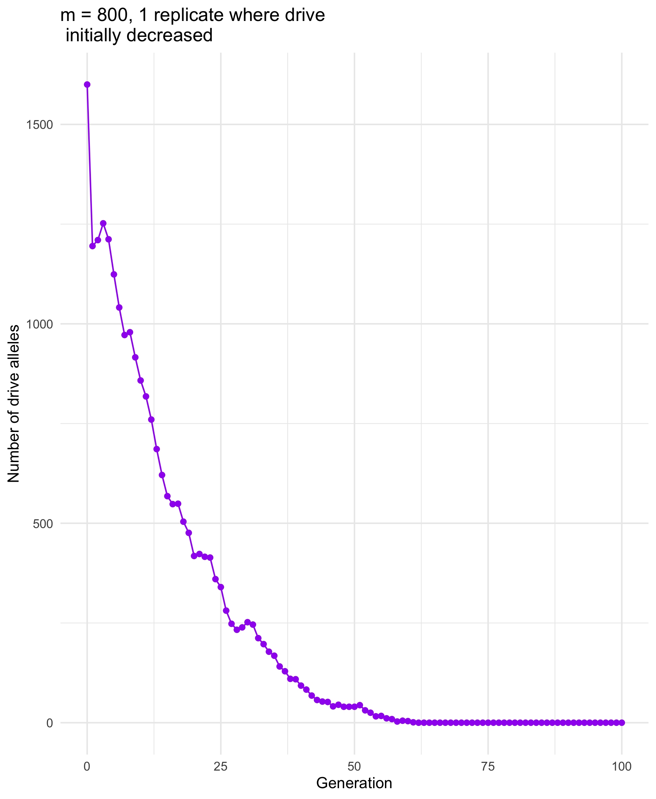
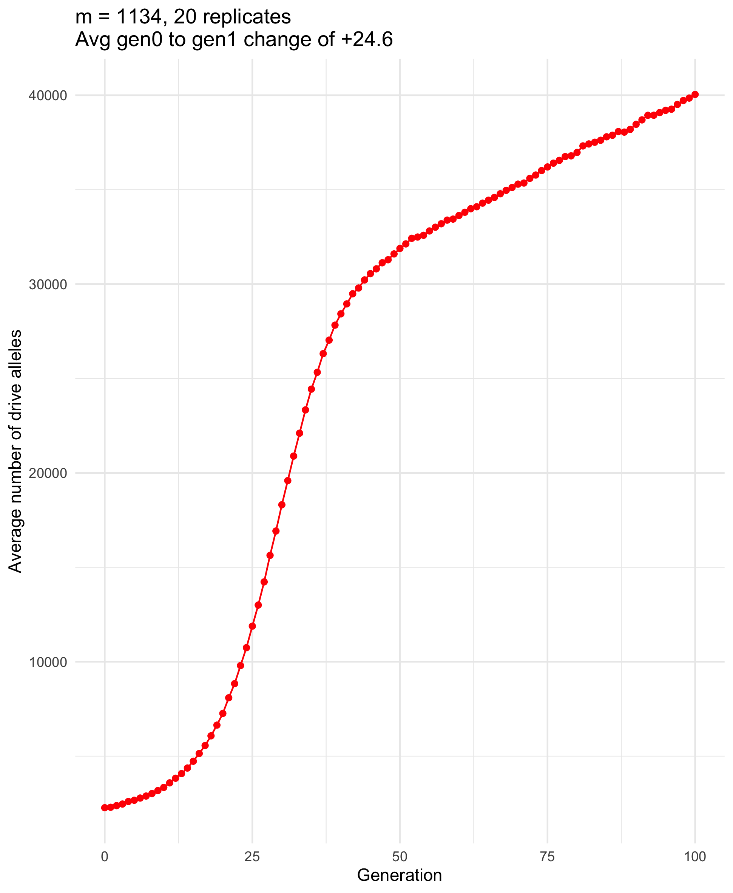
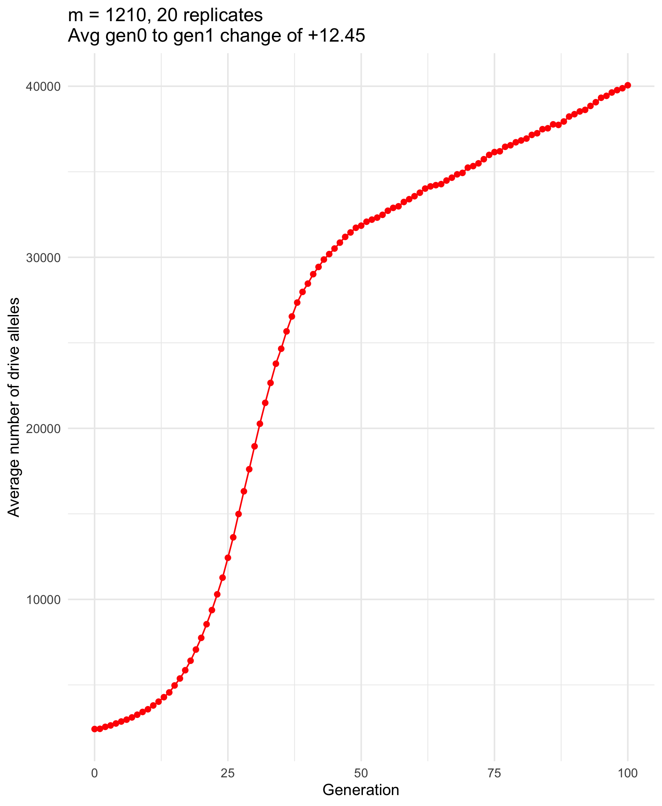
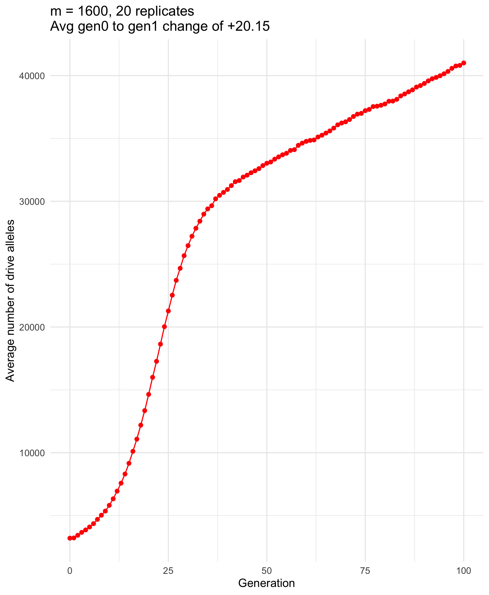
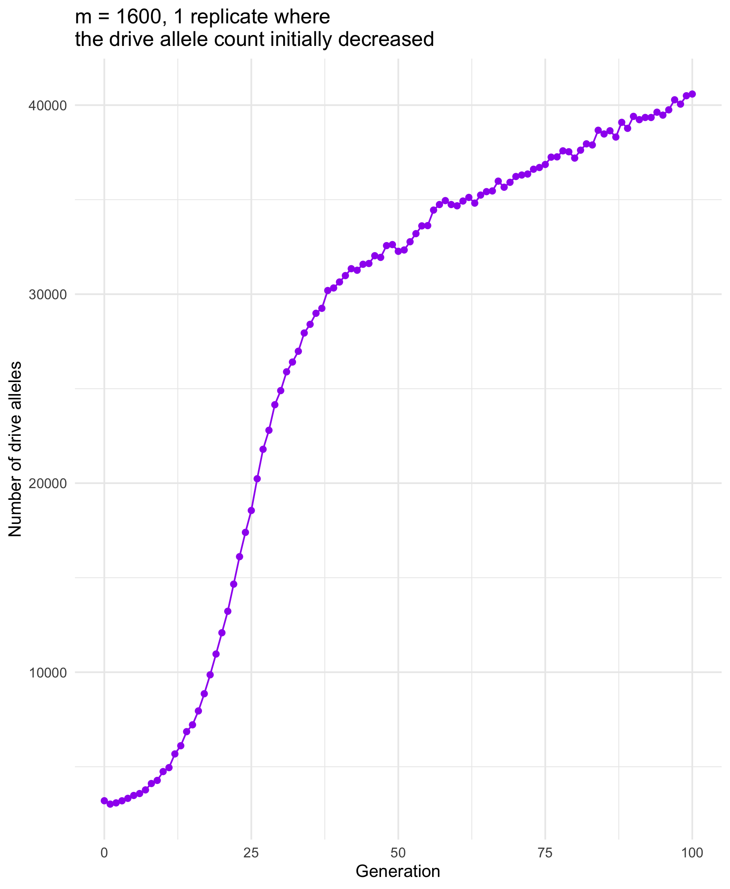
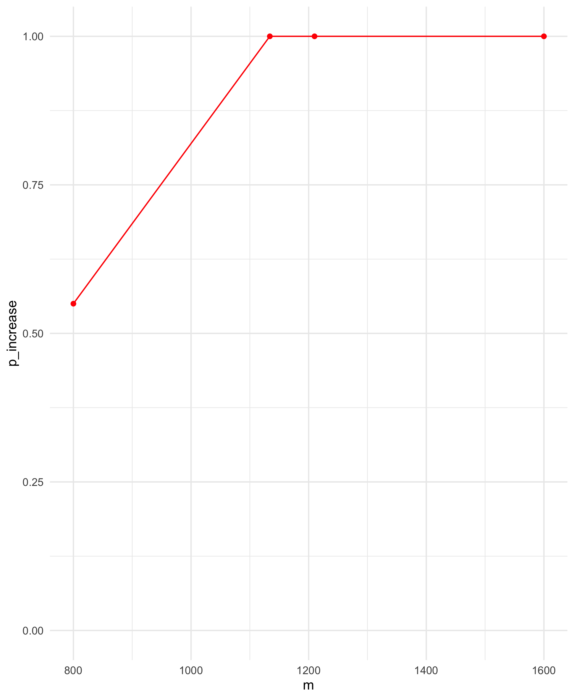
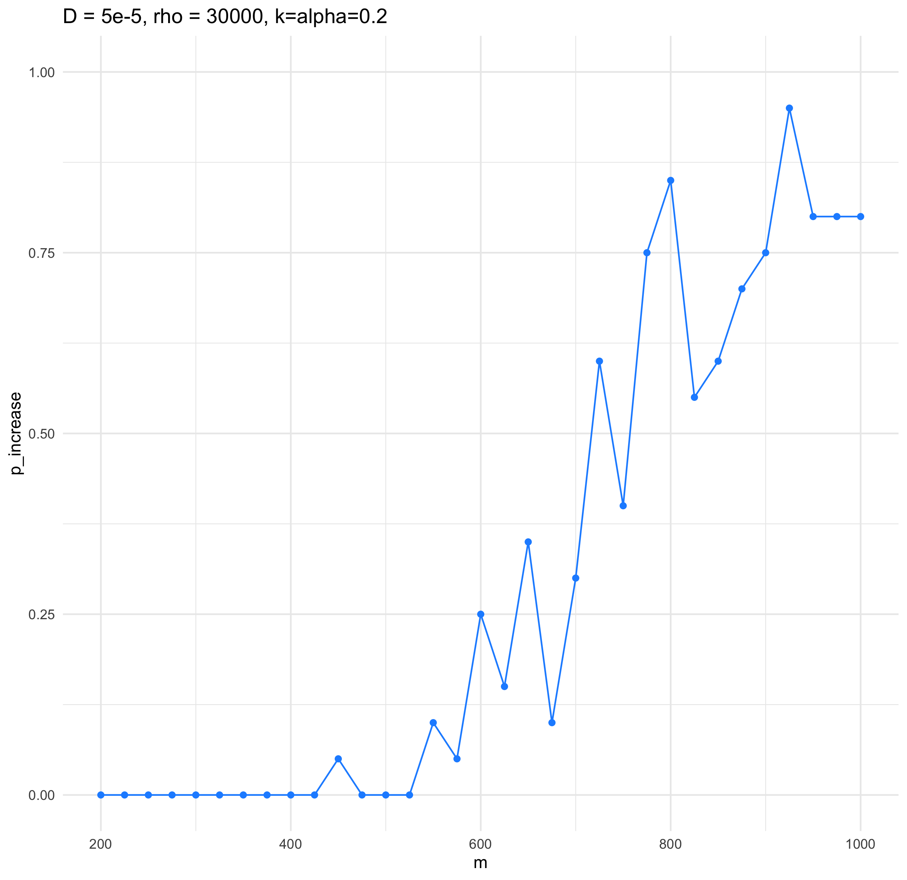

Change in number of drive alleles for different m
================
Isabel Kim
7/19/2022

## sigma = 0.01, alpha = k = 0.2, m_critical = 1209.634

### Cluster set-up

-   python driver:
    `/Users/isabelkim/Desktop/year2/underdominance/reaction-diffusion/new-slim-diffusion-files/cluster/python_driver_num_d_alleles.py`
-   SLURM script:
    `/Users/isabelkim/Desktop/year2/underdominance/reaction-diffusion/new-slim-diffusion-files/cluster/change_m_get_diff.sh`
-   text file: `change_in_drive_alleles.txt`
    -   m = 1200 to m = 1220 (mcritical = 1210)
        -   raw output will be a `m_value_1.part` file with 2 columns –
            “m, difference” written to `/home/ikk23/underdom/raw_output`
    -   nreps = 20
-   Merging
    script:`/Users/isabelkim/Desktop/year2/underdominance/reaction-diffusion/new-slim-diffusion-files/cluster/merge_change_in_d_alleles.sh`
    -   Creates `sigma_0.01_k_alpha_0.2_change_m.csv`

### Get averages and plot

``` r
library(tidyverse)

csv = read_csv("/Users/isabelkim/Desktop/year2/underdominance/reaction-diffusion/new-slim-diffusion-files/cluster/sigma_0.01_k_alpha_0.2_change_m.csv") %>% arrange(m)

avgs = csv %>% group_by(m) %>% summarise(average_difference = mean(change))

ggplot(data = avgs, mapping = aes(x = m, y = average_difference)) + theme_minimal() + geom_point() + geom_line() + geom_vline(xintercept = 1210)
```

Looks like we should expand the range

Rename csv: `m1200_to_1220.csv`

### Create new cluster run files

``` r
python_script = "python_driver_num_d_alleles.py"
m_seq = c(1150:1199, 1221:1270)


# Start writing to a new output file
sink('/Users/isabelkim/Desktop/year2/underdominance/reaction-diffusion/new-slim-diffusion-files/cluster/change_in_drive_alleles.txt')

for (i in 1:length(m_seq)){
  m = m_seq[i]

  line = paste0("python ",python_script," -DRIVE_DROP_SIZE ",m,"\n")

  cat(line)
}

# Stop writing to the file
sink()
```

m = 1150 to 1270 –> 121 values of m now

### Get new compiled csv

``` r
library(tidyverse)

csv_one = read_csv("/Users/isabelkim/Desktop/year2/underdominance/reaction-diffusion/new-slim-diffusion-files/cluster/m1200_to_1220.csv") %>% arrange(m)

csv_two = read_csv("/Users/isabelkim/Desktop/year2/underdominance/reaction-diffusion/new-slim-diffusion-files/cluster/m_other.csv") %>% arrange(m)

csv_compiled = rbind(csv_one, csv_two) %>% arrange(m)

# write out
write_csv(x = csv_compiled, file = "/Users/isabelkim/Desktop/year2/underdominance/reaction-diffusion/new-slim-diffusion-files/cluster/output/full_csv_k_alpha_0.2_sigma_0.01_m_1150_to_1270.csv")

# averages
avgs = csv %>% group_by(m) %>% summarise(average_difference = mean(change))
ggplot(data = avgs, mapping = aes(x = m, y = average_difference)) + theme_minimal() + geom_point() + geom_line() + geom_vline(xintercept = 1210)
```

Still zoom out?

m = 500 to m = 5000

let’s do `seq(500, 1100, length.out = 25)` and
`seq(1300, 1900, length.out = 25)`

### Create new files

``` r
python_script = "python_driver_num_d_alleles.py"
m_seq = c(seq(500, 1100, length.out = 25), seq(1300, 1900, length.out = 25))


# Start writing to a new output file
sink('/Users/isabelkim/Desktop/year2/underdominance/reaction-diffusion/new-slim-diffusion-files/cluster/change_in_drive_alleles.txt')

for (i in 1:length(m_seq)){
  m = m_seq[i]

  line = paste0("python ",python_script," -DRIVE_DROP_SIZE ",m,"\n")

  cat(line)
}

# Stop writing to the file
sink()
```

### Recompile

``` r
library(tidyverse)
csv_one = read_csv("/Users/isabelkim/Desktop/year2/underdominance/reaction-diffusion/new-slim-diffusion-files/cluster/output/full_csv_k_alpha_0.2_sigma_0.01_m_1150_to_1270.csv")
csv_two = read_csv("/Users/isabelkim/Desktop/year2/underdominance/reaction-diffusion/new-slim-diffusion-files/cluster/m_outside.csv")
csv_compiled = rbind(csv_one, csv_two) %>% arrange(m)
write_csv(x = csv_compiled, file = "/Users/isabelkim/Desktop/year2/underdominance/reaction-diffusion/new-slim-diffusion-files/cluster/output/full_csv_k_alpha_0.2_sigma_0.01_m_500_to_1900.csv")

avgs = csv_compiled %>% group_by(m) %>% summarise(average_difference = mean(change))

plot_m_500_to_m1900 = ggplot(data = avgs, mapping = aes(x = m, y = average_difference)) + theme_minimal() + geom_point(color = "red") + geom_line(color = "red") + geom_vline(xintercept = 1210, color = "yellow") + geom_hline(yintercept = 0)
ggsave("/Users/isabelkim/Desktop/year2/underdominance/reaction-diffusion/new-slim-diffusion-files/cluster/output/plot_m_500_to_m1900.png")
```

Need more runs around this range:
`950  975 1000 1025 1050 1075 1100 1150`

### More files

``` r
python_script = "python_driver_num_d_alleles.py"
m_seq = c(951:974, 976:999, 1001:1024, 1026:1049, 1051:1074, 1076:1099, 1101:1149) # 193

# Start writing to a new output file
sink('/Users/isabelkim/Desktop/year2/underdominance/reaction-diffusion/new-slim-diffusion-files/cluster/change_in_drive_alleles.txt')

for (i in 1:length(m_seq)){
  m = m_seq[i]

  line = paste0("python ",python_script," -DRIVE_DROP_SIZE ",m,"\n")

  cat(line)
}

# Stop writing to the file
sink()
```

### Recompile

``` r
library(tidyverse)

csv_one = read_csv("/Users/isabelkim/Desktop/year2/underdominance/reaction-diffusion/new-slim-diffusion-files/cluster/output/full_csv_k_alpha_0.2_sigma_0.01_m_500_to_1900.csv")
csv_two = read_csv("/Users/isabelkim/Desktop/year2/underdominance/reaction-diffusion/new-slim-diffusion-files/cluster/m_focus.csv")
csv_compiled = rbind(csv_one,csv_two) %>% arrange(m)
# write out again
write_csv(x = csv_compiled, file = "/Users/isabelkim/Desktop/year2/underdominance/reaction-diffusion/new-slim-diffusion-files/cluster/output/full_csv_k_alpha_0.2_sigma_0.01_m_500_to_1900.csv")


avgs = csv_compiled %>% group_by(m) %>% summarise(average_difference = mean(change))

plot_m_500_to_m1900 = ggplot(data = avgs, mapping = aes(x = m, y = average_difference)) + theme_minimal() + geom_point(color = "red") + geom_line(color = "red") + geom_vline(xintercept = 1210, color = "yellow") + geom_hline(yintercept = 0)

# which value of m is actually yielding a difference closest to 0?
diff_from_zero = avgs %>% mutate(diff_from_0 = abs(average_difference))
index = which.min(diff_from_zero$diff_from_0)
View(diff_from_zero[index,])

# 1134

plot_m_500_to_m1900 = ggplot(data = avgs, mapping = aes(x = m, y = average_difference)) + theme_minimal() + geom_point(color = "red") + geom_line(color = "red") + geom_vline(xintercept = 1210, color = "yellow") + geom_hline(yintercept = 0) + geom_vline(xintercept = 1134, color = "blue") + ggtitle("Predicted m = 1210; observed m = 1134")

ggsave("/Users/isabelkim/Desktop/year2/underdominance/reaction-diffusion/new-slim-diffusion-files/cluster/change_in_drive_alleles_gen10_to_gen11/output/plot_m_500_to_m1900.png")
```

-   Value of m that yielded a change in drive alleles closest to 0 =
    1134
    -   this is around a 6% error from 1210

``` r

```

<!-- -->

## Cluster runs to print out the number of drive alleles each generation – then average this – for different values of m

If m = mcrit, does the number of drive alleles stay \~constant over time
(or fail 50% or the time and succeed 50% of the time?)

-   Which values of m to use?
    -   m = 1210, the predicted value of m that yields
        n_drive_alleles_gen10 = n_drive_alleles_gen11
    -   m = 1134, the observed value of m that caused the closest
        (n_drive_alleles_gen11 - n_drive_alleles_gen10) to zero
    -   m = 800, a value that had an initial decrease and therefore
        should fail most of the time
    -   m = 1600, a value that had an initial increase and therefore
        should succeed most of the time

### Files

-   Python driver:
    `/Users/isabelkim/Desktop/year2/underdominance/reaction-diffusion/new-slim-diffusion-files/cluster/drive_alleles_each_generation/python_drive_num_drive_alleles_100_gens.py`
    -   On the cluster:
        `/home/ikk23/underdom/main_scripts/python_drive_num_drive_alleles_100_gens.py`
-   SLiM:
    `/Users/isabelkim/Desktop/year2/underdominance/reaction-diffusion/new-slim-diffusion-files/nonWF-diffusion-model.slim`
    -   On the cluster:
        `/home/ikk23/underdom/main_scripts/nonWF-diffusion-model.slim`
-   Text file:
    `/Users/isabelkim/Desktop/year2/underdominance/reaction-diffusion/new-slim-diffusion-files/cluster/drive_alleles_each_generation/text_file_cluster.txt`
    -   On the cluster:
        `/home/ikk23/underdom/text_files/text_file_cluster.txt`
-   SLURM script:
    `/Users/isabelkim/Desktop/year2/underdominance/reaction-diffusion/new-slim-diffusion-files/cluster/drive_alleles_each_generation/main_cluster.sh`
    -   On the cluster:
        `/home/ikk23/underdom/main_scripts/main_cluster.sh`
    -   Submitted 10:15am

### m = 800 (should fail)

``` r
library(tidyverse)
m800 = read_csv("/Users/isabelkim/Desktop/year2/underdominance/reaction-diffusion/new-slim-diffusion-files/cluster/drive_alleles_each_generation/raw_output/m800.csv", skip_empty_rows = TRUE) %>% filter(!is.na(generation))

# average change in number of drive alleles from gen0 to gen1
gen0_rows = which(m800$generation==0)
gen1_rows = gen0_rows+1
differences_vector = rep(4,20)
for (i in 1:20){
  dgen0 = m800$num_drive_alleles[gen0_rows[i]]
  dgen1 = m800$num_drive_alleles[gen1_rows[i]]
  differences_vector[i] = dgen1 - dgen0
}

avg_first_change = mean(differences_vector) # -155.9; almost always decreases

avg_num_drive_alleles_per_generation = rep(4,101)
generations_vector = 0:100
for (i in 1:101){
  g = generations_vector[i]
  rows_of_interest= m800 %>% filter(generation == g)
  avg_n_d = mean(rows_of_interest$num_drive_alleles)
  avg_num_drive_alleles_per_generation[i] = avg_n_d
}

m800_avgs = tibble(m = rep(800,101), generation = generations_vector, avg_num_drive_alleles = avg_num_drive_alleles_per_generation)

p = ggplot(m800_avgs, aes(x = generation, y = avg_num_drive_alleles)) + theme_minimal() + geom_line(color = "red") + geom_point(color = "red") + ggtitle("m = 800, 20 replicates \nAvg gen0 to gen1 change of -155.9") + ylab("Average number of drive alleles") + xlab("Generation")
ggsave(plot = p, filename = "/Users/isabelkim/Desktop/year2/underdominance/reaction-diffusion/new-slim-diffusion-files/cluster/drive_alleles_each_generation/figs/m800_num_drive_alleles.png")

# Narrow in on one replicate where the drive initial change is negative
replicate1 = m800 %>% filter(replicate_number==1)
p = ggplot(replicate1, aes(x = generation, y = num_drive_alleles)) + theme_minimal() + geom_line(color = "purple") + geom_point(color = "purple") + ggtitle("m = 800, 1 replicate where drive \n initially decreased") + ylab("Number of drive alleles") + xlab("Generation")
ggsave(plot = p, filename = "/Users/isabelkim/Desktop/year2/underdominance/reaction-diffusion/new-slim-diffusion-files/cluster/drive_alleles_each_generation/figs/m800_one_replicate.png")


# For each replicate, get the first change in drive alleles and the overall outcome
differences_vector
outcomes_vector = rep("*",20)
gen_ends = which(m800$generation==100)
for (i in 1:20){
  ending_num = m800$num_drive_alleles[gen_ends[i]]
  if (ending_num > 1600){
    outcome = "increase"
  } else if (ending_num < 1600){
    outcome = "decrease"
  } else {
    outcome = "na"
  }
  outcomes_vector[i] = outcome
}

# Given that the initial change was negative, percentage of times that the drive ultimately decreased?
is_negative_indices = which(differences_vector < 0)
outcomes_initial_negative = outcomes_vector[is_negative_indices]
mean(outcomes_initial_negative == "decrease") # 61.5% of the time

# Given that the initial change was positive, percentage of times that the drive ultimately increased?
is_positive_indices = which(differences_vector > 0)
outcomes_initial_increase = outcomes_vector[is_positive_indices]
mean(outcomes_initial_increase == "increase") # 85.7% of the time
```

-   61.5% of runs that had an initial *decrease* in the number of drive
    alleles had a continued drive decrease
-   85.7% of runs that had an initial *increase* in the number of drive
    alleles had a continued drive increase

``` r

```

<!-- -->

``` r

```

<!-- -->
Even though the average initial change is negative, the drive still
increases overall. The first generation change in number of drive
alleles is not ultimately predictive *when looking at averages*

But when narrowing in on specific replicates, the initial change *is*
*sometimes* predictive.

### m = 1134 (led to \~0 change in drive alleles from gen0 to gen1)

``` r
library(tidyverse)
m1134 = read_csv("/Users/isabelkim/Desktop/year2/underdominance/reaction-diffusion/new-slim-diffusion-files/cluster/drive_alleles_each_generation/raw_output/m1134.csv", skip_empty_rows = TRUE) %>% filter(!is.na(generation))

# average change in number of drive alleles from gen0 to gen1
gen0_rows = which(m1134$generation==0)
gen1_rows = gen0_rows+1
differences_vector = rep(4,20)
for (i in 1:20){
  dgen0 = m1134$num_drive_alleles[gen0_rows[i]]
  dgen1 = m1134$num_drive_alleles[gen1_rows[i]]
  differences_vector[i] = dgen1 - dgen0
}

# in 35% of runs, the number of drive alleles decreased in the first generation
# in 60% of runs, it increased
# in 5% (1) of runs, it stayed the same.
avg_first_change = mean(differences_vector) # 24.6

avg_num_drive_alleles_per_generation = rep(4,101)
generations_vector = 0:100
for (i in 1:101){
  g = generations_vector[i]
  rows_of_interest= m1134 %>% filter(generation == g)
  avg_n_d = mean(rows_of_interest$num_drive_alleles)
  avg_num_drive_alleles_per_generation[i] = avg_n_d
}

m1134_avgs = tibble(m = rep(1134,101), generation = generations_vector, avg_num_drive_alleles = avg_num_drive_alleles_per_generation)

p = ggplot(m1134_avgs, aes(x = generation, y = avg_num_drive_alleles)) + theme_minimal() + geom_line(color = "red") + geom_point(color = "red") + ggtitle("m = 1134, 20 replicates \nAvg gen0 to gen1 change of +24.6") + ylab("Average number of drive alleles") + xlab("Generation")

ggsave(plot = p, filename = "/Users/isabelkim/Desktop/year2/underdominance/reaction-diffusion/new-slim-diffusion-files/cluster/drive_alleles_each_generation/figs/m1134_num_drive_alleles.png")

# For each replicate, get the first change in drive alleles and the overall outcome
differences_vector
outcomes_vector = rep("*",20)
gen_ends = which(m1134$generation==100)
for (i in 1:20){
  ending_num = m1134$num_drive_alleles[gen_ends[i]]
  if (ending_num > 2268.00){
    outcome = "increase"
  } else if (ending_num < 2268.00){
    outcome = "decrease"
  } else {
    outcome = "na"
  }
  outcomes_vector[i] = outcome
}

mean(outcomes_vector == "increase")
# drive increased in *all* runs, even though the initial change was negative in some runs
```

Though the *initial* change in the number of drive alleles was sometimes
\~0 and sometimes negative, ultimately, the drive increased in all
replicates for m = 1134.

``` r

```

<!-- -->
### m = 1210 (predicted drop size that should lead to 0 change from gen0
to gen1)

``` r
library(tidyverse)
m1210 = read_csv("/Users/isabelkim/Desktop/year2/underdominance/reaction-diffusion/new-slim-diffusion-files/cluster/drive_alleles_each_generation/raw_output/m1210.csv", skip_empty_rows = TRUE) %>% filter(!is.na(generation))

# average change in number of drive alleles from gen0 to gen1
gen0_rows = which(m1210$generation==0)
gen1_rows = gen0_rows+1
differences_vector = rep(4,20)
for (i in 1:20){
  dgen0 = m1210$num_drive_alleles[gen0_rows[i]]
  dgen1 = m1210$num_drive_alleles[gen1_rows[i]]
  differences_vector[i] = dgen1 - dgen0
}

# in 45% of runs, the number of drive alleles decreased in the first generation
# in 55% of runs, it increased
avg_first_change = mean(differences_vector) # 12.45

avg_num_drive_alleles_per_generation = rep(4,101)
generations_vector = 0:100
for (i in 1:101){
  g = generations_vector[i]
  rows_of_interest= m1210 %>% filter(generation == g)
  avg_n_d = mean(rows_of_interest$num_drive_alleles)
  avg_num_drive_alleles_per_generation[i] = avg_n_d
}

m1210_avgs = tibble(m = rep(1210,101), generation = generations_vector, avg_num_drive_alleles = avg_num_drive_alleles_per_generation)

p = ggplot(m1210_avgs, aes(x = generation, y = avg_num_drive_alleles)) + theme_minimal() + geom_line(color = "red") + geom_point(color = "red") + ggtitle("m = 1210, 20 replicates \nAvg gen0 to gen1 change of +12.45") + ylab("Average number of drive alleles") + xlab("Generation")

ggsave(plot = p, filename = "/Users/isabelkim/Desktop/year2/underdominance/reaction-diffusion/new-slim-diffusion-files/cluster/drive_alleles_each_generation/figs/m1210_num_drive_alleles.png")

# For each replicate, get the first change in drive alleles and the overall outcome
differences_vector
outcomes_vector = rep("*",20)
gen_ends = which(m1210$generation==100)
for (i in 1:20){
  ending_num = m1210$num_drive_alleles[gen_ends[i]]
  if (ending_num > 2420){
    outcome = "increase"
  } else if (ending_num < 2420){
    outcome = "decrease"
  } else {
    outcome = "na"
  }
  outcomes_vector[i] = outcome
}

mean(outcomes_vector == "increase")
# drive increased in *all* runs, even though the initial change was negative in some runs
```

Almost an even split of the drive allele count increasing (55%) in gen1
from gen0 and decreasing (45%).

But the drive still increased in all runs, like m=1134.

``` r

```

<!-- -->

### m = 1600 (always saw an initial increase)

``` r
library(tidyverse)
m1600 = read_csv("/Users/isabelkim/Desktop/year2/underdominance/reaction-diffusion/new-slim-diffusion-files/cluster/drive_alleles_each_generation/raw_output/m1600.csv", skip_empty_rows = TRUE) %>% filter(!is.na(generation))

# average change in number of drive alleles from gen0 to gen1
gen0_rows = which(m1600$generation==0)
gen1_rows = gen0_rows+1
differences_vector = rep(4,20)
for (i in 1:20){
  dgen0 = m1600$num_drive_alleles[gen0_rows[i]]
  dgen1 = m1600$num_drive_alleles[gen1_rows[i]]
  differences_vector[i] = dgen1 - dgen0
}

# WEIRD -- in 60% of runs, the drive allele count initially increased, but in 40% it initially decreased
avg_first_change = mean(differences_vector) #20.15

avg_num_drive_alleles_per_generation = rep(4,101)
generations_vector = 0:100
for (i in 1:101){
  g = generations_vector[i]
  rows_of_interest= m1600 %>% filter(generation == g)
  avg_n_d = mean(rows_of_interest$num_drive_alleles)
  avg_num_drive_alleles_per_generation[i] = avg_n_d
}

m1600_avgs = tibble(m = rep(1600,101), generation = generations_vector, avg_num_drive_alleles = avg_num_drive_alleles_per_generation)

p = ggplot(m1600_avgs, aes(x = generation, y = avg_num_drive_alleles)) + theme_minimal() + geom_line(color = "red") + geom_point(color = "red") + ggtitle("m = 1600, 20 replicates \nAvg gen0 to gen1 change of +20.15") + ylab("Average number of drive alleles") + xlab("Generation")

ggsave(plot = p, filename = "/Users/isabelkim/Desktop/year2/underdominance/reaction-diffusion/new-slim-diffusion-files/cluster/drive_alleles_each_generation/figs/m1600_num_drive_alleles.png")

# For each replicate, get the first change in drive alleles and the overall outcome
differences_vector
outcomes_vector = rep("*",20)
gen_ends = which(m1600$generation==100)
for (i in 1:20){
  ending_num = m1600$num_drive_alleles[gen_ends[i]]
  if (ending_num > 3200){
    outcome = "increase"
  } else if (ending_num < 3200){
    outcome = "decrease"
  } else {
    outcome = "na"
  }
  outcomes_vector[i] = outcome
}

mean(outcomes_vector == "increase")
# drive increased in *all* runs, even though the initial change was negative in some runs

# Focus in on one replicate where the change was initially negative
m1600_rep3 = m1600 %>% filter(replicate_number == 3)

p = ggplot(m1600_rep3, aes(x = generation, y = num_drive_alleles)) + geom_point(color = "purple") + geom_line(color = "purple") + xlab("Generation") + ylab("Number of drive alleles") + ggtitle("m = 1600, 1 replicate where \nthe drive allele count initially decreased") + theme_minimal()
ggsave(plot = p, filename = "/Users/isabelkim/Desktop/year2/underdominance/reaction-diffusion/new-slim-diffusion-files/cluster/drive_alleles_each_generation/figs/m1600_one_replicate.png")
```

The drive ultimately spread in all runs, even though the initial change
was negative in 40% of runs.

``` r

```

<!-- -->

``` r

```

<!-- -->

## Conclusion

-   The math seems to be pretty good at finding the value of *m* that
    leads to little change in the number of drive alleles from
    generation 0 to 1.
-   But whether this increased or decreased does not seem to be
    predictive of whether the drive will ultimately spread or fail,
    zooming out to 100 generations.

## Create P(increase) vs m graphs –> find the m\* that leads to P(increase) = 50%

-   Data:
    `/Users/isabelkim/Desktop/year2/underdominance/reaction-diffusion/new-slim-diffusion-files/cluster/change_in_drive_alleles_gen10_to_gen11/output/full_csv_k_alpha_0.2_sigma_0.01_m_500_to_1900.csv`

``` r
library(tidyverse)
data = read_csv("/Users/isabelkim/Desktop/year2/underdominance/reaction-diffusion/new-slim-diffusion-files/cluster/change_in_drive_alleles_gen10_to_gen11/output/full_csv_k_alpha_0.2_sigma_0.01_m_500_to_1900.csv")
m_values = unique(data$m)
```

Only have the first generation change for these; can’t evaluate
P(increase). Only have data from the 4 m’s to do this.

-   m-specific data:
    -   `/Users/isabelkim/Desktop/year2/underdominance/reaction-diffusion/new-slim-diffusion-files/cluster/drive_alleles_each_generation/raw_output/m800.csv`
    -   `/Users/isabelkim/Desktop/year2/underdominance/reaction-diffusion/new-slim-diffusion-files/cluster/drive_alleles_each_generation/raw_output/m1134.csv`
    -   `/Users/isabelkim/Desktop/year2/underdominance/reaction-diffusion/new-slim-diffusion-files/cluster/drive_alleles_each_generation/raw_output/m1210.csv`
    -   `/Users/isabelkim/Desktop/year2/underdominance/reaction-diffusion/new-slim-diffusion-files/cluster/drive_alleles_each_generation/raw_output/m1600.csv`

``` r
library(tidyverse)
m800 = read_csv("/Users/isabelkim/Desktop/year2/underdominance/reaction-diffusion/new-slim-diffusion-files/cluster/drive_alleles_each_generation/raw_output/m800.csv") %>% filter(!is.na(generation))
m1134 = read_csv("/Users/isabelkim/Desktop/year2/underdominance/reaction-diffusion/new-slim-diffusion-files/cluster/drive_alleles_each_generation/raw_output/m1134.csv") %>% filter(!is.na(generation))
m1210 =  read_csv("/Users/isabelkim/Desktop/year2/underdominance/reaction-diffusion/new-slim-diffusion-files/cluster/drive_alleles_each_generation/raw_output/m1210.csv") %>% filter(!is.na(generation))
m1600 = read_csv("/Users/isabelkim/Desktop/year2/underdominance/reaction-diffusion/new-slim-diffusion-files/cluster/drive_alleles_each_generation/raw_output/m1600.csv") %>% filter(!is.na(generation))

m800_outcomes = rep("*",20)
m1134_outcomes = rep("*", 20)
m1210_outcomes = rep("*", 20)
m1600_outcomes = rep("*", 20)
replicate_numbers = unique(m800$replicate_number)
for (i in 1:20){
  r = replicate_numbers[i]
  
  # m800
  m800_this_rep = m800 %>% filter(replicate_number == r)
  m800_start = m800_this_rep$num_drive_alleles[1]
  m800_end = m800_this_rep$num_drive_alleles[nrow(m800_this_rep)]
  if (m800_start < m800_end){
    outcome = "increase"
  } else if (m800_start > m800_end){
    outcome = "decrease"
  } else {
    outcome = "constant"
  }
  m800_outcomes[i] = outcome
  
  # m1134
  m1134_this_rep = m1134 %>% filter(replicate_number == r)
  m1134_start = m1134_this_rep$num_drive_alleles[1]
  m1134_end = m1134_this_rep$num_drive_alleles[nrow(m1134_this_rep)]
  if (m1134_start < m1134_end){
    outcome = "increase"
  } else if (m1134_start > m1134_end){
    outcome = "decrease"
  } else {
    outcome = "constant"
  }
  m1134_outcomes[i] = outcome
  
  # m1210
  m1210_this_rep = m1210 %>% filter(replicate_number == r)
  m1210_start = m1210_this_rep$num_drive_alleles[1]
  m1210_end = m1210_this_rep$num_drive_alleles[nrow(m1210_this_rep)]
  if (m1210_start < m1210_end){
    outcome = "increase"
  } else if (m1210_start > m1210_end){
    outcome = "decrease"
  } else {
    outcome = "constant"
  }
  m1210_outcomes[i] = outcome
  
  # m1600
  m1600_this_rep = m1600 %>% filter(replicate_number == r)
  m1600_start = m1600_this_rep$num_drive_alleles[1]
  m1600_end = m1600_this_rep$num_drive_alleles[nrow(m1600_this_rep)]
  if (m1600_start < m1600_end){
    outcome = "increase"
  } else if (m1600_start > m1600_end){
    outcome = "decrease"
  } else {
    outcome = "constant"
  }
  m1600_outcomes[i] = outcome
  
}


p_increase_m800 = mean(m800_outcomes == "increase")
p_increase_m1134 = mean(m1134_outcomes == "increase")
p_increase_m1210 = mean(m1210_outcomes == "increase")
p_increase_m1600 = mean(m1600_outcomes == "increase")

p = tibble(m = c(800, 1134, 1210, 1600), p_increase = c(p_increase_m800, p_increase_m1134, p_increase_m1210, p_increase_m1600)) %>% 
  ggplot(aes(x = m, y = p_increase)) + 
  geom_line(color = "red") + 
  geom_point(color = "red") + 
  theme_minimal() + ylim(0,1)
#ggsave(plot = p, filename = "/Users/isabelkim/Desktop/year2/underdominance/reaction-diffusion/new-slim-diffusion-files/cluster/drive_alleles_each_generation/figs/four_ms_p_increase.png")
```

``` r

```

<!-- -->

Conclusion: the critical m might be *less* than m = 800. Need to expand
this range of m, run like 20 replicates per m for 100 generations, and
record P(increase).

## New cluster run

-   Range of m: 200 to 1000
    -   Count by 25
-   20 replicates each

``` r
python_script = "python_driver_p_increase.py"
m_seq = seq(200,1000,by=25) # length of 33


# Start writing to a new output file
sink('/Users/isabelkim/Desktop/year2/underdominance/reaction-diffusion/new-slim-diffusion-files/cluster/p_increase_vs_m/text_file_p_increase.txt')

for (i in 1:length(m_seq)){
  m = m_seq[i]

  line = paste0("python ",python_script," -DRIVE_DROP_SIZE ",m,"\n")

  cat(line)
}

# Stop writing to the file
sink()
```

### Files:

-   In
    `/Users/isabelkim/Desktop/year2/underdominance/reaction-diffusion/new-slim-diffusion-files/cluster/p_increase_vs_m/`:
    -   Python driver: `python_driver_p_increase.py` –> for each of the
        20 replicates, prints out 1 csv line with m, replicate number,
        initial generation 10 to generation 11 change in the number of
        drive alleles, and the outcome after 100 generations
    -   Text file: `text_file_p_increase.txt`
    -   SLURM main: `main_p_increase.sh`
-   SLiM:
    `/Users/isabelkim/Desktop/year2/underdominance/reaction-diffusion/new-slim-diffusion-files/nonWF-diffusion-model.slim`
-   Cluster job submitted at 10:29am 7/21
    -   Job number: `4572994`

### Analyze results

For each csv file, (1) get the value of m, (2) get the average initial
change, and (3) get the P(increase)

``` r
library(tidyverse)
dir = "/Users/isabelkim/Desktop/year2/underdominance/reaction-diffusion/new-slim-diffusion-files/cluster/p_increase_vs_m/raw_output/"
m_vector = seq(200,1000,by=25)
m_seq = rep(-1,33)
average_initial_change = rep(-1,33)
p_increase_vector = rep(-1,33)
for (i in 1:33){
  file = paste0(dir,"m_index_",i,".csv")
  csv = read_csv(file)
  m = csv$m[1]
  avg_change = mean(csv$gen10_to_gen11_change)
  p_increase = mean(csv$outcome_after_100_gens == "increase")
  m_seq[i]= m
  average_initial_change[i] = avg_change
  p_increase_vector[i] = p_increase
}

m_consolidated_csv = tibble(m = m_seq, average_gen10_to_gen11_change = average_initial_change, p_increase = p_increase_vector)
#write_csv(x = m_consolidated_csv, file = "/Users/isabelkim/Desktop/year2/underdominance/reaction-diffusion/new-slim-diffusion-files/cluster/p_increase_vs_m/output/m200_to_1000_D_5e-5_k_alpha_0.2.csv")


p = ggplot(m_consolidated_csv, aes(x = m, y = p_increase)) + theme_minimal() + geom_line(color = "dodgerblue") + geom_point(color = "dodgerblue") + ylim(0,1) + ggtitle("D = 5e-5, rho = 30000, k=alpha=0.2")
ggsave(plot = p, filename = "/Users/isabelkim/Desktop/year2/underdominance/reaction-diffusion/new-slim-diffusion-files/cluster/p_increase_vs_m/output/p_increase_vs_m_200_to_1000.png")
```

``` r

```

<!-- -->
