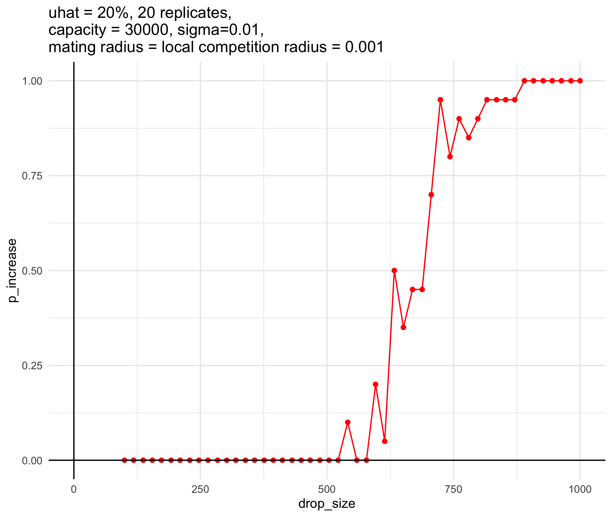
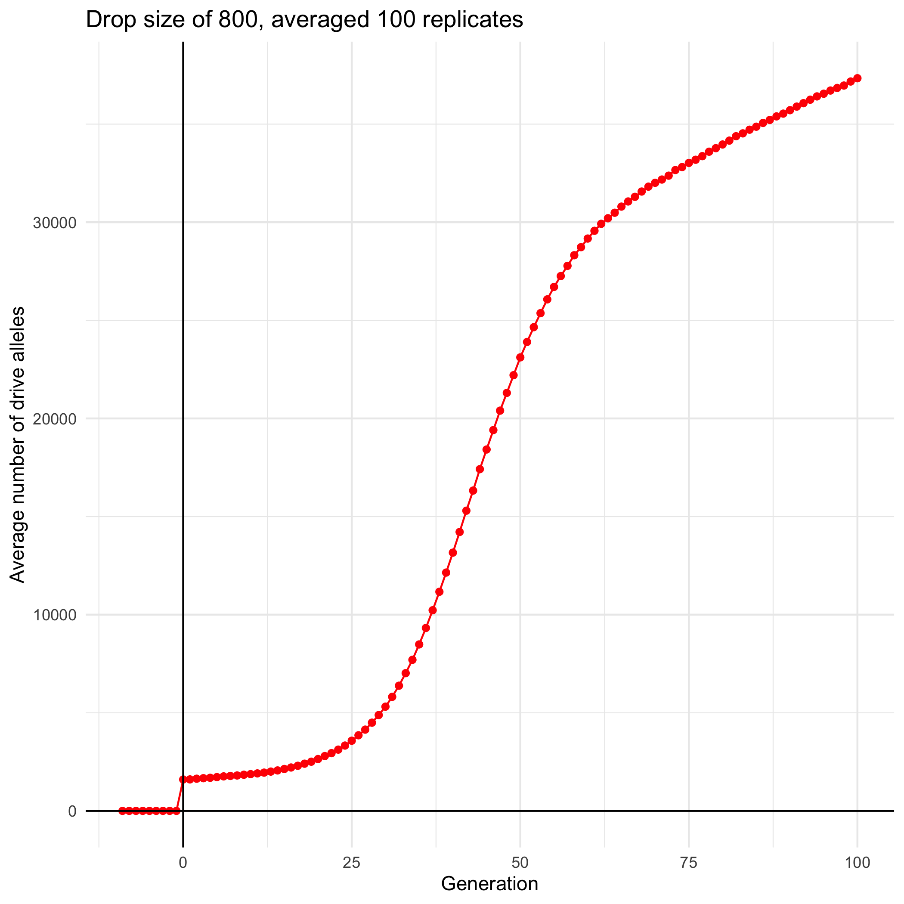

```{r setup, include=FALSE}
knitr::opts_chunk$set(echo = TRUE)
```

## Goal

* Vary the drop size (m)
  + Do 20 replicates of each
  + Calculate the P(increase) over all replicates
* Determine the "critical m" at which P(increase) = 90%
  + Go back to this m*, running like 100 replicates
  + Average over the 100 m* replicates; then plot the average number of drive alleles over time.
    * Does this increase monotonically?

## Python script

* Run SLiM for 100 generations
* Just control `DRIVE_DROP_SIZE`
* Script: `python_driver_vary_m.py`

## First run

* Let's do 20 replicates of 50 different drop size values, with a minimum of 100 (should always decrease) and maximum of 1000 (should always increase)
* Text file: `/Users/isabelkim/Desktop/year2/underdominance/reaction-diffusion/new-slim-diffusion-files/slurm_text/june6_varym.txt`
* Python file: `/Users/isabelkim/Desktop/year2/underdominance/reaction-diffusion/new-slim-diffusion-files/python_driver_vary_m.py`
* SLiM file: `/Users/isabelkim/Desktop/year2/underdominance/reaction-diffusion/new-slim-diffusion-files/nonWF-diffusion-model.slim`
* SLURM script: `/Users/isabelkim/Desktop/year2/underdominance/reaction-diffusion/new-slim-diffusion-files/slurm_scripts/slurm_june6_varym.sh`
  + Running as of 4:15 on 6/6
* SLURM merge script: `/Users/isabelkim/Desktop/year2/underdominance/reaction-diffusion/new-slim-diffusion-files/slurm_scripts/slurm_june6_varym_merge.sh`
  + On the cluster as `/home/ikk23/underdom/merge_scripts/slurm_june6_varym_merge.sh`, ready to use

### Output

* Raw csv: `/Users/isabelkim/Desktop/year2/underdominance/reaction-diffusion/new-slim-diffusion-files/cluster_output/june6_vary_m_uhat_k_0.2.csv`
* Summary csv: `/Users/isabelkim/Desktop/year2/underdominance/reaction-diffusion/new-slim-diffusion-files/cluster_output/summary_june6_vary_m_uhat_k_0.2.csv`
```{r eval=F}
library(tidyverse)

full_csv = read_csv("/Users/isabelkim/Desktop/year2/underdominance/reaction-diffusion/new-slim-diffusion-files/cluster_output/june6_vary_m_uhat_k_0.2.csv") %>% arrange(drop_size)
# write out with the drop size least to greatest
#write_csv(x = full_csv, file = "/Users/isabelkim/Desktop/year2/underdominance/reaction-diffusion/new-slim-diffusion-files/cluster_output/june6_vary_m_uhat_k_0.2.csv")

# For each drop size, get the P(increase)
dropsizes = seq(100, 1000, length.out = 50)
drop_size_vector = round(dropsizes)
p_increase_vector = rep(-1,50)

for (i in 1:50){
  m = drop_size_vector[i]
  rows = full_csv %>% filter(drop_size == m)
  p = mean(rows$outcome == "increase")
  p_increase_vector[i] = p
}

summary_csv = tibble(drop_size = drop_size_vector, p_increase = p_increase_vector)
# write out
#write_csv(x = summary_csv, file = "/Users/isabelkim/Desktop/year2/underdominance/reaction-diffusion/new-slim-diffusion-files/cluster_output/summary_june6_vary_m_uhat_k_0.2.csv")

p = ggplot(summary_csv, aes(x = drop_size, y = p_increase)) + theme_minimal() + geom_point(color = "red") + geom_line(color = "red") + geom_vline(xintercept = 0) + geom_hline(yintercept = 0) + ggtitle("uhat = 20%, 20 replicates,\ncapacity = 30000, sigma=0.01,\nmating radius = local competition radius = 0.001")
#ggsave(plot = p, filename = "/Users/isabelkim/Desktop/year2/underdominance/reaction-diffusion/new-slim-diffusion-files/cluster_output/p_increase_figure_june6_vary_m_uhat_k_0.2.png")
```


```{r}

```

Drop size of ~800 will yield P(increase) of ~90%.

## Run 100 replicates of a drop size of 800

* Split this into 4 array jobs of 25 replicates each
* Text: `/Users/isabelkim/Desktop/year2/underdominance/reaction-diffusion/new-slim-diffusion-files/slurm_text/focus_june6.txt`
* Python script: `/Users/isabelkim/Desktop/year2/underdominance/reaction-diffusion/new-slim-diffusion-files/python_driver_gen_stats.py`
* SLURM main script: `/Users/isabelkim/Desktop/year2/underdominance/reaction-diffusion/new-slim-diffusion-files/slurm_scripts/slurm_june6_m800_only.sh`
  + Submitted at 6:20pm (output will be in `/home/ikk23/underdom/out_u20` and I'll need to merge it myself)

### Output

* Compiled full csv: `/Users/isabelkim/Desktop/year2/underdominance/reaction-diffusion/new-slim-diffusion-files/cluster_output/june6_uhat_k_0.2_m800_only.csv`
* Summary csv: `/Users/isabelkim/Desktop/year2/underdominance/reaction-diffusion/new-slim-diffusion-files/cluster_output/summary_june6_uhat_k_0.2_m800_only.csv`
```{r eval=F}
dir = "/Users/isabelkim/Desktop/year2/underdominance/reaction-diffusion/new-slim-diffusion-files/cluster_output/raw/"
for (i in 1:4){
  name = paste0(dir,"out",i,".csv")
  output = read_csv(name)
  if (i == 1){
    compiled_output = output
  } else {
    compiled_output = rbind(compiled_output,output)
  }
}
# Add column for replicate number
starts = seq(1, nrow(compiled_output), by = 110)
ends = starts + 109
nparams = length(starts)
replicate_number = rep(-1,nrow(compiled_output))
for (j in 1:nparams){
  s = starts[j]
  e = ends[j]
  replicate_number[s:e] = j
}
compiled_output_edit = compiled_output %>% add_column(replicate = replicate_number)
# write out; delete other part files
#write_csv(x = compiled_output_edit, file = "/Users/isabelkim/Desktop/year2/underdominance/reaction-diffusion/new-slim-diffusion-files/cluster_output/june6_uhat_k_0.2_m800_only.csv")

# Create generation-averaged csv
generation_vector = min(compiled_output_edit$gen):max(compiled_output_edit$gen)
avg_popsize = rep(-1, length(generation_vector))
avg_num_dd = rep(-1, length(generation_vector))
avg_num_dwt = rep(-1, length(generation_vector))
avg_num_wtwt = rep(-1, length(generation_vector))
avg_num_d_alleles = rep(-1, length(generation_vector))
avg_rate_d_alleles = rep(-1, length(generation_vector))
num_replicates = rep(-1, length(generation_vector))

for (i in 1:length(generation_vector)){
  g = generation_vector[i]
  rows = compiled_output_edit %>% filter(gen == g)
  avg_popsize[i] = mean(rows$popsize)
  avg_num_dd[i] = mean(rows$num_dd)
  avg_num_dwt[i] = mean(rows$num_dwt)
  avg_num_wtwt[i] = mean(rows$num_wtwt)
  avg_num_d_alleles[i] = mean(rows$num_d_alleles)
  avg_rate_d_alleles[i] = mean(rows$rate_d_alleles)
  num_replicates[i] = nrow(rows)
}

avg_csv = tibble(gen = generation_vector,
                 avg_popsize = avg_popsize,
                 avg_num_dd = avg_num_dd,
                 avg_num_dwt = avg_num_dwt,
                 avg_num_wtwt = avg_num_wtwt,
                 avg_num_d_alleles = avg_num_d_alleles,
                 avg_rate_d_alleles = avg_rate_d_alleles,
                 num_replicates = num_replicates)
# write out
#write_csv(x = avg_csv, file = "/Users/isabelkim/Desktop/year2/underdominance/reaction-diffusion/new-slim-diffusion-files/cluster_output/summary_june6_uhat_k_0.2_m800_only.csv")

# Plot 1 replicate only and the averaged plot
r = sample(generation_vector,1) # replicate 9

one_rep_only = compiled_output_edit %>% filter(replicate == 9)

# Number of drive alleles
ndp = ggplot(one_rep_only, aes(x = gen, y = num_d_alleles)) + geom_line(color = "red") + geom_point(color = "red") + xlab("Generation") + ylab("Number of drive alleles") + ggtitle("Drop size of 800, 1 replicate only") + theme_minimal() + geom_hline(yintercept = 0) + geom_vline(xintercept = 0)
#ggsave(plot = ndp, filename = "/Users/isabelkim/Desktop/year2/underdominance/reaction-diffusion/new-slim-diffusion-files/cluster_output/num_drive_alleles_1_rep_only_m800.png")


# Population size
ppp = ggplot(one_rep_only, aes(x = gen, y = popsize)) + geom_line(color = "purple") + geom_point(color = "purple") + xlab("Generation") + ylab("Population size") + ggtitle("Drop size of 800, 1 replicate only") + theme_minimal() + geom_hline(yintercept = 0) + geom_vline(xintercept = 0) + ylim(min(one_rep_only$popsize), max(one_rep_only$popsize))
#ggsave(plot = ppp, filename = "/Users/isabelkim/Desktop/year2/underdominance/reaction-diffusion/new-slim-diffusion-files/cluster_output/popsize_1_rep_only_m800.png")

# Plot averaged stats
avg_d = ggplot(avg_csv, aes(x = gen, y = avg_num_d_alleles)) + geom_line(color = "red") + geom_point(color = "red") + xlab("Generation") + ylab("Average number of drive alleles") + ggtitle("Drop size of 800, averaged 100 replicates") + theme_minimal() + geom_hline(yintercept = 0) + geom_vline(xintercept = 0)
#ggsave(plot = avg_d, filename = "/Users/isabelkim/Desktop/year2/underdominance/reaction-diffusion/new-slim-diffusion-files/cluster_output/avg_num_drive_alleles_m800.png")

avg_popsize = ggplot(avg_csv, aes(x = gen, y = avg_popsize)) + geom_line(color = "purple") + geom_point(color = "purple") + xlab("Generation") + ylab("Average population size") + ggtitle("Drop size of 800, averaged 100 replicates") + theme_minimal() + geom_hline(yintercept = 0) + geom_vline(xintercept = 0) + ylim(min(avg_csv$avg_popsize), max(avg_csv$avg_popsize))
#ggsave(plot = avg_popsize, filename = "/Users/isabelkim/Desktop/year2/underdominance/reaction-diffusion/new-slim-diffusion-files/cluster_output/avg_popsize_m800.png")

avg_dd = ggplot(avg_csv, aes(x = gen)) + 
  geom_line(aes(y = avg_num_dd),color = "red") + 
  geom_line(aes(y = avg_num_dwt), color = "orange") + 
  geom_line(aes(y = avg_num_wtwt), color = "blue") + 
  xlab("Generation") + ylab("Average count") + 
  ggtitle("Drop size of 800, averaged 100 replicates \nblue = wt, red = d/d, orange = d/wt") + 
  theme_minimal() + geom_hline(yintercept = 0) + 
  geom_vline(xintercept = 0)
#ggsave(plot = avg_dd, filename = "/Users/isabelkim/Desktop/year2/underdominance/reaction-diffusion/new-slim-diffusion-files/cluster_output/avg_genotype_counts_m800.png")
```

#### Averaged plots
```{r}
knitr::include_graphics("../new-slim-diffusion-files/cluster_output/avg_genotype_counts_m800.png")
knitr::include_graphics("../new-slim-diffusion-files/cluster_output/avg_popsize_m800.png")

```

#### One replicate only
```{r}
knitr::include_graphics("../new-slim-diffusion-files/cluster_output/num_drive_alleles_1_rep_only_m800.png")
knitr::include_graphics("../new-slim-diffusion-files/cluster_output/popsize_1_rep_only_m800.png")
```

Monotonic increase in the number of drive alleles

## More cluster runs: a dropsize that yields P(increase)=0 and P(increase)=50%

* For P(increase)=0, drop size = 300
* For P(increase)=50, drop size = 625

* Text files:
  + `/Users/isabelkim/Desktop/year2/underdominance/reaction-diffusion/new-slim-diffusion-files/slurm_text/june6_m300.txt`
  + `/Users/isabelkim/Desktop/year2/underdominance/reaction-diffusion/new-slim-diffusion-files/slurm_text/june6_m625.txt`
* SLURM scripts:
  + `/Users/isabelkim/Desktop/year2/underdominance/reaction-diffusion/new-slim-diffusion-files/slurm_scripts/slurm_june6_m300_only.sh`
  + `/Users/isabelkim/Desktop/year2/underdominance/reaction-diffusion/new-slim-diffusion-files/slurm_scripts/slurm_june6_m625.sh`
  + Submitted both at 8:46pm
  
  