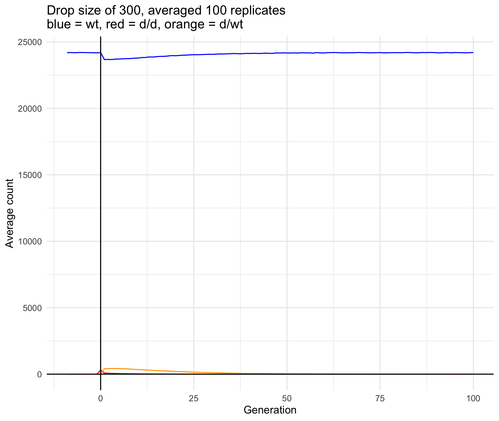
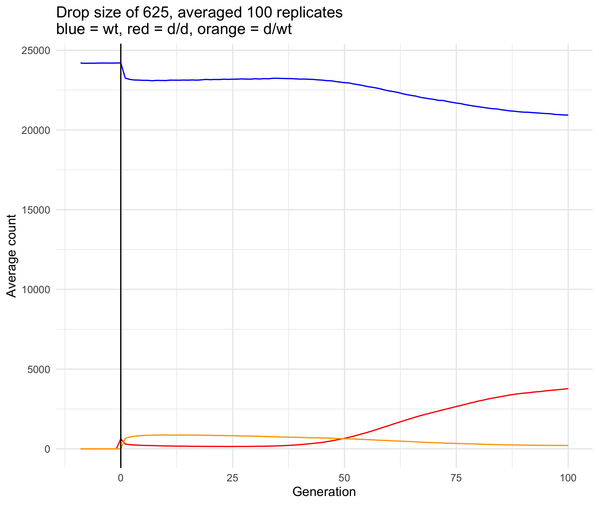
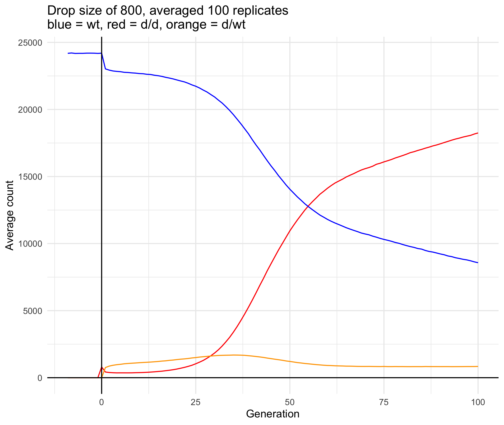
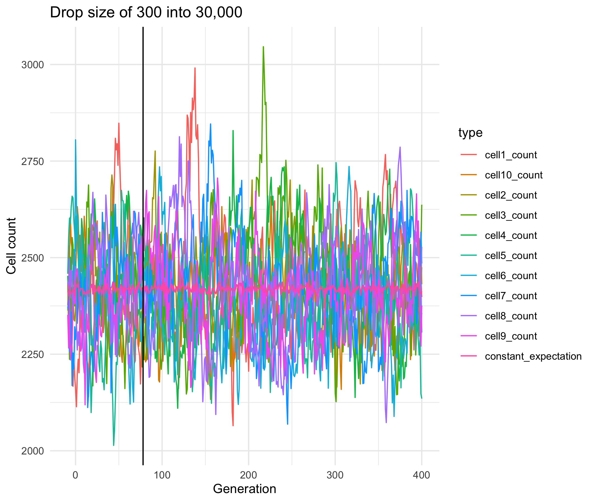
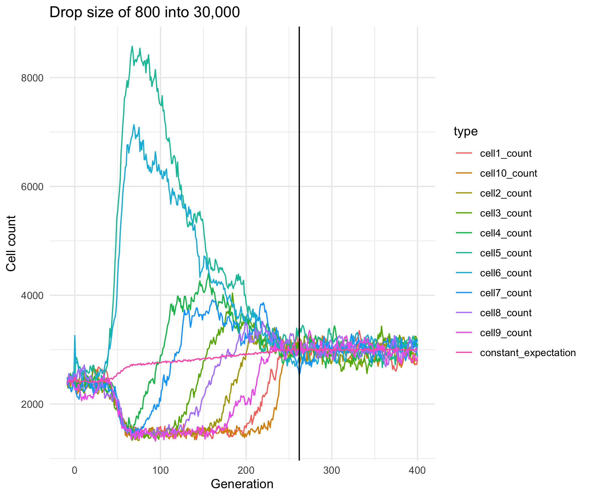
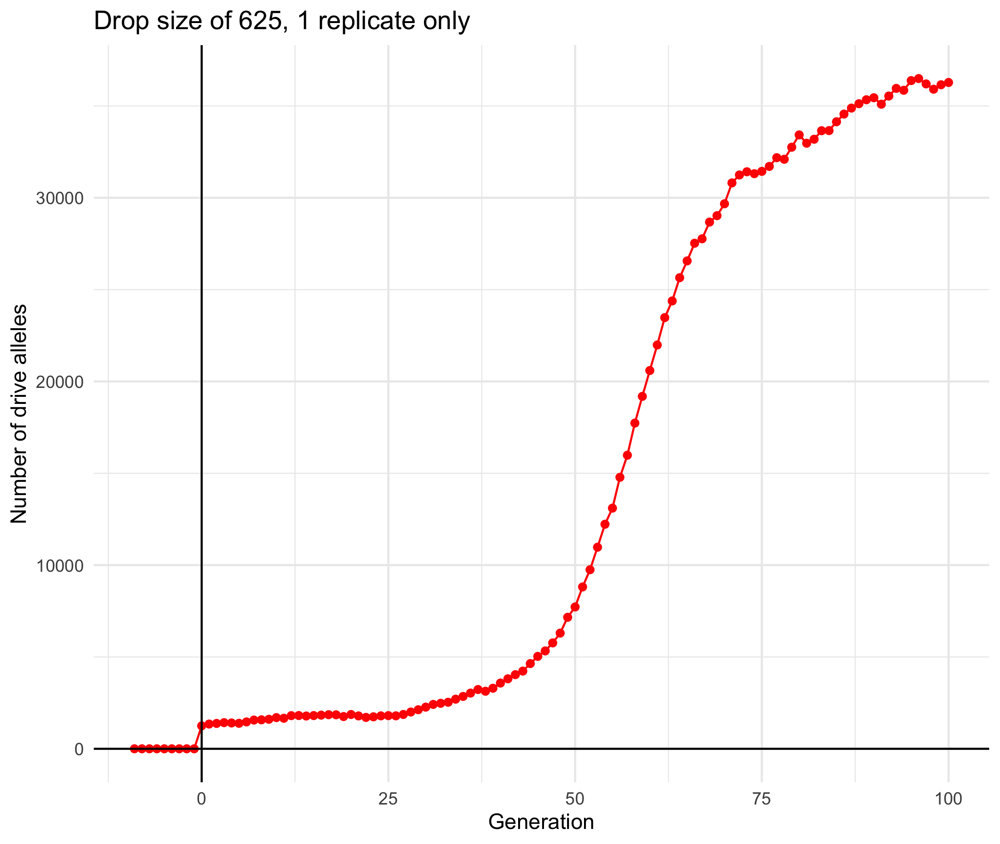

June 6-7 cluster output
================
Isabel Kim
6/7/2022

## Parameters

-   k = uhat = 0.2
-   Wild-type population size = global capacity = 30,000
-   sigma = 0.01 (D = 0.00005)
-   Mating radius = local interaction radius = 0.001
-   Baseline number of offspring = 3
-   Max additional number of offspring = 10
-   Exponential decay factor (in num_offspring code) = 5
-   Ran simulation for 100 generations

## Drop size versus P(increase) - 20 replicates per parameter

``` r
knitr::include_graphics("../new-slim-diffusion-files/cluster_output/p_increase_figure_june6_vary_m_uhat_k_0.2.png")
```

<!-- -->

## Generation-by-generation stats averaged over 100 replicates - for 3 drop size values

-   m = 300 –> P(increase) = 0%
-   m = 625 –> P(increase) = 22%
-   m = 800 –> P(increase) = around 90%

### Number of drive alleles

``` r
knitr::include_graphics("../new-slim-diffusion-files/cluster_output/avg_num_drive_alleles_m300.png")
```

<!-- -->

``` r
knitr::include_graphics("../new-slim-diffusion-files/cluster_output/avg_num_drive_alleles_m625.png")
```

<!-- -->

``` r
knitr::include_graphics("../new-slim-diffusion-files/cluster_output/avg_num_drive_alleles_m800.png")
```

<!-- -->

### Population size

``` r
knitr::include_graphics("../new-slim-diffusion-files/cluster_output/avg_popsize_m300.png")
```

<!-- -->

``` r
knitr::include_graphics("../new-slim-diffusion-files/cluster_output/avg_popsize_m625.png")
```

<!-- -->

``` r
knitr::include_graphics("../new-slim-diffusion-files/cluster_output/avg_popsize_m800.png")
```

<!-- -->

### Genotype counts

``` r

```

<!-- -->

``` r

```

<!-- -->

``` r

```

<!-- -->

## Generation-by-generation stats for a single replicate only - for 3 drop size values

### Cell counts

Separated the SLiM landscape into 10 cells – from \[0,0.1), \[0.1,
0.2),…,\[0.9,1.0) – and got the population size in each cell. Also
plotted the expected cell count under constant density. Let the
simulation run for 400 generations after the drop.

``` r

```

<!-- -->

``` r
knitr::include_graphics("../new-slim-diffusion-files/figures/cell_counts_m625_run_till_gen410.png")
```

<!-- -->

``` r

```

<!-- -->

Vertical black line represents the generation at which the drive fixes
or is lost.

The population is clustered around 0.4-0.6 when the drive is spreading.
By the time the drive has fixed, the population density becomes \~equal
again. When the drop size is small, or the drive is lost, the population
density remains constant.

### Number of drive alleles

``` r
knitr::include_graphics("../new-slim-diffusion-files/cluster_output/num_drive_alleles_1_rep_only_m300.png")
```

<!-- -->

``` r

```

<!-- -->

``` r
knitr::include_graphics("../new-slim-diffusion-files/cluster_output/num_drive_alleles_1_rep_only_m800.png")
```

<!-- -->

### Population size

``` r
knitr::include_graphics("../new-slim-diffusion-files/cluster_output/popsize_1_rep_only_m300.png")
```

<!-- -->

``` r
knitr::include_graphics("../new-slim-diffusion-files/cluster_output/popsize_1_rep_only_m625.png")
```

<!-- -->

``` r
knitr::include_graphics("../new-slim-diffusion-files/cluster_output/popsize_1_rep_only_m800.png")
```

<!-- -->
