Methods to control local density
================
Isabel Kim
5/31/2022

## Exponentiate the competition factor

-   Get rid of the “a few generations only” `reproduction()` code.
-   In every generation, turn down the local density competition factor
    penalty by exponentiating this with a value less than 1

### Exponent of 0.5

-   Nwt = 30,000

-   drop size = 10,000 (25% introduction frequency)

-   exponent = 0.5

-   Observations:

    -   Allee effects occur at least 3x in the simulation

``` bash
SLIM_CONSOLE=/Users/isabelkim/Desktop/year2/underdominance/reaction-diffusion/new-slim-diffusion-files/slim-output-exp0.5.txt
OUTPUT_CSV=/Users/isabelkim/Desktop/year2/underdominance/reaction-diffusion/new-slim-diffusion-files/slim-output-exp0.5.csv

cd /Users/isabelkim/Desktop/year2/underdominance/reaction-diffusion/new-slim-diffusion-files
python single-run-number-drive-alleles.py $SLIM_CONSOLE > $OUTPUT_CSV
```

``` r
library(tidyverse)
```

    ## ── Attaching packages ─────────────────────────────────────── tidyverse 1.3.1 ──

    ## ✓ ggplot2 3.3.5     ✓ purrr   0.3.4
    ## ✓ tibble  3.1.6     ✓ dplyr   1.0.8
    ## ✓ tidyr   1.2.0     ✓ stringr 1.4.0
    ## ✓ readr   2.1.2     ✓ forcats 0.5.1

    ## ── Conflicts ────────────────────────────────────────── tidyverse_conflicts() ──
    ## x dplyr::filter() masks stats::filter()
    ## x dplyr::lag()    masks stats::lag()

``` r
output = read_csv("/Users/isabelkim/Desktop/year2/underdominance/reaction-diffusion/new-slim-diffusion-files/csv_out/slim-output-exp0.5.csv")
```

    ## Rows: 101 Columns: 7

    ## ── Column specification ────────────────────────────────────────────────────────
    ## Delimiter: ","
    ## dbl (7): gen, popsize, num_dd, num_dwt, num_wtwt, num_d_alleles, rate_d_alleles
    ## 
    ## ℹ Use `spec()` to retrieve the full column specification for this data.
    ## ℹ Specify the column types or set `show_col_types = FALSE` to quiet this message.

``` r
plot_num_drive_alleles = ggplot(output, aes(x = gen, y = num_d_alleles)) + theme_minimal() +
  geom_line(color = "red") + xlab("gen") + ylab("number of drive alleles") + ggtitle("introduction frequency of 25% \ncompetition factor exponent = 0.5")

print(plot_num_drive_alleles)
```

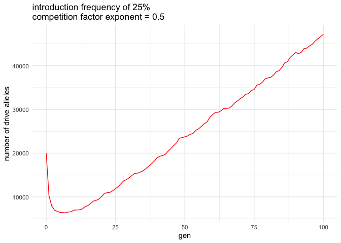<!-- -->

``` r
#ggsave(plot = plot_num_drive_alleles, filename = "/Users/isabelkim/Desktop/num_drive_alleles_exponent0.5.png")

plot_N_over_time = ggplot(output, aes(x = gen, y = popsize)) + theme_minimal() +
  geom_line(color = "purple") + xlab("gen") + ylab("population size") + ggtitle("introduction frequency of 25% \ncompetition factor exponent = 0.5")
print(plot_N_over_time)
```

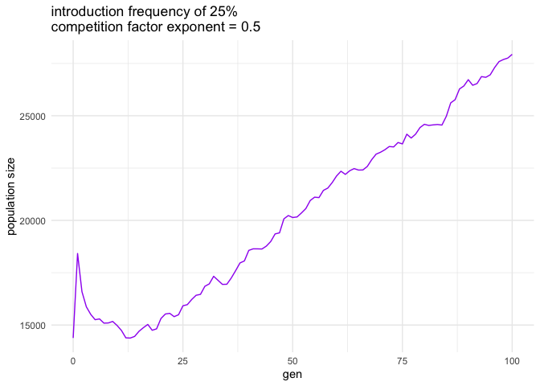<!-- -->

``` r
#ggsave(plot = plot_N_over_time, filename = "/Users/isabelkim/Desktop/popsize_exponent0.5.png")
```

This *does* seem to still punish the drive in the first generation a
lot. Plus, the population size doesn’t stay at an equilibrium; it
continues to increase.

### Exponent of 1/3

-   Nwt = 30,000

-   drop size = 10,000 (25% introduction frequency)

-   exponent = 1/3

-   Observations:

    -   Lots of clustering of the drive –> many individual can’t find a
        mate.

``` bash
SLIM_CONSOLE=/Users/isabelkim/Desktop/year2/underdominance/reaction-diffusion/new-slim-diffusion-files/slim-output-exp-one-third.txt
OUTPUT_CSV=/Users/isabelkim/Desktop/year2/underdominance/reaction-diffusion/new-slim-diffusion-files/slim-output-exp-one-third.csv

cd /Users/isabelkim/Desktop/year2/underdominance/reaction-diffusion/new-slim-diffusion-files
python single-run-number-drive-alleles.py $SLIM_CONSOLE > $OUTPUT_CSV
```

``` r
output = read_csv("/Users/isabelkim/Desktop/year2/underdominance/reaction-diffusion/new-slim-diffusion-files/csv_out/slim-output-exp-one-third.csv")
```

    ## Rows: 101 Columns: 7
    ## ── Column specification ────────────────────────────────────────────────────────
    ## Delimiter: ","
    ## dbl (7): gen, popsize, num_dd, num_dwt, num_wtwt, num_d_alleles, rate_d_alleles
    ## 
    ## ℹ Use `spec()` to retrieve the full column specification for this data.
    ## ℹ Specify the column types or set `show_col_types = FALSE` to quiet this message.

``` r
plot_num_drive_alleles = ggplot(output, aes(x = gen, y = num_d_alleles)) + theme_minimal() +
  geom_line(color = "red") + xlab("gen") + ylab("number of drive alleles") + ggtitle("introduction frequency of 25% \ncompetition factor exponent = 1/3")

print(plot_num_drive_alleles)
```

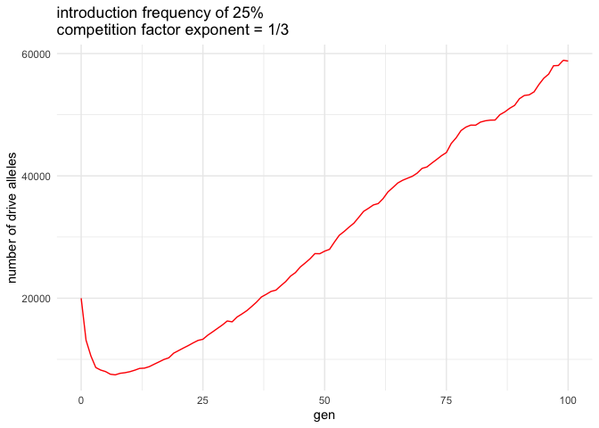<!-- -->

``` r
plot_N_over_time = ggplot(output, aes(x = gen, y = popsize)) + theme_minimal() +
  geom_line(color = "purple") + xlab("gen") + ylab("population size") + ggtitle("introduction frequency of 25% \ncompetition factor exponent = 1/3")
print(plot_N_over_time)
```

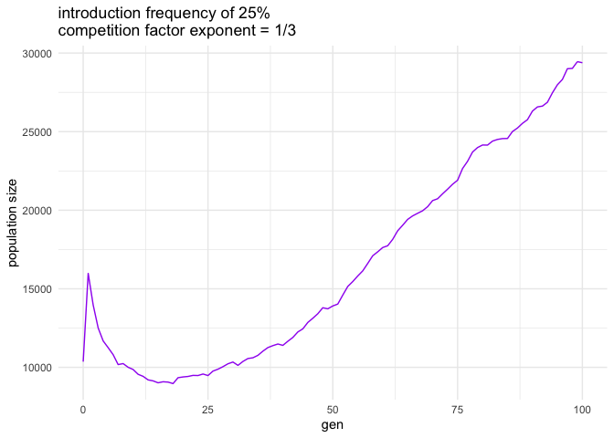<!-- -->

Same problem as before, and the population reaches an even higher level.

### Baseline: exponent of 1 – how bad is the drive punishment problem?

-   Nwt = 30,000
-   drop size = 10,000 (25% introduction frequency)
-   exponent = 1
-   Observations
    -   No cases where an individual can’t find a mate

``` bash
SLIM_CONSOLE=/Users/isabelkim/Desktop/year2/underdominance/reaction-diffusion/new-slim-diffusion-files/slim-output-exp1.txt
OUTPUT_CSV=/Users/isabelkim/Desktop/year2/underdominance/reaction-diffusion/new-slim-diffusion-files/slim-output-exp1.csv

cd /Users/isabelkim/Desktop/year2/underdominance/reaction-diffusion/new-slim-diffusion-files
python single-run-number-drive-alleles.py $SLIM_CONSOLE > $OUTPUT_CSV
```

``` r
output = read_csv("/Users/isabelkim/Desktop/year2/underdominance/reaction-diffusion/new-slim-diffusion-files/csv_out/slim-output-exp1.csv")
```

    ## Rows: 101 Columns: 7
    ## ── Column specification ────────────────────────────────────────────────────────
    ## Delimiter: ","
    ## dbl (7): gen, popsize, num_dd, num_dwt, num_wtwt, num_d_alleles, rate_d_alleles
    ## 
    ## ℹ Use `spec()` to retrieve the full column specification for this data.
    ## ℹ Specify the column types or set `show_col_types = FALSE` to quiet this message.

``` r
plot_num_drive_alleles = ggplot(output, aes(x = gen, y = num_d_alleles)) + theme_minimal() +
  geom_line(color = "red") + xlab("gen") + ylab("number of drive alleles") + ggtitle("introduction frequency of 25% \ncompetition factor exponent = 1")

print(plot_num_drive_alleles)
```

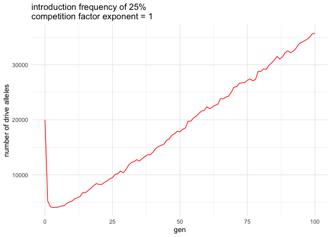<!-- -->

``` r
plot_N_over_time = ggplot(output, aes(x = gen, y = popsize)) + theme_minimal() +
  geom_line(color = "purple") + xlab("gen") + ylab("population size") + ggtitle("introduction frequency of 25% \ncompetition factor exponent = 1")
print(plot_N_over_time)
```

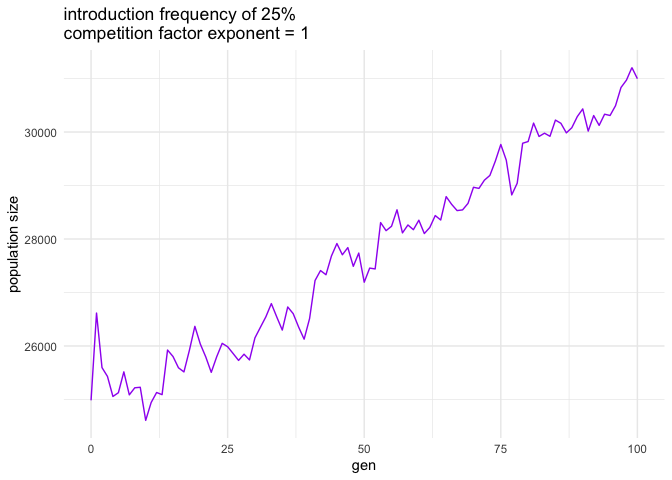<!-- -->
*BIG* drop in the number of drive alleles. Still no real “equilibrium”
N.

## Set up a different interaction for local density control and make the radius bigger (originally was 0.001)

### distance = 0.01

-   Nwt = 30,000
-   drop size = 10,000 (25% introduction frequency)
-   distance = 0.01

``` bash
SLIM_CONSOLE=/Users/isabelkim/Desktop/year2/underdominance/reaction-diffusion/new-slim-diffusion-files/slim-output-d0.01.txt
OUTPUT_CSV=/Users/isabelkim/Desktop/year2/underdominance/reaction-diffusion/new-slim-diffusion-files/slim-output-d0.01.csv

cd /Users/isabelkim/Desktop/year2/underdominance/reaction-diffusion/new-slim-diffusion-files
python single-run-number-drive-alleles.py $SLIM_CONSOLE > $OUTPUT_CSV
```

``` r
output = read_csv("/Users/isabelkim/Desktop/year2/underdominance/reaction-diffusion/new-slim-diffusion-files/csv_out/slim-output-d0.01.csv")
```

    ## Rows: 101 Columns: 7
    ## ── Column specification ────────────────────────────────────────────────────────
    ## Delimiter: ","
    ## dbl (7): gen, popsize, num_dd, num_dwt, num_wtwt, num_d_alleles, rate_d_alleles
    ## 
    ## ℹ Use `spec()` to retrieve the full column specification for this data.
    ## ℹ Specify the column types or set `show_col_types = FALSE` to quiet this message.

``` r
plot_num_drive_alleles = ggplot(output, aes(x = gen, y = num_d_alleles)) + theme_minimal() +
  geom_line(color = "red") + xlab("gen") + ylab("number of drive alleles") + ggtitle("introduction frequency of 25% \ninteraction distance = 0.01")

print(plot_num_drive_alleles)
```

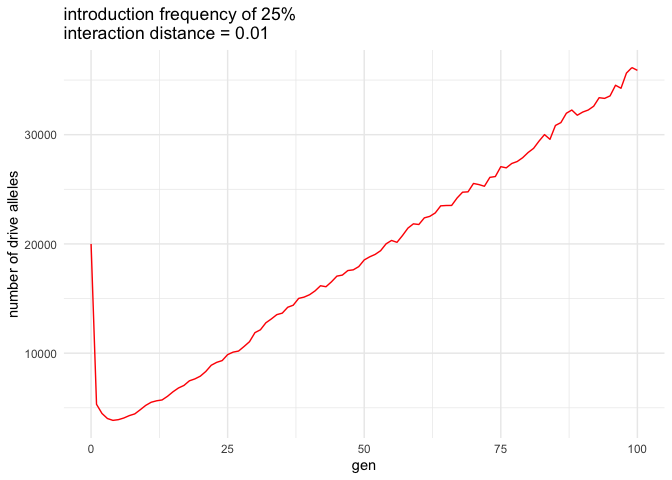<!-- -->

``` r
#ggsave(plot = plot_num_drive_alleles, filename = "/Users/isabelkim/Desktop/num_drive_alleles_interaction_distance_0.01.png")


plot_N_over_time = ggplot(output, aes(x = gen, y = popsize)) + theme_minimal() +
  geom_line(color = "purple") + xlab("gen") + ylab("population size") + ggtitle("introduction frequency of 25% \ninteraction distance = 0.01")
print(plot_N_over_time)
```

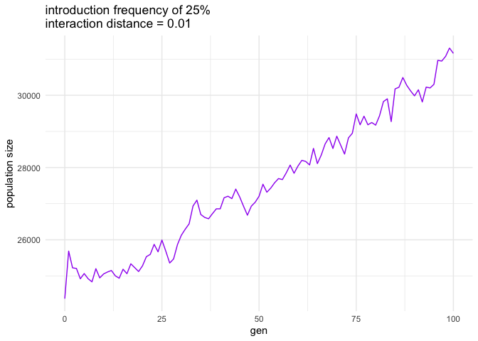<!-- -->

``` r
ggsave(plot = plot_N_over_time, filename = "/Users/isabelkim/Desktop/popsize_interaction_distance_0.01.png")
```

    ## Saving 7 x 5 in image

Still a big drop in the number of drive alleles.

### distance = 0.05

-   Nwt = 30,000
-   drop size = 10,000 (25% introduction frequency)
-   distance = 0.05

``` bash
SLIM_CONSOLE=/Users/isabelkim/Desktop/year2/underdominance/reaction-diffusion/new-slim-diffusion-files/slim-output-d0.05.txt
OUTPUT_CSV=/Users/isabelkim/Desktop/year2/underdominance/reaction-diffusion/new-slim-diffusion-files/slim-output-d0.05.csv

cd /Users/isabelkim/Desktop/year2/underdominance/reaction-diffusion/new-slim-diffusion-files
python single-run-number-drive-alleles.py $SLIM_CONSOLE > $OUTPUT_CSV
```

``` r
output = read_csv("/Users/isabelkim/Desktop/year2/underdominance/reaction-diffusion/new-slim-diffusion-files/csv_out/slim-output-d0.05.csv")
```

    ## Rows: 101 Columns: 7
    ## ── Column specification ────────────────────────────────────────────────────────
    ## Delimiter: ","
    ## dbl (7): gen, popsize, num_dd, num_dwt, num_wtwt, num_d_alleles, rate_d_alleles
    ## 
    ## ℹ Use `spec()` to retrieve the full column specification for this data.
    ## ℹ Specify the column types or set `show_col_types = FALSE` to quiet this message.

``` r
plot_num_drive_alleles = ggplot(output, aes(x = gen, y = num_d_alleles)) + theme_minimal() +
  geom_line(color = "red") + xlab("gen") + ylab("number of drive alleles") + ggtitle("introduction frequency of 25% \ninteraction distance = 0.05")
print(plot_num_drive_alleles)
```

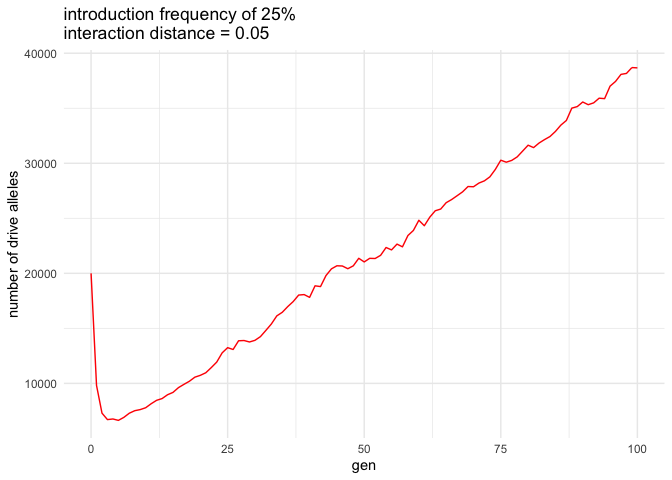<!-- -->

``` r
plot_N_over_time = ggplot(output, aes(x = gen, y = popsize)) + theme_minimal() +
  geom_line(color = "purple") + xlab("gen") + ylab("population size") + ggtitle("introduction frequency of 25% \ninteraction distance = 0.05")
print(plot_N_over_time)
```

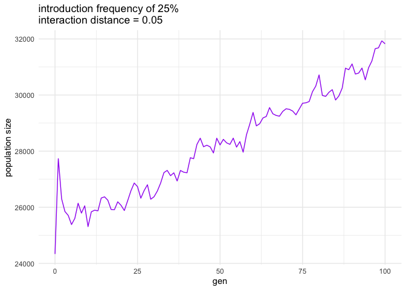<!-- -->
Big drop still.

## Investigate the number of individuals surrounding a few of the d/d individuals released

Sampling 10 female d/d at generation 10 after release and dispersal
(before reproduction in generation 11) for radius of 0.001

``` r
number_around_female = c(557,832,453,614,613,392,222,334,97,371)
mean(number_around_female)
```

    ## [1] 448.5

``` r
ratios = number_around_female/80 # ni/nexp
ratios
```

    ##  [1]  6.9625 10.4000  5.6625  7.6750  7.6625  4.9000  2.7750  4.1750  1.2125
    ## [10]  4.6375

``` r
competition_factors = 2/(ratios + 1)
competition_factors
```

    ##  [1] 0.2511774 0.1754386 0.3001876 0.2305476 0.2308802 0.3389831 0.5298013
    ##  [8] 0.3864734 0.9039548 0.3547672

``` r
num_offspring_expected = 2*competition_factors
num_offspring_expected
```

    ##  [1] 0.5023548 0.3508772 0.6003752 0.4610951 0.4617605 0.6779661 1.0596026
    ##  [8] 0.7729469 1.8079096 0.7095344

for radius of 0.01:

``` r
number_around_female = c(7026, 3888,7214,7197,6548,761,7147,7335,6780,6707)
mean(number_around_female)
```

    ## [1] 6060.3

``` r
ratios = number_around_female/800 # ni/nexp
ratios
```

    ##  [1] 8.78250 4.86000 9.01750 8.99625 8.18500 0.95125 8.93375 9.16875 8.47500
    ## [10] 8.38375

``` r
competition_factors = 2/(ratios + 1)
competition_factors
```

    ##  [1] 0.2044467 0.3412969 0.1996506 0.2000750 0.2177463 1.0249840 0.2013338
    ##  [8] 0.1966810 0.2110818 0.2131344

``` r
num_offspring_expected = 2*competition_factors
num_offspring_expected
```

    ##  [1] 0.4088934 0.6825939 0.3993012 0.4001501 0.4354927 2.0499680 0.4026677
    ##  [8] 0.3933620 0.4221636 0.4262688

``` r
beta_comp = function(beta){
  denom = ((beta-1)*7.5)+1
  num = beta
  return(num/denom)
}

# find one around 1
betas = 2:11
comp_factors = rep(-1,10)
for (i in 1:10){
  comp_factors[i] = beta_comp(betas[i])
}

plot(betas,comp_factors)
```

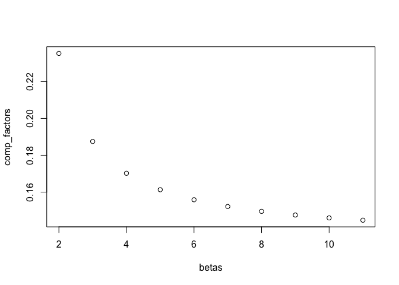<!-- -->

As beta increases, clustered individuals are punished even more.

## Drop of 100 (0.33% introduction frequency)

### Keeping the local density radius = the mating radius and the exponent on the competition factor = 1

Using the `EXPECTED_ADULT_COMPETITION` term:

``` bash
SLIM_CONSOLE=/Users/isabelkim/Desktop/year2/underdominance/reaction-diffusion/new-slim-diffusion-files/text_out/using_term.txt
OUTPUT_CSV=/Users/isabelkim/Desktop/year2/underdominance/reaction-diffusion/new-slim-diffusion-files/csv_out/m100_using_expected_adult_competition.csv

cd /Users/isabelkim/Desktop/year2/underdominance/reaction-diffusion/new-slim-diffusion-files
python single-run-number-drive-alleles.py $SLIM_CONSOLE > $OUTPUT_CSV
```

``` r
library(tidyverse)
output = read_csv("/Users/isabelkim/Desktop/year2/underdominance/reaction-diffusion/new-slim-diffusion-files/csv_out/m100_using_expected_adult_competition.csv")
```

    ## Rows: 54 Columns: 7
    ## ── Column specification ────────────────────────────────────────────────────────
    ## Delimiter: ","
    ## dbl (7): gen, popsize, num_dd, num_dwt, num_wtwt, num_d_alleles, rate_d_alleles
    ## 
    ## ℹ Use `spec()` to retrieve the full column specification for this data.
    ## ℹ Specify the column types or set `show_col_types = FALSE` to quiet this message.

``` r
plot_num_drive_alleles = ggplot(output, aes(x = gen, y = num_d_alleles)) + theme_minimal() +
  geom_line(color = "red") + xlab("gen") + ylab("number of drive alleles") + ggtitle("Drop size of 100 into 30,000")
print(plot_num_drive_alleles)
```

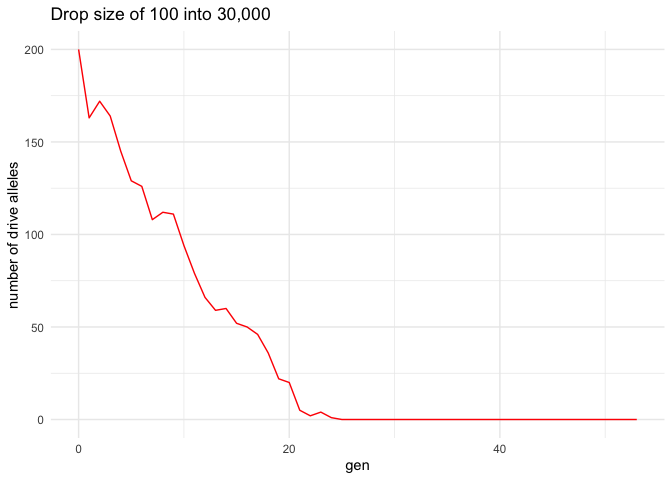<!-- -->

``` r
plot_N_over_time = ggplot(output, aes(x = gen, y = popsize)) + theme_minimal() +
  geom_line(color = "purple") + xlab("gen") + ylab("population size") +ggtitle("Drop size of 100 into 30,000")
print(plot_N_over_time)
```

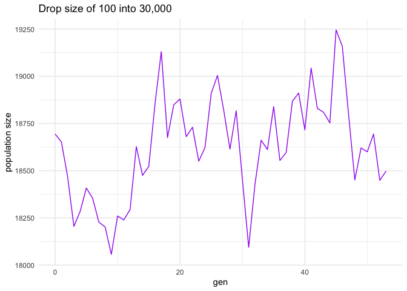<!-- -->
The drive is lost and the population size fluctuates but is much below
the capacity of 30,000.

Letting `EXPECTED_ADULT_COMPETITION` = the current population size

``` bash
SLIM_CONSOLE=/Users/isabelkim/Desktop/year2/underdominance/reaction-diffusion/new-slim-diffusion-files/text_out/using_term.txt
OUTPUT_CSV=/Users/isabelkim/Desktop/year2/underdominance/reaction-diffusion/new-slim-diffusion-files/csv_out/m100_using_current_population_size.csv

cd /Users/isabelkim/Desktop/year2/underdominance/reaction-diffusion/new-slim-diffusion-files
python single-run-number-drive-alleles.py $SLIM_CONSOLE > $OUTPUT_CSV
```

-   Lots of Allee effects –> population crashes

``` r
output = read_csv("/Users/isabelkim/Desktop/year2/underdominance/reaction-diffusion/new-slim-diffusion-files/csv_out/m100_using_current_population_size.csv")
```

    ## Rows: 9 Columns: 7
    ## ── Column specification ────────────────────────────────────────────────────────
    ## Delimiter: ","
    ## dbl (7): gen, popsize, num_dd, num_dwt, num_wtwt, num_d_alleles, rate_d_alleles
    ## 
    ## ℹ Use `spec()` to retrieve the full column specification for this data.
    ## ℹ Specify the column types or set `show_col_types = FALSE` to quiet this message.

``` r
plot_num_drive_alleles = ggplot(output, aes(x = gen, y = num_d_alleles)) + theme_minimal() +
  geom_line(color = "red") + xlab("gen") + ylab("number of drive alleles") + ggtitle("Drop size of 100 into 30,000")
print(plot_num_drive_alleles)
```

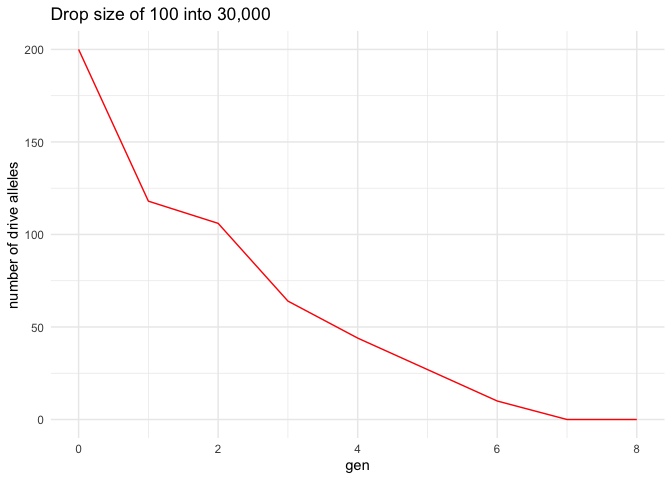<!-- -->

``` r
plot_N_over_time = ggplot(output, aes(x = gen, y = popsize)) + theme_minimal() +
  geom_line(color = "purple") + xlab("gen") + ylab("population size") +ggtitle("Drop size of 100 into 30,000")
print(plot_N_over_time)
```

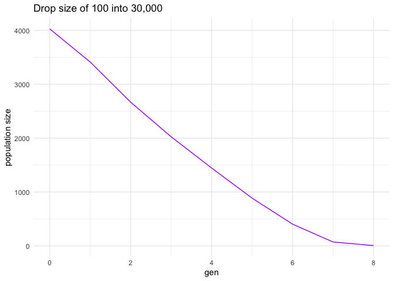<!-- -->
Almost linear decrease in population size

### Increasing the local density radius to 0.01

With the standard `EXPECTED_ADULT_COMPETITION` term

``` bash
SLIM_CONSOLE=/Users/isabelkim/Desktop/year2/underdominance/reaction-diffusion/new-slim-diffusion-files/text_out/using_term.txt
OUTPUT_CSV=/Users/isabelkim/Desktop/year2/underdominance/reaction-diffusion/new-slim-diffusion-files/csv_out/m100_standard_exp_and_increased_radius.csv

cd /Users/isabelkim/Desktop/year2/underdominance/reaction-diffusion/new-slim-diffusion-files
python single-run-number-drive-alleles.py $SLIM_CONSOLE > $OUTPUT_CSV
```

``` r
output = read_csv("/Users/isabelkim/Desktop/year2/underdominance/reaction-diffusion/new-slim-diffusion-files/csv_out/m100_standard_exp_and_increased_radius.csv")
```

    ## Rows: 159 Columns: 7
    ## ── Column specification ────────────────────────────────────────────────────────
    ## Delimiter: ","
    ## dbl (7): gen, popsize, num_dd, num_dwt, num_wtwt, num_d_alleles, rate_d_alleles
    ## 
    ## ℹ Use `spec()` to retrieve the full column specification for this data.
    ## ℹ Specify the column types or set `show_col_types = FALSE` to quiet this message.

``` r
plot_num_drive_alleles = ggplot(output, aes(x = gen, y = num_d_alleles)) + theme_minimal() +
  geom_line(color = "red") + xlab("gen") + ylab("number of drive alleles") + ggtitle("Drop size of 100 into 30,000")
print(plot_num_drive_alleles)
```

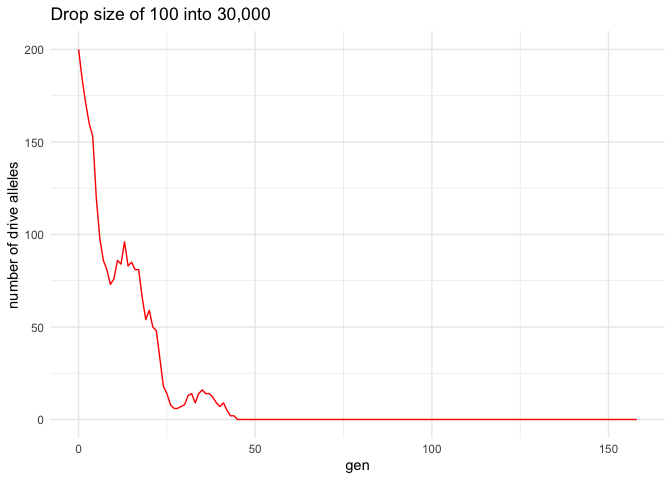<!-- -->

``` r
plot_N_over_time = ggplot(output, aes(x = gen, y = popsize)) + theme_minimal() +
  geom_line(color = "purple") + xlab("gen") + ylab("population size") +ggtitle("Drop size of 100 into 30,000")
print(plot_N_over_time)
```

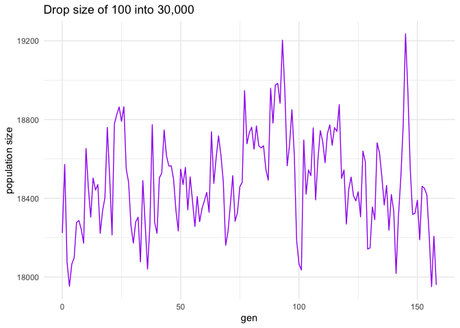<!-- -->
Population size stays more stable / doesn’t crash.
