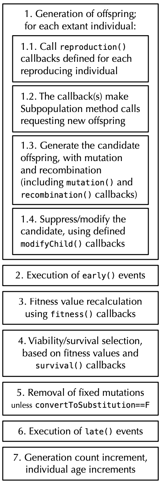

New SLiM model - write-up
================
Isabel Kim
6/7/2022

``` r

```

<!-- -->

## Generation `10() late` drive drop

-   At position 0.5 (the midpoint), add `DRIVE_DROP_SIZE` number of
    drive homozygotes.
-   Write output out to console
-   Let everyone (drives *and* wild-types) disperse according to the
    Gaussian dispersal kernel with mean 0 and standard deviation `sigma`
    -   This means that the diffusion constant, `D`, equals
        `(1/2)(sigma^2)`
-   Evaluate the interactions

## \`reproduction()

-   Sample 1 male neighbor from within the female’s
    `MATING_INTERACTION_RADIUS` (interaction2)
-   Calculate the `adult_density_force`, aka the number of individuals
    within the female’s `LOCAL_INTERACTION_RADIUS`
    -   Let the `expected_local_density` be based on the current
        population size, ie
        `(2*LOCAL_INTERACTION_RADIUS)*p1.individualCount`
-   Calculate the
    `competition_ratio = adult_density_force/expected_local_density`
-   Calculate the `exp_num_offspring`, based on the
    `BASELINE_NUM_OFFSPRING` (set to 3 by default) and whether the
    female is in a low density area:
    -   `exp_num_offspring = BASELINE_NUM_OFFSPRING + (MAX_ADDITIONAL_NUM_OFFSPRING*exp(-EXPONENTIAL_DECAY_FACTOR*competition_ratio))`
-   Draw the female’s actual `num_offspring` from the Poisson
    distribution with a mean equal to the `exp_num_offspring`

### `modifyChild()`

-   Tag each child with their genotype-fitness value
-   Set the child at the mother’s position

## `early()` – after all embryos have been created

-   Kill off all adults; set their `fitnessScaling` values to 0.0
-   For the surviving juveniles, let their viability probabilities equal
    their fitness value times a global density control factor:
    -   `juveniles.fitnessScaling = (juveniles.tagF/drive_homozygote_fitness)*(GLOBAL_CAPACITY / length(juveniles))`

## `late()`

-   Output the generation, population size, genotype counts, number of
    drive alleles, and rate of the drive
-   Let everyone disperse according to the Gaussian kernel with standard
    deviation of `sigma`
-   Evaluate the interactions
-   End the simulation after a certain number of generations (default
    100 generations after the drop – stop at generation 110).
