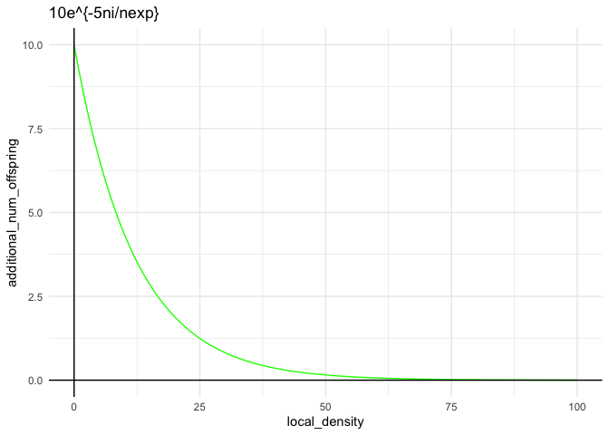

2-step density control
================
Isabel Kim
6/6/2022

## Function

``` r
additional_number_of_offspring = function(local_number, expected_number, max_addition, factor){
  sol = max_addition*exp((-factor*local_number)/expected_number)
  return(sol)
}
```

## Looping through different decay factors

``` r
library(tidyverse)
```

    ## ── Attaching packages ─────────────────────────────────────── tidyverse 1.3.1 ──

    ## ✓ ggplot2 3.3.5     ✓ purrr   0.3.4
    ## ✓ tibble  3.1.6     ✓ dplyr   1.0.8
    ## ✓ tidyr   1.2.0     ✓ stringr 1.4.0
    ## ✓ readr   2.1.2     ✓ forcats 0.5.1

    ## ── Conflicts ────────────────────────────────────────── tidyverse_conflicts() ──
    ## x dplyr::filter() masks stats::filter()
    ## x dplyr::lag()    masks stats::lag()

``` r
decay_factor = 5
expected_number=60
max_addition=10

local_numbers = seq(0,70)
addition = rep(-1,length(local_numbers))

for (i in 1:length(local_numbers)){
  local = local_numbers[i]
  addition[i] = additional_number_of_offspring(local,expected_number,max_addition,decay_factor)
}
t = tibble(local_density = local_numbers, additional_num_offspring = addition)
g = ggplot(t,aes(x = local_density, y = additional_num_offspring)) + geom_line(color = "green")+theme_minimal() + geom_vline(xintercept = expected_number, color = "yellow") + geom_vline(xintercept = 0) + geom_hline(yintercept = 0) + ggtitle(paste0(max_addition,"e^{-",decay_factor,"ni/nexp}"))
print(g)
```

<!-- -->
Let’s go with 5.
