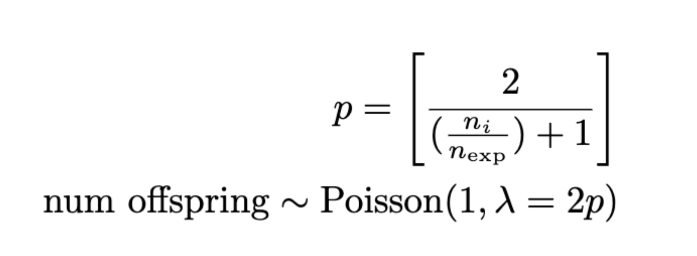

```{r setup, include=FALSE}
knitr::opts_chunk$set(echo = TRUE)
```

## Order of operations:
```{r}

```

### 0. introduction

* Introduce a population of 30,000 wild-type individuals, each with a random x coordinate drawn from the uniform distribution between 0 and 1. Assign each a tagF value that holds their genotype-based fitness.

### 1a. reproduction

* Get all males within m=0.001 of the female
  + If there are no males in this area, then the female can't mate
* Randomly sample a male neighbor to mate with
* The number of offspring produced depends on the number of individuals surrounding the female and the low density growth rate (does not depend on female fitness anymore)
```{r}

```


### 1b. modifyChild

* Assign the child a tagF value based on their fitness
* Place the child at the mother's position (no displacement)

### 2. early() events and fitness evaluation

* Kill off adults to enforce non-overlapping generations
* Juveniles' probability of survival *now depends on their fitness*
  + All fitness values are divided by the maximum fitness value, the d/d fitness value
  + **This is the reaction: viability selection at the juvenile stage**

### 3. late() events

* Only the children who survived the viability selection stage are now present
* If gen < drive release generation (10): 
  + Color all wild-types blue
  + Print out just the generation and the population size (**output**)
  + Loop through all individuals, **displacing them a random distance from the exponential distribution**
  + Evaluate the interaction to calculate new mating distances for the next generation
* If gen == drive release generation (10):
  + Convert all individuals inside the release square to drive homozygotes.
* If gen >= drive release generation (10-):
  + Color drive homozygotes red, drive heterozygotes orange, and wild-types blue.
  + **Output** the generation, population size, overall rate of the drive, overall number of drive alleles, the number of drive alleles in the window around 0, the number of drive homozygotes in the window around 0, and the number of drive heterozygotes in the window around 0.
  + If liveplot is True, then plot the number of drive alleles, drive homozygotes, and drive heterozygotes in 1 plot and the overall rate of the drive in another plot
  + **Displace** all individuals a random distance drawn from the exponential distribution
  + Evaluate the interaction to get distances for the next round of mating
  + Stop the simulation if it's generation 110
