```{r setup, include=FALSE}
knitr::opts_chunk$set(echo = TRUE)
```

## Procedure

* Run `nonWF-model.slim` with `NO_DRIVE=T`
* Copy and paste the output into a text file
* Run the python file that parses the output into a csv `python check_N.py path-to-output-text-file > path-to-output-csv-file`


## Standard parameters

* sigma = 0.01 (average dispersal distance for wikld-types)
* m = 0.005 (bug)
* growth at zero density = 2
* exponent on the competition factor = 2 (punish clustering more)
* run for 588 generations


* csv output after python: `/Users/isabelkim/Desktop/year2/underdominance/reaction-diffusion/wt-stabilize/standard-params.csv`
* figure: `/Users/isabelkim/Desktop/year2/underdominance/reaction-diffusion/wt-stabilize/standard-params-gen-N.png`


```{r}
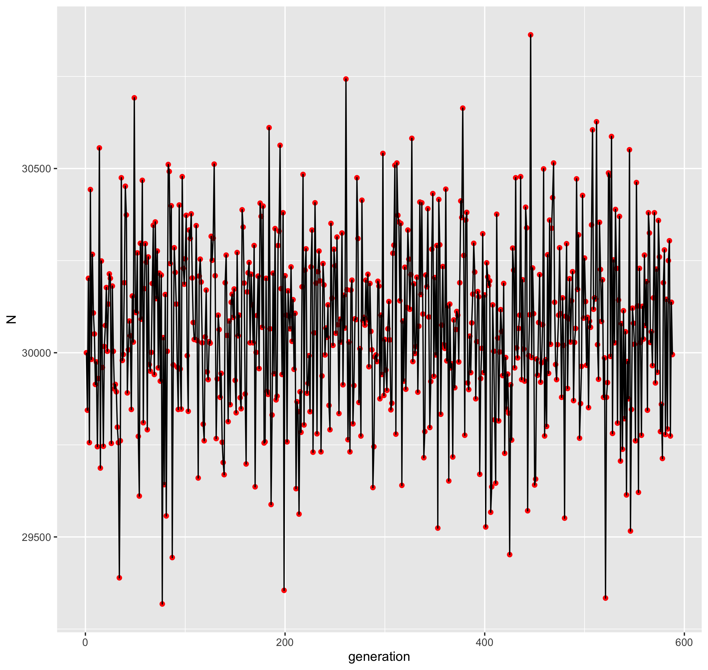
```
* min = 29,318 and max = 30,863 (range of 1545)

The population size seems to never stabilize.

## Try letting m = sigma and raising the exponent on the competition factor from 2 to 3

* sigma = m = 0.01
* growth at zero density = 2
* exponent on the competition factor = 3
* run for 154 generations

Bash commands:
```{bash eval=F}
TXT="/Users/isabelkim/Desktop/year2/underdominance/reaction-diffusion/wt-stabilize/output.txt"
CSV="/Users/isabelkim/Desktop/year2/underdominance/reaction-diffusion/wt-stabilize/exp3.csv"

python check_N.py $TXT > $CSV
```

* csv output: `/Users/isabelkim/Desktop/year2/underdominance/reaction-diffusion/wt-stabilize/exp3.csv`
* figure: `/Users/isabelkim/Desktop/year2/underdominance/reaction-diffusion/wt-stabilize/exp3_gen_vs_N.png`
```{r}
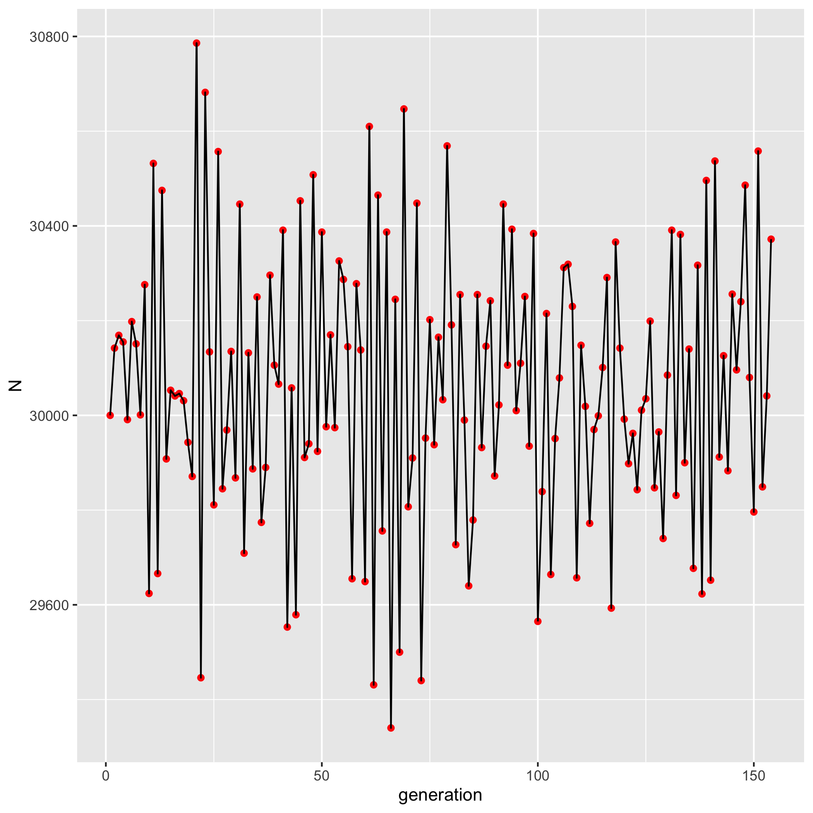
```
* min = 29,340 and max = 30,786 (range of 1446) -- has only slightly decreased

## Raise exponent even more -- to 4

* sigma = m = 0.01
* growth at zero density = 2
* exponent on the competition factor = 4
* run for 156 generations

Bash commands:
```{bash eval=F}
TXT="/Users/isabelkim/Desktop/year2/underdominance/reaction-diffusion/wt-stabilize/output.txt"
CSV="/Users/isabelkim/Desktop/year2/underdominance/reaction-diffusion/wt-stabilize/exp4.csv"

python check_N.py $TXT > $CSV
```

* csv output: `/Users/isabelkim/Desktop/year2/underdominance/reaction-diffusion/wt-stabilize/exp4.csv`
* figure: `/Users/isabelkim/Desktop/year2/underdominance/reaction-diffusion/wt-stabilize/exp4_gen_vs_N.png`
```{r}
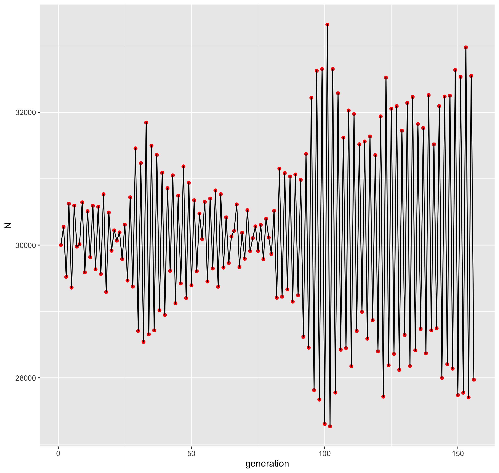
```
* min = 27,269 and max = 33,321 (range = 6052)
* The range has increased even more

## Try competition factor of 1 again

* sigma = m = 0.01
* growth at zero density = 2
* exponent on the competition factor = 1
* run for 189 generations

Bash commands
```{bash eval=F}
TXT="/Users/isabelkim/Desktop/year2/underdominance/reaction-diffusion/wt-stabilize/output.txt"
CSV="/Users/isabelkim/Desktop/year2/underdominance/reaction-diffusion/wt-stabilize/exp1.csv"

python check_N.py $TXT > $CSV
```

* csv output: `/Users/isabelkim/Desktop/year2/underdominance/reaction-diffusion/wt-stabilize/exp1.csv`
* figure: `/Users/isabelkim/Desktop/year2/underdominance/reaction-diffusion/wt-stabilize/exp1_gen_vs_N.png`
```{r}
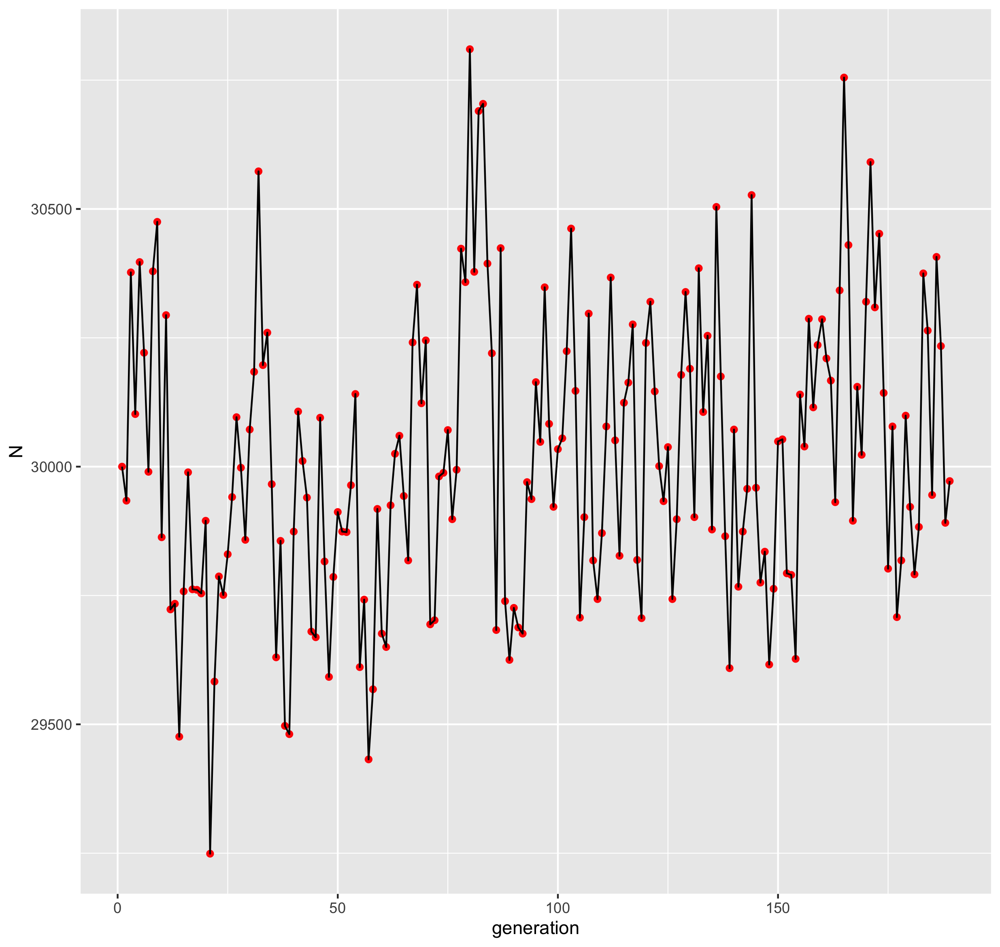
```
* min = 29,249 and max = 30,810 (range = 1561)

## Best option?

* Competition factor of 4 is probably the worst.
* Let's stick with 2.

keep these parameters the same for 3 replicates

* sigma = 0.01 (average dispersal distance for wikld-types)
* m = sigma
* exponent on the competition factor = 2
* growth at zero density = 2
* run for 100 generations

### Replicate 1

Bash commands
```{bash eval=F}
TXT="/Users/isabelkim/Desktop/year2/underdominance/reaction-diffusion/wt-stabilize/output.txt"
CSV="/Users/isabelkim/Desktop/year2/underdominance/reaction-diffusion/wt-stabilize/exp2_replicate1.csv"

python check_N.py $TXT > $CSV
```

* csv: `/Users/isabelkim/Desktop/year2/underdominance/reaction-diffusion/wt-stabilize/exp2_replicate1.csv`
  + min = 29,371 and max = 30,549 (range = 1178)
* single figure: `/Users/isabelkim/Desktop/year2/underdominance/reaction-diffusion/wt-stabilize/exp2_replicate1.png`

```{r}
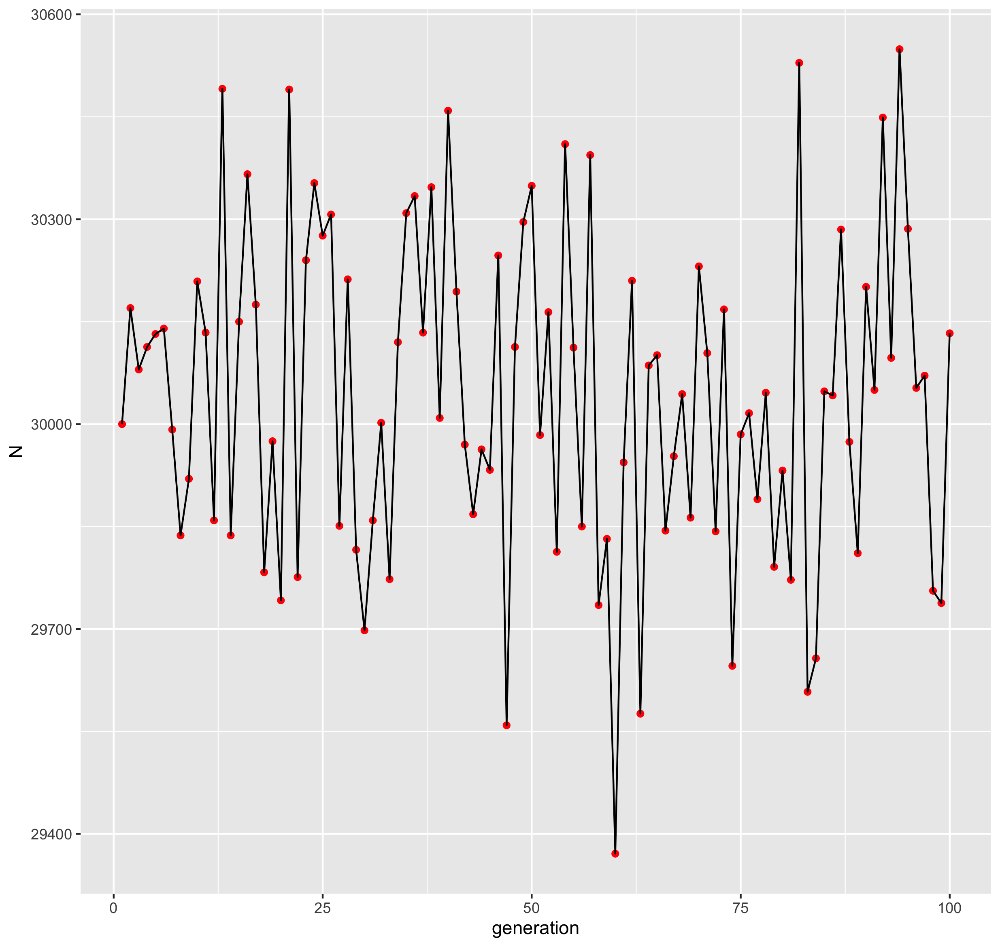
```

### Replicate 2

Bash commands
```{bash eval=F}
TXT="/Users/isabelkim/Desktop/year2/underdominance/reaction-diffusion/wt-stabilize/output.txt"
CSV="/Users/isabelkim/Desktop/year2/underdominance/reaction-diffusion/wt-stabilize/exp2_replicate2.csv"

python check_N.py $TXT > $CSV
```

* csv: `/Users/isabelkim/Desktop/year2/underdominance/reaction-diffusion/wt-stabilize/exp2_replicate2.csv`
  + min = 29,549 and max = 30,623 (range of 1074)
* single figure: `/Users/isabelkim/Desktop/year2/underdominance/reaction-diffusion/wt-stabilize/exp2_replicate2.png`

```{r}
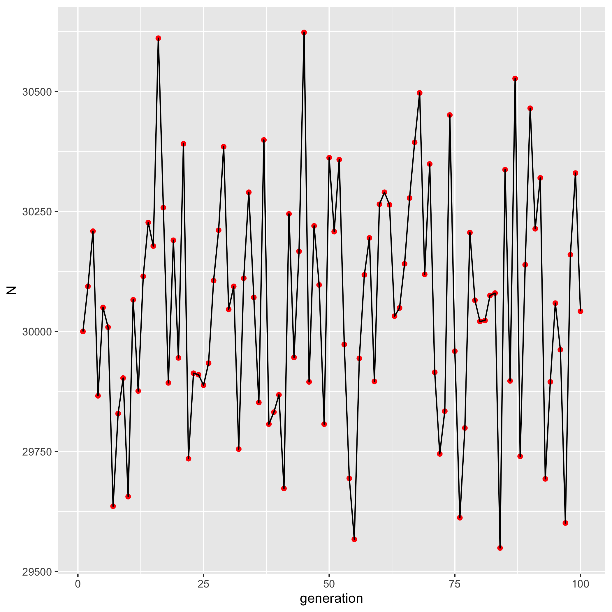
```

### Replicate 3

Bash commands
```{bash eval=F}
TXT="/Users/isabelkim/Desktop/year2/underdominance/reaction-diffusion/wt-stabilize/output.txt"
CSV="/Users/isabelkim/Desktop/year2/underdominance/reaction-diffusion/wt-stabilize/exp2_replicate3.csv"

python check_N.py $TXT > $CSV
```
* csv: `/Users/isabelkim/Desktop/year2/underdominance/reaction-diffusion/wt-stabilize/exp2_replicate3.csv`
  + min = 29,244 and max = 30,695 (range of 1451)
* single figure: `/Users/isabelkim/Desktop/year2/underdominance/reaction-diffusion/wt-stabilize/exp2_replicate3.png`
```{r}
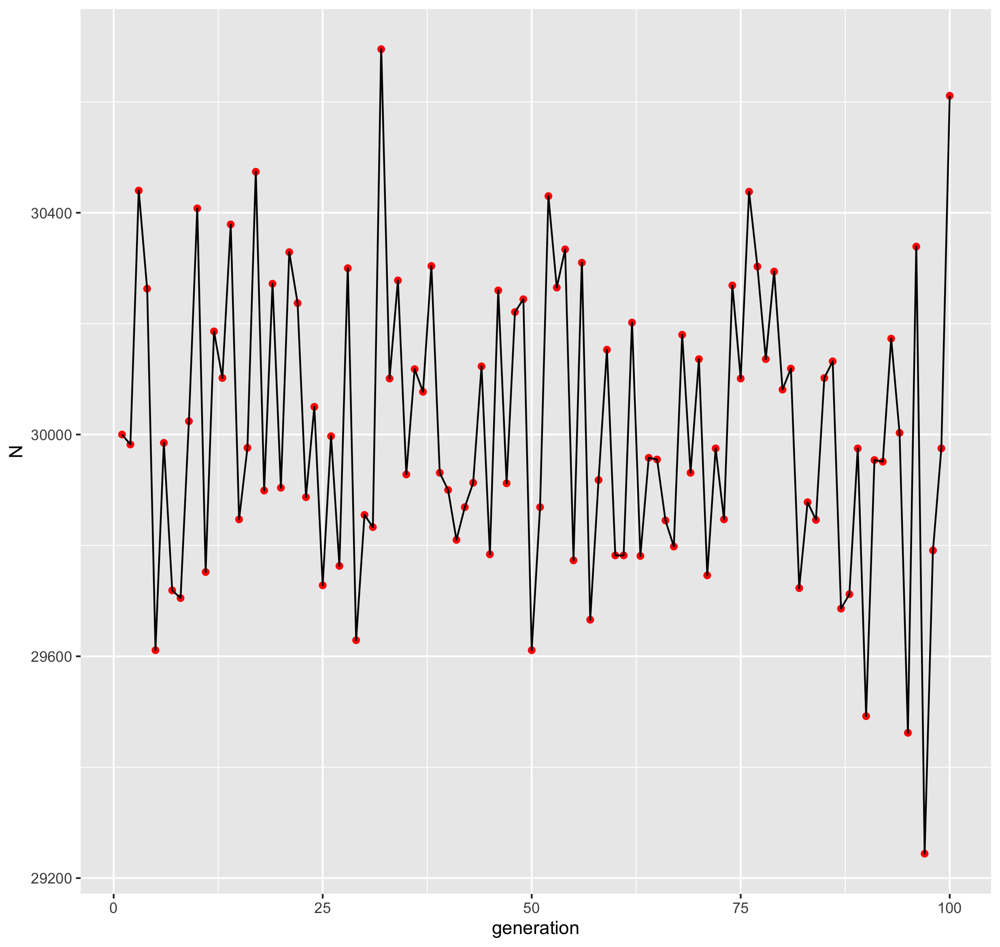
```

### Replicate 4

Bash commands
```{bash eval=F}
TXT="/Users/isabelkim/Desktop/year2/underdominance/reaction-diffusion/wt-stabilize/output.txt"
CSV="/Users/isabelkim/Desktop/year2/underdominance/reaction-diffusion/wt-stabilize/exp2_replicate4.csv"

python check_N.py $TXT > $CSV
```
* csv: `/Users/isabelkim/Desktop/year2/underdominance/reaction-diffusion/wt-stabilize/exp2_replicate4.csv`
  + min = 29,348 and max = 30,673 (range of 1325)
* single figure: `/Users/isabelkim/Desktop/year2/underdominance/reaction-diffusion/wt-stabilize/exp2_replicate4.png`
```{r}
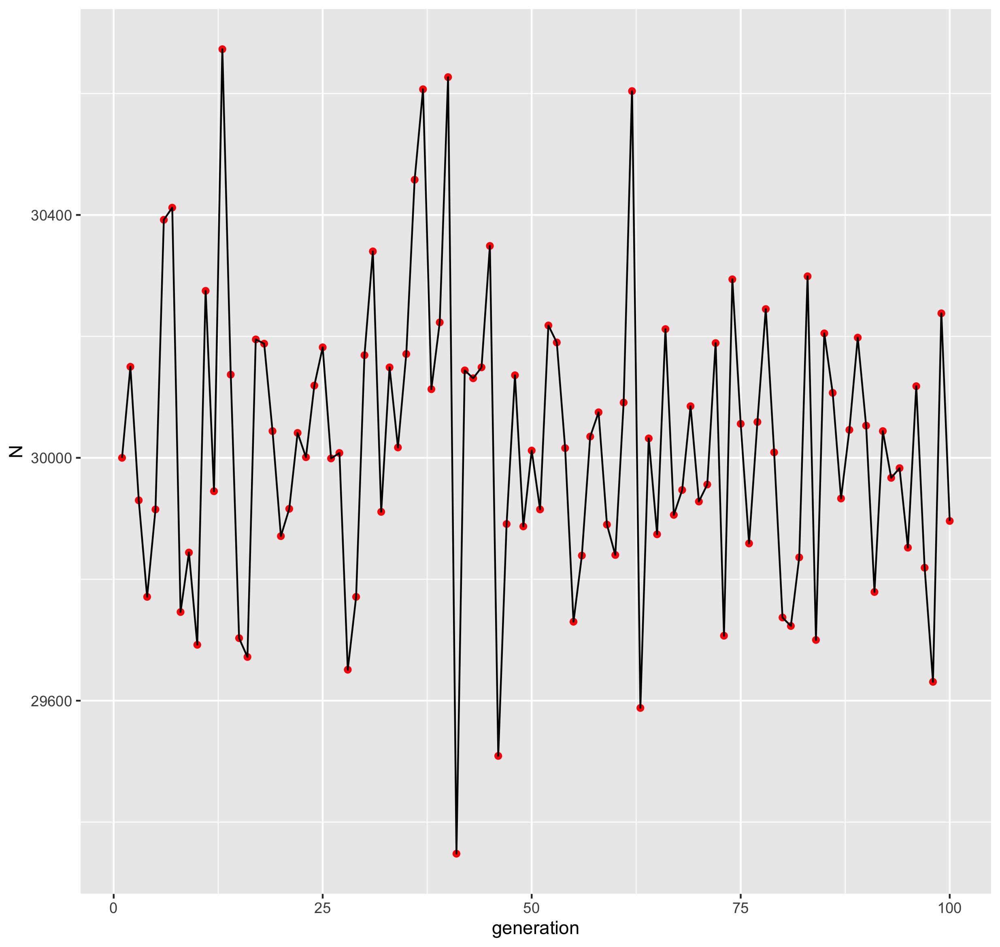
```

### Replicate 5

Bash commands
```{bash eval=F}
TXT="/Users/isabelkim/Desktop/year2/underdominance/reaction-diffusion/wt-stabilize/output.txt"
CSV="/Users/isabelkim/Desktop/year2/underdominance/reaction-diffusion/wt-stabilize/exp2_replicate5.csv"

python check_N.py $TXT > $CSV
```
* csv: `/Users/isabelkim/Desktop/year2/underdominance/reaction-diffusion/wt-stabilize/exp2_replicate5.csv`
  + min = 29,647 and max = 30,889 (range of 1242)
* single figure: `/Users/isabelkim/Desktop/year2/underdominance/reaction-diffusion/wt-stabilize/exp2_replicate5.png`
```{r}
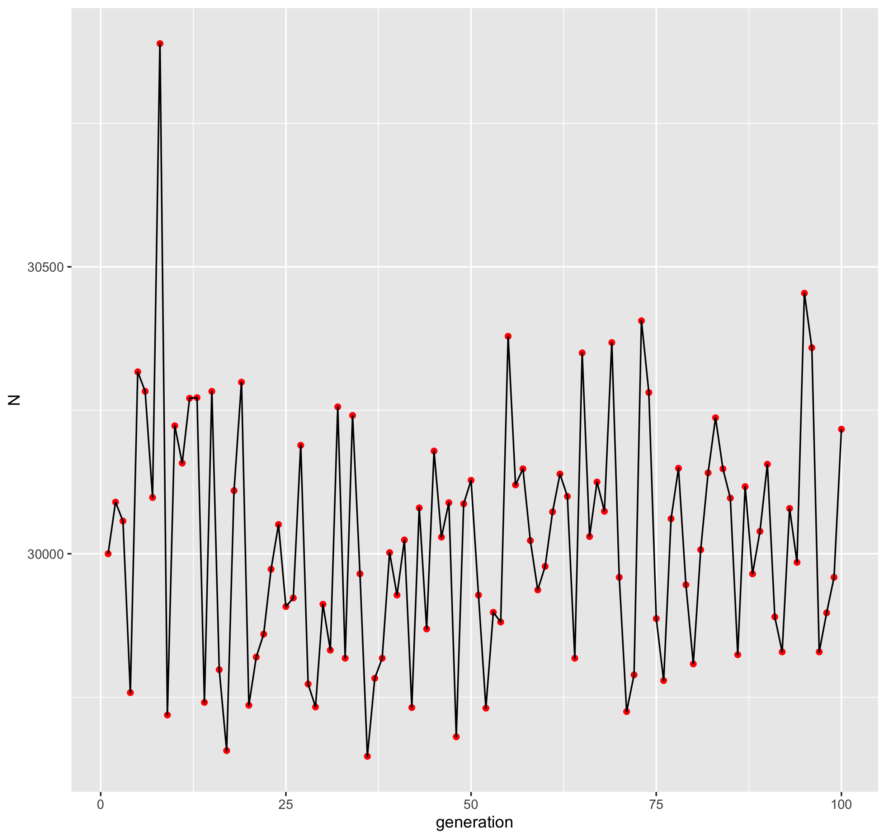
```

### Comparing replicates

* Figure: `/Users/isabelkim/Desktop/year2/underdominance/reaction-diffusion/wt-stabilize/exp2_combined_replicates_plot.png`
```{r}
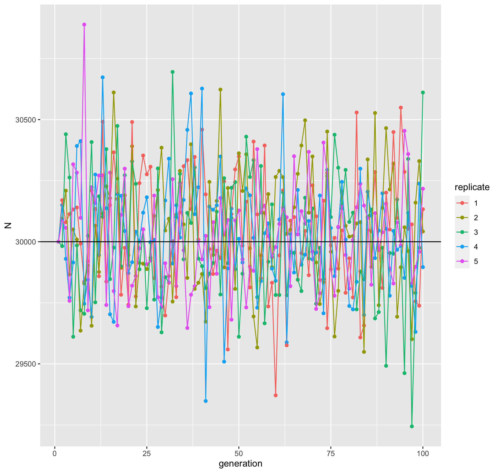
```

* Just the first 3 replicates:
  + Figure: `/Users/isabelkim/Desktop/year2/underdominance/reaction-diffusion/wt-stabilize/exp2_combined_replicates_first_3.png`
```{r}
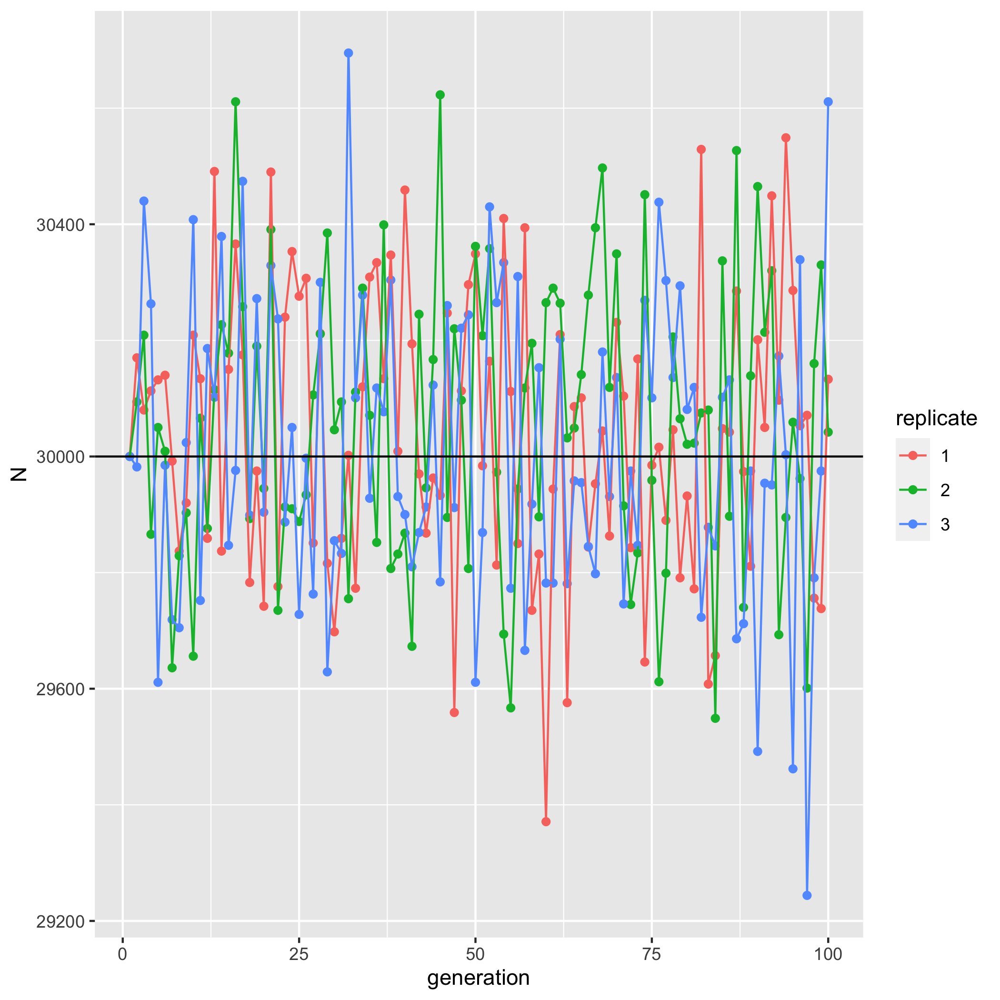
```

No clear generation where anything becomes less stochastic.