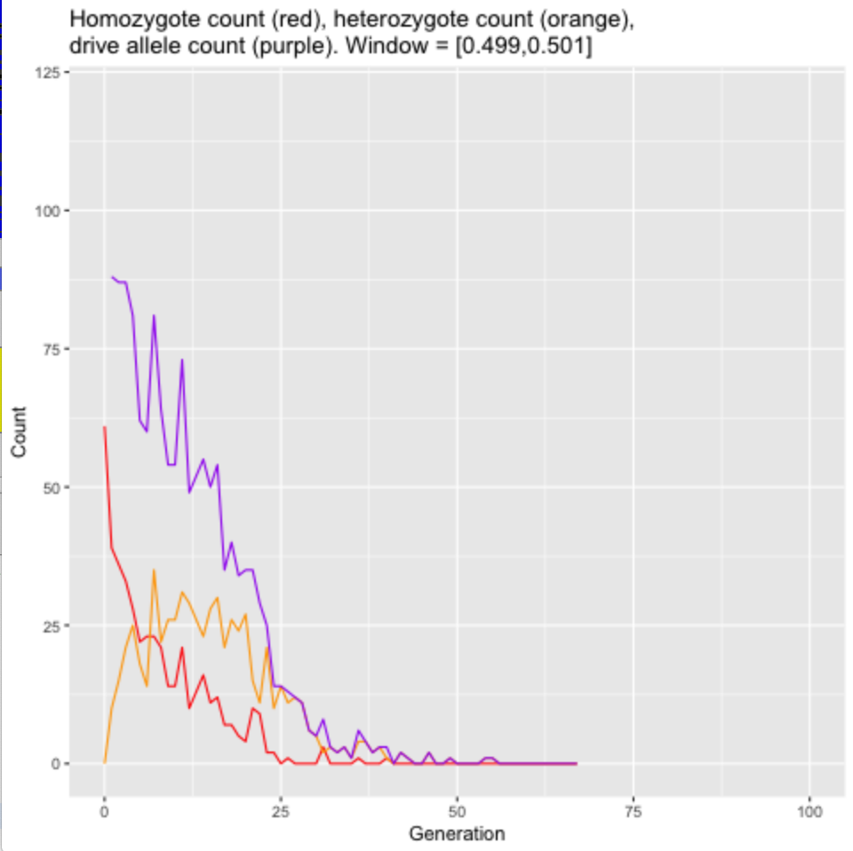

```{r setup, include=FALSE}
knitr::opts_chunk$set(echo = TRUE)
```

## Parameters

* uhat = 40%
* sigma = 0.01
* k = 0.2
* m = 0.001
* N = 30,000
* window = [0.499, 0.501]
* a_predicted = 0.025

## a vs P(increase) from before
```{r}
knitr::include_graphics("../cluster/u_hat=0.4_run/figures/april12_zoomed_in_a_vs_p_increase_uhat40.png")
```

## Live plots

### a = 0.05 (P(increase) still 0 but high above the a_predicted)
```{r}

```
The number of heterozygotes overpowers the number of homozygotes before generation 12, and the drive decreases to 0.


### a = 0.06 (within the transition boundary; P(increase) around 20%)
```{r}

```


#### another replicate of a=0.06 also showing the drive allele frequency over the entire range

```{r}


```
Number of heterozygotes overpowers the number of homozygotes in the window around generation 12, and the drive fails.

### a = 0.0682 (the a that caused P(increase)=50%)

Drive spreads
```{r}

```

The number of drive heterozygotes initially increases, but in generation 25, the number of drive heterozygotes starts to decline and the number of drive homozygotes starts to increase.

#### another replicate of a=0.0682 also showing the drive allele frequency over the entire range
```{r}


```
Again, it seems like the thing that is going to predict spread is whether the number of drive heterozygotes inside the window ever exceeds the number of drive heterozygotes. That would mean that the drive spread out (diffused) too quickly. At generation ~25, the number of heterozygotes starts to increase while the number of heterozygotes decreases. The rate of the drive allele also starts to monotically increase here.


### a = 0.08 (at the almost 100% increase side of the graph)
```{r}


```
Homozygotes stay at a greater frequency at x=0 than heterozygotes the entire time; drive always increases.

## April 19, 2022 at 1:40pm --> changing the SLiM model

* Old copy: `/Users/isabelkim/Desktop/year2/underdominance/reaction-diffusion/slim/nonWF-model-copy-april19.slim`
* Current copy: `/Users/isabelkim/Desktop/year2/underdominance/reaction-diffusion/slim/nonWF-model.slim`


