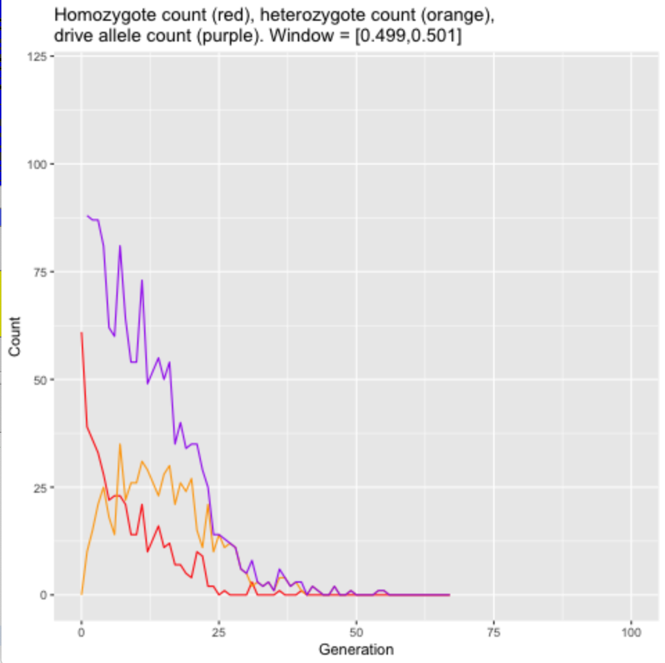
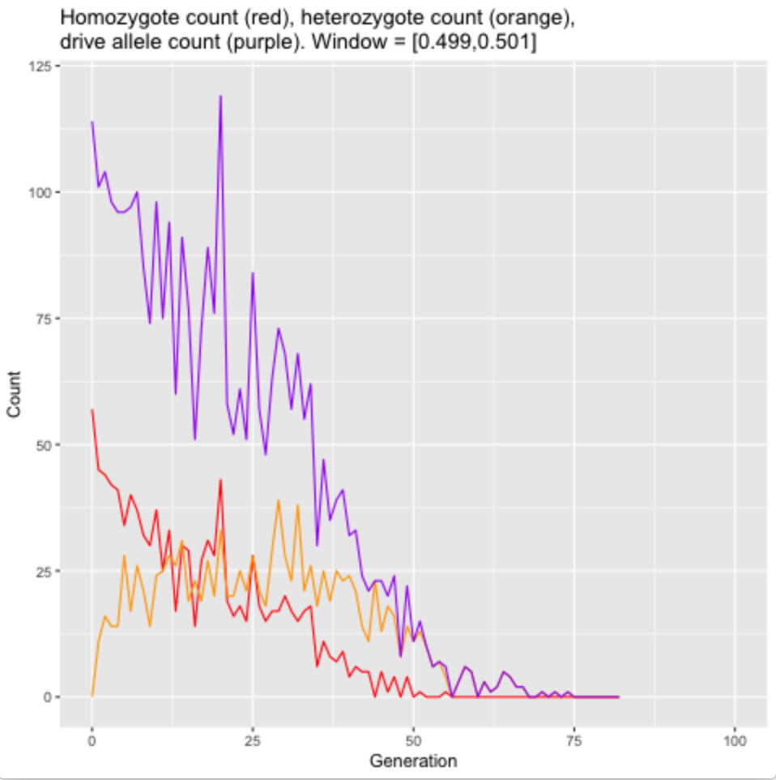
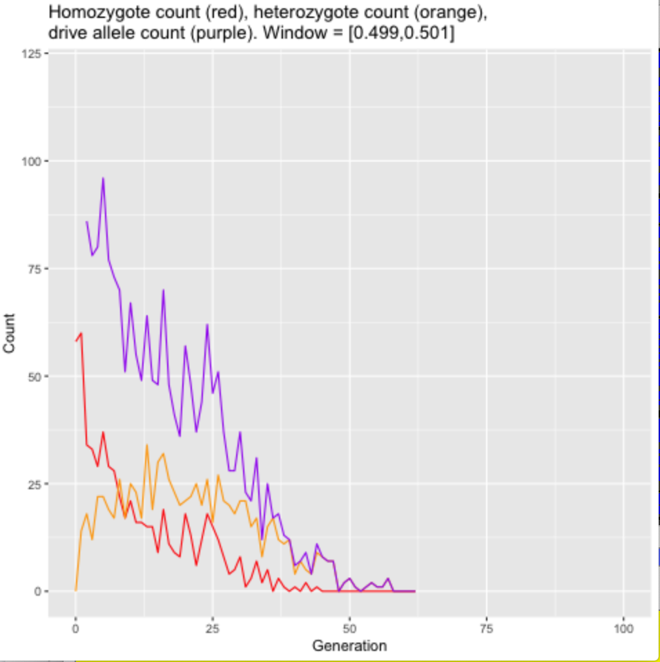
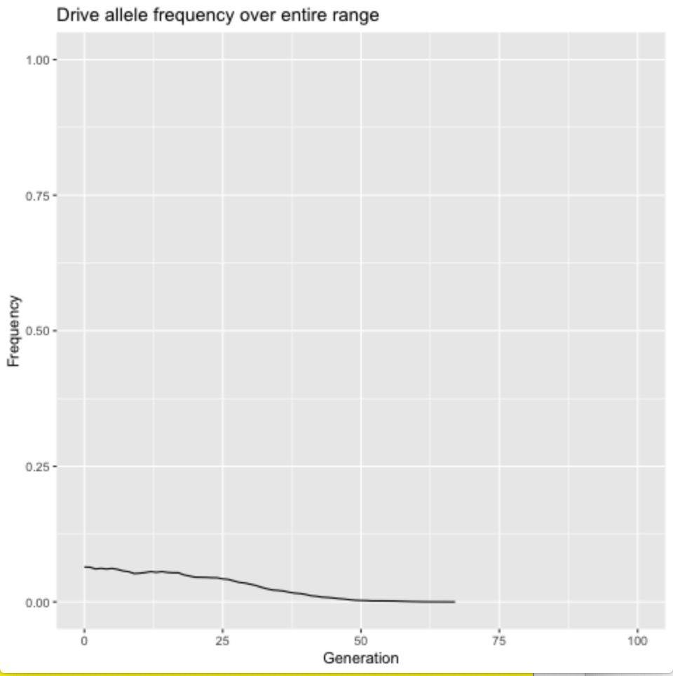
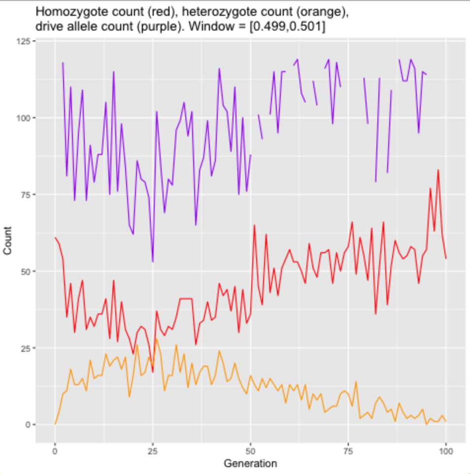
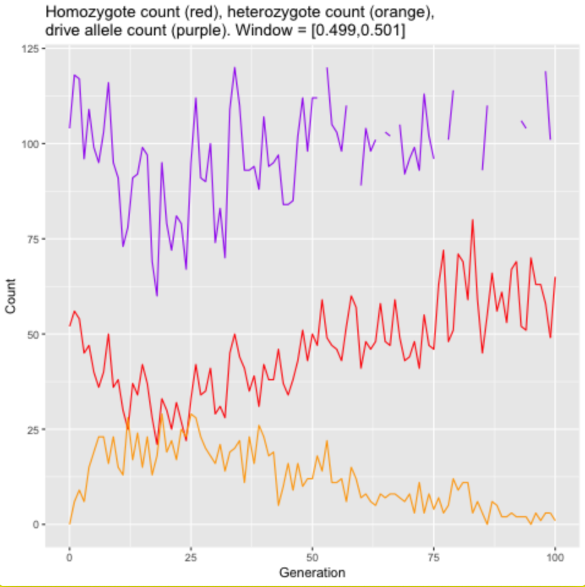
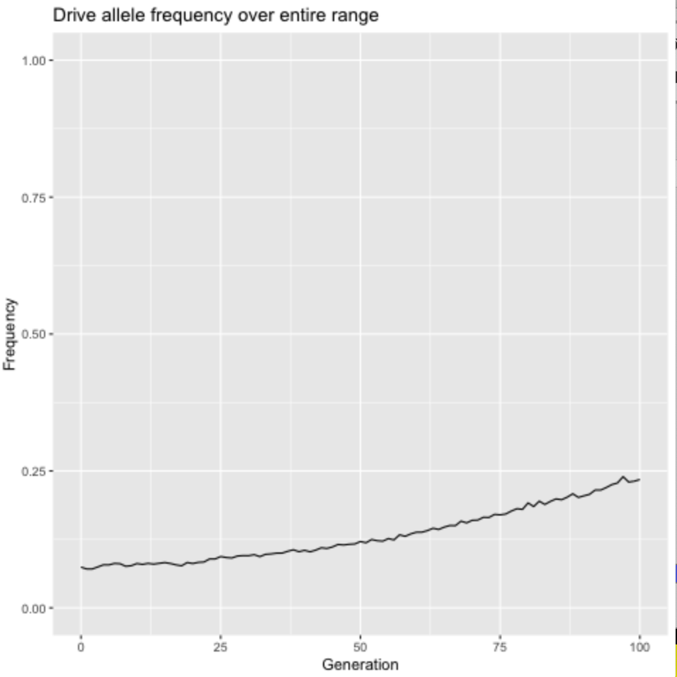
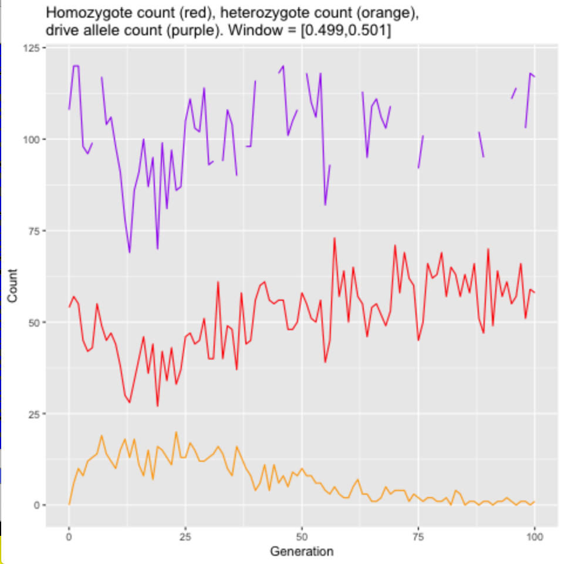
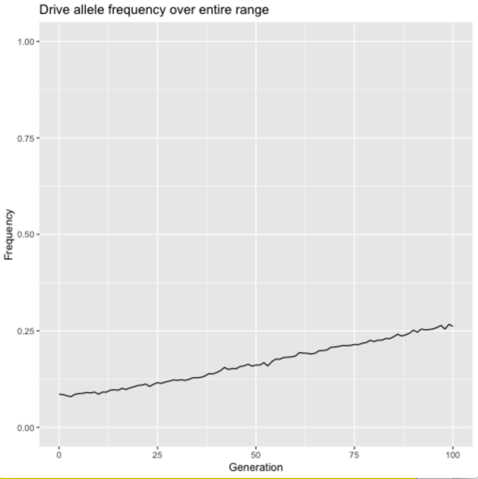

live_plot_results_uhat40
================
Isabel Kim
4/19/2022

## Parameters

-   uhat = 40%
-   sigma = 0.01
-   k = 0.2
-   m = 0.001
-   N = 30,000
-   window = \[0.499, 0.501\]
-   a_predicted = 0.025

## a vs P(increase) from before

``` r
knitr::include_graphics("../cluster/u_hat=0.4_run/figures/april12_zoomed_in_a_vs_p_increase_uhat40.png")
```

<!-- -->

## Live plots

### a = 0.05 (P(increase) still 0 but high above the a_predicted)

``` r

```

<!-- --> The number of heterozygotes
overpowers the number of homozygotes before generation 12, and the drive
decreases to 0.

### a = 0.06 (within the transition boundary; P(increase) around 20%)

``` r

```

<!-- -->

#### another replicate of a=0.06 also showing the drive allele frequency over the entire range

``` r

```

<!-- -->

``` r

```

<!-- --> Number of
heterozygotes overpowers the number of homozygotes in the window around
generation 12, and the drive fails.

### a = 0.0682 (the a that caused P(increase)=50%)

Drive spreads

``` r

```

<!-- -->

The number of drive heterozygotes initially increases, but in generation
25, the number of drive heterozygotes starts to decline and the number
of drive homozygotes starts to increase.

#### another replicate of a=0.0682 also showing the drive allele frequency over the entire range

``` r

```

<!-- -->

``` r

```

<!-- --> Again, it
seems like the thing that is going to predict spread is whether the
number of drive heterozygotes inside the window ever exceeds the number
of drive heterozygotes. That would mean that the drive spread out
(diffused) too quickly. At generation \~25, the number of heterozygotes
starts to increase while the number of heterozygotes decreases. The rate
of the drive allele also starts to monotically increase here.

### a = 0.08 (at the almost 100% increase side of the graph)

``` r

```

<!-- -->

``` r

```

<!-- --> Homozygotes stay
at a greater frequency at x=0 than heterozygotes the entire time; drive
always increases.
